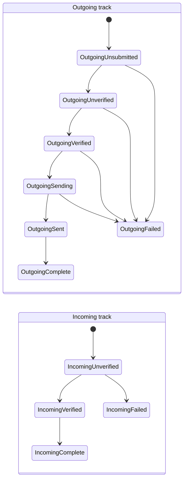

# Payment Model & State Machine

This document covers the on-device payment **record** — `TSPaymentModel` — the
`TSPaymentState` / `TSPaymentType` / `TSPaymentFailure` enums that classify it,
the large `isValid` invariant matrix that each record must satisfy, and the
`PaymentFinder` SQL queries used to look records up.

- [1. Why payments are stored separately from interactions](#1-why-payments-are-stored-separately-from-interactions)
- [2. `TSPaymentModel` fields](#2-tspaymentmodel-fields)
- [3. The enums: state, type, failure](#3-the-enums-state-type-failure)
- [4. The state machine](#4-the-state-machine)
- [5. The `isValid` invariant matrix](#5-the-isvalid-invariant-matrix)
- [6. Mutations & race-safe transitions](#6-mutations--race-safe-transitions)
- [7. The `TSPayment*` value objects & protos](#7-the-tspayment-value-objects--protos)
- [8. `PaymentFinder` queries](#8-paymentfinder-queries)
- [9. Validation rules / error paths / edge cases](#9-validation-rules--error-paths--edge-cases)
- [10. File reference checklist](#10-file-reference-checklist)

---

## 1. Why payments are stored separately from interactions

The class comment is explicit: payment records are stored separately from
interactions because (a) a payment may be a transfer to/from an exchange with
**no** associated chat interaction, and (b) interactions can be deleted while
the payment record must survive (`TSPaymentModel.swift:11-15`). **[High]**

`TSPaymentModel` is an `SDSCodableModel` persisted in table
`model_TSPaymentModel` (`TSPaymentModel.swift:16-17`). **[High]**

## 2. `TSPaymentModel` fields

| Field | Line | Meaning |
| --- | --- | --- |
| `uniqueId: String` | `:23` | random UUID assigned at init (`:149`). **[High]** |
| `paymentType: TSPaymentType` | `:25` | incoming/outgoing/etc.; "inferred from paymentState" per comment. **[High]** |
| `paymentState: TSPaymentState` | `:27` | the state-machine position (`private(set)`). **[High]** |
| `paymentFailure: TSPaymentFailure` | `:31` | only meaningful if state is `incomingFailed`/`outgoingFailed`. **[High]** |
| `paymentAmount: TSPaymentAmount?` | `:34` | may be absent for unverified incoming payments. **[High]** |
| `createdTimestamp: UInt64` | `:36` | ms-since-1970 of creation. **[High]** |
| `addressUuidString: String?` | `:41` | sender/recipient ACI; untrusted for unverified incoming. **[High]** |
| `requestUuidString: String?` | `:47` | only set for outgoing from the submitting device; cleared after notify. **[High]** |
| `memoMessage: String?` | `:49` | user memo. **[High]** |
| `isUnread: Bool` | `:51` | drives the unread badge (see `PaymentFinder`). **[High]** |
| `interactionUniqueId: String?` | `:56` | the chat interaction, if any. **[High]** |
| `mobileCoin: MobileCoinPayment?` | `:59` | the MC blob (see [mobilecoin-integration.md](mobilecoin-integration.md)). **[High]** |
| `mcLedgerBlockIndex: UInt64` | `:64` | denormalized for `PaymentFinder`; `0` = unset. **[High]** |
| `mcTransactionData: Data?` | `:69` | denormalized; outgoing only. **[High]** |
| `mcReceiptData: Data?` | `:73` | denormalized; used by `PaymentFinder`. **[High]** |

Note the three `mc*` columns duplicate values that also live inside the
`mobileCoin` blob — they exist as **top-level columns so `PaymentFinder` can
query them in SQL** (`TSPaymentModel.swift:61-73`, `PaymentFinder.swift:60-91`).
**[High]**

The designated initializer (`TSPaymentModel.swift:138`) copies
`ledgerBlockIndex`/`transactionData`/`receiptData` out of the passed
`MobileCoinPayment` into those columns, then `owsAssertDebug(self.isValid)`.
**[High]**

## 3. The enums: state, type, failure

All three are Objective-C `NS_ENUM`s declared in `TSPaymentModels.h` with
string formatters in `TSPaymentModels.m`.

**`TSPaymentState`** (`TSPaymentModels.h:50-74`) — the state machine. The header
annotates each case with its ledger relationship: **[High]**

| Case | Ledger note (from header) |
| --- | --- |
| `OutgoingUnsubmitted` (0) | "Not (yet) in ledger." |
| `OutgoingUnverified` | "Possibly in ledger." |
| `OutgoingVerified` | "In ledger." |
| `OutgoingSending` | "In ledger." |
| `OutgoingSent` | "In ledger." |
| `OutgoingComplete` | "In ledger." |
| `OutgoingFailed` | "Not in ledger. Should be ignored during reconciliation." |
| `IncomingUnverified` | "Possibly in ledger." |
| `IncomingVerified` | "In ledger." |
| `IncomingComplete` | "In ledger." |
| `IncomingFailed` | "Not in ledger. Should be ignored during reconciliation." |

The header warns: *"Each value corresponds to a state of a state machine… If you
add or remove cases, you need to update `paymentStatesToIgnore()` and
`paymentStatesToProcess()`."* Those two functions are **not in this directory**
— intent/implementation lives in the reconciliation layer. **[High]**

Derived predicates on `TSPaymentState` (Swift extensions): **[High]**
- `isIncoming` (`TSPaymentModels.swift:620`) — the four `incoming*` cases.
- `isComplete` (`TSPaymentModels.swift:804`) — `outgoingComplete`/`incomingComplete`.
- `isFailed` (`TSPaymentModels.swift:814`) — `outgoingFailed`/`incomingFailed`.
- `isVerified` (`TSPaymentModels.swift:824`) — the "in ledger" states
  (`outgoingVerified`/`Sending`/`Sent`/`Complete`, `incomingVerified`/`Complete`);
  `Unsubmitted`/`Unverified`/`Failed` are **not** verified.

**`TSPaymentType`** (`TSPaymentModels.h:21-32`) — 10 cases:
`IncomingPayment`, `OutgoingPayment`, `OutgoingPaymentNotFromLocalDevice`,
`IncomingUnidentified`, `OutgoingUnidentified`, `OutgoingTransfer`,
`OutgoingDefragmentation`, `OutgoingDefragmentationNotFromLocalDevice`,
`OutgoingRestored`, `IncomingRestored`. **[High]** Swift extensions
(`TSPaymentModels.swift:649-800`) derive `isIncoming`, `isIdentifiedPayment`,
`isUnidentified`, `isRestored`, `isDefragmentation`, `wasNotCreatedLocally` by
exhaustive `switch` (each with `@unknown default` → `owsFailDebug`). **[High]**

**`TSPaymentFailure`** (`TSPaymentModels.h:79-87`) — `None`, `Unknown`,
`InsufficientFunds`, `ValidationFailed`, `NotificationSendFailed`, `Invalid`
("payment model is malformed or completed"), `Expired`. **[High]**

**`TSPaymentCurrency`** (`TSPaymentModels.h:12-15`) — only `Unknown` (0) and
`MobileCoin` (1). **[High]**

## 4. The state machine

The header's comment says the payments logic "ushers payments through this
state machine as quickly as possible" (`TSPaymentModels.h:40-49`). The actual
transition *driving* (submission, verification, sending) lives outside this
directory; what this directory enforces is **which** transitions are legal and
**what data** each state requires. The two incoming/outgoing tracks never cross
(an outgoing record can never become incoming) — enforced by
`update(paymentState:)` asserting `isIncoming` is preserved
(`TSPaymentModel.swift:223-228`). **[High]**

> **Transition arrows are [Medium].** The *states* and their meanings are
> directly from `TSPaymentModels.h`; the specific legal transitions are inferred
> from the state names, the `isVerified`/`isComplete` groupings, and the fact
> that `update(paymentState:)` only guards the incoming/outgoing axis. The
> engine that performs these transitions is **outside this directory** — the
> exact transition graph is **intent undetermined — no evidence in source**
> here. **[Medium]**

Two sync-message-origin states are notable: `outgoingPaymentNotFromLocalDevice`
and `outgoingDefragmentationNotFromLocalDevice` are created directly in the
`outgoingComplete` state when mirroring another device's payment: the state is
set at `PaymentsHelperImpl.swift:426` and the type at `:446`/`:455`. **[High]**

## 5. The `isValid` invariant matrix

`TSPaymentModel.isValid` (`TSPaymentModels.swift:306`) is the heart of the
model's integrity. It accumulates an `isValid` flag across ~15 checks, each
`owsFailDebug`-ing on violation. The key rules: **[High]**

- **Direction consistency** — `isIncoming` (from type) must equal
  `paymentState.isIncoming` (`TSPaymentModels.swift:313-316`).
- **Failure ⇔ failure-state** — a failed state requires `paymentFailure != .none`
  and vice-versa (`:318-326`).
- **Amount presence** — if present it must pass
  `isValidAmount(canBeEmpty: isDefragmentation || isUnidentified)`; if absent it
  is only allowed for `incomingUnverified` or failed records
  (`:328-340`).
- **Fee presence** — a fee is required for non-unidentified, outgoing,
  non-restored, non-failed payments (`:342-351`).
- **Address presence** — identified payments must have `addressUuidString`
  (`:353-357`).
- **MC recipient address** — required for outgoing, non-restored,
  (identified or transfer), non-failed payments (**warn-only**, does not fail)
  (`:359-362`).
- **MC transaction** — required iff `shouldHaveMCTransaction`; forbidden iff
  `!canHaveMCTransaction` (the latter warn-only) (`:364-369`).
- **MC receipt** — required iff `shouldHaveMCReceipt` (`:371-374`).
- **MC incoming transaction** — required iff `shouldHaveMCIncomingTransaction`;
  forbidden iff `!canHaveMCIncomingTransaction` (`:376-382`).
- **Recipient presence** — non-unidentified outgoing non-defrag payments need a
  recipient (ACI or MC address) (`:384-390`).
- **MC spent key images / output public keys** — required/forbidden per the
  `shouldHave…`/`canHave…` predicates (`:392-414`).
- **MC ledger block timestamp** — expected when complete & identified &
  non-failed, but **warn-only** ("For some payments, we'll never be able to fill
  in the block timestamp.") (`:416-424`).
- **MC ledger block index** — required when `isVerified || isUnidentified` and
  not failed (`:426-434`).
- **MobileCoin blob presence** — required iff `!isFailed`; forbidden iff
  `isFailed` (`:436-449`). This mirrors the failure-scrubbing in
  `update(withPaymentFailure:)`.

The `shouldHave…`/`canHave…` predicates that this matrix relies on are defined
just below (`TSPaymentModels.swift:457-491`): `canHaveMCTransaction` (outgoing &
!unidentified & !failed), `shouldHaveMCTransaction` (that & !wasNotCreatedLocally),
`shouldHaveMCReceipt`, `shouldHaveMCIncomingTransaction`,
`canHaveMCIncomingTransaction`, `shouldHaveMCSpentKeyImages`,
`canHaveMCSpentKeyImages`, `shouldHaveMCOutputPublicKeys`,
`canHaveMCOutputPublicKeys`. **[High]**

> **Observed quirk (noted, not fixed).** `canHaveMCOutputPublicKeys`
> (`TSPaymentModels.swift:489`) is defined as
> `shouldHaveMCSpentKeyImages || isUnidentified` — it references *spent key
> images*, not *output public keys*. Whether this is intentional reuse (the two
> `shouldHave` predicates are currently identical) or a copy/paste is **intent
> undetermined — no evidence in source.** **[Low]**

## 6. Mutations & race-safe transitions

All mutators go through `anyUpdate(transaction:)` and re-assert `isValid` via
`anyWillUpdate` (`TSPaymentModel.swift:297-301`). The mutators: **[High]**

- `update(paymentState:)` (`:223`) — asserts the incoming/outgoing axis is
  unchanged.
- `update(mcLedgerBlockIndex:)` (`:230`) — asserts `> 0` and
  `!hasMCLedgerBlockIndex`, then rebuilds the MC blob via
  `MobileCoinPayment.copy(_:withLedgerBlockIndex:)`.
- `update(mcLedgerBlockTimestamp:)` (`:241`) — asserts `> 0` and
  `!hasMCLedgerBlockTimestamp`.
- `update(withPaymentFailure:paymentState:)` (`:251`) — asserts failure `!= .none`
  and a failed state; sets failure **and scrubs all MC state**
  (`mobileCoin = nil`, `mcLedgerBlockIndex = 0`, etc.).
- `update(withPaymentAmount:)`, `update(withIsUnread:)`,
  `update(withInteractionUniqueId:)` (`:269`, `:276`, `:282`).

**Race-safe state transitions.** Because payment state is updated from multiple
code paths, two guards exist (`TSPaymentModels.swift:271`, `:289`): **[High]**
- `isCurrentPaymentState(paymentState:transaction:)` — verifies both the
  in-memory model **and** a fresh DB fetch are in the expected state.
- `updatePaymentModelState(fromState:toState:transaction:)` — throws
  `OWSAssertionError` unless `isCurrentPaymentState(fromState)` holds, then
  applies the transition. This is the race-safe way to advance state.

`anyWillInsert`/`anyWillUpdate` (`TSPaymentModel.swift:288`, `:297`) call into
`SSKEnvironment.shared.paymentsEventsRef` so other subsystems can react — see
[helper-abstraction.md](helper-abstraction.md) §`PaymentsEvents`. **[High]**

## 7. The `TSPayment*` value objects & protos

Three Obj-C value types (declared in `TSPaymentModels.h`, implemented in
`.m`, extended with Swift validity/proto logic in `TSPaymentModels.swift`):

- **`TSPaymentAmount`** (`currency`, `picoMob`; `TSPaymentModels.h:97`).
  `isValidAmount(canBeEmpty:)` (`TSPaymentModels.swift:27`): currency must not be
  `.unknown`, and `picoMob > 0` (or `>= 0` when empty allowed). `buildProto`
  (`:39`) throws `PaymentsError.invalidModel` unless valid & MobileCoin;
  `fromProto` (`:53`) requires a `mobileCoin` sub-proto and re-validates with
  `canBeEmpty: true`. Also `plus(_:)`, `zeroMob`, `isZero`. **[High]**
- **`TSPaymentAddress`** (`currency`, `mobileCoinPublicAddressData`;
  `TSPaymentModels.h:108`). `isValid` (`:87`) delegates to the MobileCoin
  helper. `buildProto(tx:)` (`:95`) **signs** the MC public address with the
  local **ACI identity key** before embedding it; `fromProto(_:identityKey:)`
  (`:118`) **verifies** that signature, throwing `PaymentsError.invalidModel`
  on empty data or failed verification. `sign`/`verifySignature` wrap LibSignal
  (`:150`, `:156`). **[High]**
- **`TSPaymentNotification`** (`memoMessage?`, `mcReceiptData`;
  `TSPaymentModels.h:120`). `isValid` (`:170`) requires non-empty
  `mcReceiptData`. `buildProto` (`:177`)/`add(toDataBuilder:)`/`fromProto`
  (`:199`) marshal to/from `SSKProtoDataMessagePaymentNotification`. **[High]**

Also `TSArchivedPaymentInfo` (`amount`/`fee`/`note` strings;
`TSPaymentModels.h:131`) — a display/export snapshot used by the backup/archive
path (see [currency-and-formatting.md](currency-and-formatting.md) §archive
formatting). **[Medium]**

**`TSPaymentModels` (plural)** (`TSPaymentModels.swift:219`) is a small wrapper
whose only job is `parsePaymentProtos(dataMessage:thread:)` (`:228`): returns
`nil` under tests, when payments are disabled, when there is no payment proto,
or when the thread is not a `TSContactThread`; otherwise parses a notification
proto (or returns `nil` for an `activation` proto, "handled separately").
**[High]**

## 8. `PaymentFinder` queries

`PaymentFinder` (`PaymentFinder.swift:9`) is a set of raw-SQL class methods over
`model_TSPaymentModel`: **[High]**

| Method | Line | Query |
| --- | --- | --- |
| `paymentModels(paymentStates:)` | `:11` | `WHERE paymentState IN (…)` |
| `firstUnreadPaymentModel` | `:25` | `WHERE isUnread = 1 LIMIT 1` |
| `allUnreadPaymentModels` | `:38` | `WHERE isUnread = 1` |
| `unreadCount` | `:46` | `SELECT COUNT(*) … WHERE isUnread = 1` |
| `paymentModels(forMcLedgerBlockIndex:)` | `:60` | `WHERE mcLedgerBlockIndex = ?` |
| `paymentModels(forMcReceiptData:)` | `:71` | `WHERE mcReceiptData = ?` |
| `paymentModels(forMcTransactionData:)` | `:82` | `WHERE mcTransactionData = ?` |

The last three are exactly why the `mc*` columns are denormalized out of the
blob. They power the duplicate-detection in
`PaymentsHelperImpl.isProposedPaymentModelRedundant`
(`PaymentsHelperImpl.swift:541`). **[High]** `unreadCount` uses `failIfThrows`
and force-unwraps the `COUNT(*)` result (`PaymentFinder.swift:46-58`). **[High]**

Array helpers `sortedBySortDate(descending:)` / `sortBySortDate(descending:)`
sort by `sortDate` (`TSPaymentModels.swift:608`, `:612`), where
`TSPaymentModel.sortDate` is `mcLedgerBlockDate ?? createdDate`
(`TSPaymentModel.swift:219`). **[High]**

## 9. Validation rules / error paths / edge cases

- **`@unknown default`** in every enum `switch` guards against future proto enum
  values, logging `owsFailDebug` and treating the value conservatively
  (`TSPaymentModels.swift:635`, `:663`, etc.). **[High]**
- **Amount `canBeEmpty`** — defragmentation and unidentified payments may carry
  a zero amount; everything else must be strictly positive
  (`TSPaymentModels.swift:328-340`, `:27-34`). **[High]**
- **Failure scrubbing invariant** — a failed record must have `mobileCoin == nil`;
  `isValid` enforces both directions (`TSPaymentModels.swift:436-449`), and
  `update(withPaymentFailure:)` establishes it (`TSPaymentModel.swift:260-271`).
  **[High]**
- **Unverified incoming** — may legitimately lack `paymentAmount` and must not be
  trusted for `addressUuidString` (`TSPaymentModel.swift:34-45`,
  `TSPaymentModels.swift:331-333`). **[High]**
- **`isValid` is debug-asserting, not throwing** — in release builds an invalid
  model does not crash; the asserts fire only in debug. The *insert* path
  (`tryToInsertPaymentModel`) does throw on `!isValid`
  (`PaymentsHelperImpl.swift:524-526`). **[High]**

## 10. File reference checklist

- `TSPaymentModel.swift` — §2, §6 (fields, mutators, insert/update hooks)
- `TSPaymentModels.h` / `.m` — §3, §7 (enums + value types + formatters)
- `TSPaymentModels.swift` — §3, §5, §7 (validity matrix, enum predicates, protos)
- `PaymentFinder.swift` — §8 (SQL queries)
- `MobileCoinPayment.swift` — §2, §5 (the embedded blob; see mobilecoin doc)
