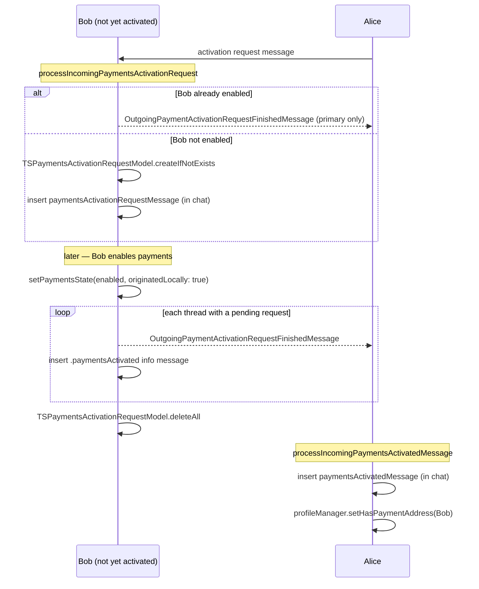

# Payments Activation

"Activation" is the handshake by which one user asks another to turn on
payments, and by which a user who turns on payments notifies everyone who asked.
This document covers the small persistent model that tracks pending requests
(`TSPaymentsActivationRequestModel.swift`) and the three `PaymentsHelperImpl`
entry points that implement the handshake.

- [1. The three activation messages](#1-the-three-activation-messages)
- [2. `TSPaymentsActivationRequestModel`](#2-tspaymentsactivationrequestmodel)
- [3. Receiving an activation *request*](#3-receiving-an-activation-request)
- [4. Receiving an *activated* message](#4-receiving-an-activated-message)
- [5. Turning payments on → fulfilling pending requests](#5-turning-payments-on--fulfilling-pending-requests)
- [6. End-to-end flow](#6-end-to-end-flow)
- [7. Validation rules / error paths / edge cases](#7-validation-rules--error-paths--edge-cases)
- [8. File reference checklist](#8-file-reference-checklist)

---

## 1. The three activation messages

The handshake uses three distinct messages/info-messages (the outgoing message
types themselves are defined outside this directory): **[Medium]**

1. **Activation request** — "please turn on payments". Received via
   `processIncomingPaymentsActivationRequest` (`PaymentsHelperImpl.swift:299`).
2. **Activation finished / activated** — "I have turned on payments". Sent as
   `OutgoingPaymentActivationRequestFinishedMessage`
   (`PaymentsHelperImpl.swift:179`, `:313`) and received via
   `processIncomingPaymentsActivatedMessage` (`:338`).
3. **In-chat info messages** — `TSInfoMessage.paymentsActivationRequestMessage`
   (`:331`) and `TSInfoMessage.paymentsActivatedMessage` (`:345`) /
   `messageType: .paymentsActivated` (`:192`) render the handshake in the
   conversation. **[High]**

## 2. `TSPaymentsActivationRequestModel`

`struct TSPaymentsActivationRequestModel`
(`TSPaymentsActivationRequestModel.swift:14`) is a GRDB
`Codable/FetchableRecord/PersistableRecord` row in table
`TSPaymentsActivationRequestModel`. The doc comment states its purpose exactly:
*"A record of incomplete payments activation requests. When we activate
payments, we use these to find the senders that requested we activate, so we can
send them an `OutgoingPaymentActivationRequestFinishedMessage`, then we delete
these models."* **[High]**

Fields (`:16-19`): **[High]**
- `id: Int64?` — row id, assigned in `didInsert`.
- `threadUniqueId: String` — the thread the request arrived on.
- `senderAci: Aci` — who asked. Custom `Codable` encodes the ACI as its
  `serviceIdBinary` and decodes via `Aci.parseFrom(serviceIdBinary:)`
  (`:33-45`).

Static helpers: **[High]**
- `createIfNotExists(threadUniqueId:senderAci:transaction:)` (`:54`) — inserts a
  row only if none already exists **for that `threadUniqueId`** (the existence
  check keys on thread only, not sender). Wrapped in `failIfThrows`.
- `allThreadsWithPaymentActivationRequests(transaction:)` (`:78`) — fetches all
  rows and resolves each to a `TSThread` via `TSThread.fetchViaCache`; the
  comment notes it does an in-memory join because "the table is really small".
  **[High]**

> **Edge case — dedup keys on thread only.** `createIfNotExists` checks
> existence by `threadUniqueId IS ?` (`:60-71`); if a second person in the same
> thread (e.g. a future group scenario) requested activation, the second
> `senderAci` would not create a new row. In practice activation requests only
> flow over `TSContactThread`s (one sender per thread), so this is consistent —
> but the dedup is thread-scoped, not sender-scoped. **[Medium]**

## 3. Receiving an activation *request*

`processIncomingPaymentsActivationRequest(thread:senderAci:transaction:)`
(`PaymentsHelperImpl.swift:299`): **[High]**

1. **If payments are already enabled** (`loadPaymentsState(...).isEnabled`,
   `:310`): on the **primary device only** (`isPrimaryDevice ?? false`, `:312`),
   immediately send an `OutgoingPaymentActivationRequestFinishedMessage` back and
   return. The primary-only guard prevents every linked device from replying.
2. **Otherwise**, persist a pending request via
   `TSPaymentsActivationRequestModel.createIfNotExists(...)` (`:325`) and insert
   an in-chat `paymentsActivationRequestMessage` info message (`:331`).

## 4. Receiving an *activated* message

`processIncomingPaymentsActivatedMessage(thread:senderAci:localIdentifiers:tx:)`
(`PaymentsHelperImpl.swift:338`): **[High]**

1. Insert a `paymentsActivatedMessage` info message in the thread (`:345`).
2. Record that the sender now has a payment address:
   `profileManager.setHasPaymentAddress(aci:localIdentifiers:userProfileWriter:
   .paymentActivation:tx:)` (`:352`). This updates the sender's profile flag so
   the UI knows payments can be sent to them. **[High]**

## 5. Turning payments on → fulfilling pending requests

When the local user enables payments, `setPaymentsState(_:originatedLocally:
transaction:)` (`PaymentsHelperImpl.swift:122`) does the fulfillment side of the
handshake (`:174-203`): **[High]**

1. Enumerate `allThreadsWithPaymentActivationRequests(transaction:)` (`:175`).
2. For each thread:
   - **If `originatedLocally`**, send an
     `OutgoingPaymentActivationRequestFinishedMessage` to that thread (`:179`) —
     only the originating device sends, to avoid duplicate sends from linked
     devices.
   - **Always** insert a local `.paymentsActivated` info message carrying the
     local ACI (`.paymentActivatedAci`) wherever we were requested (`:188-199`).
3. Delete **all** pending request rows: `TSPaymentsActivationRequestModel
   .deleteAll(transaction.database)` (`:202`) — once activated, they are
   useless regardless of origin.

See [helper-abstraction.md](helper-abstraction.md) §enable/disable for the rest
of what `setPaymentsState` does (entropy persistence, profile re-upload,
storage-service update).

## 6. End-to-end flow

## 7. Validation rules / error paths / edge cases

- **Primary-device reply guard** — only the primary device replies to a request
  when already activated (`PaymentsHelperImpl.swift:312`); linked devices stay
  silent to avoid duplicate "finished" messages. **[High]**
- **Origin guard on send** — in `setPaymentsState`, the "finished" message is
  only sent when `originatedLocally` (`:177-186`), but the in-chat
  `.paymentsActivated` info message is inserted regardless (`:188-199`). **[High]**
- **Unconditional cleanup** — pending rows are deleted on activation whether or
  not the change originated locally (`:200-202`), with `try?` swallowing any
  delete error. **[High]**
- **Thread-scoped dedup** — see §2 note; `createIfNotExists` keys existence on
  `threadUniqueId` only (`TSPaymentsActivationRequestModel.swift:60-71`). **[Medium]**
- **ACI serialization** — a decode of a malformed `senderAci` would throw inside
  the custom `init(from:)` (`:33-39`); fetches are wrapped in `failIfThrows`
  (`:84-88`). **[High]**
- **Activation protos handled elsewhere** — `TSPaymentModels.parsePaymentProtos`
  explicitly returns `nil` for an `activation` proto ("Handled separately",
  `TSPaymentModels.swift:251-252`); the activation routing lives in the message
  pipeline that calls the `processIncoming…` helpers. **[High]**

## 8. File reference checklist

- `TSPaymentsActivationRequestModel.swift` — §2, §7 (the pending-request row)
- `PaymentsHelperImpl.swift` — §3, §4, §5 (the three handshake entry points +
  fulfillment in `setPaymentsState`)
- `TSPaymentModels.swift` — §7 (activation proto routed separately)
