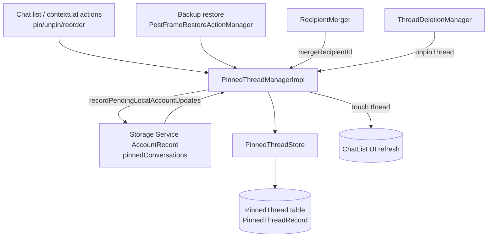

# Pinned Threads

Covers `SignalServiceKit/PinnedThreadManager/`:

- `PinnedThreadManager.swift`
- `PinnedThreadManagerImpl.swift`
- `PinnedThreadStore.swift`
- `PinnedThreadRecord.swift`
- `MockPinnedThreadManager.swift`

This subsystem owns the set and **ordering** of "pinned" conversations shown at the top of the
chat list. It persists which threads are pinned (and in what order), enforces a remotely-configured
pin limit, keeps pins in sync via Storage Service, and reacts to related events (thread
deletion/archival, recipient merges). It intentionally stores pins by a **stable identity** rather
than by `TSThread.uniqueId`, so that a conversation can remain pinned even before its `TSThread`
exists locally (e.g. a group still being restored from Storage Service).

---

## Public surface

### `PinnedThreadManager` protocol — `PinnedThreadManager.swift:17`
Confidence: HIGH (read in full). The entry point used across the app and SSK.

| Method | Line | Behavior |
|--------|------|----------|
| `pinnedThreadOrder(forThread:tx:)` | 25 | Returns the sort key (the record's row `id`) for a pinned thread, or `nil` if unpinned. Values may have "gaps" and are only meaningful for relative ordering. |
| `pinnedThreads(tx:)` | 31 | Returns the ordered, **visible** pinned `TSThread`s. Threads that don't yet exist, or that are archived/hidden, are omitted. |
| `setPinnedThreads(_:updateStorageService:tx:)` | 33 | Replace the full pinned set/order from `TSThread`s. |
| `setPinnedThreadIds(_:updateStorageService:tx:)` | 39 | Replace the full pinned set/order from `PinnedThreadId`s (used by paths where the `TSThread` may not exist, e.g. Storage Service). |
| `pinThread(_:updateStorageService:tx:)` | 45 | Pin a single thread (appended last); `throws(TooManyPinnedThreadsError)`. |
| `unpinThread(_:updateStorageService:tx:)` | 51 | Unpin a single thread. |

Supporting types:
- `TooManyPinnedThreadsError` — `PinnedThreadManager.swift:8` (typed error thrown by `pinThread`).
- `PinnedThreads.maxPinnedThreads` — `PinnedThreadManager.swift:12`: the limit, sourced from
  `RemoteConfig.current.pinnedThreadLimit` (confidence: HIGH — remotely configured, not a constant).

### `PinnedThreadMerger` protocol — `PinnedThreadManager.swift:58`
Confidence: HIGH. An internal (non-`public`) protocol with a single
`mergeRecipientId(_:into:updateStorageService:tx:)`. Used by `RecipientMerger` to move/collapse a
pin when two recipients are merged. `PinnedThreadManagerImpl` conforms to both protocols, and
`DependenciesBridge` exposes the same instance under both names (`DependenciesBridge.swift:159`,
`:463`–`:464`).

---

## Identity model

### `PinnedThreadId` — `PinnedThreadRecord.swift:9`
Confidence: HIGH. The stable identity a pin is stored under:
- `.groupId(Data)` — a group thread (by group id).
- `.recipientId(SignalRecipient.RowId)` — a 1:1 contact thread, keyed by the recipient's **row id**
  (a DB foreign key), not by phone number/ACI. This is what lets recipient merges relocate a pin.
- `.releaseNotes` — the single Release Notes thread.

How a `TSThread` maps to a `PinnedThreadId` (`PinnedThreadManagerImpl.swift:72` `_fetchPinnedThreadId`):
- `TSContactThread` → `.recipientId` (resolving/creating a `SignalRecipient` from its address).
- `TSGroupThread` → `.groupId`.
- `TSReleaseNotesThread` → `.releaseNotes`.
- `TSPrivateStoryThread` → `nil` (**cannot be pinned**).
- Anything else → `owsFailDebug` + `nil`.

Note the asymmetry between read and write paths (confidence: HIGH):
- `fetchPinnedThreadId` (`:41`) only **fetches** an existing recipient for a contact thread.
- `insertPinnedThreadId` (`:51`) will **fetch-or-create** the recipient (preferring ACI, then E164,
  then PNI) so that pinning always has a recipient row to reference.

---

## Persistence

### `PinnedThreadRecord` — `PinnedThreadRecord.swift:33`
Confidence: HIGH (read in full). A GRDB `Codable`/`FetchableRecord`/`PersistableRecord` for the
`PinnedThread` table (`:33`).
- `id: RowId` (`:38`) — the primary key; **doubles as the sort order** of the pins.
- Exactly one of `constantId` / `groupId` / `recipientId` is populated; the computed `threadId`
  (`:61`) enforces this with `owsPrecondition`s on read and clears-then-sets on write.
- `ConstantId.releaseNotes = 0` (`:44`) encodes the Release Notes thread as a constant.
- `insertRecord(threadId:tx:)` (`:99`) inserts **at the end of the list** using raw SQL that sets
  `id = (SELECT MAX(id)+1 ...)` (`:124`) and `RETURNING *`, so new pins always sort after existing
  ones.

### `PinnedThreadStore` — `PinnedThreadStore.swift:10`
Confidence: HIGH (read in full). A thin stateless query layer:
- `fetchPinnedThreadRecords(tx:)` (`:14`) — all records **ordered by primary key** (i.e. pin order).
- `fetchPinnedThreadRecord(forThreadId:tx:)` (`:20`) — one record matching a `PinnedThreadId`
  (filtering on `constantId` / `groupId` / `recipientId` as appropriate).

Both wrap queries in `failIfThrows`.

---

## Core logic — `PinnedThreadManagerImpl`

`PinnedThreadManagerImpl` — `PinnedThreadManagerImpl.swift:9`. Dependencies (`:11`–`:17`): `DB`,
`PinnedThreadStore`, `RecipientFetcher`, `RecipientDatabaseTable`, `StorageServiceManager`,
`ThreadStore`. Constructed in `AppSetup` (`Environment/AppSetup.swift:937`) and handed to
`DependenciesBridge` under both `pinnedThreadManager` and `pinnedThreadMerger`.

### Reading pins — `pinnedThreads(tx:)` `:117`
Confidence: HIGH. Fetches records in order, resolves each `PinnedThreadId` back to a `TSThread`
(`_pinnedThread` `:95`), and drops any that are missing or **not visible** (`_isVisiblePinnedThread`
`:113` = `shouldThreadBeVisible && !isArchived`), logging a warning for deleted/archived pins. So a
pin can persist in the DB while being hidden from the returned list.

### Replacing the whole set — `setPinnedThreadIds(...)` `:146`
Confidence: HIGH. Reconciles the stored order against the desired `threadIds`
(after `removingDuplicates()`):
1. Walk the desired list; for each id, pop stored records off the front, unpinning any that don't
   match until a match is found (so a reordered thread is unpinned then re-inserted in the right
   place).
2. Any stored records left over at the end are unpinned.
3. If anything changed, call `didUpdatePinnedThreads` once.

`setPinnedThreads` (`:130`) is the `TSThread` wrapper that maps each thread to an id first
(asserting pinnable threads).

### Pinning one — `pinThread(...)` `:182`
Confidence: HIGH. Notable behaviors:
- Resolves (fetch-or-create) a `PinnedThreadId`; no-op if already pinned (`:194`).
- **Limit enforcement** against *visible* pins. If at/over `maxPinnedThreads`, it looks for the
  first pin that is missing or not visible and evicts it to make room; if every pin is visible it
  throws `TooManyPinnedThreadsError` (`:210`–`:220`). This deliberately avoids clearing a pin that
  merely hasn't restored yet while still letting the user pin something new.
- **Side effects on the thread**: unarchives it (`:224`, honoring `updateStorageService`) and marks
  it visible (`:232`) if needed, then inserts the record last and calls `didUpdatePinnedThreads`.

### Unpinning one — `unpinThread(...)` `:259`
Confidence: HIGH. Looks up the record for the thread and deletes it; `_unpinThread` (`:274`) deletes
the row and triggers a chat-list UI touch.

### Merge handling — `mergeRecipientId(_:into:...)` `:298`
Confidence: HIGH. Invoked from `RecipientMerger` (`Contacts/RecipientMerger.swift:833`) when two
recipients collapse into one:
- If the source recipient isn't pinned → no-op.
- If the target is already pinned → unpin the (now redundant) source pin.
- Otherwise → rewrite the source record's `threadId` to the target recipient id (preserving its
  order), then re-touch.

### Shared side effects
Confidence: HIGH.
- `didPinThread` / `didUnpinThread` (`:247` / `:282`) call `db.touch(thread:..., shouldReindex:
  false, shouldUpdateChatListUi: true, tx:)` so the chat list re-renders.
- `didUpdatePinnedThreads` (`:290`): when `updateStorageService` is true, schedules
  `storageServiceManager.recordPendingLocalAccountUpdates()` on `tx.addSyncCompletion`, so a
  committed local pin change gets pushed to Storage Service. Paths that are themselves *applying*
  remote state pass `updateStorageService: false` to avoid echo.

---

## Interactions with the rest of SSK and the app

Confidence: HIGH (call sites grepped; representative ones cited).

- **Storage Service sync** (`StorageService/StorageServiceProto+Sync.swift`). Pins live in the
  `AccountRecord.pinnedConversations` list. On apply, each proto entry (contact/group master key/
  legacy group id/release notes) is mapped to a `PinnedThreadId` and
  `pinnedThreadManager.setPinnedThreadIds(..., updateStorageService: false, tx:)` is called
  (`:2032`). On build, `pinnedThreadStore.fetchPinnedThreadRecords` is read back into protos
  (`pinnedConversationProtos`, `:2035`). This is the cross-device source of truth for pin set/order.
- **Chat list** (`Signal/.../Chat List/`). `CLVLoader` reads `pinnedThreads(...)` to get the pinned
  unique ids for list rendering (`CLVLoader.swift:73`); `ThreadContextualActionProvider` and
  `ChatListViewController+Helpers` call `pin`/`unpinThread` for swipe actions (with
  `updateStorageService: true`).
- **Backup restore**. `BackupArchiveChatArchiver` records a chat's `pinnedThreadOrder` into the
  backup (`:233`); `BackupArchivePostFrameRestoreActionManager` restores pins via
  `setPinnedThreads(..., updateStorageService: false, ...)` after the main frame restore (`:127`).
- **Thread deletion** (`Threads/ThreadDeletionManager.swift:177`) unpins a thread when it's deleted.
- **Recipient merge** (`Contacts/RecipientMerger.swift`) via `PinnedThreadMerger` as described above.
- **UI consumers** such as `ThreadViewModel` (`SignalUI/.../ThreadViewModel.swift:106`, `isPinned`),
  `ConversationPicker`, and `StoryManager` read pinned threads for display/ordering.

---

## Testing

`MockPinnedThreadManager.swift:10` defines `MockPinnedThreadMerger` (under `#if TESTABLE_BUILD`),
a no-op `PinnedThreadMerger` used by tests such as `RecipientMergerTest`
(`tests/Contacts/RecipientMergerTest.swift:67`). Confidence: HIGH. There is no mock of the full
`PinnedThreadManager` protocol in this folder.

---

## Edge cases & invariants (confidence: HIGH)

- Pins are stored by durable identity, so a pin can exist for a thread that doesn't exist yet; such
  pins are hidden from `pinnedThreads(...)` but retained in the DB and in Storage Service protos.
- Row `id` is both the primary key and the ordering key; new pins always append (`MAX(id)+1`), and
  reordering is implemented as delete-then-reinsert within `setPinnedThreadIds`.
- The pin limit is enforced only against *visible* pins and may evict a stale/invisible pin rather
  than reject the new pin outright.
- Pinning forces the thread visible and unarchived.
- `updateStorageService` gates whether a change is pushed back to Storage Service, which keeps
  remote-apply paths from looping.
- `TSPrivateStoryThread` cannot be pinned.
