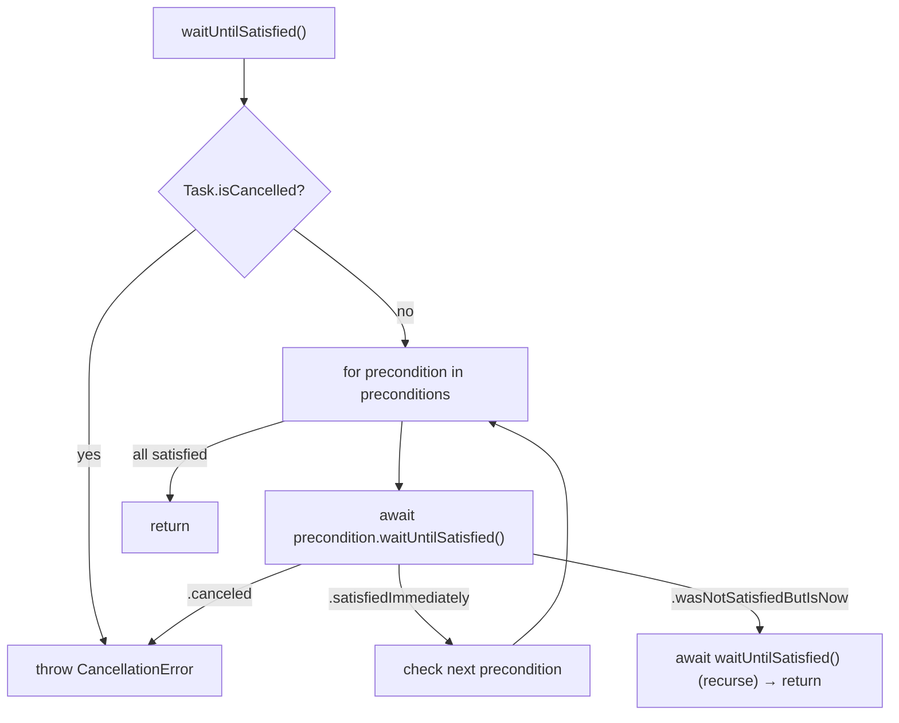

# SignalServiceKit `Preconditions/` Layer

This directory documents the **preconditions** utility in
[`SignalServiceKit/Preconditions/`](../../../SignalServiceKit/Preconditions/)
(2 Swift files, ~153 LOC). It provides a small structured-concurrency primitive
for *asynchronously waiting* until one or more conditions are true before
proceeding — for example, "wait until the app is foregrounded", "wait until the
chat web socket has drained its initial message queue", or "wait until
registration state settles".

All citations are `path:line` relative to the repository root. Each claim is
labeled with a confidence level:

- **[High]** — directly read from source; behavior is explicit in code.
- **[Medium]** — inferred from code structure, naming, or comments; cross-file
  behavior that is strongly implied but not fully traced.
- **[Low]** — depends on types/constants defined outside this directory that
  were not fully read in-tree.

Where the source gives no evidence for a design question, the text says
**"intent undetermined — no evidence in source"** rather than guessing.

## Files in this directory

| File | Defines | Role |
| --- | --- | --- |
| [`Preconditions.swift`](../../../SignalServiceKit/Preconditions/Preconditions.swift) | `Precondition` protocol, `_PreconditionWaitResult` enum, `Preconditions` class | The abstraction and the "wait for all" aggregator |
| [`NotificationPrecondition.swift`](../../../SignalServiceKit/Preconditions/NotificationPrecondition.swift) | `NotificationPrecondition` struct | A reusable `Precondition` driven by `NotificationCenter` events |

## The abstraction

### `Precondition` protocol

`Precondition` is a protocol with a single async requirement,
`waitUntilSatisfied() async -> WaitResult`, whose contract is that **when it
returns, the condition must be true** (or the task was canceled). **[High]**
(`SignalServiceKit/Preconditions/Preconditions.swift:9-27`)

The doc comment prescribes a two-phase implementation strategy: (1) if the
condition is already satisfied, return `.satisfiedImmediately`; (2) otherwise
suspend until it becomes satisfied — typically by listening for a notification
or other async callback — and then return `.wasNotSatisfiedButIsNow`. **[High]**
(`SignalServiceKit/Preconditions/Preconditions.swift:18-25`)

`WaitResult` is a `typealias` for the module-level enum `_PreconditionWaitResult`.
**[High]** (`SignalServiceKit/Preconditions/Preconditions.swift:10`)

### `_PreconditionWaitResult` enum

The result type has three cases, each with a precise meaning spelled out in the
source: **[High]** (`SignalServiceKit/Preconditions/Preconditions.swift:29-39`)

| Case | Meaning |
| --- | --- |
| `.satisfiedImmediately` | Already satisfied when `waitUntilSatisfied` was invoked |
| `.wasNotSatisfiedButIsNow` | Was not satisfied initially; the call suspended until it became satisfied |
| `.canceled` | The `Task` was canceled while waiting |

The underscore-prefixed name combined with the public `WaitResult` typealias
means callers refer to the type as `Precondition.WaitResult` rather than by its
bare name. **[Medium]** (`SignalServiceKit/Preconditions/Preconditions.swift:10`,
`SignalServiceKit/Preconditions/Preconditions.swift:29`)

### `Preconditions` aggregator

`Preconditions` (note the plural) is a `final class` holding an immutable array
of `Precondition`s supplied at init. **[High]**
(`SignalServiceKit/Preconditions/Preconditions.swift:41-45`)

Its `waitUntilSatisfied()` is `async` and typed-throws `CancellationError`. It:

1. Throws immediately if the current `Task` is already canceled. **[High]**
   (`SignalServiceKit/Preconditions/Preconditions.swift:86-88`)
2. Iterates the preconditions in order, awaiting each one's
   `waitUntilSatisfied()`. **[High]**
   (`SignalServiceKit/Preconditions/Preconditions.swift:89-90`)
3. On `.canceled`, converts to a thrown `CancellationError`. **[High]**
   (`SignalServiceKit/Preconditions/Preconditions.swift:91-92`)
4. On `.satisfiedImmediately`, moves on to the next precondition. **[High]**
   (`SignalServiceKit/Preconditions/Preconditions.swift:93-96`)
5. On `.wasNotSatisfiedButIsNow`, **recursively starts over** from the top and
   returns. **[High]**
   (`SignalServiceKit/Preconditions/Preconditions.swift:97-101`)

The "start over" behavior is the key semantic: because waiting on a later
precondition can cause an earlier one to become false again, the whole set must
be re-validated once anything had to wait. The source gives the concrete example
of `AppActive` plus `WebSocketOpen` — if the user backgrounds the app while
waiting for the socket to open, the app-active check must be re-run once the
socket opens. **[High]**
(`SignalServiceKit/Preconditions/Preconditions.swift:78-82`)

> Note: the loop returns normally (all satisfied) only when every precondition
> reports `.satisfiedImmediately` on a single clean pass; any wait triggers a
> recursive restart before returning. **[High]**
> (`SignalServiceKit/Preconditions/Preconditions.swift:89-103`)

The lengthy doc comment on `waitUntilSatisfied()` contrasts this
structured-concurrency design against the older unstructured
`runIfReady`/`isReady`/`stateChanged`-observer idiom, explaining why observers
are set up lazily (only while awaiting) rather than being permanently
registered. **[High]**
(`SignalServiceKit/Preconditions/Preconditions.swift:47-84`)

## `NotificationPrecondition`

`NotificationPrecondition` is the one concrete, reusable `Precondition` shipped
in this directory. It is a `struct` conforming to both `Precondition` and
`Sendable`. **[High]**
(`SignalServiceKit/Preconditions/NotificationPrecondition.swift:10`)

It stores an array of `Notification.Name`s and a `@Sendable () async -> Bool`
`isSatisfied` closure. Two initializers are provided: a single-name convenience
that forwards to the array form. **[High]**
(`SignalServiceKit/Preconditions/NotificationPrecondition.swift:11-21`)

Its `waitUntilSatisfied()` implements exactly the two-phase pattern the protocol
prescribes:

1. Registers a `NotificationCenter.default` observer for **each** notification
   name; when any fires, it spawns a `Task` that re-evaluates `isSatisfied()`
   and, if true, resumes a `CancellableContinuation<Void>`. **[High]**
   (`SignalServiceKit/Preconditions/NotificationPrecondition.swift:24-33`)
2. A `defer` block removes every registered observer on exit (satisfied,
   canceled, or otherwise). **[High]**
   (`SignalServiceKit/Preconditions/NotificationPrecondition.swift:34-38`)
3. Performs the initial check: if `isSatisfied()` is already true, returns
   `.satisfiedImmediately` (so observers are torn down immediately via the
   `defer`). **[High]**
   (`SignalServiceKit/Preconditions/NotificationPrecondition.swift:39-41`)
4. Otherwise awaits `result.wait()`; on success returns
   `.wasNotSatisfiedButIsNow`, and on a thrown error (cancellation) returns
   `.canceled`. **[High]**
   (`SignalServiceKit/Preconditions/NotificationPrecondition.swift:42-47`)

Note the ordering: observers are registered **before** the initial
`isSatisfied()` check (lines 25-39), which closes the race where a notification
could fire between the check and observer registration. The initial check still
short-circuits with `.satisfiedImmediately` when possible. **[Medium]**
(`SignalServiceKit/Preconditions/NotificationPrecondition.swift:25-41`)

### Dependency on `CancellableContinuation`

The suspend/resume mechanism is `CancellableContinuation<Void>`, defined outside
this directory in
[`SignalServiceKit/Concurrency/CancellableContinuation.swift`](../../../SignalServiceKit/Concurrency/CancellableContinuation.swift).
It is a `Sendable` container that resumes immediately when the surrounding task
is canceled, which is precisely why `waitUntilSatisfied` can map a thrown error
onto the `.canceled` case. Its own doc comment frames cancellation as "stop
waiting for the event to occur" rather than "stop the event from occurring" —
matching how a `Precondition` is just an observer, not an actor. **[High]**
(`SignalServiceKit/Concurrency/CancellableContinuation.swift:7-37`,
`SignalServiceKit/Preconditions/NotificationPrecondition.swift:24`)

`result.resume(with:)` is documented as safe to call multiple times (redundant
calls are ignored), which matters here because multiple observers (one per
notification name) can each resume the same continuation. **[High]**
(`SignalServiceKit/Concurrency/CancellableContinuation.swift:22-28`,
`SignalServiceKit/Preconditions/NotificationPrecondition.swift:25-33`)

## How the module is used

These types are consumed across both the `SignalServiceKit` framework and the
app/extension targets. Representative call sites:

| Caller | What it waits for | Citation |
| --- | --- | --- |
| `MessageProcessor` | Message-fetch complete, processor queue drained, GV2 queue flushed | `SignalServiceKit/Messages/MessageProcessor.swift:41-58` **[High]** |
| `MessageFetcherJob` | `OWSChatConnection.chatConnectionStateDidChange` → initial fetch complete | `SignalServiceKit/Messages/MessageFetcherJob.swift:19-23` **[High]** |
| `BulkDeleteInteractionJobQueue` | `registrationStateDidChange` → registration state settled before deleting a thread | `SignalServiceKit/Jobs/BulkDeleteInteractionJobQueue.swift:151-154` **[High]** |
| `GroupMessageProcessor` | `registrationStateDidChange` | `SignalServiceKit/Messages/GroupMessageProcessor.swift:101-103` **[High]** |
| `AppActivePrecondition` (app target) | `UIApplication.didBecomeActiveNotification` → app foreground & active | `Signal/Preconditions/AppActivePrecondition.swift:9-21` **[High]** |
| `NotificationService` (NSE target) | `.isSignalProxyReadyDidChange` → proxy ready | `SignalNSE/NotificationService.swift:198-204` **[High]** |

`AppActivePrecondition` is an illustrative *wrapper* `Precondition`: it is itself
a thin `Precondition` conformer in the app target that composes a
`NotificationPrecondition` internally and forwards `waitUntilSatisfied()` to it.
**[High]** (`Signal/Preconditions/AppActivePrecondition.swift:9-21`)

The typical usage shape across these call sites is to build an array of
`Precondition`s and wrap it in `Preconditions([...]).waitUntilSatisfied()`,
sometimes within a `do throws(CancellationError)` block. **[High]**
(`SignalServiceKit/Messages/MessageProcessor.swift:44-58`,
`SignalServiceKit/Jobs/BulkDeleteInteractionJobQueue.swift:150-158`)

## Tests

Unit coverage for the concrete precondition lives at
[`SignalServiceKit/tests/Preconditions/NotificationPreconditionTest.swift`](../../../SignalServiceKit/tests/Preconditions/NotificationPreconditionTest.swift),
exercising the immediately-satisfied path, the wait-then-notify path, and
cancellation. **[High]**
(`SignalServiceKit/tests/Preconditions/NotificationPreconditionTest.swift:11-47`)
The supporting `CancellableContinuation` has its own tests at
`SignalServiceKit/Concurrency/CancellableContinuationTest.swift`. **[High]**
(`SignalServiceKit/Concurrency/CancellableContinuationTest.swift:11`)

## Related modules

- **Concurrency** — `CancellableContinuation` (the suspend/resume primitive this
  module depends on) and its backing `DeferredContinuation` live in
  `SignalServiceKit/Concurrency/`. **[High]**
  (`SignalServiceKit/Concurrency/CancellableContinuation.swift:12-13`)
- **[Jobs subsystem](../Jobs/README.md)** — `BulkDeleteInteractionJobQueue` uses
  a `NotificationPrecondition` to gate deletion on registration state, so job
  bodies and preconditions interoperate. **[High]**
  (`SignalServiceKit/Jobs/BulkDeleteInteractionJobQueue.swift:151-154`)
- **[Network layer](../Network/README.md)** — `MessageFetcherJob` builds a
  precondition from `OWSChatConnection.chatConnectionStateDidChange`, tying this
  utility to the chat web socket's connection-state notifications. **[Medium]**
  (`SignalServiceKit/Messages/MessageFetcherJob.swift:19-23`)
- **Messages** — `MessageProcessor` / `GroupMessageProcessor` are the heaviest
  in-framework consumers, aggregating multiple preconditions before draining
  envelope queues. **[High]**
  (`SignalServiceKit/Messages/MessageProcessor.swift:41-58`,
  `SignalServiceKit/Messages/GroupMessageProcessor.swift:101-103`)
