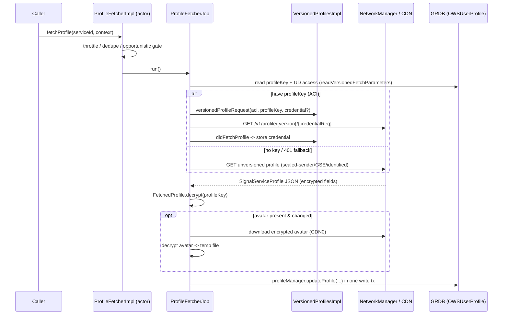

# Signal iOS — Profiles Subsystem

This document reconstructs Signal iOS's **Profiles** subsystem from the
first-party source in `SignalServiceKit/Profiles/` (~14 files, ~235 KB). A
"profile" is the small bundle of self-authored, end-to-end-encrypted account
metadata that each user publishes to the service: display name (given + family),
"about" bio text + emoji, an avatar image, a payment address, a
phone-number-sharing flag, and a set of donor/subscription badges. The server
stores these fields as opaque ciphertext; only holders of a user's 32-byte
**profile key** can decrypt them.

The subsystem is responsible for four related jobs:

1. **Publishing** the local user's profile (encrypt fields, PUT to the chat
   service, upload the encrypted avatar to CDN).
2. **Fetching + decrypting** other users' profiles (versioned & unversioned
   requests, avatar download), with throttling and sealed-sender/GSE auth.
3. **Profile-key lifecycle**: persistence, rotation, "profile key credentials"
   (zkgroup), and the profile whitelist that gates who may see your profile.
4. **Badges**: the donor/boost/gift badge catalog and their rendered image
   assets.

> **Confidence labels.** Each claim is tagged:
> - **[High]** — directly read from source; behavior is explicit in code.
> - **[Medium]** — inferred from code with reasonable certainty, but depends on
>   collaborators defined outside this directory (notably **LibSignalClient** —
>   `ProfileKey`, `ClientZkProfileOperations`, `ExpiringProfileKeyCredential`;
>   `OWSRequestFactory`; `NetworkManager`/`RequestMaker`; `StorageServiceManager`;
>   `OWSUDManager`; `Upload.CDN0`; `Aes256GcmEncryptedData`).
> - **[Low]** — inferred from naming/comments; not fully verified in-tree.
>
> Where the code does not reveal *why* something is done, this is stated as
> "intent undetermined — no evidence in source". File+line citations refer to
> the tree at the time of writing; line numbers are approximate anchors — use
> the cited symbol name if lines have drifted.

---

## The source files at a glance

| File | Role | LOC (approx) |
| --- | --- | --- |
| `OWSProfileManager.swift` | **Orchestration layer** for the *local* user: whitelist, profile-key rotation, the serialized "update profile on service" queue, avatar re-upload/repair, `setProfileKeyData`/`fillInProfileKeys` for other users. **[High]** | ~1.7k |
| `OWSUserProfile.swift` | The **persisted model** (`model_OWSUserProfile`) + the profile **encryption/decryption** primitives (name/bio/boolean/avatar), name/bio normalization, avatar file paths, and the big `applyChanges` side-effect engine. **[High]** | ~1.4k |
| `ProfileFetcherJob.swift` | A **single profile fetch**: versioned-vs-unversioned request selection, decrypt, avatar download, write-back, UD/capability reconciliation. Defines `FetchedProfile`/`DecryptedProfile`. **[High]** | ~600 |
| `ProfileFetcher.swift` | The **actor** (`ProfileFetcherImpl`) that de-dupes, throttles, and rate-limits fetch jobs; opportunistic vs urgent fetches. **[High]** | ~330 |
| `VersionedProfilesImpl.swift` | **zkgroup/versioned-profile** crypto: build the versioned update request, upload avatar, request+store `ExpiringProfileKeyCredential`s. **[High]** | ~370 |
| `VersionedProfiles.swift` | Protocol + value types (`VersionedProfileUpdate`, `VersionedProfileAvatarMutation`) + `MockVersionedProfiles`. **[High]** | ~130 |
| `SignalServiceProfile.swift` | Parses the **server JSON** profile response into a value type (encrypted fields + capabilities + badges). **[High]** | ~220 |
| `ProfileManager.swift` | The `ProfileManager`/`ProfileManagerProtocol` protocols + the `OptionalChange`/`OptionalAvatarChange` enums used throughout. **[High]** | ~230 |
| `ProfileManagerProtocol.swift` | The ObjC-visible slice of the protocol: whitelist + local profile key. **[High]** | ~55 |
| `UserProfileFinder.swift` | GRDB queries that fetch `OWSUserProfile` rows by serviceId/phone-number (batched via `Refinery`). **[High]** | ~130 |
| `UserProfileWriter.swift` | A serialized enum tagging *who* initiated a profile write (drives storage-service side effects). **[High]** | ~30 |
| `LocalProfileChecker.swift` | Eventual-consistency reconciler: after fetching our own profile, detect divergence from Storage Service and re-upload. **[High]** | ~180 |
| `ProfileBadgeManager.swift` | The `ProfileBadge` model (`model_ProfileBadgeTable`) + a manager that stores badges and fetches their image assets. **[High]** | ~300 |
| `BadgeAssets.swift` | Slices a downloaded sprite-sheet into per-size/per-theme `UIImage`s and caches them on disk. **[High]** | ~310 |

---

## The two central models

### `OWSUserProfile` — the persisted row — `OWSUserProfile.swift:140`
**[High]** An `SDSCodableModel` stored in `model_OWSUserProfile`. One row per
*recipient*, plus one row for the local user. Key fields (`:174-275`):
`serviceIdString`, `phoneNumber`, `profileKey` (`Aes256Key?`), `givenName`,
`familyName`, `bio`, `bioEmoji`, `avatarUrlPath` (on-CDN, encrypted),
`avatarFileName` (on-disk, decrypted), `badges`, `lastFetchDate`,
`lastMessagingDate`, `isPhoneNumberShared`, `hasPaymentAddress`.

The local user is a **special row** keyed by the sentinel phone number
`"kLocalProfileUniqueId"` and *no* ACI (`Constants.localProfilePhoneNumber`,
`:177`; `internalAddress`, `:190`). Code must never write to the "real"
local address; it uses this sentinel row instead (`applyChanges` asserts this,
`OWSUserProfile.swift:1126-1131`). **[High]** The `Address` enum
(`.localUser`/`.otherUser`, `:143`) and `InsertableAddress` (adds
`.legacyUserPhoneNumberFromBackupRestore`, `:150`) make this split explicit.

`getOrBuildUserProfile(for:…)` (`:838`) returns an existing row or creates one;
when building the **local** profile it immediately generates a random profile
key (`Aes256Key.generateRandom()`, `:862`). It also de-dupes: there should be
exactly one profile per recipient, and `fetchAndExpungeUserProfiles` deletes
redundant rows (`:875`). **[High]**

### `ProfileBadge` — the badge catalog row — `ProfileBadgeManager.swift:11`
**[High]** Stored in `model_ProfileBadgeTable`. Holds server-defined,
*non-user-specific* badge info: `id`, `category` (`donor`/`other`, unknown →
`.other`, `:124`), localized name + description-format-string, `resourcePath`
(sha256 of the badge image per the comment, `:24`), `badgeVariant` (device pixel
scale), and optional `duration`. User-specific info (expiration, visibility)
lives separately in `OWSUserProfileBadgeInfo` (`OWSUserProfile.swift:10`). **[High]**

---

## `UserProfileWriter` — provenance drives side effects — `UserProfileWriter.swift:7`
**[High]** Every profile mutation is tagged with *who* initiated it
(`localUser`, `profileFetch`, `storageService`, `syncMessage`, `registration`,
`linking`, `groupState`, `reupload`, `avatarDownload`, …). This enum is
**serialized** (persisted in `PendingProfileUpdate`), so its raw values are
load-bearing.

Its most important consumer is `shouldUpdateStorageService`
(`OWSUserProfile.swift:92-115`): only `changePhoneNumber`, `groupState`,
`localUser`, `profileFetch`, `registration`, `reupload`, and
`systemContactsFetch` writes propagate to Storage Service; everything else
(including `storageService` itself, to avoid loops) does not. **[High]** This is
how a write originating *from* Storage Service doesn't bounce back.

---

## Data flow 1 — fetching another user's profile



### The actor: throttling & de-duplication — `ProfileFetcher.swift:65`
**[High]** `ProfileFetcherImpl` is an `actor`. It:
- Tracks **in-progress** fetches per `ServiceId` (`inProgressFetches`, `:106`)
  so `waitForPendingFetches(for:)` (`:296`) can await all current fetches.
- Keeps a 16k-entry **LRU of recent results** (`recentFetchResults`, `:76`) with
  per-outcome retry delays (`shouldOpportunisticallyFetch`, `:320`): success →
  5 min, networkFailure → 1 min, notAuthorized → 30 min, notFound → 6 h,
  rateLimit → 5 min, otherFailure → 30 min. **[High]**
- Distinguishes **opportunistic** fetches (droppable; main-app only; skipped in
  tests; rate-throttled) from **urgent** fetches (`fetchProfileWithOptions`,
  `:220`). Opportunistic fetches self-throttle to ~0.1 s spacing normally and
  back off to 20 s after hitting the rate limit (`waitIfNecessary`, `:289`; the
  comment cites the service bucket of 4320 refilling 3/min). **[High]**

### The job: request selection — `ProfileFetcherJob.swift:87`
**[High]** `run()` fetches then writes, and on `.notFound` for a
believed-registered recipient asks `accountChecker.checkIfAccountExists`
(`:102-114`). `requestProfile` retries 3× with backoff and maps HTTP
401/404/429 → `ProfileRequestError.notAuthorized/.notFound/.rateLimit`
(`:113-125`). **[High]**

`requestProfileAttempt` (`:127`) prefers a **versioned** fetch when we have the
recipient's profile key *and* a UD access key (`readVersionedFetchParameters`,
`:214` / `_readVersionedFetchParameters`, `:245`). PNIs are never fetched
versioned (`:263`); the local ACI is fetched versioned but without UD
(`:270-273`). If the
versioned fetch 401s while using an access key, it **falls back to an
unversioned fetch** (`:170-172`) — unless `mustFetchNewCredential` is set, in
which case it throws `couldNotFetchCredential` (`:175`). The unversioned path
builds auth via `RequestMaker` with `.allowIdentifiedFallback`/`.isProfileFetch`
and an optional **group-send endorsement** (GSE) when fetching in a group
context (`readGroupSendEndorsement`, `:299`; `:185-205`). **[High]**

### Decrypting — `ProfileFetcherJob.swift:FetchedProfile.decrypt` (`:616`)
**[High]** `FetchedProfile` (`:603`) wraps the raw `SignalServiceProfile` plus the
`ProfileKey?` used. If a key is present and any encrypted field exists, it
produces a `DecryptedProfile` (`:592`) whose fields are each a `Result` (so one
field's decryption failure doesn't poison the others): name components, bio,
bio emoji, payment-address data, phone-number-sharing bool (`:616-657`). The
payment address is length-prefixed then parsed as `SSKProtoPaymentAddress` and
verified against the fetched identity key (`DecryptedProfile.paymentAddress()`,
`:659`). **[High]**

### Writing back — `ProfileFetcherJob.updateProfile` (`:336` → `:429`)
**[High]** In one write transaction it: updates UD mode (`updateUnidentifiedAccess`,
`:487`, which HMACs a 32-byte zero block with the UD access key and
constant-time-compares the verifier, `:507-512`), moves the decrypted avatar
into place (`consumeTemporaryAvatarFileUrl`), calls
`profileManager.updateProfile(...)`, reconciles capabilities
(`updateCapabilitiesIfNeeded`, `:519`), saves the identity key, and — for the
local ACI — hands the result to `LocalProfileChecker`
(`reconcileLocalProfileIfNeeded`, `:562`). Profile fetches
**never touch the local user's avatar** (`downloadAvatarIfNeeded`, `:359`).
**[High]**

---

## Data flow 2 — publishing the local user's profile

```mermaid
sequenceDiagram
    participant UI as App (settings/registration)
    participant PM as OWSProfileManager
    participant Q as PendingProfileUpdate (persisted)
    participant VP as VersionedProfilesImpl
    participant NET as chat service + CDN
    participant DB as GRDB

    UI->>PM: updateLocalProfile(name/bio/avatar/badges, ...)
    PM->>Q: enqueueProfileUpdate (coalesce w/ existing)
    PM->>PM: _updateProfileOnServiceIfNecessary (serialized)
    PM->>VP: updateProfile(encrypted fields, commitment, version, avatar mutation)
    VP->>NET: PUT versioned profile (OWSRequestFactory.setVersionedProfileRequest)
    opt avatar changed
        VP->>NET: upload encrypted avatar (CDN0 form)
    end
    NET-->>VP: avatarUrlPath
    PM->>DB: apply changes to local OWSUserProfile; dequeue
    PM->>NET: sendFetchLatestProfileSyncMessage (tell our devices)
```

### The serialized update queue — `OWSProfileManager.swift:402` / `:934`
**[High]** `updateLocalProfile(...)` is main-app only. It **coalesces** the new
change into a single persisted `PendingProfileUpdate`
(`enqueueProfileUpdate`, `:1274`; stored via `settingsStore` under
`kPendingProfileUpdateKey`), records a `ProfileUpdateRequest` with a `Future`,
and kicks `_updateProfileOnServiceIfNecessary` on the main actor. A single
`isUpdatingProfileOnService` flag ensures **one in-flight update at a time**
(`_updateProfileOnServiceIfNecessary`, `:934`). `processProfileUpdateRequests`
(`:990`) finds the matching request
by id, **cancels now-obsolete earlier requests** (rejecting their futures), and
refuses to send if we can't authenticate (implicit auth while unregistered)
(`:1010-1024`). On success the future resolves and the loop re-runs; on network
error it retries forever with exponential backoff; on other errors it dequeues
and gives up (`updateProfileOnService`, `:1114`). **[High]**

`PendingProfileUpdate` (`:1415`) is an `NSSecureCoding` object persisted across
launches so an interrupted update survives a restart; its coder carefully
distinguishes `.noChange`, `.setTo(nil)`, and `.noChangeButMustReupload`
(`:1470-1600`). **[High]**

### Avatar handling — `buildAvatarUpdate` — `OWSProfileManager.swift:1220`
**[High]** Avatars are re-uploaded only when necessary: (1) the avatar changed,
(2) the profile key changed, or (3) the remote avatar doesn't match local. For
`.noChangeButMustReupload` it first tries
`downloadAndDecryptLocalUserAvatarIfNeeded` so it can re-encrypt the existing
image (`:1253-1266`). `repairAvatarIfNeeded` (`:1039`) is a bounded (5-attempt)
self-heal that re-uploads a local avatar that failed to land. **[High]**

---

## Cryptography

All profile crypto lives in `OWSUserProfile`'s `encrypt`/`decrypt` family
(`OWSUserProfile.swift:735-848`) and uses **AES-256-GCM** via
`Aes256GcmEncryptedData` with the 32-byte profile key as the symmetric key.
**[High]**

- **Fixed-length padding.** Variable-length fields are padded up to the smallest
  allowed bucket before encryption so ciphertext length doesn't leak content
  length (`encrypt(data:profileKey:paddedLengths:)`, `:802`). Observed buckets:
  names `[53, 257]` (`encrypt(givenName:…)`, `:791`; given+null+family), bio
  `[128, 254, 512]`, bio emoji `[32]`, payment address `[554]`
  (`VersionedProfilesImpl.swift:174-176`). **[High]**
- **Name encoding.** Given and family names are joined as
  `"<given><0x00><family><0x00 padding>"` and split back on decrypt
  (`decrypt(profileNameData:…)`, `:748`). Strings are null-terminated +
  padded (`decrypt(profileStringData:…)`, `:769`); booleans are a single
  `0x00`/`0x01` byte (`decrypt(profileBooleanData:…)`, `:780`). **[High]**
- **Avatars** are encrypted the same way (concatenated nonce‖ciphertext‖tag) and
  decrypted **streaming** from a file (`decryptAvatar(at:to:profileKey:)`,
  `OWSProfileManager.swift:1677`), reading the nonce, then decrypting in 32 KB
  chunks via `Aes256GcmDecryption`, and validating the result is a real image.
  The decrypted file is written with
  `completeUntilFirstUserAuthentication` protection. **[High]**

### Versioned profiles & profile-key credentials — `VersionedProfilesImpl.swift`
**[Medium]** (depends on LibSignalClient zkgroup types). A **versioned** profile
upload (`updateProfile`, `:106`) derives, from the local ACI + profile key, a
`ProfileKeyCommitment` and a hex `profileKeyVersion`
(`localProfileKey.getCommitment`, `:119` / `.getProfileKeyVersion`, `:187`),
encrypts every field, uploads the avatar (if any) to CDN0 via the server-provided
upload form (`uploadAvatar`, `:236`), and submits via
`OWSRequestFactory.setVersionedProfileRequest`. This lets the server serve the
*right* ciphertext to viewers who have an older vs newer profile key, which is
what makes profile-key **rotation** race-free. **[High for the control flow,
Medium for the zkgroup semantics]**

A **profile-key credential** (`ExpiringProfileKeyCredential`) is a zkgroup token
proving to the server (anonymously, e.g. for group operations) that you know a
member's profile key. `versionedProfileRequest` optionally bundles a credential
*request* (`createProfileKeyCredentialRequestContext`, `:258`); when the response
arrives, `didFetchProfile` (`:291`)
receives + validates it against the stored profile key (`:321`) and persists it.
**[High]**

- **Credential storage** — `VersionedProfilesImpl.CredentialStore` (`:32`): a
  `NewKeyValueStore` keyed by uppercase ACI string. `getValidCredential` (`:38`)
  returns `nil` for expired credentials (checked via `isValid`,
  `expirationTime > Date()`, `:361`) and deliberately leaves the expired blob in
  place on a read-only tx — it's overwritten on the next successful fetch
  (`:48-70`). `clearProfileKeyCredential(s)` wipe them. **[High]**
- Credentials are **cleared whenever the relevant profile key changes** — on
  local rotation (`OWSProfileManager.swift:634`) and in `setProfileKeyData`
  (`:819`). **[High]**

---

## Profile-key rotation — `OWSProfileManager.swift:476`
**[High]** Rotation is primary-device-only and skipped in the NSE. It is
triggered by:
- **Blocklist overlap** — a whitelisted recipient or group is also blocked
  (`blocklistRotationTriggerIfNeeded`, `:538`). Rotating prevents blocked parties
  from decrypting your future profile.
- **An explicit trigger token** persisted by `setNeedsProfileKeyRotation`
  (`:1326`) / `tokenTriggerIfNeeded` (`:552`), e.g. when leaving a group.

The **order of operations is deliberate** (`_rotateProfileKey`, `:582`): it
re-uploads the profile under a **new** key *before* persisting that key locally,
because versioned profiles let other clients keep using the old key against the
old version until they re-fetch. Only after the upload succeeds does it persist
the key, clear the local profile-key credential, schedule gv2 member
profile-key updates, update account attributes, and clear the triggers
(`:625-654`). The whole thing retries on the next launch/blocklist-change if
interrupted. The blocklist victims are removed from the whitelist **in the same
transaction** that persists the new key — presence in whitelist∩blocklist is the
durable "needs rotation" signal, so removing them early would lose a retry
(`didRotateProfileKeyFromBlocklistTrigger`, `:679`). **[High]**

---

## The profile whitelist — `ProfileManagerProtocol.swift` / `OWSProfileManager.swift:70-243`
**[High]** The whitelist records *who is allowed to see your profile* (contacts
you've accepted, groups you're in). It has two backing stores:
- **Recipients**: a `SignalRecipient.status` of `.whitelisted`
  (`addRecipientToProfileWhitelist`/`isRecipientInProfileWhitelist`, `:81-157`).
  Blocked or hidden recipients are never whitelisted. **[High]**
- **Groups**: a `NewKeyValueStore` keyed by hex group id
  (`whitelistedGroupsStore`; `addGroupId(toProfileWhitelist:)`, `:159`). **[High]**

Whitelist changes post `profileWhitelistDidChange`, touch the relevant thread,
and — if the writer `shouldUpdateStorageService` — record a pending Storage
Service update (`_didUpdateRecipientInWhitelist`, `:126`;
`didUpdateGroupWhitelist`, `:199`). **[High]**

---

## Profile keys for other users — `setProfileKeyData` / `fillInProfileKeys`
**[High]** `setProfileKeyData` (`OWSProfileManager.swift:785`) stores a profile
key we learned about (from a message, group state, storage service, etc.). It
no-ops if the key is unchanged or (when `onlyFillInIfMissing`) already present;
on change it clears the stale profile-key credential, resets UD mode to
`.unknown`, and optionally schedules a profile fetch. `fillInProfileKeys`
(`:843`) applies a batch, with **authoritative** keys always overwriting and
non-authoritative keys only filling gaps. **[High]**

---

## `applyChanges` — the side-effect engine — `OWSUserProfile.swift:1117`
**[High]** All model mutations funnel through `OWSUserProfile.update(...)` →
`applyChanges`. Beyond writing columns, a single call can:
- Compute a `UserVisibleChange` (`.something`/`.avatarOnly`/`.nothing`) and gate
  which fields a given writer may touch — e.g. only "storage service properties"
  (name/avatar) are writable for authoritative writers, and the **local** avatar
  file may additionally be set by `.avatarDownload` (`:1072-1090`). **[High]**
- Insert "profile change" and "learned profile name" info messages into
  conversations (`insertProfileChangeMessagesIfNecessary`, `:1185`). **[High]**
- Reconcile donor badge state for the local user (`reconcileBadgeStates`,
  `:1177`). **[High]**
- Update phone-number visibility (`updatePhoneNumberVisibilityIfNeeded`,
  `:1206`). **[High]**
- **Record pending Storage Service updates** (local account vs other-user
  address) and post `localProfileDidChange` / `localProfileKeyDidChange` /
  `otherUsersProfileDidChange` notifications on sync-completion
  (`:1236-1264`). **[High]** Note the rule: local profile *fetches* never write
  to Storage Service, and non-local writes only do so for non-avatar changes
  (`shouldUpdateStorageService`, `:1218-1234`). **[High]**

---

## `LocalProfileChecker` — eventual consistency — `LocalProfileChecker.swift:7`
**[High]** After the main-app primary device fetches *its own* profile,
`didFetchLocalProfile` records the remote snapshot and reconciles. Because your
profile and Storage Service can't be updated atomically, it **waits for a steady
state** (3 s sleep + `messageProcessor.waitForFetchingAndProcessing()` +
`storageServiceManager.waitForPendingRestores()`, re-checking that the profile
snapshot hasn't changed, `waitForSteadyState`, `:83-113`) before comparing. If local
avatarUrlPath/givenName/familyName/phoneNumberSharing diverge from the remote
decrypted profile, it **re-uploads** the local profile (treating local state as
source of truth for those "Storage Service properties"), with exponential
backoff keyed on a consecutive-mismatch counter to avoid hot loops
(`reconcileProfile`, `:116-205`). **[High]**

---

## Capabilities — `SignalServiceProfile.Capabilities` — `SignalServiceProfile.swift:17`
**[High]** The server advertises boolean feature capabilities. A **missing**
capability is treated as default-**true** (assumed retired from the service and
now universal), except the always-false `dummyCapability` placeholder that keeps
the struct non-empty (`parseCapabilityFlag`, `:160-180`). On fetching our *own*
profile, newly-enabled capabilities (e.g. `usernameChangeSyncMessage`) trigger a
`sendFetchLatestProfileSyncMessage` to our other devices — guarded against
infinite sync loops by first checking `keyTransparencyStore`
(`updateCapabilitiesIfNeeded`, `ProfileFetcherJob.swift:519-560`). **[High]**

---

## Badges & assets — `ProfileBadgeManager.swift`, `BadgeAssets.swift`
**[High]** `ProfileBadgeManager` (`ProfileBadgeManager.swift:179`) persists
badges (`createOrUpdateBadge`), fetches them by id
(boost/subscription/gift/arbitrary), and downloads image assets through a
per-`resourcePath` serialized `KeyedConcurrentTaskQueue` so the same sprite-sheet
isn't fetched twice concurrently (`fetchAssetsIfNecessary`, `:231`). **[High]**

Badge images come from a remote **sprite-sheet** at
`https://updates2.signal.org/static/badges/<resourcePath>` and are cached under
`ProfileBadges/<trimmedPath>/` in the shared app container
(`ProfileBadge.remoteAssetPrefix`/`localAssetPrefix`, `:101-102`). `BadgeAssets`
(`BadgeAssets.swift:12`) slices the sheet into light/dark × 16/24/36 pt plus
universal 64/112/160 pt variants at the device's pixel scale, memo-izing the
per-variant `UIImage`s to disk. **[High]**

The `BadgeVariant.devicePreferred` selection reads
`UITraitCollection.current.displayScale` and the badge JSON's `sprites6` array
to pick the right source resolution (`ProfileBadgeManager.swift:76-80`,
`:157`). **[High]**

---

## Interactions with the rest of the app

- **Storage Service** (`StorageServiceManager`): the primary sync target.
  Profile/whitelist/profile-key changes become `recordPendingUpdates` /
  `recordPendingLocalAccountUpdates`; conversely `UserProfileWriter.storageService`
  writes don't bounce back. **[High]**
- **LibSignalClient / zkgroup** (`GroupsV2Protos.serverPublicParams`,
  `ClientZkProfileOperations`, `ProfileKey`, `ExpiringProfileKeyCredential`):
  versioned profiles, commitments, versions, and credentials. **[Medium]**
- **GroupsV2** (`groupsV2Ref`): on profile-key rotation, every gv2 the user is in
  must be told the new key (`scheduleAllGroupsV2ForProfileKeyUpdate` /
  `processProfileKeyUpdates`). GSEs are also used as a fetch auth fallback. **[High]**
- **OWSUDManager**: sealed-sender access keys gate versioned fetches and encode
  the unidentified-access mode written back from a fetch. **[High]**
- **PaymentsHelper**: a local payment address is included (length-prefixed,
  encrypted) in the versioned upload when payments are enabled. **[High]**
- **IdentityManager / AccountChecker / KeyTransparencyStore / SyncManager /
  ContactManager**: identity-key save, "does this account exist?" checks on 404,
  capability bookkeeping, cross-device sync messages, and avatar-download
  blocking. **[High]**
- **SearchableNameIndexer**: profiles are (re)indexed for search on insert/update
  (`anyDidInsert`/`anyDidUpdate`, `OWSUserProfile.swift:898-907`). **[High]**

---

## Notable edge cases & conventions

- **`OptionalChange` / `OptionalAvatarChange`** (`ProfileManager.swift:8-96`)
  thread a precise "no change vs set-to vs must-reupload" tri-/bi-state through
  every update path, and the avatar variant has an `importanceLevel` ordering so
  coalescing picks the stronger pending intent. **[High]**
- **Payment-address framing**: stored as a little-endian `UInt32` length prefix
  followed by the proto bytes, then padded to 554 bytes
  (`VersionedProfilesImpl.swift:144-160`; `DecryptedProfile.paymentAddress()`,
  `ProfileFetcherJob.swift:659`). **[High]**
- **Per-field decrypt isolation**: `DecryptedProfile` stores each field as a
  `Result`, so a single corrupt field never discards the whole profile. **[High]**
- **Avatar download never retried once finished** (per the doc comment on
  `downloadAndDecryptAvatar`, `ProfileManager.swift:103-108`): identical repeat
  requests re-download. **[High]**
- **Error-log hygiene**: avatar-fetch errors are logged by `shortDescription`
  only, because the raw error's userInfo can contain the CDN URL
  (`ProfileFetcherJob.swift:407`, `OWSProfileManager.swift:1242`). **[High]**

*Intent undetermined — no evidence in source*: the exact server-side semantics
of versioned profile versions/commitments and credential issuance live in
LibSignalClient + the service and are not reconstructable from this directory
alone.
