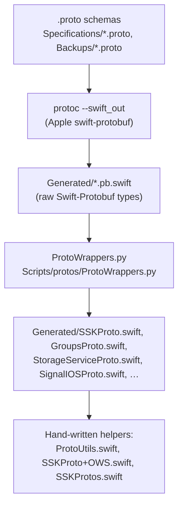

# SignalServiceKit `Protos/` module

This directory documents the Protocol Buffer layer of Signal-iOS, located at
[`SignalServiceKit/Protos/`](../../../SignalServiceKit/Protos/).

The module is overwhelmingly **generated code plus `.proto` schemas**. Only two
files in the directory root are hand-written Swift:
[`ProtoUtils.swift`](../../../SignalServiceKit/Protos/ProtoUtils.swift) and
[`SSKProto+OWS.swift`](../../../SignalServiceKit/Protos/SSKProto+OWS.swift).
Everything else is either a `.proto` specification, Swift-Protobuf output, the
hand-maintained wrapper layer emitted by a code generator, or build tooling.
This README focuses on the two hand-written Swift files and the build pipeline
that produces the rest.

All citations are `path:line` relative to the repository root. Each claim is
labeled with a confidence level:

- **[High]** — directly read from source; behavior is explicit in code.
- **[Medium]** — inferred from code structure, naming, or comments; cross-file
  behavior that is strongly implied but not fully traced.
- **[Low]** — depends on types/constants/tooling defined outside this
  directory (e.g. `SSKEnvironment`, `ProfileKey`, the `protoc` toolchain) that
  were not read in full.

Where the source gives no evidence for a design question, the text says
**"intent undetermined — no evidence in source"** rather than guessing.

## What this module is responsible for

The `Protos/` module is the single place where Signal-iOS defines its wire
formats and the Swift types used to encode/decode them. Its responsibilities:

1. **Hold the `.proto` schemas** that define Signal's wire protocols. These are
   kept "the same as/compatible with Signal-Android and Signal-Desktop, though
   modified slightly to match iOS conventions." **[High]**
   (`SignalServiceKit/Protos/Specifications/README.md:3-4`)
2. **Generate Swift types** from those schemas via a `Makefile`-driven build
   step. **[High]** (`SignalServiceKit/Protos/Makefile:14-16`)
3. **Supply hand-written helpers** that sit on top of the generated types to add
   iOS-specific convenience behavior that the generator cannot express. **[High]**
   (`SignalServiceKit/Protos/ProtoUtils.swift:10-48`,
   `SignalServiceKit/Protos/SSKProto+OWS.swift:9-14`)

## The two hand-written Swift files

### `ProtoUtils.swift` — populating the local profile key on outbound builders

`ProtoUtils` is an `@objc class` (with a `// TODO: Convert to enum once no objc
depends on this.`) whose only job is to decide whether the local user's profile
key should be attached to an outgoing message proto, and to attach it when so.
**[High]** (`SignalServiceKit/Protos/ProtoUtils.swift:8-10`)

It exposes three `addLocalProfileKeyIfNecessary(…)` overloads that mutate proto
*builders* produced by the generated wrapper layer:

- One for `SSKProtoDataMessageBuilder`, keyed purely on whitelist membership.
  **[High]** (`SignalServiceKit/Protos/ProtoUtils.swift:12-17`)
- One for `SSKProtoDataMessageBuilder` that additionally accepts a
  `profileKeySnapshot: ProfileKey?`; it adds the key if the snapshot
  **constant-time-equals** the current local profile key *or* the thread is
  whitelisted. The constant-time comparison avoids leaking timing information
  about the key. **[High]**
  (`SignalServiceKit/Protos/ProtoUtils.swift:19-28`)
- One for `SSKProtoCallMessageBuilder`, again keyed on whitelist membership.
  **[High]** (`SignalServiceKit/Protos/ProtoUtils.swift:30-34`)

The gating predicate `shouldMessageHaveLocalProfileKey(_:transaction:)` is
`private` and simply asks the profile manager whether the thread (group or
contact) is in the profile whitelist. **[High]**
(`SignalServiceKit/Protos/ProtoUtils.swift:42-47`)

`localProfileKey(tx:)` fetches the key from `SSKEnvironment.shared
.profileManagerRef` and **force-unwraps** it. The in-source comment explains the
force-unwrap is inherited from the original Objective-C implementation and is
considered "safe" because missing profile keys are generated in `warmCaches`.
**[Medium]** — the safety guarantee depends on `warmCaches`, which lives outside
this directory. (`SignalServiceKit/Protos/ProtoUtils.swift:36-41`)

Dependencies pulled in from outside the module (`TSThread`,
`SSKProtoDataMessageBuilder`, `SSKProtoCallMessageBuilder`, `DBReadTransaction`,
`ProfileKey`, `SSKEnvironment`, `ows_constantTimeIsEqual(to:)`) mean the file
only compiles in the context of the wider `SignalServiceKit` target. **[Low]** —
these symbols are referenced but defined elsewhere.
(`SignalServiceKit/Protos/ProtoUtils.swift:6-7`,
`SignalServiceKit/Protos/ProtoUtils.swift:19-28`)

### `SSKProto+OWS.swift` — a derived predicate on a generated type

This file is a one-method extension on the **generated** type
`SSKProtoSyncMessageSent`. It adds a computed `isStoryTranscript` property that
returns `true` when the sent sync message carries a `storyMessage` or any
`storyMessageRecipients`. **[High]**
(`SignalServiceKit/Protos/SSKProto+OWS.swift:9-14`)

The `+OWS` filename convention marks this as an iOS-authored augmentation of a
generated class, so the hand-written logic survives regeneration (the generator
rewrites `Generated/SSKProto.swift`, not this file). **[Medium]** — inferred
from the file/naming split between this file and the `Generated/` directory.
(`SignalServiceKit/Protos/SSKProto+OWS.swift:9`,
`SignalServiceKit/Protos/Makefile:14-16`)

## The generation pipeline

The schemas live in
[`Specifications/`](../../../SignalServiceKit/Protos/Specifications/) and the
Backup schemas in [`Backups/`](../../../SignalServiceKit/Protos/Backups/). The
`Makefile` drives generation. **[High]**
(`SignalServiceKit/Protos/Makefile:9-54`)

Two distinct generation styles appear in the `Makefile`:

1. **`protoc` only.** Some schemas are compiled straight to raw Swift-Protobuf
   types with no wrapper, e.g. `session_record_protos`, `svr_protos`,
   `mobilecoin_protos`, and the `public`-visibility targets
   `provisioning_protos`, `fingerprint_protos`, `registration_protos`. **[High]**
   (`SignalServiceKit/Protos/Makefile:38-57`,
   `SignalServiceKit/Protos/Makefile:18-24`)
2. **`protoc` + `ProtoWrappers.py`.** Signal's own messaging protocols get a
   second pass through `../../Scripts/protos/ProtoWrappers.py`, which emits the
   `SSKProto`/`GroupsProto`/`StorageServiceProto`/`SignalIOSProto`/
   `DeviceTransferProto` wrapper classes with iOS-friendly, `@objc`, non-optional
   accessors. **[High]** (`SignalServiceKit/Protos/Makefile:8-9`,
   `SignalServiceKit/Protos/Makefile:14-37`)

The wrapper output is what `ProtoUtils` and `SSKProto+OWS` build on — e.g.
`SignalIOSProtoDeviceName` is a generated `@objc` wrapper around the raw
`IOSProtos_DeviceName`, matching the `SignalIOS.proto` schema. **[High]**
(`SignalServiceKit/Protos/Generated/SignalIOSProto.swift:16-24`,
`SignalServiceKit/Protos/Specifications/SignalIOS.proto:12-18`)

### A non-generated wrapper for one edge case

`SSKProtos.currentProtocolVersion` is a hand-maintained shim in the `Generated/`
tree. Its in-source comment states the wrappers "don't handle enum aliases," so
this one value is exposed manually by reaching into the raw
`SignalServiceProtos_DataMessage.ProtocolVersion.current`. **[High]**
(`SignalServiceKit/Protos/Generated/SSKProtos.swift:13-18`)

### Backups are generated differently

The Backup schemas are compiled by `protoc` **without** the `ProtoWrappers.py`
pass. The directory's own README explains this is because `ProtoWrappers.py` "is
incompatible with some of the syntactic structures we use in `Backup.proto`."
**[High]** (`SignalServiceKit/Protos/Backups/README.md:5-7`,
`SignalServiceKit/Protos/Makefile:48-54`)

## File index (directory root)

| File | Hand-written? | Purpose |
| --- | --- | --- |
| [`ProtoUtils.swift`](../../../SignalServiceKit/Protos/ProtoUtils.swift) | Yes | Attach local profile key to data/call message builders. **[High]** (`ProtoUtils.swift:10-48`) |
| [`SSKProto+OWS.swift`](../../../SignalServiceKit/Protos/SSKProto+OWS.swift) | Yes | `isStoryTranscript` convenience on generated `SSKProtoSyncMessageSent`. **[High]** (`SSKProto+OWS.swift:9-14`) |
| [`Makefile`](../../../SignalServiceKit/Protos/Makefile) | Yes (build) | Drives `protoc` + `ProtoWrappers.py` generation. **[High]** (`Makefile:9-57`) |
| `Specifications/*.proto` | Schemas | Signal wire-format definitions. **[High]** (`Specifications/README.md:1-4`) |
| `Generated/*.pb.swift` | No (generated) | Raw Swift-Protobuf types. **[High]** (`Makefile:15`) |
| `Generated/*Proto.swift`, `SSKProtos.swift` | Mostly generated | iOS wrapper classes; `SSKProtos.swift` is a hand-maintained shim. **[High]** (`Makefile:16`, `Generated/SSKProtos.swift:13-18`) |
| `Backups/` | Schemas + generated | Backup protos, compiled without the wrapper pass. **[High]** (`Backups/README.md:5-7`) |

> The task scopes this module to "2 Swift files," referring to the two
> hand-written Swift files in the directory root (`ProtoUtils.swift` and
> `SSKProto+OWS.swift`). The `Generated/` and `Backups/` trees contain many more
> `.swift` files, but they are machine-emitted and governed by the `Makefile`,
> not maintained by hand. **[High]**
> (`SignalServiceKit/Protos/Makefile:14-57`)

## Related modules

- [`Backups/`](../Backups/README.md) — consumes the `Backup.proto`-generated
  types produced here (see `Backups/README.md`). **[Medium]** — relationship
  implied by the shared Backup schemas. (`SignalServiceKit/Protos/Backups/README.md:5-7`)
- [`StorageService/`](../StorageService/README.md) — consumes the
  `StorageServiceProto` wrappers generated from `StorageService.proto`. **[Medium]**
  (`SignalServiceKit/Protos/Makefile:26-28`)
- [`Groups/`](../Groups/README.md) — consumes the `GroupsProto` wrappers
  generated from `Groups.proto`. **[Medium]** (`SignalServiceKit/Protos/Makefile:30-32`)
- [`Messages/`](../Messages/README.md) — builds `SSKProtoDataMessage` /
  `SSKProtoCallMessage` / `SSKProtoSyncMessage` payloads, which is where
  `ProtoUtils` and `SSKProto+OWS` are applied. **[Medium]** —
  `ProtoUtils` mutates data/call message builders.
  (`SignalServiceKit/Protos/ProtoUtils.swift:12-34`)
- [`Profiles/`](../Profiles/README.md) — provides `profileManagerRef` /
  `localProfileKey` and the profile whitelist that `ProtoUtils` queries. **[Medium]**
  (`SignalServiceKit/Protos/ProtoUtils.swift:36-47`)
- [`Network/`](../Network/README.md) — the transport layer that serializes and
  sends the proto payloads defined here. **[Low]** — relationship by role, not
  traced in this directory. (`SignalServiceKit/Protos/Specifications/README.md:1-4`)
- [`Stories/`](../Stories/README.md) — `SSKProto+OWS.isStoryTranscript`
  classifies sent sync messages as story transcripts. **[Medium]**
  (`SignalServiceKit/Protos/SSKProto+OWS.swift:9-14`)
