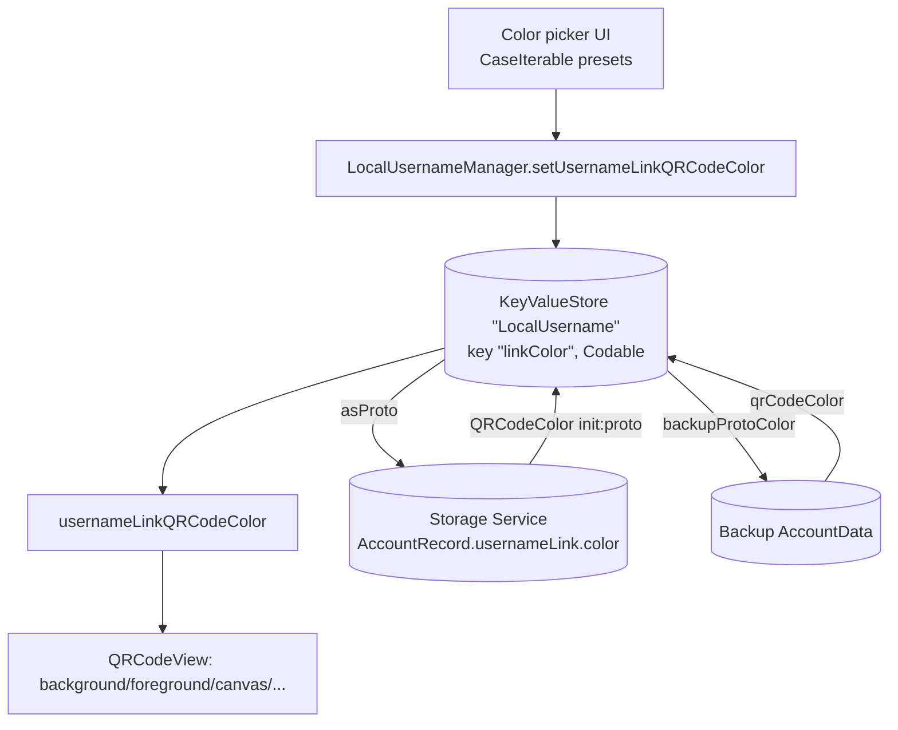

# QR Codes

Covers `SignalServiceKit/QRCodes/`:

- `QRCodeColor.swift`

This folder is tiny: it defines the **color theme** used when Signal renders a styled QR code
(today, the username-link QR code). It holds no rendering, scanning, or persistence logic — only a
palette. The actual QR-code image generation and the color-picker/share UI live in the app layer
(e.g. `Signal/QRCodes/QRCodeView.swift`, `Signal/Usernames/Links/...`), while the *selected* color
is persisted and synced by the Usernames subsystem.

---

## `QRCodeColor` — `QRCodeColor.swift:9`

Confidence: HIGH (read in full). A `String`-backed enum of eight preset themes
(`blue`, `white`, `grey`, `olive`, `green`, `orange`, `pink`, `purple`, `:10`–`:17`). Each case maps
to a set of `UIColor` values via computed properties; there is no stored state.

| Property | Line | Role |
|----------|------|------|
| `background` | 20 | Fill color of the QR code's background. |
| `foreground` | 44 | Color of the QR code modules (the dots); used as the tint for the template image in the app's `QRCodeView.setTemplateImage(_:tintColor:)`. |
| `canvas` | 66 | Background of the larger *share image* that wraps the QR code. |
| `paddingBorder` | 90 | Border around the QR's padding — only non-`.clear` for `.white` (a light grey), so the white preset stays visible on a white canvas. |
| `username` | 101 | Text color for the username shown beside the QR code (black on `.white`, white otherwise). |

Color values are hard-coded `rgbHex` literals per case; this is a design asset expressed in code
rather than an asset catalog.

### `public import UIKit` — `:6`
Confidence: HIGH. The enum returns `UIColor`, so it depends on UIKit even though it lives in
SignalServiceKit. This is why the type is in SSK rather than purely in the app: it must be reachable
from both the persistence/sync code (below) and the app's rendering code.

### `UnknownEnumCodable` conformance — `:9`
Confidence: HIGH. `QRCodeColor` conforms to `UnknownEnumCodable`
(`Util/UnknownEnumCodable.swift:9`) and `CaseIterable`.
- `static var unknown: QRCodeColor { .blue }` (`:19`) — the fallback. `UnknownEnumCodable`'s default
  `init(from:)` decodes any unrecognized stored raw value to `.unknown`
  (`UnknownEnumCodable.swift:14`), so a color written by a newer client decodes as `.blue` here
  rather than failing.
- `CaseIterable` drives the app's color-picker, which iterates all presets.

---

## Interactions with the rest of SignalServiceKit and the app

The enum itself is passive; everything flows through the **username link** feature.

### Persistence — `LocalUsernameManager`
Confidence: HIGH. The selected color is read/written through
`LocalUsernameManager.usernameLinkQRCodeColor(tx:)` (`Usernames/LocalUsernameManager.swift:48`) and
`setUsernameLinkQRCodeColor(color:tx:)` (`:51`). The concrete store persists it in a
`KeyValueStore(collection: "LocalUsername")` under key `"linkColor"`
(`:209`), via `kvStore.setCodable` / `getCodableValue` (`:235`, i.e. `usernameLinkColor(tx:)` /
`setUsernameLinkColor(color:tx:)` on the private `UsernameStore`). A missing/undecodable value falls
back to `.unknown` (→ `.blue`).

### Storage Service sync — `StorageServiceProto+Sync.swift`
Confidence: HIGH. On push, the local color becomes
`StorageServiceProtoAccountRecordUsernameLinkColor` via `QRCodeColor.asProto`
(`:2378`, called at `:1326`). On pull, `QRCodeColor(proto:)` maps the account record's color back,
mapping `.unknown`/`.UNRECOGNIZED` to `.unknown` with a warning
(`:2391`, applied at `:1591`–`1592`). This keeps the QR-code color consistent across the
user's linked devices.

### Backups — `BackupArchiveAccountDataArchiver`
Confidence: HIGH. Export writes `usernameLinkProto.color = ...usernameLinkQRCodeColor(...).backupProtoColor`
(`Backups/.../BackupArchiveAccountDataArchiver.swift:201`; mapping `QRCodeColor.backupProtoColor` at
`:666`). Import reads it back with `BackupProto_AccountData.UsernameLink.Color.qrCodeColor`
(`:682`, applied at `:642`), again defaulting unknown/unrecognized to `.unknown`.

### App rendering & selection (outside SSK, for orientation)
Confidence: MEDIUM (file names/usages confirmed via grep; UI internals not read in full).
- `Signal/QRCodes/QRCodeView.swift:11` holds a `QRCodeColor` tint and applies `.foreground`
  (`:117`) when drawing the code.
- `Signal/Usernames/Links/UsernameLinkPresentQRCodeViewController.swift` and
  `UsernameLinkQRCodeColorPickerViewController.swift` present the QR code and the color picker
  (the latter relies on `CaseIterable`).
- `Signal/src/ViewControllers/ThreadSettings/GroupLinkQRCodeViewController.swift` also references the
  type for group-link QR codes.

---

## Data flow

Edge cases (confidence: HIGH): any color value this client doesn't recognize — whether from a
KeyValueStore decode, a Storage Service pull, or a Backup import — collapses to `.unknown`, which is
`.blue`. The `.white` preset is special-cased to draw a visible `paddingBorder` (`:90`) and to use
black text/foreground where every other preset uses white.
