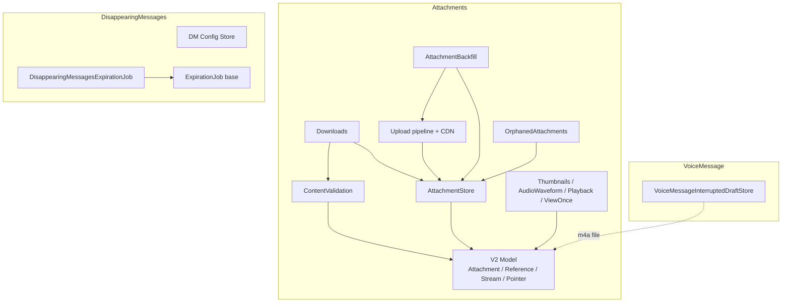
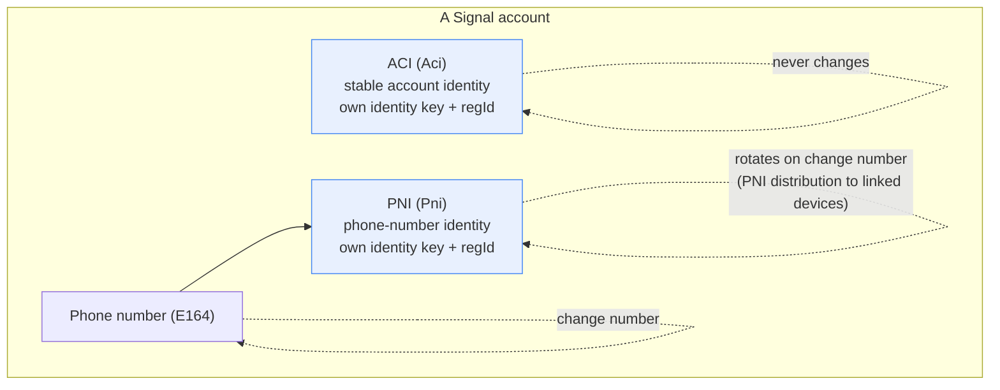
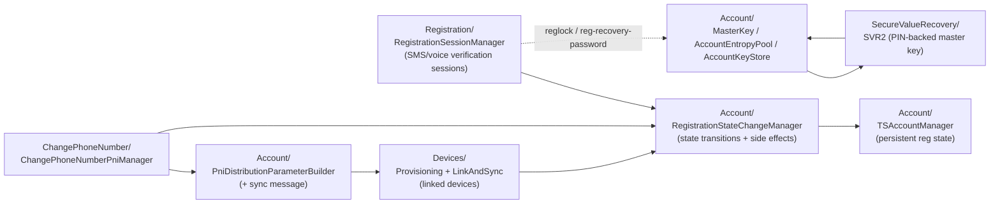

<<<<<<< ours
<<<<<<< ours
# SignalServiceKit Subsystems

This documentation covers three related SignalServiceKit (SSK) subsystems:

1. **[Attachments](Attachments/README.md)** — the V2 attachment model, content validation,
   encryption, the up/download pipelines, CDN interaction, thumbnails, playback, view-once,
   orphan cleanup, and the attachment backfill flow.
2. **[Disappearing Messages](DisappearingMessages/README.md)** — expiration configuration,
   timer-start triggers, and the generic expiry job (shared with the `Expiration/` folder).
3. **[Voice Messages](VoiceMessage/README.md)** — interrupted-draft persistence for in-progress
   voice memos.

## Conventions used in these docs

- **Citations** are given as `File.swift:line`, pointing at the definition being described.
  Line numbers reflect the state of the tree at authoring time and may drift as code changes.
- **Confidence labels** appear on claims about behavior:
  - **HIGH** — the file was read in full and the claim is directly supported by the code.
  - **MEDIUM** — the claim is derived from signatures / partial reads / cross-file inference.
  - **LOW** — the claim is an educated inference not fully verified in-source.
- Diagrams are [Mermaid](https://mermaid.js.org/). GitHub renders them natively.

## Subsystem map

## Where things live

| Area | Source directory | Doc |
|------|------------------|-----|
| Attachment limits / padding | `SignalServiceKit/Attachments/` | [Attachments/Core.md](Attachments/Core.md) |
| Media utils / blurhash / V2 model | `SignalServiceKit/Messages/Attachments/` | [Attachments/Core.md](Attachments/Core.md), [Attachments/V2-Model.md](Attachments/V2-Model.md) |
| Content validation | `.../V2/ContentValidation/` | [Attachments/ContentValidation.md](Attachments/ContentValidation.md) |
| Store / Records | `.../V2/AttachmentStore/`, `.../V2/Records/` | [Attachments/Store-and-Records.md](Attachments/Store-and-Records.md) |
| Manager / DataSource | `.../V2/AttachmentManager/`, `.../V2/DataSource/` | [Attachments/Manager.md](Attachments/Manager.md) |
| Downloads | `.../V2/Downloads/` | [Attachments/Downloads.md](Attachments/Downloads.md) |
| Upload + CDN | `SignalServiceKit/Upload/` | [Attachments/Upload.md](Attachments/Upload.md) |
| Thumbnails/Waveform/Playback/ViewOnce | `.../V2/{Thumbnails,AudioWaveform,Playback,ViewOnce}/` | [Attachments/Media.md](Attachments/Media.md) |
| Orphan cleanup | `.../V2/OrphanedAttachments/` | [Attachments/OrphanedAttachments.md](Attachments/OrphanedAttachments.md) |
| Backfill | `SignalServiceKit/AttachmentBackfill/` | [Attachments/Backfill.md](Attachments/Backfill.md) |
| Disappearing messages | `SignalServiceKit/DisappearingMessages/`, `SignalServiceKit/Expiration/` | [DisappearingMessages/README.md](DisappearingMessages/README.md) |
| Voice messages | `SignalServiceKit/VoiceMessage/` | [VoiceMessage/README.md](VoiceMessage/README.md) |
=======
=======
>>>>>>> theirs
# Signal iOS — Identity & Registration Subsystems

This documentation set covers the first-party source in five directories of
`SignalServiceKit/` that together implement Signal iOS's **identity model**,
**registration/provisioning**, **device linking**, **phone-number (PNI)
handling**, and **Secure Value Recovery (SVR / PIN)**.

> **Confidence labels.** Each claim is tagged with a confidence level:
> - **[High]** — directly read from source; behavior is explicit in code.
> - **[Medium]** — inferred from code with reasonable certainty, but depends on
>   collaborators defined outside these directories.
> - **[Low]** — inferred from naming/comments; not fully verified in-tree.
>
> All file+line citations refer to the state of the tree at the time of writing.
> Line numbers are approximate anchors; use the cited symbol name to locate code
> if lines have drifted.

## Document map

| Doc | Directory covered |
| --- | --- |
| [Account/identity-and-registration.md](Account/identity-and-registration.md) | `SignalServiceKit/Account/` (identifiers, `TSAccountManager`, PNI distribution, keys) |
| [Registration/registration-sessions.md](Registration/registration-sessions.md) | `SignalServiceKit/Registration/` |
| [Devices/device-linking-and-sync.md](Devices/device-linking-and-sync.md) | `SignalServiceKit/Devices/` |
| [ChangePhoneNumber/change-phone-number.md](ChangePhoneNumber/change-phone-number.md) | `SignalServiceKit/ChangePhoneNumber/` |
| [SecureValueRecovery/secure-value-recovery.md](SecureValueRecovery/secure-value-recovery.md) | `SignalServiceKit/SecureValueRecovery/` |

## The ACI / PNI identity split (the central concept)

Signal represents a user with **two** service identifiers, defined in LibSignal
and distinguished locally by `OWSIdentity` (`SignalServiceKit/Account/OWSIdentity.swift:14-18`): **[High]**

- **ACI** ("Account Identifier", `OWSIdentity.aci = 0`) — the stable identity of
  the *account/person*. It never changes for the life of the account.
- **PNI** ("Phone Number Identifier", `OWSIdentity.pni = 1`) — the identity of
  the *phone number (E.164)*. It changes when the user changes their phone
  number, and is distributed to linked devices via a PNI-distribution flow.

Each identity has its **own identity key pair** and its **own registration ID**.
This split lets Signal share a phone number with contacts (for discovery)
without exposing the stable account identity, and lets a user change numbers
without re-establishing their account.

`LocalIdentifiers` (`SignalServiceKit/Account/LocalIdentifiers.swift:8-54`) is the
in-memory bundle of the local user's identity: a **non-optional** `aci`, an
**optional** `pni` (linked devices and freshly-registered primaries may not yet
know their PNI), and a `phoneNumber` string. **[High]**

## How the subsystems fit together

- **Registration** establishes a verified session with the server for an E.164
  (see Registration doc).
- **`TSAccountManager`** is the durable source of truth for "am I registered,
  as what, and with which identifiers". **`RegistrationStateChangeManager`**
  performs the state transitions and all the cross-subsystem side effects.
- **PNI distribution** keeps linked devices' PNI key material in sync whenever
  the PNI identity changes (new number, or PNI "hello world" repair).
- **Change Phone Number** generates a brand-new PNI identity and distributes it.
- **Secure Value Recovery (SVR2)** backs up the `MasterKey` (derived from the
  `AccountEntropyPool`) behind the user's PIN, inside an SGX enclave, enabling
  SMS-bypass re-registration and recovery of Storage Service / Backups keys.

See each subsystem document for the detailed design, per-type purpose,
validation/business rules, error paths, and server interactions.
<<<<<<< ours
>>>>>>> theirs
=======
>>>>>>> theirs
