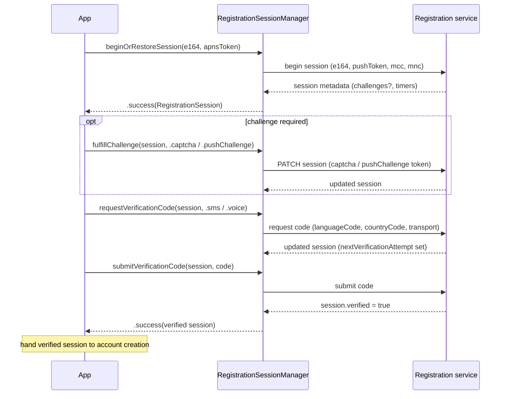

# `SignalServiceKit/Registration/` — Verification Sessions

This directory implements the **phone-number verification session** half of
registration: establishing a server-side session for an E.164, satisfying
anti-abuse challenges, requesting an SMS/voice verification code, and submitting
it. It does **not** itself create the account — a verified session is handed off
to the broader registration coordinator (outside these directories) which then
performs account creation using identifiers/keys from `Account/`.

- [1. Overview & flow](#1-overview--flow)
- [2. `RegistrationSession` (persisted model)](#2-registrationsession-persisted-model)
- [3. `RegistrationSessionManager` + `Registration` responses](#3-registrationsessionmanager--registration-responses)
- [4. `RegistrationSessionManagerImpl`](#4-registrationsessionmanagerimpl)
- [5. `RegistrationIdentifier`](#5-registrationidentifier)
- [6. Server interactions & error paths](#6-server-interactions--error-paths)
- [7. File reference checklist](#7-file-reference-checklist)

---

## 1. Overview & flow

The manager persists exactly **one** session at a time; changing the E.164 wipes
any existing session (`RegistrationSessionManagerImpl.swift:35-41,174-181`). **[High]**

---

## 2. `RegistrationSession` (persisted model)

`struct RegistrationSession: Codable, Equatable`
(`RegistrationSession.swift:14-116`) is the on-disk, migration-stable
representation (intentionally distinct from the server's JSON). **[High]**

| Field | Meaning | Citation |
| --- | --- | --- |
| `id: String` | Opaque server session id (URL-safe, ≤1024 bytes). | `:17` |
| `e164: E164` | The number this session is for. | `:20` |
| `receivedDate: Date` | When metadata was received; all durations are relative to this. | `:24` |
| `nextSMS: TimeInterval?` | Wait before next SMS; nil ⇒ no more SMS allowed. (`nextSMSDate` computed) | `:27-32` |
| `nextCall: TimeInterval?` | Wait before next voice call; nil ⇒ none allowed. (`nextCallDate`) | `:36-41` |
| `nextVerificationAttempt: TimeInterval?` | Wait before submitting a code; nil ⇒ no code available to submit. (`nextVerificationAttemptDate`) | `:48-53` |
| `hasCodeAvailableToSubmit: Bool` | `nextVerificationAttempt != nil`. | `:59-61` |
| `allowedToRequestCode: Bool` | If true, `requestedInformation` can be skipped; else challenges must be satisfied first. | `:66` |
| `requestedInformation: [Challenge]` | FIFO list of challenges to satisfy. | `:84` |
| `hasUnknownChallengeRequiringAppUpdate: Bool` | Server sent a challenge this client can't interpret ⇒ prompt app update. | `:88` |
| `verified: Bool` | A correct code has been submitted; registration may proceed. | `:92` |

`enum Challenge { case captcha; case pushChallenge }` — captcha is user-visible;
pushChallenge is a silent push proving App-Store install validity, requiring no
user action (`:69-77`). **[High]**

**Note:** `CodingKeys` deliberately omits none of the above (`:94-105`); the
computed `*Date` and `hasCodeAvailableToSubmit` are not stored. **[High]**

---

## 3. `RegistrationSessionManager` + `Registration` responses

### Protocol — `RegistrationSessionManager.swift:7-32`
- `restoreSession(logger:)` → most recent session, re-validated against server;
  nil if none/invalid.
- `beginOrRestoreSession(e164:apnsToken:logger:)` → begins a new session, first
  attempting to restore an existing valid one for the same number.
- `fulfillChallenge(for:fulfillment:logger:)`
- `requestVerificationCode(for:transport:logger:)`
- `submitVerificationCode(for:code:logger:)`
- `clearPersistedSession(_:)` — wipe after use.

> **Business rule:** a session is **not** auto-completed when `verified == true`,
> because registration may still be interrupted before account creation; callers
> must explicitly `clearPersistedSession` (`:24-31`). **[High]**

### `enum Registration` namespace (`RegistrationSessionManager.swift:34-146`) **[High]**
- `CodeTransport { sms, voice }`.
- `ChallengeFulfillment { captcha(String), pushChallenge(String) }`.
- `BeginSessionResponse`: `success(RegistrationSession)`, `invalidArgument`
  (typically bad E.164), `retryAfter(TimeInterval?)`, `networkFailure`,
  `genericError`.
- `UpdateSessionResponse` (shared by challenge/request/submit): `success`,
  `rejectedArgument` (input wrong — still inspect the session for new
  challenges), `disallowed` (operation not valid for current state),
  `transportError` (e.g. SMS to a landline — retry other transport),
  `retryAfterTimeout(_, retryAfterHeader:)`, `invalidSession` (start over),
  `serverFailure(ServerFailureResponse)`, `networkFailure`, `genericError`.
- `ServerFailureResponse { session; isPermanent; reason: Reason? }` where
  `Reason { providerRejected, illegalArgument, providerUnavailable }`.

---

## 4. `RegistrationSessionManagerImpl`

`RegistrationSessionManagerImpl.swift`. Persists to
`KeyValueStore(collection: "RegistrationSession")`, key `"session"`
(`:76-80`). **[High]**

- **Persistence helpers** (`:82-150`): `persist`/`getPersistedSession` use
  Codable; three `persistSessionFromResponse` overloads persist on success-ish
  cases and **clear** the session on `invalidSession`/`sessionInvalid`. **[High]**
- **MCC/MNC** (`:154-167`): read from `CTTelephonyNetworkInfo` (first provider),
  included in the begin-session request. **[High]**
- **`restoreSession(forE164:)`** (`:171-193`): loads the persisted session,
  wipes it if the E.164 differs, otherwise re-validates it via a fetch request;
  returns nil on `sessionInvalid`/`genericError`. **[High]**
- **Request builders** (`:197-430`): each uses `RegistrationRequestFactory`
  (external) and maps HTTP status via `RegistrationServiceResponses.*ResponseCodes`
  into the `Registration.*Response` enums. See §6 for the mappings.
- **Generic request plumbing** (`:510-575`): `makeRequest` performs the request
  via `signalService.urlSessionForMainSignalService()`, treats network
  failures/timeouts as `.networkFailure`, and otherwise feeds HTTP status +
  `Retry-After` header + body into the handler. `makeUpdateRequest` wraps it for
  `UpdateSessionResponse` handlers. **[High]**
- **Response decoding** (`:432-508`): `registrationSession(fromResponseBody:e164:)`
  decodes `RegistrationServiceResponses.RegistrationSession` and converts to the
  local model via `toLocalSession`, mapping unknown challenge types to
  `hasUnknownChallengeRequiringAppUpdate = true` (`:577-611`). **[High]**

---

## 5. `RegistrationIdentifier`

`enum RegistrationIdentifier { case phoneNumber(E164) }`
(`RegistrationIdentifier.swift:8-10`) — "an identifier for a pre-existing account
used during registration." Currently only phone numbers. **[High / Low on intent]**

---

## 6. Server interactions & error paths

All requests go to the main Signal service via `OWSSignalServiceProtocol`.
Status-code → response mappings (handlers in `RegistrationSessionManagerImpl.swift`): **[High]**

| Operation | Handler | Notable mappings |
| --- | --- | --- |
| Begin session | `handleBeginSessionResponse` (`:231-253`) | `success`→`.success`; `invalidArgument`/`missingArgument`→`.invalidArgument`; `retry`→`.retryAfter(header)`; unexpected→`.genericError`. |
| Fulfill challenge | `handleFulfillChallengeResponse` (`:280-310`) | `success`→`.success`; `notAccepted`→`.rejectedArgument`; `missingSession`→`.invalidSession`; malformed→`.genericError`. |
| Request code | `handleRequestVerificationCodeResponse` (`:349-390`) | `disallowed`→`.disallowed`; `retry`→`.retryAfterTimeout(header)`; `providerFailure`→`.serverFailure`; `transportError`→`.transportError`; `missingSession`→`.invalidSession`. |
| Submit code | `handleSubmitVerificationCodeResponse` (`:409-470`) | `success` + `session.verified`→`.success`, else `.rejectedArgument`; `retry`→`.retryAfterTimeout`; `newCodeRequired`→`.retryAfterTimeout`/`.disallowed`/`.success` depending on session; `missingSession`→`.invalidSession`. |
| Fetch session | `handleFetchSessionResponse` (`:489-508`) | `success`→`.success`; `missingSession`→`.sessionInvalid`; else `.genericError`. |

`serverFailureResponse` (`:452-508`) decodes
`RegistrationServiceResponses.SendVerificationCodeFailedResponse`, logging the
reason and mapping `providerRejected`/`providerUnavailable`/`illegalArgument`
into `Registration.ServerFailureResponse.Reason` with the server's
`permanentFailure` flag. **[High]**

> Two `TODO`s note that begin/fetch requests lack transient-network retry logic
> (`:71-72`, `:170-171`). **[High]**

---

## 7. File reference checklist

- `RegistrationSession.swift` — §2
- `RegistrationSessionManager.swift` — §3
- `RegistrationSessionManagerImpl.swift` — §4, §6
- `RegistrationIdentifier.swift` — §5
