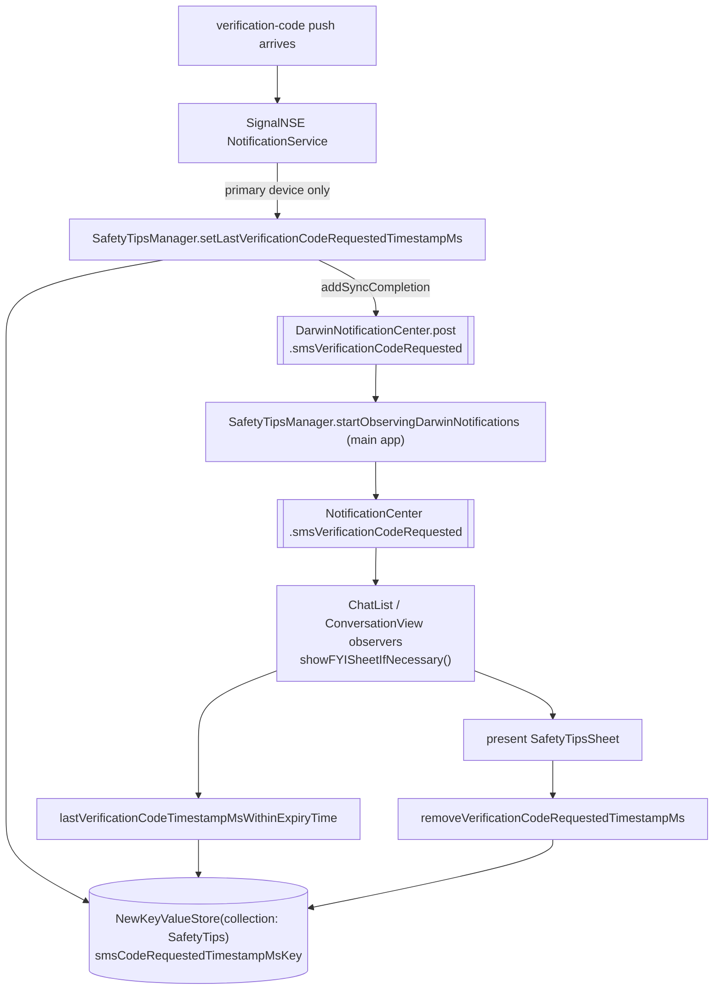

# Safety Tips

Covers `SignalServiceKit/SafetyTips/`:

- `SafetyTipsManager.swift`

This folder is tiny: a single `@MainActor` class that persists **one** piece of state — the
timestamp of the most recent SMS verification-code request — and bridges a cross-process
("Darwin") notification into the main app's in-process `NotificationCenter`. The purpose is a
security "safety tip": if someone else (or an attacker) triggers an SMS verification code for the
user's number, the primary device shows an FYI sheet warning the user. The actual UI
(`SafetyTipsSheet`, the FYI sheet coordinator) lives in the main app, not here.

---

## `SafetyTipsManager` — `SafetyTipsManager.swift:11`

Confidence: HIGH (read in full). A `@MainActor` class backed by a single
`NewKeyValueStore(collection: "SafetyTips")` (`:19`, `:22`). It stores exactly one key,
`smsCodeRequestedTimestampMsKey` (`StoreKeys.smsCodeRequestedTimestampMs`, `:15`), holding the
epoch-millisecond timestamp of the last verification-code request.

A verification-code "safety tip" is only considered relevant for a short window:
`expiryTimeSeconds = TimeInterval.minute * 10` — **10 minutes** (`:13`).

### API

| Method | Line | Behavior |
|--------|------|----------|
| `setLastVerificationCodeRequestedTimestampMs(value:transaction:)` | 24 | Writes the timestamp into the KV store, then on `tx.addSyncCompletion` posts the Darwin notification so the main app wakes up and checks the store (`:35`–`:38`). |
| `lastVerificationCodeTimestampMsWithinExpiryTime(transaction:)` | 41 | Reads the stored timestamp and returns it **only if** it is within `expiryTimeSeconds` of now; otherwise returns `nil` (`:54`–`:60`). Note it does not delete an expired entry on read. |
| `removeVerificationCodeRequestedTimestampMs(transaction:)` | 62 | Removes the key — called after the FYI sheet has been shown. |
| `startObservingDarwinNotifications()` (static) | 68 | Idempotent (guarded by `hasStartedObserving`, `:12`/`:69`–`:70`). Registers a `DarwinNotificationCenter` observer on `.main` that re-posts the event as an in-process `NotificationCenter` `.smsVerificationCodeRequested` (`:71`–`:73`). |

### The two `.smsVerificationCodeRequested` names (don't confuse them)

Confidence: HIGH. There are **two distinct** symbols with similar names:

- `NSNotification.Name.smsVerificationCodeRequested` (`:7`) — the in-process `NotificationCenter`
  name (`"SafetyTipsKeyValueStore.smsVerificationCodeRequested"`) that app view controllers observe.
- `DarwinNotificationName.smsVerificationCodeRequested`
  (`SignalServiceKit/Util/DarwinNotificationName.swift:10`,
  `"org.signal.safetyTips.smsVerificationCodeRequested"`) — the **cross-process** name used to signal
  from the NSE (or a background write) to the main app.

`startObservingDarwinNotifications()` is the bridge: Darwin (cross-process) → `NotificationCenter`
(in-process).

---

## Interactions with the rest of the app

Confidence: HIGH (grep + read of call sites).

### Writer: SignalNSE — `SignalNSE/NotificationService.swift:155`

When a push whose `userInfo` carries a verification-code timestamp arrives, the Notification
Service Extension writes the timestamp — but **only on the primary device**
(`registrationState(tx:).isPrimaryDevice == true`, `:157`), otherwise it logs and ignores
(`:158`). It then short-circuits (no message fetch) and returns an empty `UNNotificationContent`
(`:164`–`:165`). Because the write happens in the extension process, the `addSyncCompletion`
Darwin post is what lets the main app find out. (See also
[Notifications/nse.md](../Notifications/nse.md).)

### Reader + presenter: Chat List FYI sheet coordinator

`ChatListFYISheetCoordinator` (`Signal/src/ViewControllers/HomeView/Chat List/ChatListFYISheetCoordinator.swift`)
holds a `SafetyTipsManager` (`:88`, `:121`). `shouldShowSMSVerificationCodeSentSheet(tx:)` (`:205`)
calls `lastVerificationCodeTimestampMsWithinExpiryTime` and, if non-nil, returns a
`.smsVerificationCodeSent` FYI sheet carrying the timestamp. After the `SafetyTipsSheet` is
presented, the completion handler calls `removeVerificationCodeRequestedTimestampMs` (`:610`) so the
tip isn't shown again.

### Observers that trigger a re-check

Both the chat list and the conversation view register for the in-process notification and call
`showFYISheetIfNecessary()` / their equivalent when it fires, and both invoke
`SafetyTipsManager.startObservingDarwinNotifications()` during setup:

- `ChatListViewController+Notifications.swift:156`–`160`, handler at `:232`.
- `ConversationViewController+Notifications.swift:83`–`87`, handler at `:216` (constructs its own
  `SafetyTipsManager()` at `:220`).

---

## State & lifecycle notes

Confidence: HIGH.

- **Single value, last-writer-wins.** Only one timestamp is kept; a newer request overwrites the
  older one. There is no history.
- **Expiry is read-time, not swept.** An entry older than 10 minutes is simply reported as absent by
  `lastVerificationCodeTimestampMsWithinExpiryTime`; it is not proactively deleted. It is cleared
  explicitly only after the sheet is shown (`removeVerificationCodeRequestedTimestampMs`).
- **Cross-process delivery.** The write typically originates in the NSE process; the main app learns
  of it via the Darwin notification bridged into `NotificationCenter`. The `addSyncCompletion` hook
  ensures the post happens only after the KV write has committed, so a woken reader sees the value.
- **Primary-device gating** lives at the call site (NSE), not in `SafetyTipsManager` itself — the
  manager will store/read whatever it's told to.
- **Idempotent observer registration** (`hasStartedObserving`) means multiple view controllers can
  safely call `startObservingDarwinNotifications()`.
