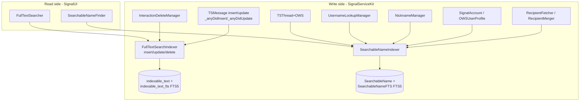

# Search (Full-Text Search Indexing)

Covers `SignalServiceKit/Search/`:

- `FullTextSearchIndexer.swift`
- `SearchableNameIndexer.swift`

This folder owns the **write side and query primitives of SQLite FTS5 full-text search**. There
are two independent FTS indexes maintained here:

1. **Message-body index** — `FullTextSearchIndexer` indexes the `rawBody` text of `TSMessage`s into
   the `indexable_text` / `indexable_text_fts` tables, powering "search your conversations".
2. **Searchable-name index** — `SearchableNameIndexer` indexes the display-relevant names of
   contacts, recipients, profiles, usernames, nicknames and group/story threads into the
   `SearchableName` / `SearchableNameFTS` tables, powering "search for a person/group as you type".

Both share the same tokenization/normalization logic (`FullTextSearchIndexer.normalizeText` /
`buildQuery`) and the same prefix-match query shape, but they are separate tables with separate
schemas and separate maintenance triggers. The read/UI layer that consumes these primitives lives
in `SignalUI/Search/` (`FullTextSearcher`, `SearchableNameFinder`), not in this folder.

---

## Shared text normalization & query building — `FullTextSearchIndexer.swift`

Confidence: HIGH (read in full). `FullTextSearchIndexer` is an `enum` namespace; its normalization
and query helpers are used by **both** indexes.

### `normalizeText(_:)` — `FullTextSearchIndexer.swift:38`
Confidence: HIGH. Canonicalizes text before it is stored or queried:
1. Strips a broad "punctuation" set — `CharacterSet.punctuationCharacters` plus illegal/control
   characters, plus all non-alphanumeric, non-whitespace ASCII (`charactersToRemove`, `:13`).
2. Collapses all whitespace/newlines to single spaces (`:43`).
3. Trims leading/trailing whitespace (`:50`).
4. Applies `precomposedStringWithCanonicalMapping` (NFC) (`:70`) so content and query use matching
   Unicode normalization — SQLite FTS matching is normalization-sensitive.

> Flagged as a hot path, especially during large migrations (`:35`); the comment warns changes
> should be profiled.

### `buildQuery(for:)` — `FullTextSearchIndexer.swift:79`
Confidence: HIGH. Turns user search text into an FTS5 MATCH expression for **prefix** ("search as
you type") matching:
- Normalizes the input, then splits non-numeric text into terms while extracting an additional
  **digits-only** term (so a phone number typed with punctuation still matches).
- De-dupes and sorts terms (deterministic output, order-independent results) (`:107`).
- Wraps each term as `"term"*` (quoted + prefix wildcard) and joins with spaces.
- Returns `""` if nothing survives filtering — callers treat an empty query as "no results".

`matchTag = "match"` (`:9`) is the token wrapped around snippet matches (see search snippets below).

---

## Message-body index — `FullTextSearchIndexer.swift:134` (extension)

Confidence: HIGH (read in full). This extension maintains the `indexable_text` content table and
its synchronized `indexable_text_fts` FTS5 virtual table.

### Schema (owned by the migrator, not this folder)
Confidence: HIGH. Created in `GRDBSchemaMigrator.createIndexableFTSTable`
(`Storage/Database/GRDBSchemaMigrator.swift:1409`):
- `indexable_text` content table (`:1411`): `collection`, `uniqueId`, `ftsIndexableContent`, with a
  unique index on `(collection, uniqueId)`.
- `indexable_text_fts` FTS5 virtual table using the `unicode61` tokenizer, `synchronize(withTable:
  "indexable_text")` (so FTS rows track content rows), indexing the `ftsIndexableContent` column.
- Stemming (porter) is deliberately **not** used; the comment weighs stemming vs. diacritic removal
  (`GRDBSchemaMigrator.swift:1435`).
- "Secure delete" is enabled on `indexable_text_fts` via
  `enableFts5SecureDelete` (`GRDBSchemaMigrator.swift:3115`), so deleted content doesn't linger in
  FTS b-tree pages.

The column/table name constants mirrored in code: `ftsTableName = "indexable_text_fts"`,
`contentTableName = "indexable_text"`, `uniqueIdColumn`, `collectionColumn`, `ftsContentColumn`
(`FullTextSearchIndexer.swift:136`). All rows use a single `legacyCollectionName = "TSInteraction"`
(`:143`); the collection column is a historical artifact and is asserted on read.

### What gets indexed — `indexableContent(for:tx:)` — `:145`
Confidence: HIGH. Returns `normalizeText(message.rawBody)` **unless** the message is a view-once
message, a group-story reply, or a past (edited) revision — those return `nil` and are skipped.

### Maintenance API
| Method | Line | Behavior |
|--------|------|----------|
| `insert(_ message:tx:)` | 162 | Insert a row into `indexable_text` if `indexableContent` is non-nil. |
| `update(_ message:tx:)` | 181 | `delete` then `insert` (no in-place update). |
| `delete(_ message:tx:)` | 189 | Delete by `(uniqueId, collection)`. |
| `search(for:maxResults:tx:block:)` | 229 | Run the FTS query; see below. |

`executeUpdate` (`:204`) uses a **cached** prepared statement (indexing happens in bulk). It
intentionally **swallows GRDB errors** via `owsFailDebug` rather than `failIfThrows`, because the
FTS index "relatively frequently reports corruption errors" and flagging the whole DB corrupt would
be worse. A `TODO` notes that rebuilding the FTS index on corruption isn't implemented (`:222`).

### `search(...)` — `:229`
Confidence: HIGH. Builds the prefix query, joins `indexable_text_fts` back to `indexable_text` by
`rowId`, orders by `rank`, and `LIMIT`s to `maxResults`. For each match it computes a
`SNIPPET(...)` with `<match>…</match>` delimiters and 15 tokens of context (`:249`), fetches the
`TSMessage` via `fetchMessageViaCache`, and invokes the caller's `block(message, snippet, &stop)`
(callers can set `stop` to end early). Rows whose collection isn't the message collection or whose
`uniqueId` is empty/unresolvable are skipped with `owsFailDebug`. A `GRDB TODO` suggests `bm25()`
instead of `rank` for ordering (`:246`).

### Who triggers message indexing (interactions with the rest of SSK)
Confidence: HIGH (verified via call-site search).
- `TSMessage._anyDidInsert` / `_anyDidUpdate` → `FullTextSearchIndexer.insert`/`.update`
  (`Messages/Interactions/TSMessage.swift:805`, `:810`) — normal persistence writes keep the index
  in sync automatically.
- `InteractionDeleteManager` → `FullTextSearchIndexer.delete` on message deletion
  (`Messages/Interactions/InteractionDeleteManager.swift:320`).
- `SDSDatabaseStorage` re-indexes on certain updates
  (`Storage/Database/SDSDatabaseStorage/SDSDatabaseStorage.swift:149`).
- `DatabaseRecovery` re-inserts messages into the index while rebuilding a corrupted DB
  (`Storage/Database/DatabaseRecovery.swift:726`).
- `BackupArchiveFullTextSearchIndexer` re-populates the message index after a Backup restore via a
  time-gated background job (`Backups/Archiving/BackupArchiveFullTextSearchIndexer.swift`); see
  concurrency below.

---

## Searchable-name index — `SearchableNameIndexer.swift`

Confidence: HIGH (read in full). Indexes the names of several heterogeneous "name-bearing" entities
into one FTS index so a single query returns candidate people/groups.

### `SearchableNameIndexer` protocol — `SearchableNameIndexer.swift:10`
Confidence: HIGH. Public API: `search(for:maxResults:tx:block:)`, `insert`, `update`, `delete`,
`indexEverything`, `indexThreads`. `update` removes the entry if it now has no indexable content
(`:25`). `indexEverything`/`indexThreads` require the index (or its thread rows) to be **empty**
first — they are migration/bootstrap operations, not idempotent upserts.

A `MockSearchableNameIndexer` exists under `TESTABLE_BUILD` (`:43`), with all methods
`owsFail`/no-op.

### `SearchableNameIndexerImpl` — `:54`
Confidence: HIGH. Concrete implementation. It is dependency-injected with the stores it needs to
re-hydrate matches: `ThreadStore`, `SignalAccountStore`, `UserProfileStore`,
`RecipientDatabaseTable`, `UsernameLookupRecordStore`, `NicknameRecordStore` (`:55`). Table-name
constants: `SearchableName` / `SearchableNameFTS` (`:63`).

### Schema (owned by the migrator)
Confidence: HIGH. Created in `GRDBSchemaMigrator.addSearchableName`
(`Storage/Database/GRDBSchemaMigrator.swift:3301`):
- `SearchableName` content table (`:3317`) has one **nullable, unique** foreign-key column per
  entity kind — `threadId`, `signalAccountId`, `userProfileId`, `signalRecipientId`,
  `usernameLookupRecordId` (blob), plus `nicknameRecordRecipientId` (added by a later migration),
  and a `value` text column. Each FK is `ON DELETE CASCADE` to its owning model table, so deleting
  a thread/account/profile/recipient/username row automatically evicts its index entry.
- `SearchableNameFTS` FTS5 virtual table (`unicode61` tokenizer), `synchronize(withTable:
  "SearchableName")`, indexing the `value` column, with `enableFts5SecureDelete`
  (`GRDBSchemaMigrator.swift:3340`).
- A migration-time assert (`GRDBSchemaMigrator.swift:3315`) pins the table name to the code
  constant — changing the constant requires a new migration.

The row only ever has **one** identifier column populated; the search query (`:98`–`:116`) selects
all identifier columns and picks the first non-null to reconstruct an `IndexableNameIdentifier`.

### `IndexableName` protocol & conformances — `:275` onward
Confidence: HIGH. The protocol an entity implements to be indexable: `indexableNameIdentifier()`
and `indexableNameContent() -> String?` (nil = not indexable / should be removed). Conformances:
| Type | Line | Indexed content |
|------|------|-----------------|
| `TSThread` | 280 | Group name (`TSGroupThread`) or private-story name; contact threads return `nil`. |
| `SignalAccount` | 298 | System-contact full name + nickname-resolved name (de-duped). |
| `OWSUserProfile` | 320 | Profile display name; the local user's profile is skipped. |
| `SignalRecipient` | 339 | E.164 phone number + national-number digits (de-duped); local number skipped. |
| `UsernameLookupRecord` | 375 | The `username`. |
| `NicknameRecord` | 385 | Resolved nickname display name. |

`IndexableNameIdentifier` (`:249`) maps each case to its `(IdentifierColumnName, DatabaseValue)`
(`columnNameAndValue()`, `:257`), which is how `insert`/`delete` know which column to write.
`usernameLookupRecord` is keyed by the ACI's `serviceIdBinary` blob.

### Maintenance API
| Method | Line | Behavior |
|--------|------|----------|
| `insert` | 173 | If `indexableNameContent()` is non-nil, write `normalizeText(value)` into the entity's identifier column + `value`. |
| `update` | 191 | `delete` then `insert` (also evicts when content became nil). |
| `delete` | 196 | Delete the row for this entity's identifier column/value. |
| `indexEverything` | 210 | Bulk-index threads + all accounts/profiles/recipients/username/nickname records (empty-index precondition). |
| `indexThreads` | 229 | Bulk-index all `TSThread`s. |

All writes swallow GRDB errors via `Logger.warn` rather than throwing.

### `search(...)` — `:85`
Confidence: HIGH. Builds the shared prefix query, joins `SearchableNameFTS` to `SearchableName` by
`rowId`, orders by `rank`, `LIMIT`s to `maxResults`, reconstructs an `IndexableNameIdentifier` from
whichever identifier column is non-null, then `fetchIndexableName` (`:154`) re-fetches the live
model object from the appropriate store and passes it to the caller's `block`. The `block` is
`throws(CancellationError)`, so the consumer (`SearchableNameFinder`) can abort an in-flight
as-you-type search by throwing on `Task.isCancelled`.

### Who triggers name indexing (interactions with the rest of SSK)
Confidence: HIGH (verified via call-site search).
- Wired once in `AppSetup` (`Environment/AppSetup.swift:237`) and exposed via
  `DependenciesBridge.shared.searchableNameIndexer`.
- `RecipientFetcher.insert` indexes newly created recipients
  (`Contacts/RecipientFetcher.swift:43`).
- `RecipientMerger` updates/inserts the surviving recipient after a merge
  (`Contacts/RecipientMerger.swift:837`, `:840`).
- `SignalAccount` and `OWSUserProfile` call through `DependenciesBridge` on insert/update
  (`Contacts/SignalAccount.swift:187`, `Profiles/OWSUserProfile.swift`).
- `NicknameManager` indexes nickname create/update (`Contacts/NicknameRecord/NicknameManager.swift:78`, `:84`).
- `UsernameLookupManager` indexes username records (`Usernames/UsernameLookupManager.swift`).
- `TSThread+OWS` indexes group/story threads (`Threads/TSThread+OWS.swift`).
- Backup restore uses `indexThreads` / `BackupArchiveRecipientStore.insert` to repopulate names
  (`Backups/Archiving/.../BackupArchiveRecipientStore.swift:59`,
  `Backups/Archiving/BackupArchiveFullTextSearchIndexer.swift:58`).

---

## Data flows, state & persistence

Confidence: HIGH.

- **State lives entirely in SQLite**, in two pairs of tables (content + synchronized FTS5 virtual
  table). This folder holds no in-memory cache or state of its own — the indexers are stateless
  given a transaction.
- **The content tables are the source of truth for the index.** Because the FTS tables are declared
  with `synchronize(withTable:)`, GRDB keeps them in lockstep with the content tables; code only
  ever writes the content tables (`indexable_text`, `SearchableName`).
- **Cascade semantics differ.** `SearchableName` relies on SQLite FK `ON DELETE CASCADE` so model
  deletions auto-evict entries. The message index has **no** FK cascade — it is maintained
  imperatively by `TSMessage` hooks and `InteractionDeleteManager`.
- **Bootstrap / backfill paths:** `dataMigration_indexSearchableNames`
  (`GRDBSchemaMigrator.swift:5902`) and `indexEverything`/`indexThreads` populate the name index from
  scratch; `DatabaseRecovery` (`:726`) and the Backup restore job rebuild the message index after a
  corruption recovery or restore.
- **Normalization is applied on both write and query** so stored content and search terms match;
  changing `normalizeText` would silently invalidate already-indexed content.

---

## Concurrency considerations

Confidence: HIGH where tied to code; MEDIUM for broader threading model (the read side lives in
`SignalUI` and GRDB internals aren't re-verified here).

- **Transaction-scoped.** Every method takes a `DBReadTransaction` or `DBWriteTransaction`;
  correctness/serialization is delegated to the surrounding GRDB write transaction. The indexers
  do no locking themselves.
- **Cancellable searches.** `SearchableNameIndexer.search`'s `block` is `throws(CancellationError)`,
  letting `SearchableNameFinder` abort stale as-you-type queries by checking `Task.isCancelled`
  (`SignalUI/Search/SearchableNameFinder.swift`). `FullTextSearchIndexer.search` instead exposes an
  `inout Bool stop` for early termination.
- **Bulk indexing is time-gated to avoid blocking the DB.** The Backup message re-index job
  (`BackupArchiveFullTextSearchIndexer`) runs on a serial `taskQueue`, uses
  `TimeGatedBatch.processAll` with `yieldTxAfter: 0.1` / `delayTwixtTx: 0.2`
  (`BackupArchiveFullTextSearchIndexer.swift:102`), and tracks progress via a min/max interaction
  rowId watermark so it can resume. It also gates on `appReadiness.isAppReady`.
- **Error resilience over strict consistency.** Both indexers swallow GRDB errors
  (`owsFailDebug`/`Logger.warn`) rather than aborting the enclosing transaction. For the message
  index this is a deliberate choice to tolerate FTS corruption without declaring the whole database
  corrupt (`FullTextSearchIndexer.swift:217`). The trade-off is that the index can silently drift
  from the content tables.
- **Performance.** `normalizeText` is a documented hot path during migrations
  (`FullTextSearchIndexer.swift:35`); message writes use a cached prepared statement for bulk
  indexing (`:212`).
