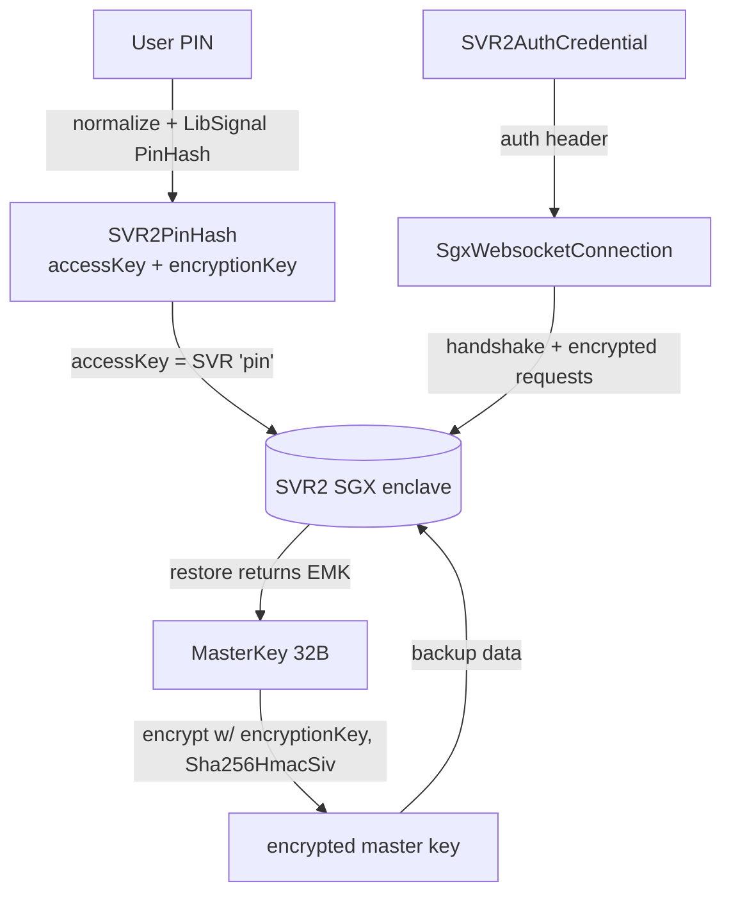
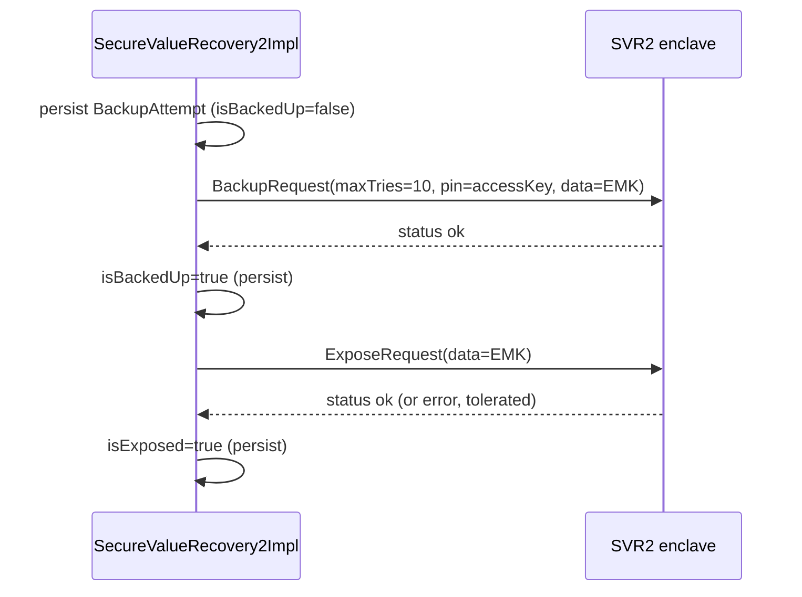

# `SignalServiceKit/SecureValueRecovery/` — SVR2, PIN & the Master Key

Secure Value Recovery (SVR, currently **SVR2**) lets a user back up their
`MasterKey` behind a **PIN**, inside an **SGX enclave**, so they can recover
account data (Storage Service / Backups keys) and bypass SMS verification when
re-registering on a new device. The enclave enforces a strict **PIN-guess limit**
so a weak PIN can't be brute-forced server-side.

- [1. Big picture](#1-big-picture)
- [2. PIN handling & key derivation](#2-pin-handling--key-derivation)
- [3. Auth credentials](#3-auth-credentials)
- [4. The SGX websocket layer](#4-the-sgx-websocket-layer)
- [5. `SecureValueRecovery` protocol & SVR namespace](#5-securevaluerecovery-protocol--svr-namespace)
- [6. `SecureValueRecovery2Impl` — backup / restore / delete / migrate](#6-securevaluerecovery2impl--backup--restore--delete--migrate)
- [7. File reference checklist](#7-file-reference-checklist)

---

## 1. Big picture

Flow summary **[High]**:
- The PIN is hashed (with the username + enclave as salt) into an **access key**
  (used as the SVR "pin" for rate limiting) and an **encryption key** (used to
  encrypt the master key).
- The encrypted master key is stored in the enclave via a **backup** then
  **expose** request pair.
- On restore, a correct PIN yields the encrypted master key, which is decrypted
  locally.
- All enclave traffic rides an attested, end-to-end-encrypted websocket.

---

## 2. PIN handling & key derivation

### `SVRUtil.swift`
- `normalizePin(_:)` — trims whitespace; if the PIN is all digits, converts to
  Arabic numerals; then applies **NFKD** compatibility normalization
  (`SVRUtil.swift:10-20`). **[High]**
- `deriveEncodedPINVerificationString(pin:)` / `verifyPIN(pin:against…)` — wrap
  LibSignal's `hashLocalPin` / `verifyLocalPin`; used to locally detect whether a
  new backup is for the same PIN (`:22-40`). **[High]**

### `SVR2PinHash.swift`
- `SVR2PinHash { accessKey: Data; encryptionKey: Data }`
  (`SVR2PinHash.swift:40-...`). **[High]**
- `encryptMasterKey(_:)` → `iv(16) || cipherText(32)` via `Sha256HmacSiv`;
  `decryptMasterKey(_:)` validates the 48-byte length and that the decrypted key
  is 32 bytes (`MasterKey.Constants.byteLength`) (`:44-86`). **[High]**
- `derive(normalizedPin:username:mrEnclave:)` uses LibSignal's `PinHash` with the
  enclave bytes as part of the derivation (`:88-96`). **[High]**
- `SVR2PinHasher` protocol + `LibSignalPinHasher`; a `MockPinHasher` reproduces
  the same inputs for tests via HKDF (`:8-37`). **[High]**

### `SVRLocalStorage.swift`
`struct SVRLocalStorage { backupAttemptStore = KeyValueStore(collection:
"SVR.Completed") }` — stores per-enclave backup bookkeeping
(`SVRLocalStorage.swift:8-11`). **[High]**

---

## 3. Auth credentials

### `SVRAuthCredential.swift` / `SVR2AuthCredential.swift`
`typealias SVRAuthCredential = SVR2AuthCredential` — a single pointer the rest of
the app uses; today it's SVR2, eventually possibly SVR3
(`SVRAuthCredential.swift:5-11`). `SVR2AuthCredential { credential:
RemoteAttestationAuth }` is a transparent wrapper making the SVR2-ness explicit;
`enum SVR2 { typealias AuthMethod = SVR.AuthMethod }` (`SVR2AuthCredential.swift:9-23`). **[High]**

### `SVRAuthCredentialStore.swift`
`protocol SVRAuthCredentialStore { getCredentialData / setCredentialData }` with
two impls (`SVRAuthCredentialStore.swift:7-52`): **[High]**
- `SVRAuthCredentialCloudStore` — backed by `NSUbiquitousKeyValueStore` (iCloud).
- `SVRAuthCredentialLocalStore` — backed by a local `KeyValueStore`.

### `SVRAuthCredentialManager.swift`
`struct SVRAuthCredentialManager` stores credentials **across all stores** (local
+ iCloud), supporting multiple Signal accounts sharing one iCloud account
(`SVRAuthCredentialManager.swift:14-...`). **[High]**

**Business rules:** **[High]**
- `SVR.maxSVRAuthCredentialsBackedUp = 10` (`:7-9`); excess credentials are
  dropped in FIFO order.
- iCloud-synced credentials + the user's PIN enable **SMS-bypass** during
  re-registration (e.g. new phone, signed into iCloud, same number). The
  credential alone grants no account data — the PIN is still required
  (`:11-30`).
- `storeAuthCredentialForCurrentUsername`, `getAuthCredentials` (for
  registration), `getAuthCredentialForCurrentUser` (not during registration),
  `deleteInvalidCredentials`, `removeSVR2CredentialsForCurrentUser`.
- `consolidateCredentials` dedups by username then password (keeping oldest for a
  given password to preserve timestamps), sorts newest-first, and truncates to
  the limit; `updateCredentials` applies changes to each store independently so
  deletions in one store aren't resurrected by additions in another
  (`:200-...`). **[High]**

---

## 4. The SGX websocket layer

### `SgxWebsocketConfigurator.swift`
`protocol SgxWebsocketConfigurator` abstracts a connection to any
`SgxClient`-compliant server: associated `Request`/`Response` protobufs +
`Client: SgxClient`, the `mrenclave`, `signalServiceType`, `websocketUrlPath`,
async `fetchAuth()`, a static `client(mrenclave:attestationMessage:currentDate:)`
factory, and a `loggingName` (`SgxWebsocketConfigurator.swift:11-66`). **[High]**

### `SgxWebsocketConnection.swift`
`SgxWebsocketConnection<Configurator>` is an abstract base (never instantiated
directly) exposing `mrEnclave`, `client`, `auth`, `sendRequestAndReadResponse`,
`disconnect` (`SgxWebsocketConnection.swift:19-43`). **[High]**

`SgxWebsocketConnectionImpl` performs the **handshake**
(`connectAndPerformHandshake`, `:64-105`): **[High]**
1. Open the websocket with an auth header.
2. Receive the **attestation** message; build the `SgxClient`.
3. Send `client.initialRequest()`; receive the handshake response; call
   `client.completeHandshake(...)`.
4. On any failure, disconnect with `.invalidFramePayloadData` and rethrow.

Subsequent calls `encryptAndSendRequest`/`decryptResponse` use
`client.establishedSend`/`establishedRecv` for the end-to-end encrypted channel
(`:117-175`). A `MockSgxWebsocketConnection` is provided for tests (`:139-175`).

### `SgxWebsocketConnectionFactory.swift`
`protocol SgxWebsocketConnectionFactory.connectAndPerformHandshake` + `Impl`,
which first `fetchAuth()` then opens + handshakes
(`SgxWebsocketConnectionFactory.swift:9-45`). A
`MockSgxWebsocketConnectionFactory` dispatches per-configurator-type closures
(`MockSgxWebsocketConnectionFactory.swift:9-30`). **[High]**

### `SVR2WebsocketConfigurator.swift`
The concrete SVR2 configurator: `Request = SVR2Proto_Request`,
`Response = SVR2Proto_Response`, `Client = Svr2Client`, URL path
`v1/{mrenclave}`, `signalServiceType = .svr2`. `fetchAuth()` resolves the
`SVR2.AuthMethod` (`svrAuth` returns the embedded credential; `chatServerAuth`/
`implicit` fetch a fresh SVR2 attestation auth) (`SVR2WebsocketConfigurator.swift:9-74`). **[High]**

### `SVR2Shims.swift`
`SVR2.Shims.OWS2FAManager` protocol + wrapper exposing `pinCode(transaction:)`
and `shouldMasterKeyBeBackedUp(tx:)` (`SVR2Shims.swift:8-42`). **[High]**

---

## 5. `SecureValueRecovery` protocol & SVR namespace

`SecureValueRecovery.swift`: **[High]**
- `enum SVR` namespace (`:9-45`):
  - `maximumKeyAttempts: UInt32 = 10` — the enclave PIN-guess limit.
  - `KeysError { missingAep, missingMrbk }`.
  - `AuthMethod` (indirect enum): `svrAuth(SVRAuthCredential, backup:
    AuthMethod?)`, `chatServerAuth(AuthedAccount)`, `implicit` (use cached, fall
    back to chat-server auth).
  - `RestoreKeysResult { success(MasterKey), invalidPin(remainingAttempts),
    backupMissing, networkError, genericError }`.
- `protocol SecureValueRecovery` (`:47-82`):
  - `refreshBackupIfNecessary()` — perform pending backups/migrations/deletions.
  - `refreshCredentialsIfNecessary()` — periodic credential refresh for
    re-registration.
  - `restoreKeys(pin:authMethod:)`, `backUpMasterKey(pin:masterKey:authMethod:)`.
  - `invalidateBackupAttemptForEveryEnclave(tx:)`.
  - `storeKeys(fromKeysSyncMessage:…)` (throws `KeysError`) and
    `storeKeys(fromProvisioningMessage:…)` — ingest keys delivered from the
    primary (keys sync) or during provisioning.

---

## 6. `SecureValueRecovery2Impl` — backup / restore / delete / migrate

`SecureValueRecovery2Impl.swift`. Collaborators include the connection factory,
`SVRAuthCredentialManager`, `AccountKeyStore`, `SVRLocalStorage`, a `pinHasher`,
`RemoteAttestationAuthFetcher`, `StorageServiceManager`, `TSConstants` (enclave
list), and the 2FA-manager shim (`:11-46`). **[High]**

### Ingesting keys (no enclave round-trip)
- `storeKeys(fromProvisioningMessage:)` sets MRBK + AEP and clears the
  "waiting for keys sync" flag (`:106-116`). **[High]**
- `storeKeys(fromKeysSyncMessage:)` validates presence of MRBK (`missingMrbk`)
  and AEP (`missingAep`), stores them, and — if the AEP changed or we were
  waiting for keys — triggers a Storage Service manifest restore/create on sync
  completion (`:118-150`). **[High]**

### Backup + Expose (the careful part)
`BackupAttempt` (`Codable`, persisted per enclave in `SVR.Completed`) tracks
`masterKey`, `encryptedMasterKey`, `encodedPINVerificationString`, `isBackedUp?`,
`isExposed` (`:159-184`). **[High]**

> **Critical invariant:** we must **never repeat a backup request after sending
> an expose request** (doing so could lose data). Once a backup succeeds we set
> `isBackedUp` and only issue expose requests from then on, until the PIN
> changes, the master key rotates, a new enclave rolls out, or the PIN is
> disabled (delete) (`:152-158`). **[High]**

`doBackupAndExpose` iterates the active enclaves
(`svr2Enclaves.prefix(activeSvr2EnclaveCount)`) and for each
(`_doBackupAndExpose`, `:217-310`): **[High]**
1. If a prior matching backup exists and is already exposed → return (no-op).
2. Open an attested connection.
3. If no matching prior backup: derive the PIN verifier + `SVR2PinHash`, encrypt
   the master key, **persist the attempt first** (unresolved state, for eventual
   consistency), send the **backup** request
   (`SVR2Proto_BackupRequest` with `maxTries = 10`, `pin = accessKey`,
   `data = encryptedMasterKey`), then set `isBackedUp` and persist.
4. Send the **expose** request (`SVR2Proto_ExposeRequest`); set `isExposed`;
   persist. An expose `.error` is logged but tolerated; unknown status throws.

### Restore
`doRestore` iterates **all** enclaves; a `.backupMissing` from one enclave means
"try the next (older) enclave" (we wipe old enclaves after migrating, so data in
an old enclave means we haven't migrated yet); `.success`/`.invalidPin` return
immediately (`:363-430`). `performRestoreRequest` maps the enclave response:
`.missing`→`backupMissing`, `.pinMismatch`→`invalidPin(remainingAttempts: tries)`,
`.ok`→decrypt the master key and validate its length (`:446-...`). A
`WebSocketError.httpError(404)` for a non-existent enclave is treated as
`backupMissing` (`:426-...`). **[High]**

`restoreKeys` (public, `:88-104`) maps thrown errors to
`.networkError`/`.genericError`. **[High]**

### Delete, durable-delete bookkeeping & migrations
- `doDelete` opens a connection, **invalidates the local backup attempt first**
  (so a lost response doesn't leave stale local state), then sends
  `SVR2Proto_DeleteRequest` (`:...`). **[High]**
- `wipeObsoleteEnclaves(allEnclaves:enclavesToKeep:)` deletes from enclaves beyond
  the kept set and prunes unknown enclaves; errors are collected and the first is
  rethrown so it can be retried later (`:...`). **[High]**
- `refreshBackupIfNecessary` (`:...`): if there's a PIN and an AEP, back up the
  derived master key (no-op if already backed up); keep
  `activeSvr2EnclaveCount` enclaves (0 if no PIN); wipe obsolete enclaves
  **after** backups succeed (so we're always backed up to at least one enclave);
  and if there's no PIN, remove cached credentials. **[High]**

### Opening a connection (`makeHandshakeAndOpenConnection`, `:...`) **[High]**
- For `.implicit` auth, substitute a cached credential if present.
- On success with implicit auth, cache the (now known-good) credential.
- On `WebSocketError.httpError(401)` with `.svrAuth`, delete the invalid
  credential and fall back to the `backup` auth method; serialized through a
  1-wide task queue.

### `refreshCredentialsIfNecessary` (`:49-72`)
Only refreshes if the master key *should* be backed up; force-fetches a fresh
SVR2 credential and caches it so re-registration has a valid credential. **[High]**

---

## 7. File reference checklist

- `SecureValueRecovery.swift` — §5
- `SecureValueRecovery2Impl.swift` — §6
- `SVRUtil.swift` — §2
- `SVR2PinHash.swift` — §2
- `SVRLocalStorage.swift` — §2
- `SVRAuthCredential.swift` — §3
- `SVR2AuthCredential.swift` — §3
- `SVRAuthCredentialStore.swift` — §3
- `SVRAuthCredentialManager.swift` — §3
- `SgxWebsocketConfigurator.swift` — §4
- `SgxWebsocketConnection.swift` — §4
- `SgxWebsocketConnectionFactory.swift` — §4
- `MockSgxWebsocketConnectionFactory.swift` — §4
- `SVR2WebsocketConfigurator.swift` — §4
- `SVR2Shims.swift` — §4
