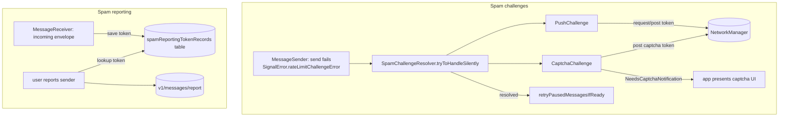

# Spam Challenges & Reporting

Covers `SignalServiceKit/Spam/`:

- `SpamChallengeResolver.swift`
- `SpamChallenge.swift`
- `PushChallenge.swift`
- `CaptchaChallenge.swift`
- `SpamReportingToken.swift`
- `SpamReportingTokenRecord.swift`

There are two mostly-independent concerns in this folder:

1. **Spam challenges** — when the server suspects the local user is sending spam, it responds with
   a rate-limit "challenge" the client must satisfy (silently via a push, or interactively via a
   captcha) before messages flow again. This is the `SpamChallengeResolver` and its `SpamChallenge`
   subclasses.
2. **Spam reporting tokens** — opaque tokens the server attaches to *incoming* envelopes, which the
   client persists and echoes back if the user later reports the sender as spam. This is
   `SpamReportingToken` / `SpamReportingTokenRecord`.

The two concerns share only the "spam" theme; they do not call into each other.

---

## Spam challenges

### `SpamChallengeResolver` — `SpamChallengeResolver.swift:9`
Confidence: HIGH (read in full). A long-lived service (one instance, owned by `SSKEnvironment` as
`spamChallengeResolverRef`, built in `AppSetup.swift:1986`/wired at `:2062`). It owns the set of
outstanding `SpamChallenge`s, drives them to resolution, and persists them.

- **Threading.** All work happens on a private serial queue `org.signal.spam-challenge-resolver`
  targeting `.sharedUtility` (`:13`); most entry points `workQueue.async { … }` onto it and assert
  via `assertOnQueue`. The next-attempt `Timer` is scheduled on the main run loop (`:36`).
- **`challenges: [SpamChallenge]?`** (`:22`) — the in-memory working set. Its `didSet` detects the
  pausing→not-pausing transition and triggers `retryPausedMessagesIfReady()`.
- **`isPausingMessages`** (`:18`) — true if any live challenge `pausesMessages`. Read by the app to
  decide whether sends are currently blocked (`ConversationViewController+CVComponentDelegate.swift:994`).
- **Lifecycle on launch** (`:46`): `runNowOrWhenAppDidBecomeReadySync` → `loadChallengesFromDatabase()`.

#### Core loop — `recheckChallenges()` `:58`
Confidence: HIGH. The heartbeat of the resolver, called whenever the challenge set changes:
1. `consolidateChallenges()` (`:68`) — drop challenges that aren't `isLive` (complete/failed/expired).
2. `saveChallenges()` (`:300`) — persist to the `KeyValueStore`.
3. `scheduleNextUpdate()` (`:80`) — set a one-shot `Timer` for the earliest `nextActionableDate`
   among challenges; the timer re-enters `recheckChallenges()` on the work queue.
4. `resolveChallenges()` (`:102`) — call `resolveChallenge()` on every challenge whose `state.isActionable`.

#### Scheduling delegate — `SpamChallengeSchedulingDelegate` `SpamChallenge.swift:6`
Confidence: HIGH. The resolver conforms (`SpamChallengeResolver.swift:320`). A challenge calls back
`spamChallenge(_:stateDidChangeFrom:)` on any state change; the resolver re-runs `recheckChallenges()`
(unless the new state is `.inProgress`) and posts `didCompleteAnyChallenge` on completion. This is
how an individual challenge's async networking result feeds back into the shared loop.

#### Retrying paused sends — `retryPausedMessagesIfReady()` `:112`
Confidence: HIGH. Once nothing pauses messages, it reloads `InteractionFinder.pendingInteractionIds`
and re-enqueues each as a `PreparedOutgoingMessage.preprepared(forResending:)` onto the
`messageSenderJobQueueRef`. This is the counterpart to messages being parked as "pending" when a
challenge appears (see TSOutgoingMessage handling of `SpamChallengeRequiredError`,
`TSOutgoingMessage.swift:229`).

#### Entry points

| Trigger | Method | Line | Source |
|---------|--------|------|--------|
| APNs push with a spam-challenge token | `handleIncomingPushChallengeToken(_:)` | 143 | `AppLifecycleManager.swift:1842` |
| User completed a captcha | `handleIncomingCaptchaChallengeToken(_:)` | 173 | captcha UI (via `NeedsCaptchaNotification`) |
| Send rejected with a server challenge | `tryToHandleSilently(token:options:retryAfter:)` | 253 | `MessageSender.swift:1951` |

- **Push token arrival** (`:143`): if there is an existing `PushChallenge` still awaiting a token,
  the token is populated into it (`:160`); otherwise a brand-new `PushChallenge(tokenIn:)` is created
  and added. (Confidence: HIGH.)
- **Captcha token arrival** (`:173`): routed to the oldest `CaptchaChallenge` still missing a
  `captchaToken` (`:187`). (Confidence: HIGH.)
- **Server challenge body** — `handleServerChallengeBody(...)` `:197`: the heart of silent recovery.
  Confidence: HIGH.
  - If a `CaptchaChallenge` is already in progress, reply failure to the silent-recovery handler and
    bail (`:207`).
  - If `.pushChallenge` is offered: attach to an in-flight live `PushChallenge` if present, else
    create one with a **10-second** expiry (`:219`). On that push's completion, if it did *not*
    succeed, recurse with `.pushChallenge` removed from `options` so a captcha path can be tried
    (`:227`).
  - Else if `.captcha` is offered: register a `CaptchaChallenge(tokenIn:expiry: retryAfter)` and
    immediately report failure to the silent-recovery handler (`:244`) — a captcha can't be resolved
    silently, so the send fails now and is retried later.
- **`tryToHandleSilently`** (`:253`): bridges the completion-handler world to `async`/`await`. If the
  server gave no `retryAfter`, throws `SpamChallengeRequiredError` immediately; otherwise suspends on
  a continuation that `handleServerChallengeBody` resumes — returning normally if silently resolved,
  else throwing `SpamChallengeRequiredError` (defined in `MessageSender+Errors.swift:191`). The
  `options`/`token`/`retryAfter` come from `SignalError.rateLimitChallengeError`, and
  `ChallengeOption` is a LibSignalClient type.

#### Persistence — `SpamChallengeResolver` storage extension `:272`
Confidence: HIGH. Challenges are stored as a `Codable` array under key
`"OutstandingChallengesArray"` in `KeyValueStore(collection: "SpamChallengeResolver")` (`:273`).
`loadChallengesFromDatabase` (`:277`) decodes them (defaulting to `[]` on error) and kicks
`recheckChallenges`; `saveChallenges` (`:300`) re-encodes (or removes the key if the set is nil).
Codable round-tripping of a heterogeneous `[SpamChallenge]` works because each concrete subclass
encodes its own keys plus a `superEncoder()` (see below).

#### Notifications (public surface) — `:138`
Confidence: HIGH.
- `NeedsCaptchaNotification` (`:138`) — posted by `CaptchaChallenge` to ask the app layer to present
  a captcha UI.
- `didCompleteAnyChallenge` (`:140`) — posted when any challenge reaches `.complete`.

### `SpamChallenge` (base) — `SpamChallenge.swift:11`
Confidence: HIGH (read in full). A `Codable` base class modeling one outstanding challenge.
- **State machine** `State` (`:26`): `.actionable`, `.inProgress`, `.deferred(Date)`, `.complete`,
  `.failed`. `.complete`/`.failed` are terminal (asserted in `state.didSet`, `:44`). `isActionable`
  is true for `.actionable` or a `.deferred` whose date is in the past (`:37`).
- **`state.didSet`** (`:42`): notifies the scheduling delegate, and on reaching a terminal state fires
  all `completionHandlers` with success = `(state == .complete)`.
- **`pausesMessages`** (`:22`): base default `true` (overridden to `false` by `PushChallenge`).
- **`isLive`** (`:59`): not expired and in a non-terminal state. **`nextActionableDate`** (`:69`):
  the deferral date (clamped to expiry) or the expiry.
- **`deinit`** (`:81`): any un-fired completion handlers fire with `false` — so a dropped challenge
  never silently strands a waiting `tryToHandleSilently`.
- **`resolveChallenge()`** (`:88`): base just sets `.inProgress`; subclasses override to do the work
  and are responsible for driving their own state afterward.
- **Codable** (`:99`): encodes `creationDate`/`expirationDate` and flattens `state` into
  `deferralDate`/`isComplete`/`isFailed` fields (`.inProgress` is persisted as `.actionable`).

### `PushChallenge` — `PushChallenge.swift:6`
Confidence: HIGH (read in full). Resolves silently with no user interaction. `pausesMessages = false`
(`:11`) — a push challenge does not block the user's sends.
- **Simulator** short-circuits to `.failed` in `init` (`:17`) since there's no APNs push.
- **`resolveChallenge()`** (`:32`): if a `token` is already present, `postToken` it; otherwise
  `requestToken` (asks the server to send a push, which later arrives via
  `handleIncomingPushChallengeToken`).
  - `requestToken` → `OWSRequestFactory.pushChallengeRequest()`; success defers until expiry (`:59`).
  - `postToken` → `OWSRequestFactory.pushChallengeResponse(token:)`; success → `.complete`.
- **Networking** uses `SSKEnvironment.shared.networkManagerRef.asyncRequest` (`:47`,`:89`); the result
  is handed back onto `workQueue` before mutating state.
- **Failure handling** (`handleRequestTokenResult` `:55`, `handlePostTokenResult` `:97`): bounded by
  `kMaxFailures = 15`; 5xx (except 508) → defer using the server's `Retry-After` or exponential
  backoff (`fallbackRetryAfter`, `:126`, `maxAverageBackoff ≈ 14.1 min`); other HTTP/permanent errors
  → terminal.
- **Codable** persists `token`/`failureCount`. (Note (confidence: HIGH): a latent bug at
  `:141` decodes `failureCount` using the `.token` key instead of `.failureCount`.)

### `CaptchaChallenge` — `CaptchaChallenge.swift:6`
Confidence: HIGH (read in full). Requires the user to solve a captcha; `pausesMessages` inherits the
base `true`, so these block sends.
- Holds the server-provided `token` and a user-supplied `captchaToken` (set via
  `handleIncomingCaptchaChallengeToken`); setting `captchaToken` flips state back to `.actionable`
  (`:8`).
- **`resolveChallenge()`** (`:25`): if no `captchaToken` yet, `requestCaptchaFromUser()` posts
  `SpamChallengeResolver.NeedsCaptchaNotification` (`:35`) so the app presents the captcha; once a
  token exists, `notifyServerOfCompletedCaptcha()` sends
  `OWSRequestFactory.recaptchChallengeResponse(serverToken:captchaToken:)`.
- **Failure handling** (`:64`): same `kMaxFailures = 15` / 5xx-defer / backoff shape as
  `PushChallenge`, except exhaustion defers to the expiration date rather than marking `.failed`.

---

## Spam reporting tokens

### `SpamReportingToken` — `SpamReportingToken.swift:10`
Confidence: HIGH (read in full). A `Codable`/`Hashable`/`Sendable` value wrapping opaque `Data`.
`init?(data:)` rejects empty data (`:16`); `base64EncodedString()` (`:22`) is the wire form sent to
the server. The doc comment states the intent: save when receiving envelopes, provide when reporting
spam.

### `SpamReportingTokenRecord` — `SpamReportingTokenRecord.swift:10`
Confidence: HIGH (read in full). A GRDB `FetchableRecord`/`PersistableRecord` row in table
`spamReportingTokenRecords` (`:11`), keyed by the sender's ACI (column `sourceUuid`, `:17`).
- Custom Codable maps `sourceAci` ⇄ `UUID` and nests the token (`:23`).
- **Upsert shim** (`:58`): a `persistenceConflictPolicy` of replace-on-conflict (`:53`) + `upsert`
  wrapper to emulate upsert on GRDB <6 (one record per ACI; new tokens overwrite).
- **`reportingToken(for:database:)`** (`:38`): fetch the stored token for an ACI (nil if none).
- `SpamReportingToken` is made `DatabaseValueConvertible` as a BLOB (`:63`).
- **Schema** created by migration `addSpamReportingTokenRecordTable`
  (`GRDBSchemaMigrator.swift:2821`); the column is a BLOB by SQLite affinity default.

### Data flow (reporting)
Confidence: HIGH (cross-file reads).
- **Save on receive.** `MessageReceiver.finishProcessingEnvelope` → `saveSpamReportingToken`
  (`MessageReceiver.swift:299`,`:303`) reads `decryptedEnvelope.envelope.spamReportingToken` (a
  protobuf field, `SSKProto.swift:176`), wraps it, and upserts a record keyed by `sourceAci`.
  Failures are logged via `owsFailBeta` and do **not** interrupt message processing (`:318`).
- **Send on report.** The app layer (outside this folder) builds a `SpamReport`
  (`Signal/Spam/SpamReport.swift`), looking up the token via
  `SpamReportingTokenRecord.reportingToken(for:database:)` (`SpamReportingUIUtils.swift:170`), and
  POSTs to `v1/messages/report/<aci>/<serverGuid>` via
  `OWSRequestFactory.reportSpam(from:withServerGuid:reportingToken:)`
  (`OWSRequestFactory+Spam.swift:10`). The token (if any) is sent base64-encoded in the `token`
  parameter; absent token → no parameters (`:21`).

---

## Interactions with the rest of the app
Confidence: HIGH (cross-file reads).

- **MessageSender** (`MessageSender.swift:1951`) is the only producer of server-driven challenges: on
  `SignalError.rateLimitChallengeError` it calls `tryToHandleSilently`, then rethrows so the message
  parks as pending while the resolver works (the resolver gets ~10s for silent recovery).
- **TSOutgoingMessage** (`TSOutgoingMessage.swift:229`) and **CallLinkProfileKeySharingManager**
  (`CallLinkProfileKeySharingManager.swift:83`) special-case `SpamChallengeRequiredError`.
- **AppLifecycleManager** (`AppLifecycleManager.swift:1842`) forwards APNs spam-challenge tokens into
  the resolver.
- **ConversationViewController** reads `isPausingMessages` and calls `retryPausedMessagesIfReady`
  (`ConversationViewController+CVComponentDelegate.swift:994`,`:1000`).
- **Reporting UI** (`Signal/Spam/SpamReportingUIUtils.swift`, `ConversationSettingsViewController`,
  `MessageRequestDecliner`, message-request action sheets) drives the reporting path and consumes
  stored tokens.

## Notable networking considerations
Confidence: HIGH.

- Challenge requests go through `networkManagerRef.asyncRequest`; all three request shapes live in
  `OWSRequestFactory.swift:70–78` (`pushChallengeRequest`, `pushChallengeResponse`,
  `recaptchChallengeResponse`).
- Both challenge types respect the server's `Retry-After` and otherwise fall back to exponential
  backoff capped near 14 minutes; 5xx (except 508) is retryable, other HTTP errors are terminal.
- `tryToHandleSilently` intentionally has a short (10s) window: silent push recovery either succeeds
  quickly or the send is parked and retried later once the challenge resolves.
- Reporting fans out one POST per server GUID concurrently (`SpamReport.submit`,
  `Signal/Spam/SpamReport.swift:16`), each carrying the same reporting token.

## Tests
Confidence: HIGH. Unit tests live outside this folder under
`SignalServiceKit/tests/Network/Spam/` (`SpamReportingTokenTest.swift`,
`SpamReportingTokenRecordTest.swift`) plus request coverage in `OWSRequestFactoryTest.swift`.
