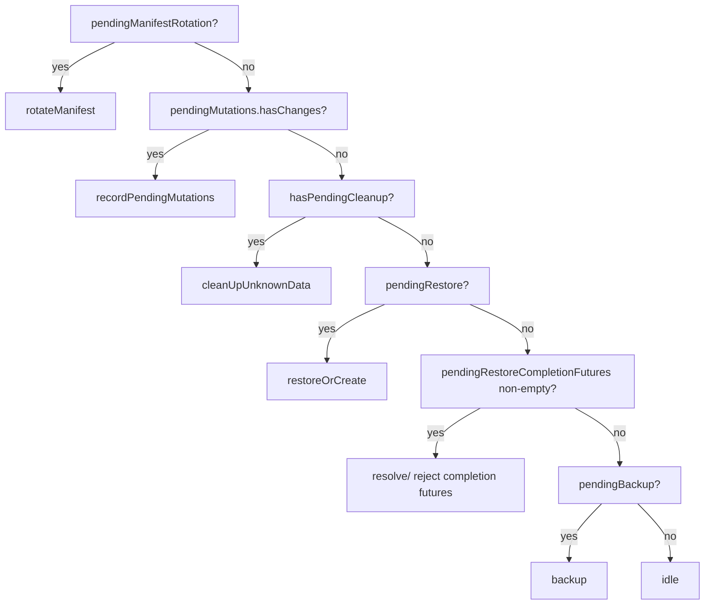

# Storage Service — Architecture

This document covers the orchestration layer in
`SignalServiceKit/StorageService/StorageServiceManager.swift`: the actors, the
serialized operation state machine, how work is scheduled, authentication, and
the local `State` mirror. The network/crypto layer (`StorageService.swift`) is
covered in [encryption-and-ikm.md](encryption-and-ikm.md) and
[manifest-and-record-model.md](manifest-and-record-model.md); the push/pull/merge
flows are in [push-pull-merge.md](push-pull-merge.md).

---

## The two actors

### `StorageServiceManager` (protocol) / `StorageServiceManagerImpl`

The long-lived, app-wide object (a `NSObject` subclass) that owns the public
API and the queue of pending work. Defined at
`StorageServiceManager.swift:11-83` (protocol) and `:140` (impl). **[High]**

Public API surface (`:11-83`): **[High]**

- `setLocalIdentifiers(_:)` — supply the local user's `LocalIdentifiers`
  (ACI/PNI/e164); called at launch, registration, change-number.
- `registerForCron(_:)` — schedule the periodic restore (see "Scheduling").
- `currentManifestVersion(tx:)` (`:238`) / `currentManifestHasRecordIkm(tx:)`
  (`:244`) — read the local mirror.
- `recordPendingUpdates(...)` overloads + `recordPendingLocalAccountUpdates()` +
  `recordPendingInsertions(forGroupMasterKeys:)` — mark local objects dirty so
  they get pushed on the next backup.
- `backupPendingChanges(authedAccount:)` (`:618`) — push dirty records now.
- `restoreOrCreateManifestIfNecessary(authedAccount:masterKeySource:)` — pull.
- `rotateManifest(mode:authedAccount:)` (`:597`) — recreate the manifest
  (optionally all records). `async throws`.
- `resetLocalData(transaction:)` (`:648`) — wipe the local mirror only (remote
  untouched). **[High]**
- `waitForPendingRestores()` (`:631`) / `waitForSteadyState()` (`:644`) —
  synchronization points.

### `StorageServiceOperation`

A per-run object (`StorageServiceManager.swift:735`) that actually executes one
of four `Mode`s against the server and database. **[High]** — `Mode` at
`:746-751`:

```swift
enum Mode {
    case rotateManifest(mode: StorageServiceManager.ManifestRotationMode)
    case backup
    case restoreOrCreate(isRunningViaCron: Bool)
    case cleanUpUnknownData
}
```

Each operation is constructed with the resolved `localIdentifiers`,
`isPrimaryDevice`, `authedAccount`, and `masterKeySource`, and
`run()` (`:776`) wraps `_run()` (`:783`) in
`Retry.performWithBackoff(maxAttempts: 4)`. **[High]**

---

## The serialized state machine

The manager keeps a single `AtomicValue<ManagerState>` (`:303`) and guarantees
**at most one operation runs at a time**. All mutations go through
`updateManagerState` (`:305`), which runs the mutation and then calls
`startNextOperationIfNeeded` (`:316`), which (if idle) pops the next operation and
runs it in a `Task`; when the task finishes, `finishOperation` (`:495`) clears the
running flag and re-checks. **[High]**

`ManagerState` (`:252`) tracks the queued/pending work: **[High]**

| Field | Meaning |
| --- | --- |
| `localIdentifiers` | optional until the DB is loaded |
| `pendingManifestRotation` | a queued rotate (with accumulated continuations + merged `mode`) |
| `hasPendingCleanup` | a queued `cleanUpUnknownData` |
| `pendingBackup` / `pendingBackupTimer` | a queued push + the debounce timer |
| `pendingRestore` | a queued pull (with futures + `isRunningViaCron`) |
| `pendingMutations` | coalesced "mark dirty" requests (`PendingMutations`) |
| `mostRecentRestoreError` / `pendingRestoreCompletionFutures` | state for `waitForPendingRestores` |
| `isRunningOperation` | the mutex |
| `onSteadyState` | waiters for `waitForSteadyState` |

### Operation precedence

`popNextOperation` (`:341`) selects the next operation in this **fixed priority
order**: **[High]**



Notes on the precedence logic (`:341-451`): **[High]**

- Rotation continuations are resumed in a cleanup block, and if the rotate
  operation can't be built the continuations are rejected with an assertion
  error but `popNextOperation` keeps looking for other work.
- `recordPendingMutations` is itself an operation (it writes the dirty flags
  into the persisted `State`), not a network call.
- The restore operation resolves/rejects the `pendingRestore.futures` and
  records `mostRecentRestoreError` via its cleanup block.
- `pendingRestoreCompletionFutures` (populated by `waitForPendingRestores`) are
  resolved only *after* a restore has run — if a restore failed, they're
  rejected with that error. **[High]**

### Building an operation / resolving auth

`buildOperation` (`:453`) resolves the identity to run as: **[High]**

- `.explicit(authedAccount)` → use its `localIdentifiers` + `isPrimaryDevice`.
- `.implicit` → read `TSAccountManager`; if not registered yet (new-reg flow
  before TS account auth is set up) it **skips** the operation and returns `nil`
  ("Skipping storage service operation with implicit auth during registration.",
  `:470`); if registered but `managerState.localIdentifiers` is still `nil`, it
  `owsFailDebug`s and returns `nil` (`:477`).

---

## Scheduling: when operations run

Four independent triggers enqueue work: **[High]**

1. **Debounced backup.** Any `recordPendingUpdates*` call lands in
   `updatePendingMutations` (`:504`), which (if there are changes and no timer
   yet) starts a one-shot `Timer` with `backupDebounceInterval = 0.2s`
   (`:661`, `startBackupTimer` `:663`). When it fires it calls
   `backupPendingChanges`, coalescing a burst of edits into a single push.
2. **App lifecycle.** On first launch (`appReadiness` ready) and on
   `willResignActive` (`:208`) / `didBecomeActive` (`:217`), the manager calls
   `backupPendingChanges` so pending edits are flushed quickly, even in the
   background. On `backupPlanDidChange` (`:225`), it marks the local account
   record dirty. **[High]** — main-app only (`:148`).
3. **Cron (periodic restore).** `registerForCron` (`:186`) schedules
   `restoreManifestCronKey = .fetchStorageService` to run approximately once per
   **day** (`restoreManifestCronInterval = .day`, `:184`), `mustBeConnected`,
   invoking `_restoreOrCreateManifestIfNecessary(isRunningViaCron: true)`. After
   a non-cron restore succeeds, the cron date is bumped
   (`updateRestoreManifestCronDate`, `:202`; applied in
   `StorageServiceOperation._run`). **[High]**
4. **Explicit calls** from registration/linking/change-number (`restoreOrCreate…`,
   `rotateManifest`).

### Coalescing semantics of the enqueue helpers

- `_restoreOrCreateManifestIfNecessary` (`:575`) merges into any existing
  `pendingRestore`: it appends the new `Future`, and OR-merges `authedAccount` /
  `masterKeySource` via `orIfImplicitUse` (explicit wins over implicit) and
  `isRunningViaCron`. **[High]**
- `rotateManifest` (`:597`) merges into any existing `pendingManifestRotation`,
  appending the continuation and merging `mode` **by precedence** (see
  [push-pull-merge.md](push-pull-merge.md) on `ManifestRotationMode`). **[High]**
- `backupPendingChanges` (`:618`) invalidates the debounce timer (the push is
  happening now) and merges `authedAccount`. **[High]**

---

## Steady-state and restore synchronization

- `waitForSteadyState()` (`:644`) waits on a `Monitor.Condition` that is
  satisfied when `!isRunningOperation && pendingBackupTimer == nil`
  (`steadyStateCondition`, `:639`). **[High]**
- `waitForPendingRestores()` (`:631`) appends a `Future` to
  `pendingRestoreCompletionFutures`; those are resolved only after the next
  restore completes (or rejected with its error). The protocol doc comment
  (`:62-78`) carefully bounds the guarantee: *"if this device has knowledge that
  storage service has new state at the time this method is invoked, the returned
  Promise will be resolved after that state has been fetched."* **[High]**

---

## Authentication

Storage Service does **not** use the chat auth directly. `storageRequest`
(`StorageService.swift:470`) first calls `requestStorageAuth` (`:510`), which
hits `OWSRequestFactory.storageAuthRequest(auth:)` on the network manager to
obtain an ephemeral `{username, password}` pair, then issues the storage request
with HTTP basic auth and `Content-Type: application/x-protobuf`.
`require2xxOr3xx` is disabled so the caller can inspect 204/404/409 status codes.
**[High]** — `:470-507`.

The `authedAccount` threaded through operations provides the `chatServiceAuth`
used to fetch those storage credentials. **[Medium]** — the exact credential
exchange lives in `OWSRequestFactory`/`NetworkManager` outside this directory.

---

## The local `State` mirror

`StorageServiceOperation.State` (`:2226`) is a `Codable` struct persisted as JSON
under key `"state"` in the `kOWSStorageServiceOperation_IdentifierMap`
`KeyValueStore` (`current` at `:2358`, `save` at `:2367`). It is the device's
authoritative local view of what's in Storage Service. Key fields: **[High]**

| Field | Purpose |
| --- | --- |
| `manifestVersion` | last-known manifest version (`0` = none) |
| `refetchLatestManifest` | force an unconditional manifest fetch next pull |
| `manifestRecordIkm` | the record IKM from the current manifest (see [encryption-and-ikm.md](encryption-and-ikm.md)) |
| `consecutiveConflicts` | conflict-loop guard (ceiling `maxConsecutiveConflicts = 3`, `:2224`) |
| `localAccountIdentifier` + `localAccountRecordWithUnknownFields` | the single account record |
| `accountIdToIdentifierMap` / `…RecordWithUnknownFields` | contacts, keyed by `RecipientUniqueId` |
| `groupV1IdToIdentifierMap` / `groupV2MasterKeyToIdentifierMap` / … | groups |
| `storyDistributionListIdentifierToStorageIdentifierMap` / … | DLists |
| `callLinkRootKeyToStorageIdentifierMap` / … | call links |
| `unknownIdentifiersTypeMap` | identifiers of record *types this app build doesn't understand* |
| `invalidIdentifiers` | ids to delete on the next mutation (see [conflict-resolution.md](conflict-resolution.md)) |
| `unknownFieldLastCheckedAppVersion` | gate for the per-app-version unknown-field re-merge |
| `localAccountChangeState` + the per-type `…ChangeMap`s | dirty flags (`.unchanged`/`.updated`/`.deleted`) |

`ChangeState` (`:2293`) has a vestigial `.deleted = 2` case that newer code no
longer *writes* but must still *read* for backward compatibility. **[High]**

`allIdentifiers` (`:2335`) is the union of every mapped identifier **plus the
unknown identifiers** (`:2351`) — the latter must be re-listed in every manifest
we write so we don't delete records newer apps added. **[High]**

### Legacy decoding shims

- `@BidirectionalLegacyDecoding` (`:2527`, applied e.g. at `:2243`, `:2250`,
  `:2257`) decodes a plain dictionary, or falls back to the old
  `BidirectionalDictionary` on-disk shape. **[High]**
- `@EmptyForCodable` on `groupV1ChangeMap` (`:2309`): GroupV1 change state is no
  longer written and is ignored on decode. **[High]**

---

## Validation rules, error paths, and edge cases

- **Main-app only side effects.** The lifecycle observers, cleanup, and
  deleted-call-link GC are only wired up when `CurrentAppContext().isMainApp`
  (`:148`). **[High]**
- **NSE batch size.** When running in the Notification Service Extension, item
  fetch batches shrink from 1024 to 256 (`itemsBatchSize`, `:1798`). **[High]**
- **Missing identifiers window.** `localIdentifiers` may be `nil` between init
  and DB load; implicit operations are skipped in that window (`:477`).
  **[High]**
- **Not-registered / linked-without-keys.** If no `MasterKey` is available, the
  operation either sends a keys-sync request (linked + registered) or no-ops
  (primary / unregistered). See [encryption-and-ikm.md](encryption-and-ikm.md).
  **[High]** — `_run` master-key handling begins at `:783`;
  `sendKeysSyncRequestMessageIfNeeded` at `:859`.
- **Deleted call-link GC.** On launch, call links admin-deleted longer ago than
  `RemoteConfig.current.messageQueueTimeMs` are hard-deleted locally and their
  root keys marked pending-update so the deletion propagates
  (`cleanUpDeletedCallLinks`, `:688-706`). **[High]**

### Feature flags

No `FeatureFlags.*` gate exists in this directory; behavior that varies is
driven by **`RemoteConfig`** (`messageQueueTime`) and app context (main app vs
NSE), not static flags. *Intent for finer-grained flagging: intent undetermined
— no evidence in source.* **[High]** (searched the directory; the only dynamic
knobs are `RemoteConfig.current.messageQueueTime(Ms)` at
`StorageServiceManager.swift:691` and `StorageServiceProto+Sync.swift:113`).
