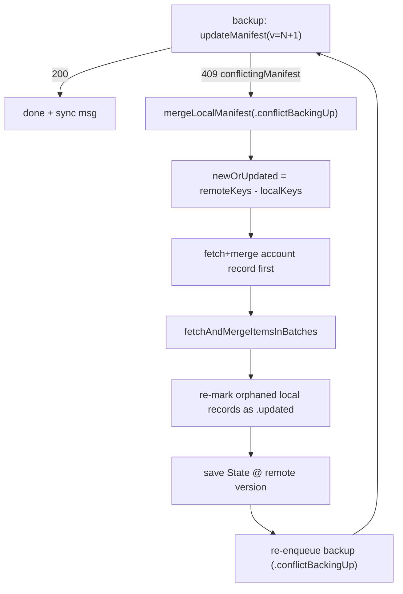

# Storage Service — Conflict Resolution

This document covers how Signal iOS reconciles concurrent writes to Storage
Service: version conflicts (HTTP 409), the per-record merge semantics, orphan
re-adoption, invalid-identifier bookkeeping, decryption-failure recovery, and
the consecutive-conflict ceiling. Primary source:
`StorageServiceManager.swift` (`mergeLocalManifest`, `createNewManifest*`), with
record-level merge logic in `StorageServiceProto+Sync.swift`.

---

## The conflict model

The server enforces optimistic concurrency: `updateManifest` succeeds only if
the version we write is the next version the server expects. If another device
already wrote that version, the server returns **HTTP 409 with the current
remote manifest in the body**, which `StorageService.updateManifest` surfaces as
`StorageError.conflictingManifest(remoteManifest)`
(`StorageService.swift:309-333`). **[High]**

Because a changed record always gets a **new random identifier** (see
[manifest-and-record-model.md](manifest-and-record-model.md)), a device can
compute "what changed remotely" purely by set difference:
`newOrUpdatedItems = remoteManifest.keys − state.allIdentifiers`
(`StorageServiceManager.swift:1539`). No per-field timestamps are stored.
**[High]**

---

## "Latest wins" per-record merge

The record-updater protocol doc states the philosophy explicitly: *"the latest
value on the service is always right."* Divergences are tolerated because
changes are infrequent and pushed quickly. **[High]** —
`StorageServiceProto+Sync.swift:36-56`.

`mergeRecord` on the operation (`StorageServiceManager.swift:2064`) applies one
record and interprets the result: **[High]**

- `.invalid` → the record has no usable identifier; nothing is written locally,
  so it ends up in `invalidIdentifiers` and gets deleted on the next mutation.
- `.merged(needsUpdate:, localId)` →
  - record the storage identifier for `localId` (local now matches remote),
  - set the change state to `.updated` **iff `needsUpdate`** (local diverged, so
    schedule a push) else clear it,
  - keep the record if it carries unknown fields.

`needsUpdate` is each updater's signal that *local state could not be made to
exactly match the record* (e.g. a contact whose merged ids differ from the
record's — `StorageServiceProto+Sync.swift:487-495`), which schedules a
corrective push. **[High]**

---

## Merge ordering within a manifest

### Account record first

The local **account record is merged before everything else** (and even before
the batched fetch), because it carries the user's own configuration that we want
applied ASAP — especially right after linking
(`StorageServiceManager.swift:1562`). If the manifest is missing a local account
record, we mark our account `.updated` to re-push it. If the item vanishes
between manifest-fetch and item-fetch (a linked device raced us), we also just
mark `.updated`. **[High]**

### Deferred ACI-less contacts

`fetchAndMergeItemsInBatches` (`StorageServiceManager.swift:1799`) splits each
fetched batch: contact records where `shouldDeferMerge` is true (i.e. **no ACI**,
`StorageServiceProto+Sync.swift:424`) are deferred to a final pass. ACI-bearing
records are merged first so that **split operations** are processed before we
might re-populate an ACI from local state. **[High]**

### Batch size

1024 items per batch (256 in the NSE), `itemsBatchSize`
(`StorageServiceManager.swift:1798`). **[High]**

---

## Orphan re-adoption

After merging, the device scans its local maps for records that still exist
locally but are **no longer referenced by the remote manifest**, and re-marks
them `.updated` so the next backup re-adds them. This is done per type, each
with a guard so that a *legitimate* remote deletion is honored rather than
fought: **[High]** — `StorageServiceManager.swift:1677-1735`.

| Type | Re-adopt only if … | Else |
| --- | --- | --- |
| GroupV2 | always re-mark `.updated` (`:1677`) | — |
| Story DList | the DList isn't tombstoned and the private story thread still exists (`:1683-1688`) | allow the remote removal |
| Call link | the local call-link record has an `adminPasskey` (`:1704-1710`) | allow removal |
| Account/contact | the recipient is still registered and `shouldBeInStorageService` (`:1721-1732`) | allow removal (e.g. unregistered-a-while-ago) |

This asymmetry prevents two devices from endlessly re-adding/removing a record:
only records we have strong local evidence should exist are re-adopted. **[High]**

---

## Invalid identifiers

`state.invalidIdentifiers` is recomputed each merge as
`remoteManifestItems − state.allIdentifiers` (`StorageServiceManager.swift:1671`),
i.e. identifiers the manifest references but which we did **not** incorporate
into local state. They are **not deleted immediately** — they're deleted on the
*next* mutation (added to `deletedIdentifiers` in `backupPendingChanges`,
`:1092`). The code enumerates three causes (comment at `:1653`): **[High]**

1. a `.invalid` merge result (record not processed),
2. two storage items pointing at the same underlying thing (the latter wins, the
   former is orphaned),
3. a manifest-referenced item that couldn't be fetched (usually a stale
   manifest; the next write's 409 merge drops the reference).

Deferring deletion avoids fighting another device that might legitimately
re-add them. **[High]**

---

## Decryption / deserialization failure recovery

Handled both in `restoreOrCreateManifestIfNecessary` (manifest-level) and in the
`catch` of `mergeLocalManifest` (item-level): **[High]**

| Failure | Primary device | Linked device |
| --- | --- | --- |
| manifest decrypt/deserialize | recreate manifest+records at `version+1` (in the pull `catch` after `:1213`; and in backup at `:1140-1146`) | request keys-sync from primary, rethrow |
| item decrypt (`itemDecryptionFailed`) | recreate manifest+records at `manifest.version+1` ("Item decryption failed, recreating manifest.", `:1772-1773`) | `sendKeysSyncRequestMessageIfNeeded()` |
| item deserialize (`itemProtoDeserializationFailed`) | recreate manifest+records (byte garbage, local is only recourse) (`:1790`) | rethrow |

The rationale encoded in comments: a decryption failure most likely means the
keys changed; the primary (which holds authoritative keys) re-encrypts the whole
social graph, while a linked device waits for fresh keys from the primary.
**[High]** — `StorageServiceManager.swift:1766-1793`.

The keys-sync path: `sendKeysSyncRequestMessageIfNeeded`
(`StorageServiceManager.swift:859`) is linked-only, idempotent (checks
`isWaitingForKeysSyncMessage` first), and sets that flag after sending so the
operation short-circuits until new keys arrive. **[High]**

---

## The consecutive-conflict ceiling

To avoid an infinite conflict loop (a service bug or a pathological race),
`mergeLocalManifest` increments `state.consecutiveConflicts` on each
`.conflictBackingUp` merge (`:1505`) and **gives up once it exceeds
`maxConsecutiveConflicts = 3`** (`:1515`), clearing the counter and throwing so
work resumes on the next operation (`maxConsecutiveConflicts` at `:2224`). A
successful save elsewhere clears the counter
(`save(clearConsecutiveConflicts: true, …)`). **[High]**

Additional guards: **[High]**

- Merging a manifest **version lower than local** throws (`:1528`) — we never
  roll back; versions only increase, even through recovery.
- A `conflictingManifest` whose version is **not ≥ our proposed version** throws
  an assertion in the backup path (`:1124`).
- In `createNewManifestAndRecords`, a **second** conflict after bumping+retrying
  is fatal ("Repeated conflicts trying to create a new manifest; giving up.
  What's going on?", `:1412`). **[High]**

---

## Cleanup pass (`cleanUpUnknownData`)

A separate low-priority operation reconciles accumulated cruft
(`StorageServiceManager.swift:1892`): **[High]**

- `cleanUpUnknownIdentifiers` (`:1936`) — if any previously-unknown identifier is
  now a known type, set `refetchLatestManifest` so the next pull fetches it.
- `cleanUpRecordsWithUnknownFields` (`:1961`) — once per app version, re-merge
  records with unknown fields in case this build now understands them.
- `cleanUpOrphanedAccounts` (`:2015`) — mark contact records that should no
  longer be in Storage Service (unregistered-a-while-ago / merged recipients) for
  update so they get removed, plus a one-off migration for contacts that stored
  invalid PNIs (`recordPendingMutationsForContactsWithPNIs`, `:2029`). **[High]**
