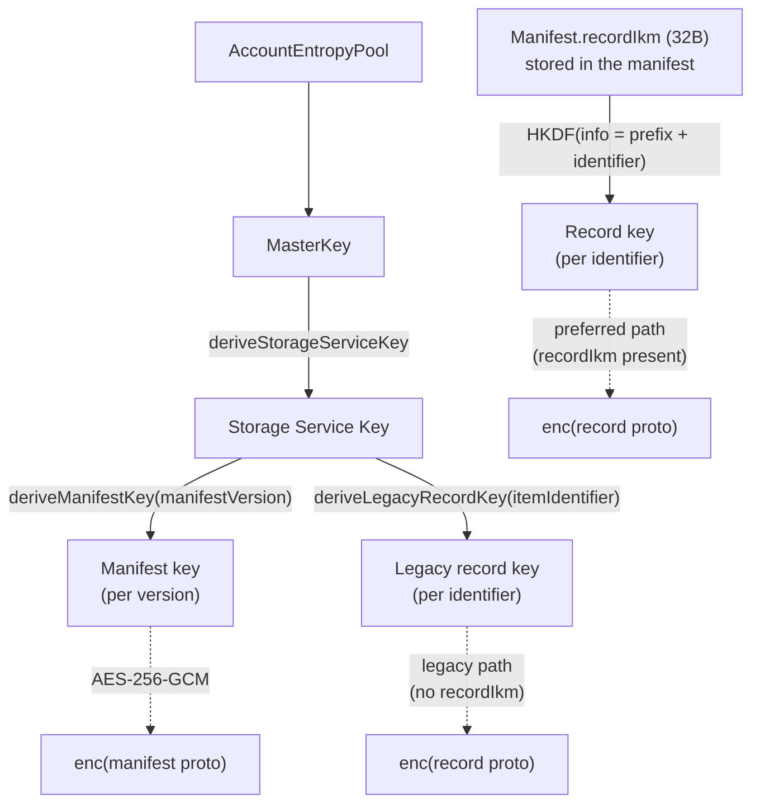
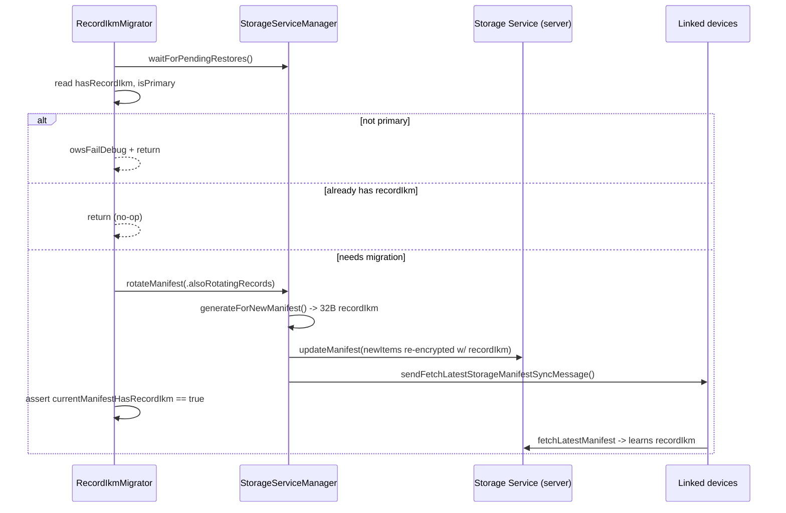

# Storage Service — Encryption & Record IKM

This document covers how manifests and records are encrypted, the two key
schemes (legacy SVR-derived keys vs. the manifest `recordIkm`), and the one-shot
migrator that moves accounts onto the `recordIkm` scheme. Sources:
`SignalServiceKit/StorageService/StorageService.swift` and
`StorageServiceRecordIkmMigrator.swift`.

---

## The key hierarchy

Everything roots in the account's **`MasterKey`** (derived from the
`AccountEntropyPool`, obtained from `AccountKeyStore` — outside this directory).
The code uses `masterKey.deriveStorageServiceKey()` as the storage-service root,
then derives per-blob keys from it. **[High]** — e.g.
`StorageService.swift:221` (manifest), `:282` (legacy record).



### Manifest encryption

Manifests are **always** encrypted with a per-version key:
`masterKey.deriveStorageServiceKey().deriveManifestKey(manifestVersion:)`
(`StorageService.swift:221` on fetch, `:258` on write, `:316` on the 409 conflict
path). The key is version-dependent, so re-encrypting a manifest at a new version
uses a different key. **[High]**

### Record (item) encryption — two schemes

For each storage item, the encryption key is chosen by whether the manifest has
a `recordIkm`: **[High]** — `StorageService.swift:272-287` (write),
`:382-392` (read).

```swift
if let manifestRecordIkm {
    // Preferred: derive from the manifest's recordIkm.
    encryptionKey = try manifestRecordIkm.recordKey(forIdentifier: item.identifier)
} else {
    // Legacy fallback: SVR/master-key-derived per-identifier key.
    encryptionKey = masterKey.deriveStorageServiceKey()
        .deriveLegacyRecordKey(itemIdentifier: item.identifier).rawData
}
```

- **Legacy scheme** (`deriveLegacyRecordKey`, `:282`/`:390`): the record key is
  derived directly from the master key + the item identifier. Rotating record
  encryption therefore requires rotating the master key / SVR state. **[High]**
- **`recordIkm` scheme**: the manifest itself carries a random 32-byte
  `recordIkm`; record keys are derived from *that* (not the master key). This
  lets records be re-keyed by rotating only the manifest's `recordIkm`, without
  touching the master key. **[High]**

### The `ManifestRecordIkm` type

Defined at `StorageService.swift:420-456`. **[High]**

- `expectedLength = 32` bytes (`:421`).
- `from(manifest:)` (`:431`) returns `nil` when the manifest has no `recordIkm`
  (⇒ legacy path).
- `generateForNewManifest()` (`:442`) produces 32 random bytes for a brand-new
  manifest.
- `recordKey(forIdentifier:)` (`:448`) derives the per-record key via **HKDF**:
  ```
  info      = "20240801_SIGNAL_STORAGE_SERVICE_ITEM_" || identifier.data
  salt      = <empty>
  ikm       = recordIkm (32B)
  outLength = 32
  ```
  The record **identifier is mixed into the HKDF `info`** (`:451`), so every
  record gets a distinct key even under the same `recordIkm`. **[High]**

### Symmetric primitive

Both manifests and items use **AES-256-GCM** via LibSignal's
`Aes256GcmEncryptedData`: `encryptValue` concatenates the GCM output
(`StorageService.swift:408`), `decryptValue` parses the concatenated form and
decrypts (`:412`). **[High]**

---

## When each scheme is used

- A **new manifest created from scratch** (`createNewManifestAndRecords`) always
  calls `generateForNewManifest()` and encrypts its records with the new
  `recordIkm` (`StorageServiceManager.swift:1296`). **[High]**
- A manifest **merged in from the server** copies the remote `recordIkm` into
  local `State` (`StorageServiceManager.swift:1626`); the primary asserts the
  remote IKM matches the local one it generated (`:1627-1636`). **[High]**
- Writing/reading records always prefers the manifest's `recordIkm` and only
  falls back to the legacy key when it is absent. **[High]** —
  `StorageService.swift:272-287`, `:382-392`.

---

## The record-IKM migrator

`StorageServiceRecordIkmMigrator` (`StorageServiceRecordIkmMigrator.swift`) is a
one-shot migration that gets older accounts (still on legacy record keys) onto
the `recordIkm` scheme. **[High]**

`migrateToManifestRecordIkmIfNecessary()` (`:34`): **[High]**

1. `await storageServiceManager.waitForPendingRestores()` — if a restore is in
   flight it may itself install a `recordIkm`, so let it finish first.
2. Read `currentManifestHasRecordIkm` and `isRegisteredPrimaryDevice` in one tx.
3. **Guard: primary only.** If not a registered primary device, `owsFailDebug`
   and return — "Unexpectedly attempting to migrate to recordIkm, but not a
   primary device!". **[High]**
4. **Guard: idempotent.** If the manifest already has a `recordIkm`, return
   (nothing to do). **[High]**
5. Otherwise `rotateManifest(mode: .alsoRotatingRecords, authedAccount:
   .implicit)` — recreating the manifest+records generates, stores, and
   thereafter uses a `recordIkm`. It then asserts the IKM is now present. On
   error it logs and swallows — the migration will be re-attempted on a future
   launch. **[High]**

The migrator notes that rotating the manifest sends a `fetchLatestStorageManifest`
sync message, so **linked devices learn about the new `recordIkm`** by fetching
the rotated manifest. **[High]**



*Why the cutover date `20240801` appears in the HKDF info string: intent
undetermined — no evidence in source beyond the literal; it functions as a
domain-separation / versioning tag.* **[High]** (the literal is at
`StorageService.swift:451`).

---

## Validation rules, error paths, and edge cases

- **IKM length is asserted at 32 bytes** when building a manifest
  (`StorageServiceManager.swift:1159-1163`) and is the fixed `expectedLength`
  (`StorageService.swift:421`). **[High]**
- **Manifest decryption failure** throws `StorageError.manifestDecryptionFailed(version:)`;
  **manifest deserialization failure** throws
  `.manifestProtoDeserializationFailed(version:)` (`StorageService.swift:9-18`
  defines the errors; thrown at `:218-233` and `:313-330`). **[High]**
- **Item decryption/deserialization failure** throws
  `.itemDecryptionFailed(identifier:)` / `.itemProtoDeserializationFailed(identifier:)`
  (`StorageService.swift:382-404`). **[High]**
- These errors drive the recovery flows in
  [conflict-resolution.md](conflict-resolution.md): a **primary** recreates the
  manifest/records with its local keys; a **linked device** requests a keys-sync
  from the primary. **[High]**
- **Linked device without keys.** If `AccountKeyStore.isWaitingForKeysSyncMessage`
  is set, the operation treats the master key as missing and (if registered)
  sends a keys-sync request rather than proceeding
  (`StorageServiceManager.swift:783-860`). **[High]**
