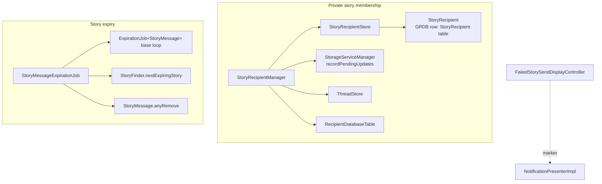
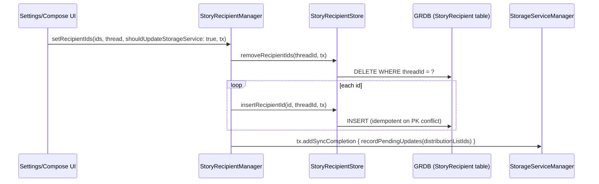

# Stories

Covers the files directly under `SignalServiceKit/Stories/`:

- `SignalServiceKit/Stories/StoryRecipient.swift`
- `SignalServiceKit/Stories/StoryRecipientStore.swift`
- `SignalServiceKit/Stories/StoryRecipientManager.swift`
- `SignalServiceKit/Stories/StoryMessageExpirationJob.swift`
- `SignalServiceKit/Stories/FailedStorySendDisplayController.swift`

This folder is **not** the whole Stories feature. The core story models and
business logic (`StoryManager`, `StoryMessage`, `StoryFinder`,
`StoryContextAssociatedData`, …) live under
`SignalServiceKit/Messages/Stories/` and are referenced here but not documented
in this README. The files in `SignalServiceKit/Stories/` handle two mostly
independent concerns plus one tiny cross-target protocol:

1. **Private story recipient membership** — the many-to-many mapping between
   custom/private story threads (`TSPrivateStoryThread`) and the recipients who
   are in (or excluded from) them. This is `StoryRecipient`,
   `StoryRecipientStore`, and `StoryRecipientManager`.
2. **Story expiry** — a concrete expiration-job runner that deletes
   `StoryMessage`s once they age out. This is `StoryMessageExpirationJob`.
3. **A UI-presentation marker protocol** — `FailedStorySendDisplayController`,
   used by the notification layer to decide how to route a "failed story send"
   notification.

---

## Private story recipient membership

A `TSPrivateStoryThread` is a custom story audience (e.g. a named custom story,
or "My Signal Connections Except…"). Its member list is stored out-of-band from
the thread itself, in a dedicated join table.

### `StoryRecipient` — `StoryRecipient.swift:9`
Confidence: HIGH (read in full). A GRDB `Codable`/`FetchableRecord`/
`PersistableRecord` row backing the `StoryRecipient` table
(`databaseTableName = "StoryRecipient"`, `:10`). Two columns:
- `threadId: TSThread.RowId` (`:16`) — the owning thread's SQLite row id.
  The source comment notes this *should* be a `TSPrivateStoryThread`, but the
  DB-layer foreign key only enforces "a thread" (`:14`).
- `recipientId: SignalRecipient.RowId` (`:17`) — the member recipient's row id.

The `(threadId, recipientId)` pair is the primary key; see the
`SQLITE_CONSTRAINT_PRIMARYKEY` handling in the store below. `CodingKeys`
(`:19`) names the columns used in queries.

### `StoryRecipientStore` — `StoryRecipientStore.swift:8`
Confidence: HIGH (read in full). A thin, stateless GRDB data-access struct over
the `StoryRecipient` table. All methods wrap their body in `failIfThrows`, so
GRDB errors are treated as unrecoverable (fatal) rather than propagated.
- `insertRecipientId(_:forStoryThreadId:tx:)` (`:9`) — inserts a membership row.
  A primary-key conflict (`SQLITE_CONSTRAINT_PRIMARYKEY`) is **swallowed**
  silently ("it's already there", `:16`), making insert idempotent.
- `removeRecipientId(_:forStoryThreadId:tx:)` (`:22`) — deletes one membership
  row.
- `removeRecipientIds(forStoryThreadId:tx:)` (`:32`) — deletes **all** members of
  a thread (filtered on `threadId`).
- `fetchRecipientIds(forStoryThreadId:tx:)` (`:41`) — the members of a thread, as
  recipient row ids.
- `doesStoryThreadId(_:containRecipientId:tx:)` (`:50`) — membership test.
- `fetchStoryThreadIds(forRecipientId:tx:)` (`:60`) — the inverse lookup: every
  thread a recipient belongs to. (Note: takes a `DBWriteTransaction` even though
  it only reads.)
- `mergeRecipient(_:into:tx:)` (`:69`) — recipient-merge support: moves every
  membership from `recipient` to `targetRecipient` by remove+insert per thread.
  Used when two `SignalRecipient`s are merged into one.

### `StoryRecipientManager` — `StoryRecipientManager.swift:8`
Confidence: HIGH (read in full). The public, thread-aware API over
`StoryRecipientStore`. It is a `class` (reference type) constructed with four
collaborators (`:14`):
- `recipientDatabaseTable: RecipientDatabaseTable` — to resolve recipient row
  ids back into `SignalRecipient` objects.
- `storyRecipientStore: StoryRecipientStore` — the backing table.
- `storageServiceManager: any StorageServiceManager` — to enqueue Storage
  Service sync after membership changes.
- `threadStore: any ThreadStore` — to resolve thread row ids into
  `TSPrivateStoryThread`s.

Key behaviors:
- `fetchRecipients(forStoryThread:tx:)` (`:26`) — resolves a thread's members to
  full `SignalRecipient`s. If a stored `recipientId` can't be resolved it
  `owsFail`s ("can't fetch recipient that must exist", `:33`) — i.e. referential
  integrity is assumed, not defended.
- `setRecipientIds(_:for:shouldUpdateStorageService:tx:)` (`:39`) — replaces the
  entire membership: clears the thread (`removeRecipientIds`) then inserts the
  new set.
- `insertRecipientIds(...)` (`:55`) / `removeRecipientIds(...)` (`:70`) —
  additive / subtractive variants.
- `removeRecipientIdFromAllPrivateStoryThreads(_:shouldUpdateStorageService:tx:)`
  (`:97`) — removes a recipient from every private story thread that references
  it. It skips threads whose `storyViewMode` is `.default` or `.disabled` and
  only mutates `.explicit`/`.blockList` threads (`:104`), and does not touch
  already-deleted custom stories (per the doc comment, `:94`).
- `updateStorageService(for:tx:)` (`:85`, private) — common sink for the
  `shouldUpdateStorageService` flag. It maps threads to their
  `distributionListIdentifier` and, **on `tx.addSyncCompletion`** (i.e. after the
  write commits), calls
  `storageServiceManager.recordPendingUpdates(updatedStoryDistributionListIds:)`.
  This is how local membership edits propagate to a user's other devices.

Confidence note (MEDIUM): the `shouldUpdateStorageService` flag exists so that
mutations originating *from* a Storage Service merge don't re-enqueue a Storage
Service update (avoiding feedback loops); callers in the app pass `true`, and the
Storage Service merge path owns whether to pass `false`. The exact caller policy
is inferred from call sites, not re-verified line-by-line in this README.

#### Who calls it
Confidence: HIGH (grep-verified call sites):
- Construction: `AppSetup.swift:1029`, wired into `DependenciesBridge`
  (`DependenciesBridge.swift:186`, assigned at `:336`); the app accesses it via
  `DependenciesBridge.shared.storyRecipientManager`.
- Storage Service read/merge: `StorageServiceProto+Sync.swift:2152` reads a
  private story thread's recipients to build the outgoing
  `StoryDistributionList` record (serviceIds + `isBlockList` from
  `storyViewMode`, `:2152`–`:2157`); it is injected at `StorageServiceManager.swift:2199`.
- Thread accessors: `TSPrivateStoryThread.swift:185`/`:187` derive the thread's
  addresses / blocked-addresses from the manager.
- Settings & compose UI (Signal / SignalUI targets): e.g.
  `PrivateStoryAddRecipientsSettingsViewController.swift:61` (insert),
  `PrivateStorySettingsViewController.swift:319` (remove),
  `NewPrivateStoryConfirmViewController.swift:179` (set).
- Cleanup paths: `BlockingManager.swift:188` and
  `RecipientHidingManager.swift:337` both call
  `removeRecipientIdFromAllPrivateStoryThreads(...)` when a recipient is
  blocked / hidden.

---

## Story expiry

### `StoryMessageExpirationJob` — `StoryMessageExpirationJob.swift:6`
Confidence: HIGH (read in full). A concrete `ExpirationJob<StoryMessage>` (the
same generic background runner documented under
`docs/SignalServiceKit/DisappearingMessages/`). Constructed with a
`DateProvider` and `DB` (`:8`) and tagged with the log prefix
`[StoryMessageExpJob]` (`:13`). Overrides:
- `nextExpiringElement(tx:)` (`:21`) → `StoryFinder.nextExpiringStory(tx:)`
  (`StoryFinder.swift:270`).
- `expirationDate(ofElement:)` (`:25`) → a story expires at
  `timestamp + StoryManager.storyLifetimeMillis`; `storyLifetimeMillis` is one
  day (`UInt64.dayInMs`, `StoryManager.swift:10`). So stories live ~24h after
  their send timestamp.
- `deleteExpiredElement(_:tx:)` (`:29`) → `storyMessage.anyRemove(transaction:)`.

Lifecycle / wiring (confidence: HIGH, grep-verified):
- Built in `AppSetup.swift:1035`, exposed as
  `DependenciesBridge.storyMessageExpirationJob` (`DependenciesBridge.swift:185`).
- Started by the app once at launch:
  `AppLifecycleManager.swift:1701` runs `storyMessageExpirationJob.run()` inside
  a task group.
- `StoryManager` calls `storyMessageExpirationJob.restart()` whenever stories are
  inserted/changed (`StoryManager.swift:128`, `:168`) so the base loop
  re-computes the next-expiring story — the same `restart()` mechanism the base
  `ExpirationJob` uses for disappearing messages.

See the DisappearingMessages README for the base `ExpirationJob` run loop,
`restart()` semantics, batching, and clock-change handling; this job only
supplies the three story-specific overrides above.

---

## Failed-story-send notification routing

### `FailedStorySendDisplayController` — `FailedStorySendDisplayController.swift:13`
Confidence: HIGH (read in full). An empty public marker protocol refining
`UIViewController`. It exists purely so lower layers can detect, without a
dependency on the Signal app target, whether the topmost view controller is the
one that displays failed story sends.
- Conformed to by `MyStoriesViewController` in the Signal target
  (`MyStoriesViewController.swift:12`) — the doc comment at `:7` notes this is
  "in practice always `MyStoriesViewController`".
- Consumed in `NotificationPresenterImpl.swift:328`: when the current top view
  controller `is FailedStorySendDisplayController`, the presenter classifies the
  notification context as `.failedStorySends` (affecting whether/how the
  failed-send notification is shown while that screen is already visible).

---

## Persistence & data-flow summary

Confidence: HIGH.
- **Persisted state owned by this folder:** the `StoryRecipient` table only
  (`threadId`, `recipientId`), a join table between `TSPrivateStoryThread` and
  `SignalRecipient`. Story messages themselves (`StoryMessage`) and threads
  (`TSPrivateStoryThread`) are owned elsewhere.
- **Outbound sync:** membership edits made with `shouldUpdateStorageService: true`
  schedule a Storage Service update for the affected distribution list ids after
  the DB transaction commits.
- **Inbound sync:** Storage Service record building reads membership via
  `StoryRecipientManager.fetchRecipients(...)` to populate the
  `StoryDistributionList` proto (service ids + `isBlockList`).
- **Expiry:** no persisted scheduler state; the expiry schedule is recomputed at
  runtime from `StoryMessage.timestamp + 1 day`, driven by the in-memory
  `ExpirationJob` loop and `restart()` nudges.
- **Error posture:** store methods are fatal-on-error (`failIfThrows`) and the
  manager `owsFail`s on dangling recipient references — the subsystem assumes
  referential integrity rather than tolerating it being broken.
