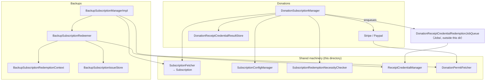

# Signal iOS — Subscriptions Subsystem

This document reconstructs Signal iOS's **Subscriptions** subsystem from the
first-party source in `SignalServiceKit/Subscriptions/`. The subsystem covers
two superficially-different-but-mechanically-similar product features:

1. **Donations** — one-time ("boost"), recurring ("subscription"), and "gift"
   donations paid via external processors (Stripe, Braintree/PayPal), which
   grant **profile badges**.
2. **Paid-tier Backups** — a recurring subscription paid via **StoreKit
   In-App Purchase (IAP)**, which grants a server-side **paid Backups
   entitlement** (the "media tier").

Both features share the same **zero-knowledge "subscriber ID"** anonymization
machinery, the same **receipt-credential** redemption protocol, and the same
periodic **renewal-necessity check**. The subsystem's job is to set up and pay
for subscriptions, keep them alive with the server, and periodically redeem the
server-issued **receipt credentials** that unlock the badge/entitlement without
linking the payment to the user's account.

> **Confidence labels.** Each claim is tagged:
> - **[High]** — directly read from source in this directory; behavior is
>   explicit in code.
> - **[Medium]** — inferred from code with reasonable certainty, but depends on
>   collaborators defined **outside** this directory (notably **LibSignalClient**
>   ZK operations, `DonationReceiptCredentialRedemptionJobQueue` in
>   `SignalServiceKit/Jobs/`, `BackupPlanManager`, `WhoAmIManager`,
>   `StorageServiceManager`, `OWSRequestFactory`, StoreKit, and the donations UI
>   that lives in the `Signal` app target).
> - **[Low]** — inferred from naming/comments; not fully verified in-tree.
>
> File+line citations refer to the tree at the time of writing. Line numbers are
> approximate anchors; use the cited symbol name to locate code if lines drift.
> Where the code does not reveal *why*, this is stated as "intent undetermined".

---

## Why there are two "subscription managers"

The subsystem is deliberately split around two different payment rails that
cannot share payment code:

| Concern | Donations | Paid Backups |
| --- | --- | --- |
| Orchestrator | `DonationSubscriptionManager` (`Donations/DonationSubscriptionManager.swift:68`) | `BackupSubscriptionManager` protocol / `BackupSubscriptionManagerImpl` (`Backups/BackupSubscriptionManager.swift:33`, `:144`) |
| Payment processor | Stripe (`STRIPE`) / Braintree (`BRAINTREE`) (`Donations/DonationPaymentProcessor.swift:8`) | Apple App Store / Google Play (`Backups/BackupPaymentProcessor.swift:8`) |
| Payment method mgmt | In-app UI (cancel in app) | iOS Settings / Apple ID (StoreKit) |
| Reward | Profile **badge** (`SubscriptionBadgeIds`, `BoostBadgeIds`, `GiftBadgeIds` — `DonationSubscriptionManager.swift:24-48`) | Server-side **paid-tier Backups entitlement** |
| ZK receipt level | donation levels | `201` paid / `200` free (`Backups/BackupSubscriptionRedeemer.swift:12-16`) |

The two managers are explicitly cross-referenced as "not to be confused with"
each other (`DonationSubscriptionManager.swift:62`,
`BackupSubscriptionManager.swift:18`). **[High]** They **share** the following
directory-local collaborators:

- `SubscriptionFetcher` / `Subscription` — fetch & model the server's view of a
  recurring subscription (`SubscriptionFetcher.swift:6`, `:71`).
- `SubscriptionConfigManager` — fetch & cache the server's subscription config
  (`SubscriptionConfigManager.swift:6`).
- `SubscriptionRedemptionNecessityChecker` — the generic "do we need to redeem?"
  state machine (`SubscriptionRedemptionNecessityChecker.swift:28`).
- `ReceiptCredentialManager` — the ZK receipt-credential request/parse/present
  operations (`ReceiptCredentials/ReceiptCredentialManager.swift:9`).
- `DonationPermitFetcher` / `DonationPermit` — ZK "donation permits", an input
  to several donation **and** Backups endpoints
  (`DonationPermitFetcher.swift:14`, `:94`).

---

## Directory map

| Path | Area | Notes |
| --- | --- | --- |
| `SubscriptionFetcher.swift` | `GET /v1/subscription/{id}` + the `Subscription` model | shared |
| `SubscriptionConfigManager.swift` | `GET /v1/subscription/configuration` + donation/backup config models | shared |
| `SubscriptionRedemptionNecessityChecker.swift` | generic renewal/heartbeat state machine | shared |
| `DonationPermitFetcher.swift` | ZK `DonationPermit` fetch + cache | shared |
| `ReceiptCredentials/` | `ReceiptCredentialManager`, `ReceiptCredentialRequestError` | shared ZK receipt ops |
| `Currencies/` | `Currency`, `CurrencyFormatter` | value types / formatting |
| `Donations/` | donation orchestration, Stripe/PayPal, stores, receipt model | the largest subfolder |
| `Backups/` | IAP orchestration, redeemer, context, issue store, TestFlight entitlement | paid-tier Backups |

No subfolder under `Subscriptions/` is tests, mocks, generated protobufs, or
asset catalogs — all are first-party production source. (A
`MockDisappearingMessagesConfigurationStore`-style testable shim is **not**
present here; a `TESTABLE_BUILD` precondition exists only inside
`Currencies/Currency.swift:40`.) **[High]**

---

## Shared machinery

### The `Subscription` model and `SubscriptionFetcher`

`SubscriptionFetcher.fetch(subscriberID:)` issues an **anonymous**
`GET v1/subscription/{base64url subscriberID}` and parses the JSON into a
`Subscription` (`SubscriptionFetcher.swift:17`, `:52`). **[High]**

- A `404` means "no subscription" and returns `nil` (`:24`). **[High]**
- The request is marked `.auth = .anonymous` and the subscriber ID is redacted
  from logs via `applyRedactionStrategy(.redactURL(...))` — the subscriber ID is
  an unlinkable, client-generated secret, so it must not be tied to the account
  or leaked in logs (`:56-60`). **[High]**

`Subscription` (`SubscriptionFetcher.swift:71`) models the server's view:
`level`, `amount` (`FiatMoney`), `endOfCurrentPeriod`, `active`,
`cancelAtEndOfPeriod`, `isPaymentProcessing`, an optional `ChargeFailure`, and a
`SubscriptionStatus` of `active` / `canceled` / `pastDue` / `unrecognized`
(`:90-130`). **[High]** The amount is divided by 100 unless the currency is a
"zero-decimal currency" (`:168-176`). **[High]** The `processor`/`paymentMethod`
fields are parsed against **both** the donation enums and the Backup enums; a
Backup-only value yields a `nil` donation processor/method rather than a failure
(`:183-205`). **[High]**

> **Status note (from doc comments).** A subscription stays `active` while the
> current period's payment succeeds; the server auto-cancels subscriptions whose
> client has not performed a "keep-alive" in ~30–45 days; `pastDue` means the
> processor is retrying a failed renewal, on the scale of days for up to ~2 weeks
> (`SubscriptionFetcher.swift:84-130`). **[High]**

### `SubscriptionConfigManager` — config fetch + cache

`refresh()` issues an anonymous `GET v1/subscription/configuration` with a
3-attempt backoff on network/5xx errors, parses **both** a
`DonationSubscriptionConfiguration` and a `BackupSubscriptionConfiguration` from
the one response body, and caches the raw body + fetch date in a `NewKeyValueStore`
collection `"SubscriptionConfiguration"` (`SubscriptionConfigManager.swift:34`,
`:40-70`). **[High]** A `ConcurrentTaskQueue(concurrentLimit: 1)` serializes
refreshes (`:20`, `:35`). **[High]**

- `donationConfiguration()` / `backupConfiguration()` prefer a cached body
  (default TTL **1 week**) and only `refresh()` on a miss (`:75-104`,
  `_cachedResponseBody` `:125-141`). **[High]**
- `backupConfigurationOrDefault(tx:)` is a **synchronous** accessor that ignores
  TTL and falls back to hard-coded defaults (`storageAllowanceBytes =
  100_000_000_000`, `freeTierMediaDays = 45`) when nothing is cached — for
  callers who need a non-optional value inside a transaction (`:109-121`).
  **[High]**
- `BackupSubscriptionConfiguration` is parsed from the `"backup"` object's level
  `"201"` (paid tier) (`:143-188`). **[High]**
- `DonationSubscriptionConfiguration` models boost/gift/subscription levels,
  per-currency preset amounts, minimums, the SEPA boost maximum, and
  per-currency supported payment methods, with a dedicated `ParseError` enum
  (`:216-371+`). **[High]**

### `SubscriptionRedemptionNecessityChecker` — the renewal/heartbeat engine

`SubscriptionRedemptionNecessityChecker<RedemptionJobContext>`
(`SubscriptionRedemptionNecessityChecker.swift:28`) is a generic struct
parameterized by four caller-supplied blocks (fetch subscription, parse
entitlement expiration, save redemption job, start redemption job) so donations
and Backups share one algorithm (`:29-50`). **[High]**

`redeemSubscriptionIfNecessary(...)` logic (`:98`): **[High]**

1. Bail if not registered (`:138`).
2. Bail if the last check was within **`intervalBetweenChecks = 3 days`**
   (`Constants`, `:46`; check at `:119`).
3. Fetch the subscription via the caller block; if missing, record the check
   time and bail (`:150-170`).
4. **Subscriber-ID heartbeat** — `performSubscriberIdHeartbeat` re-registers the
   subscriber ID with `OWSRequestFactory.setSubscriberID(_, donationPermit: nil)`
   so the server does not garbage-collect it (`:188`, `:293-307`). **[High]**
5. Decide if the subscription has **renewed since last redemption** by comparing
   the current entitlement expiration (via `WhoAmIManager.makeWhoAmIRequest()`)
   against `subscription.endOfCurrentPeriod`: if the subscription period ends
   *after* the entitlement expires, it has renewed; with no entitlement, redeem
   iff `subscription.active` (`:196-233`). **[High]**
6. If status is `.pastDue`, record the check and **do not** redeem (processor is
   still retrying) (`:235-250`). **[High]**
7. Otherwise, in a **single write transaction**, call the caller's
   `saveRedemptionJobBlock` *and* record the check time together; if a job was
   saved, start it (`:252-275`). **[High]**

### `ReceiptCredentialManager` — the ZK receipt-credential protocol

`ReceiptCredentials/ReceiptCredentialManager.swift:9` wraps LibSignalClient's
`ClientZkReceiptOperations` (built from `GroupsV2Protos.serverPublicParams()` —
`:181`). It is "part of redeeming all zero-knowledge subscriptions (donations
and Backups)" (`:8`). **[High]**

- `generateReceiptRequest()` creates a random `ReceiptSerial` and a
  request/context pair **entirely on-device**; failure is treated as
  unrecoverable and `owsFail`s (`:34-48`, `:174-178`). **[High]**
- `requestReceiptCredential(via:isValidReceiptLevelPredicate:context:)` sends a
  caller-provided `TSRequest`, then validates the response: `204` → throw
  `.paymentStillProcessing`; `200` → parse the `receiptCredentialResponse` and
  `receiveReceiptCredential`; validate the **receipt level** against the
  predicate, that **expiration % 86400 == 0** (server spec), and that expiration
  is **< 90 days** out (`:52-137`). **[High]**
- `generateReceiptCredentialPresentation(receiptCredential:)` turns the
  credential into a presentation that is redeemed with the server; the
  presentation carries no account-linkable data (ZK). **[Medium — relies on
  LibSignalClient semantics]** (`:26-32`).
- Server/processor error codes are mapped to `ReceiptCredentialRequestError`
  (`ReceiptCredentials/ReceiptCredentialRequestError.swift:7`): `204` still
  processing, `402` payment failed (+ optional charge-failure code), `400`
  server validation, `404` not found, `409` payment intent already redeemed,
  plus a local `1` validation code (`:7-16`). **[High]**

### `DonationPermitFetcher` — ZK donation permits

`DonationPermitFetcher.swift:14` fetches `DonationPermit`s via
`POST v1/donation/permit`, using LibSignal `DonationPermitRequestContext` /
`DonationPermitResponse` verified against `ServerPublicParams`
(`:40-85`). **[High]** It requests **3 permits at a time**, caches the extras,
and reuses a cached permit only while it has **> 1 hour** of validity left
(`:48-62`). **[Medium — ZK verification is LibSignal-internal]** A
`ConcurrentTaskQueue(concurrentLimit: 1)` guards the cache (`:28`). The header
comment notes these are also a dependency for some **Backups** APIs despite the
"Donation" name (`:7-11`). **[High]**

### Currencies

`Currencies/Currency.swift` is a value namespace: `Currency.Code` (a `String`),
`Info` (code + localized name), and a hard-coded symbol table
(`Symbol.for(currencyCode:)`) covering ~13 currencies with a
`currencyCode`-fallback (`:48-78`). **[High]**
`Currencies/CurrencyFormatter.swift` formats a `FiatMoney` using
`Decimal.FormatStyle.Currency`, choosing 0 or 2 fraction digits based on
zero-decimal currencies / integer values (`:7-33`). **[High]**

---

## Donations (`Donations/`)

### `DonationSubscriptionManager` — the donations orchestrator

`DonationSubscriptionManager` (`DonationSubscriptionManager.swift:68`) owns
one-time and recurring donation flows and the resulting profile badges. **[High]**

**Persistence.** A `KeyValueStore(collection: "SubscriptionKeyValueStore")` holds
donation state keyed by the string constants at `:74-100`: `subscriberID`,
`subscriberCurrencyCode`, `subscriptionExpiration`, `subscriptionHeartbeat`,
`userManuallyCancelledSubscription`, `displayBadgesOnProfile`, several
`known*BadgeIDs` arrays, `mostRecentlyExpired(Gift)BadgeID`,
`showExpirySheetOnHomeScreen`, and `mostRecentSubscriptionPaymentMethod`
(getters/setters at `:528+`). **[High]** The collection name is deliberately
reused by other donation stores (`:72`). **[High]**

**Recurring subscription lifecycle.** **[High]**

- `prepareNewSubscription(currencyCode:)` → `setupNewSubscriberID()` generates a
  **random 32-byte subscriber ID**, fetches a `DonationPermit`, registers it via
  `OWSRequestFactory.setSubscriberID`, resets local flags, and records pending
  Storage Service updates (`:159-180`, `:243-266`). **[High]**
- `finalizeNewSubscription(...)` sets the default payment method (IDEAL vs
  Stripe/PayPal/Apple Pay/SEPA/card paths), stores the most-recent payment
  method, then `setSubscription(...)` selects the level with a random
  **idempotency key** and re-fetches the resulting `Subscription`
  (`:184-227`, `:300-345`). **[High]**
- `updateSubscriptionLevel(...)` reuses `setSubscription(...)` (`:231-242`).
- `cancelSubscription(for:)` issues `OWSRequestFactory.deleteSubscriberID`
  (accepting `200`/`404`), clears local subscriber state, marks
  `userManuallyCancelledSubscription = true`, and clears any stored
  recurring-subscription receipt results (`:245-272`). **[High]**

**One-time ("boost") and gift.** `requestAndRedeemReceipt(boostPaymentIntentId:…)`
and the gift path save a boost redemption job and run it (`:378-406`). The
actual Stripe/PayPal payment is handled by `Stripe` / `Paypal` (below), and the
`SendGiftBadgeJobQueue` for gifts (`DonationUtilities.swift:9`). **[High]**

**Receipt redemption** is delegated to the **`DonationReceiptCredentialRedemptionJobQueue`**
(a durable job queue in `SignalServiceKit/Jobs/`, lazily resolved from
`SSKEnvironment` to break a dependency cycle — `:103-105`). `requestAndRedeemReceipt(...)`
generates a receipt request, saves a subscription/boost redemption job in a
write transaction, then `runRedemptionJob(...)` (`:346-406`). **[High]**
`redeemReceiptCredentialPresentation(...)` performs the final
`OWSRequestFactory.subscriptionRedeemReceiptCredential(..., displayBadgesOnProfile:)`
and re-fetches the local profile (`:408-430`). **[High]**

**Heartbeat.** `redeemSubscriptionIfNecessary()` builds a
`SubscriptionRedemptionNecessityChecker<DonationReceiptCredentialRedemptionJobRecord>`
with a `CheckerStore` backed by the KVS heartbeat key, a
`fetchSubscriptionBlock` using the stored subscriber ID, a
`parseEntitlementExpirationBlock` that selects the **last-expiring subscription
badge entitlement** from `whoAmI`, and a `saveRedemptionJobBlock` that skips
enqueuing when a job already exists for that subscriber ID (to avoid two jobs
stepping on each other during long "processing" windows, e.g. SEPA)
(`:432-535`). **[High]**

**Badges / Storage Service.** `currentProfileSubscriptionBadges(tx:)` and
`probablyHasCurrentSubscription(tx:)` read the local profile's badges
(`:120-134`). `setDisplayBadgesOnProfile` / `setUserManuallyCancelledSubscription`
optionally call `storageServiceManager.recordPendingLocalAccountUpdates()` so
the setting syncs across devices (`:559-586`). **[High]** The subsystem is read
by `StorageServiceProto+Sync.swift` and backed up by
`BackupArchiveAccountDataArchiver.swift` (see cross-references below). **[Medium
— those files live outside this directory]**

### Payment processors: Stripe & PayPal

`Donations/Stripe.swift` implements the Stripe flow for **boosts** and
**subscription payment-method setup**, with a documented 5-step boost pipeline
(start → create intent → tokenize → create PaymentMethod → confirm) in the type
header (`Stripe.swift:9-23`, `boost(...)` `:36`, `createBoostPaymentIntent`
`:58`). Boost intents carry a `DonationPermit` (`:63-73`). **[High]** Supporting
files: `Stripe+Subscriptions.swift` (create Signal payment method + setup intent
for subscriptions, `:7-62`), `Stripe+PaymentMethod.swift`, `Stripe+3DSecure.swift`,
`Stripe+IDEAL.swift`, `Stripe+StripeError.swift`. **[High]**

`Donations/Paypal.swift` is an empty namespace (`:8`) extended by
`Paypal+API.swift` (`createBoost` returns a PayPal approval URL + payment ID;
`confirmOneTimePayment`) and `Paypal+WebAuthentication.swift` (ASWebAuth-based
approval UI, approval/cancel URL params). **[High]** PayPal maps to the
`braintree` processor (`DonationPaymentProcessor.swift:12`). **[High]**

`DonationUtilities.swift` decides which payment methods are available for a
given `DonationMode`/currency using `RemoteConfig` region/feature flags and
`PKPaymentAuthorizationController.canMakePayments()` for Apple Pay
(`:11-70+`), computes integral amounts, holds preset models, and exposes the
`SendGiftBadgeJobQueue` (`:9`). **[High]**

### Donation value types & stores

- `DonationPaymentProcessor` — `STRIPE` / `BRAINTREE` (`:8`). **[High]**
- `DonationPaymentMethod` — `applePay`, `creditOrDebitCard`, `paypal`, `sepa`,
  `ideal`; **raw values are on-disk persisted**, while `init(serverRawValue:)`
  parses the *different* server format (`CARD`, `PAYPAL`, `SEPA_DEBIT`, `IDEAL`),
  with Apple Pay returned by the server as a card (`DonationPaymentMethod.swift:14-47`).
  **[High]**
- `DonationMode` — `oneTime` / `monthly` / `gift` (`:9-16`). **[High]**
- `DonationSubscriptionLevel` — `level` + `ProfileBadge` + per-currency amounts,
  `Comparable` by level (`:9-37`). **[High]**
- `DonationReceipt` — a **GRDB `SDSCodableModel`** (`model_DonationReceipt`
  table) recording a completed donation (`boost` / `subscription(level)` /
  `gift`) with a legacy-tolerant decoder for the pre-`receiptType` format
  (`DonationReceipt.swift:11`, `:72-105`). **[High]**
- `DonationReceiptFinder` — raw-SQL `hasAny` and `fetchAllInReverseDateOrder`
  over that table (`:7-28`). **[High]**
- `DonationReceiptCredentialResultStore` — persists per-`Mode` (`oneTimeBoost`,
  `recurringSubscriptionInitiation`, `recurringSubscriptionRenewal`) the latest
  **error** / **success** of a receipt-credential redemption plus whether it has
  been **presented** to the user, across four KeyValueStores
  (`DonationReceiptCredentialResultStore.swift:7-230`). **[High]** The persisted
  payloads are `DonationReceiptCredentialRequestError`
  (`DonationReceiptCredentialRequestError.swift:7` — Codable, legacy-tolerant
  badge decoding) and `DonationReceiptCredentialRedemptionSuccess`
  (`DonationReceiptCredentialRedemptionSuccess.swift:11` — carries a
  `ProfileBadgesSnapshot` taken *before* the job ran, for diffing new badges).
  **[High]**
- `ProfileBadgesSnapshot` (`:7`) + `+Constructors.swift` — a Codable snapshot of
  `{id, isVisible}` badges. **[High]**
- `PreparedGiftPayment` — a Stripe-or-PayPal gift payment ready to send (`:8`).
  `PreparedGiftPayment.swift`. **[High]**
- `PendingIDEALDonationStore` — persists an in-flight **IDEAL** donation
  (one-time or monthly) across the external bank-redirect round-trip, in
  collection `"PendingExternalDonationStore"`, with legacy-tolerant decoding of
  subscription levels (`PendingIDEALDonationStore.swift:9-200`). **[High]** IDEAL
  is a redirect-based method, so the client must remember what it was doing while
  the user is off in their banking app.

---

## Paid-tier Backups (`Backups/`)

### `BackupSubscriptionManager` — the IAP orchestrator

`BackupSubscriptionManager` (protocol, `BackupSubscriptionManager.swift:33`;
impl `BackupSubscriptionManagerImpl` `:144`) owns the StoreKit purchase and the
redemption of the resulting IAP subscription for a paid-tier Backups
entitlement. **[High]** Key points from the protocol doc comments: a subscription
may only be *started* on a primary, but the primary that started it may be a
different (even Android) device, so the manager must tolerate "restored"
subscriber data (`:14-23`, `:40-45`). **[High]**

- `IAPSubscriberData` bundles a client-generated, account-**un**linked
  `subscriberId` with an `IAPSubscriptionId` that is either a StoreKit
  `originalTransactionId` or an Android `purchaseToken`
  (`:84-120`). **[High]**
- `purchaseNewSubscription()` drives the StoreKit purchase (product id
  `"backups.mediatier"`, which "must not change" — `:146-149`) and returns
  `success` / `pending` / `userCancelled` (`:122-146`). **[High]**
- The impl observes StoreKit `Transaction.updates` (`listenForTransactionUpdates`)
  and logs startup state comparing the latest entitling StoreKit transaction to
  the locally-stored `IAPSubscriberData` and `BackupPlan`
  (`:170-220`). **[Medium — StoreKit + `BackupPlanManager` are external]**
- `fetchAndMaybeDowngradeSubscription()` can **downgrade the local `BackupPlan`**
  based on remote state (`:30-34`). **[Medium — `BackupPlanManager` external]**
- `redeemSubscriptionIfNecessary()` is serialized, idempotent, and returns
  quickly when nothing needs redeeming; `setRedemptionAttemptIsNecessary(tx:)`
  flags a redeem on external state change (`:60-82`). **[High]**

### `BackupSubscriptionRedeemer` + `BackupSubscriptionRedemptionContext`

`BackupSubscriptionRedeemer` (`Backups/BackupSubscriptionRedeemer.swift:9`) runs
the two-request ZK redemption as a **persisted state machine**, mirroring the
donation flow but writing paid-tier Backups entitlement rather than a badge.
**[High]**

The state lives in `BackupSubscriptionRedemptionContext`
(`Backups/BackupSubscriptionRedemptionContext.swift:7`), a `Codable` persisted in
the `NewKeyValueStore` collection `"BackupSubscriptionRedemptionContext"`
(`:72-104`). Its `RedemptionAttemptState` is `unattempted` →
`receiptCredentialRequesting(request, context)` →
`receiptCredentialRedemption(credential)` (`:30-53`). The context must be
persisted between the two network requests so an app exit mid-flow can resume
with the **same** inputs — once a receipt-credential request has hit the server,
remote state may have changed and only identical retries are safe
(`:9-28`). **[High]**

`_redeemBackupReceiptCredential(context:)` (`:191`) walks the state machine
(`:197`): generate request → request credential (accepting receipt level `200`
**or** `201` to tolerate clock skew, `:235-250`) → generate presentation →
`POST v1/archives/redeem-receipt`, expecting `204`
(`BackupSubscriptionRedeemer.swift:1011-1038` request builder; redemption at
`:300-360`). **[High]**

The outer `redeem(context:)` (`:95`) maps results to retry policy: **[High]**

- `success` → delete the context; if local `BackupPlan` is `.free`, upgrade to
  `.paid(optimizeLocalStorage: false)` (never auto-enable from `.disabled`/
  `.disabling`); clear cached Backup auth credentials via
  `authCredentialStore.removeAllBackupAuthCredentials`; clear IAP warning flags
  (`:100-146`). **[High]**
- `needsReattempt` → retry immediately; `paymentStillProcessing` → retry after an
  **exponential backoff** (`waitForIncrementedExponentialRetry`, max avg
  `.day`, `:77-93`); `networkError` → retry after an **interruptible** wait that
  is cancelled when reachability returns (`:148-166`, reachability observer
  `:57-68`). **[High]**
- `redemptionUnsuccessful` → delete the context and throw a terminal error
  (`:168-173`). A `409 paymentIntentRedeemed` is treated as terminal and records
  an "already redeemed" warning — the most likely cause being multiple Signal
  accounts sharing one IAP subscription (`:255-285`). A `400` on redemption means
  an expired presentation; the context resets to `unattempted` and retries
  (`:330-350`). **[High]**

### `BackupSubscriptionIssueStore` — user-facing issue flags

`Backups/BackupSubscriptionIssueStore.swift:11` persists (in collection
`"BackupSubscriptionIssueStore"`) a family of boolean/date "should warn" flags
driving chat-list badges, menu items, and sheets for: failed-to-renew,
already-redeemed, not-found-locally, expiring-soon (two staged warnings), expired,
and **TestFlight** expired (`:14-45`, accessors throughout). **[High]** Several
setters post `NotificationCenter` notifications
(`.backupSubscriptionAlreadyRedeemedDidChange`,
`.backupIAPNotFoundLocallyDidChange`) via `tx.addSyncCompletion` so UI refreshes
after the write commits (`:7-9`, `:142-150`). **[High]** The "expiring soon"
schedule warns at `max(3 days, halfway-to-expiry)` out and again 2 days out
(`:230-245`). **[High]**

### `BackupTestFlightEntitlementManager`

`Backups/BackupTestFlightEntitlementManager.swift:14` grants paid-tier Backup
entitlements to **TestFlight** builds that cannot use StoreKit real-money
transactions, gated on `BuildFlags.Backups.avoidStoreKitForTesters`
(`:76-78`). It uses **App Attest** (`AppAttestManager` over `DeviceCheck`) to
prove app integrity when acquiring the entitlement, skipping entirely on Staging
(where accounts get the entitlement automatically) (`:40-90+`). **[High]** It
exposes `setRenewEntitlementIsNecessary(tx:)` / `renewEntitlementIfNecessary()`
and tracks `lastEntitlementRenewalDate` in a KeyValueStore (`:9-20`). **[High]**

`BackupPaymentProcessor` / `BackupPaymentMethod` are the `APPLE_APP_STORE` /
`GOOGLE_PLAY_BILLING` enums the server uses (`:8`). **[High]**

---

## Cryptography & networking considerations

- **Subscriber IDs are account-unlinked secrets.** Donation and IAP subscriber
  IDs are **random 32-byte** values generated on-device
  (`DonationSubscriptionManager.swift:249`, `setupNewSubscriberID`), registered
  with the server anonymously, used in `.auth = .anonymous` requests, and
  **redacted from logs** (`SubscriptionFetcher.swift:56-60`). They are explicitly
  *not* associated with the account (`BackupSubscriptionManager.swift:98-103`).
  **[High]** This is the core privacy property: payment ↔ account cannot be
  linked by the server.
- **Receipt credentials are zero-knowledge.** Redemption uses LibSignalClient
  `ClientZkReceiptOperations` and server public params; the client generates a
  random `ReceiptSerial`, requests a credential, and presents a
  `ReceiptCredentialPresentation` that unlocks the badge/entitlement without
  revealing the subscriber ID↔account link
  (`ReceiptCredentialManager.swift:174-181`, `:26-48`). **[Medium — ZK math is in
  LibSignal]** Receipt level and expiration are validated client-side
  (`% 86400 == 0`, `< 90 days`) (`:120-137`). **[High]**
- **Donation permits** are a separate LibSignal ZK artifact
  (`DonationPermitRequestContext` / `DonationPermitResponse`, verified against
  `ServerPublicParams`) required to create subscriber IDs and some boost/payment
  endpoints (`DonationPermitFetcher.swift:40-85`). **[High]**
- **Two-request redemption must be crash-safe.** Both donations and Backups
  persist intermediate redemption state (the donation job record in the Jobs
  queue; `BackupSubscriptionRedemptionContext` here) so that an interruption
  between "request credential" and "redeem credential" can resume with identical
  inputs (`BackupSubscriptionRedemptionContext.swift:9-28`). **[High]**
- **Keep-alive / renewal cadence.** The server reclaims idle subscriber IDs, so
  the client must heartbeat; the `NecessityChecker` checks at most once per **3
  days** and heartbeats the subscriber ID each time (`SubscriptionRedemptionNecessityChecker.swift:46`,
  `:293-307`). **[High]**
- **Retry policy.** Subscription-config and most donation/backup requests use
  `.hopefullyRecoverable` or a 3-attempt backoff on network/5xx; the Backups
  redeemer additionally backs off exponentially on "still processing" and waits
  interruptibly for reachability on network errors
  (`SubscriptionConfigManager.swift:49-54`, `BackupSubscriptionRedeemer.swift:77-166`).
  **[High]**
- **StoreKit vs external processors.** Backups payments go through Apple IAP
  (managed in iOS Settings), while donations go through Stripe/Braintree with
  in-app management and, for IDEAL/PayPal/3DSecure, external web-redirect
  round-trips whose in-flight state is persisted (`PendingIDEALDonationStore`,
  `Paypal+WebAuthentication.swift`). **[High]**

---

## Interactions with the rest of SignalServiceKit and the app

- **Durable jobs (`SignalServiceKit/Jobs/`).** Donation receipt redemption runs
  on `DonationReceiptCredentialRedemptionJobQueue` (resolved from
  `SSKEnvironment`, `DonationSubscriptionManager.swift:103-105`). **[High]**
- **Dependency wiring (`Environment/AppSetup.swift`).** `SubscriptionConfigManager`,
  `DonationPermitFetcher`, `DonationReceiptCredentialResultStore`,
  `DonationSubscriptionManager`, `BackupSubscriptionIssueStore`,
  `BackupSubscriptionManagerImpl` (with its `BackupSubscriptionRedeemer`), and
  `BackupTestFlightEntitlementManagerImpl` are all constructed in `AppSetup`
  (`AppSetup.swift:441`, `:461`, `:504-529`, `:1298-1306`) and exposed via
  `SSKEnvironment` / `DependenciesBridge`. **[High — verified by grep]**
- **Backups plan/entitlement.** The Backups redeemer and manager drive
  `BackupPlanManager` (free↔paid transitions) and clear `AuthCredentialStore`
  Backup credentials; `BackupAuthCredentialManager` consumes the resulting
  entitlement (`BackupSubscriptionRedeemer.swift:102-140`;
  `ZeroKnowledge/BackupAuthCredentialManager.swift`). **[Medium — those live
  outside this directory]**
- **Storage Service & Backups export.** Donation/subscription settings
  (display-badges, manually-cancelled, subscriber data) sync via
  `StorageServiceManager.recordPendingLocalAccountUpdates()` and are
  read/written by `StorageServiceProto+Sync.swift` and
  `BackupArchiveAccountDataArchiver.swift`; `AppSetup` wraps
  `DonationSubscriptionManager` for the Backup archiver
  (`AppSetup.swift:1562`). **[Medium — those files are outside this directory]**
- **Registration.** `RegistrationStateChangeManagerImpl` references the Backups
  subscription managers (likely to re-check redemption/entitlement on
  registration-state changes). **[Low — not read in full]**
- **App UI (`Signal`/`SignalUI` targets).** The donations settings and
  purchase/badge UI live outside SignalServiceKit and consume this subsystem's
  public API (fetch/finalize/cancel subscription, request-and-redeem receipts,
  issue flags). **[Low — UI not in this directory]**
