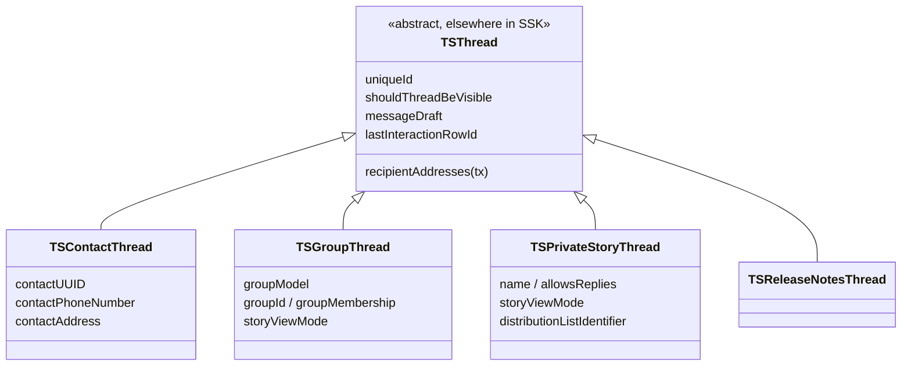

# Threads

Covers `SignalServiceKit/Threads/`:

- `TSContactThread.swift`
- `TSGroupThread.swift` / `TSGroupThread+OWS.swift`
- `TSPrivateStoryThread.swift`
- `TSReleaseNotesThread.swift`
- `TSThread+OWS.swift`
- `ThreadStore.swift`
- `ThreadRemover.swift`
- `ThreadDeletionManager.swift`
- `PrivateStoryThreadDeletionManager.swift`
- `LastVisibleInteractionStore.swift`
- `BannerHidingStore.swift`

A **thread** is the top-level container for a conversation. Every message
([Interactions](../README.md)) belongs to exactly one thread via its
`uniqueThreadId`. This folder holds the concrete `TSThread` subclasses, the
read/write access layer (`ThreadStore`), and the two deletion pathways
("soft" delete via `ThreadDeletionManager` vs. "hard" delete via
`ThreadRemover`), plus a few small per-thread key/value stores.

> **Note.** The abstract base class `TSThread` itself is **not** in this folder
> (it lives elsewhere in SSK). This folder documents the subclasses and the
> management/store types that operate on threads. Claims about base-class
> behavior are labeled accordingly.

> **Confidence labels** follow the repo convention:
> - **HIGH** — the file was read in full and the claim is directly supported by the code.
> - **MEDIUM** — derived from signatures / partial reads / cross-file inference.
> - **LOW** — an educated inference not fully verified in-source.
>
> Citations are `File.swift:line` at authoring time; line numbers may drift.

---

## The thread type hierarchy



Each subclass sets a distinct `recordType` (a `TSThreadType`), which is how SDS
persistence disambiguates the single `TSThread` SQLite table into the right
subclass on fetch — `TSContactThread.swift:10`, `TSGroupThread.swift:16`,
`TSPrivateStoryThread.swift:11`, `TSReleaseNotesThread.swift:10`. Confidence:
HIGH (declared in-file); MEDIUM on the SDS dispatch mechanism (defined
elsewhere).

### `TSContactThread` — `TSContactThread.swift:9`
Confidence: HIGH (read in full). A 1:1 conversation with a single recipient.

- **Columns.** `contactUUID` (an **uppercase ServiceId string**, not necessarily
  a valid UUID despite the name — `:16`) and `contactPhoneNumber` (`:17`).
  `contactAddress` (`:151`) reconstructs a `SignalServiceAddress` from the two.
- **Recipients.** `recipientAddresses(with:)` returns just `[contactAddress]`
  (`:155`). `isNoteToSelf` is true when `contactAddress.isLocalAddress` (`:159`).
- **Get-or-create.** `getOrCreateThread(withContactAddress:transaction:)` (`:198`)
  looks up via `ContactThreadFinder` and inserts if absent; there's a
  convenience read-then-write variant that opens its own transactions (`:214`),
  and `getWithContactAddress` (`:232`) which never creates. `getOrCreateLocalThread`
  (`:184`/`:188`) resolves the local user's ACI address for the Note-to-Self
  thread.
- **Construction** normalizes the input address via
  `NormalizedDatabaseRecordAddress` (`:175`) so the stored service-id string is
  canonical uppercase.
- **Storage Service.** `recordPendingUpdates(storageServiceManager:)` records a
  pending **contact** update for `contactAddress` (`:143`). Confidence: MEDIUM
  (collaborator defined elsewhere).

### `TSGroupThread` — `TSGroupThread.swift:14`
Confidence: HIGH (read in full). A group conversation; wraps a `TSGroupModel`.

- **Model storage.** `groupModel` is serialized/deserialized through
  `LegacySDSSerializer` as opaque `Data` in the `groupModel` column
  (`:27`, `:34`) — i.e. it is **not** a normalized relational column.
- **Identity helpers** (in `TSGroupThread+OWS.swift`): `groupId` (`:10`),
  `groupMembership` (`:13`), and unique-id derivation. The canonical uniqueId
  is resolved from the group id via `GroupStore` (`threadUniqueId(forGroupIdData:tx:)`,
  `TSGroupThread+OWS.swift:22`); `defaultThreadUniqueId` (`:41`) is the legacy
  `"g" + base64(groupId)` form. Confidence: HIGH; MEDIUM on `GroupStore`
  (defined elsewhere — see [Groups](../Groups/README.md)).
- **Recipients.** `recipientAddresses(with:)` returns group members **minus the
  local user** (`:146`).
- **Updating the model** — `update(with:transaction:)` (`:192`): asserts V2
  revision monotonicity and forbids V2→V1 downgrades (`:204`), copies in the new
  model, re-derives `TSGroupMember` records (`updateGroupMemberRecords`), clears
  group-send-endorsements when membership changed
  (`clearGroupSendEndorsementsIfNeeded`, `:257`), `touch`es the thread
  (reindexing search only if the name changed), and posts
  `.TSGroupThreadAvatarChanged` on avatar change via `tx.addSyncCompletion`
  (`:223`). Confidence: HIGH.
- **Membership-change notification.** `membershipDidChange`
  (`TSGroupThread+OWS.swift:53`) is posted by object identity (the uniqueId
  string); observers must register broadly and filter. Confidence: HIGH
  (documented in-file).
- **Story send mode.** `storyViewMode` is `.explicit` / `.disabled` / `.default`;
  `updateWithStorySendEnabled` (`:283`) maps the bool to a view mode, optionally
  records a Storage Service group update, and un-hides the story context when
  enabling. `TSThreadStoryViewMode` <-> `StorageServiceProtoGroupV2RecordStorySendMode`
  conversion is at `:434`/`:449`. Confidence: HIGH; MEDIUM on Storage Service /
  Story collaborators.
- **Interaction bookkeeping.** `updateWithInsertedInteraction` (`:330`) stamps the
  sender's `TSGroupMember.lastInteractionTimestamp` (used for member ordering).
- **Hard-delete eligibility.** `canBeDeleted(localIdentifiers:)` (`:161`) returns
  false while the local user is still any kind of member of a non-terminated V2
  group (see `ThreadDeletionManager`).

### `TSPrivateStoryThread` — `TSPrivateStoryThread.swift:10`
Confidence: HIGH (read in full). A **story distribution list** (not a chat).

- **Columns.** `name` and `allowsReplies` (`:13`/`:14`); the `addresses` coding
  key is always encoded as `nil` (`:34`) — recipients live elsewhere (via
  `storyRecipientManager`).
- **"My Story"** is the distinguished list with the all-zero uniqueId (`:155`);
  `getOrCreateMyStory` (`:163`) creates it in `.blockList` view mode, and `name`
  returns a localized "My Story" string for it (`:145`).
- **`distributionListIdentifier`** (`:174`) is the uniqueId's UUID as `Data` — the
  key used by Storage Service and by `PrivateStoryThreadDeletionManager`.
- **Recipients** (`:177`) depend on `storyViewMode`: `.explicit`/`.disabled`
  resolve from `storyRecipientManager`; `.blockList` returns the whitelisted
  address set *minus* the blocked recipients and the local user; `.default` is
  invalid for a private story. Confidence: HIGH; MEDIUM on the recipient-manager
  collaborator.
- **Mutators** (`updateWithAllowsReplies`/`updateWithName`/`updateWithStoryViewMode`,
  `:197`/`:213`/`:240`) persist and (optionally) record a pending Storage Service
  *distribution-list* update, deferring it to `tx.addSyncCompletion` for view-mode
  changes. `updateWithStoryViewMode` also sets the one-time "has set My Story
  privacy" flag for My Story unless the caller opts out (Backups) (`:240`).

### `TSReleaseNotesThread` — `TSReleaseNotesThread.swift:8`
Confidence: HIGH (read in full). The singleton Signal "Release Notes" chat.
Fixed uniqueId `00000000-0000-5000-8000-00000000000A` (`:13`). `createReleaseNotes`
(`:17`) inserts it hidden (`shouldThreadBeVisible = false`) and muted forever
(`alwaysMutedTimestamp`). It has **no** recipients (`:61`) and records pending
updates as a **local account** Storage Service update (`:56`).

### Cross-cutting `TSThread` extensions — `TSThread+OWS.swift`
Confidence: HIGH (read in full). Objective-C-visible predicates and draft access
layered onto the base class:

- **Type/capability predicates** (`:11`): `isGroupThread`, `isGroupV1Thread`,
  `isGroupV2Thread`, `isReleaseNotesThread`, `canSendChatMessagesToThread(...)`
  (false for GV1, announcement-only non-admins, terminated groups, and the
  release-notes thread — `:52`), `isBlockedByAnnouncementOnly` (`:72`),
  `isSystemContact(...)` (`:98`).
- **Group-member state** (in `TSGroupThread+OWS.swift:68`):
  `isLocalUserFullMemberOfThread`, `isTerminatedGroup`.
- **Drafts** (`:116`): `currentDraft(...)` builds a `MessageBody` from the stored
  `messageDraft` + `messageDraftBodyRanges`; `editTarget(...)` (`:144`) resolves the
  in-progress edit's outgoing message by timestamp.
- **Search indexing** (`:105`): `_anyDidInsert` registers the thread with the
  `searchableNameIndexer`. Confidence: MEDIUM (indexer defined elsewhere).

---

## `ThreadStore` — the access layer — `ThreadStore.swift:7`
Confidence: HIGH (read in full). A protocol over thread persistence so callers
don't touch SDS/GRDB directly; `ThreadStoreImpl` (`:118`) delegates to finders
(`ThreadFinder`, `ContactThreadFinder`) and the model cache.

Responsibilities:

- **Enumeration** by category: `enumerateNonStoryThreads`, `enumerateStoryThreads`,
  `enumerateGroupThreads` (group threads in last-interaction order), each with an
  early-exit `block` returning `Bool` (`:12`–`:31`).
- **Fetch**: by rowId / uniqueId / `ServiceId` / phone number / group-id data
  (`:32`–`:37`). Convenience extensions add typed `fetchGroupThread(uniqueId:)`
  (`:80`), `fetchThread(forGroupId:)` (`:76`), `fetchThreadForInteraction` (`:110`),
  and `fetchContactThread(recipient:)` (`:98`) which routes through
  `UniqueRecipientObjectMerger` to collapse ACI/PNI/phone duplicates into the one
  canonical contact thread. Confidence: HIGH; MEDIUM on the merger collaborator.
- **Create**: `getOrCreateContactThread`, `getOrCreateLocalThread`, and a static
  `insertGroupThread(groupRecord:groupModel:tx:)` (`:170`) that inserts the thread
  and back-links the new rowId onto a `GroupRecord`.
- **Update**: generic `updateThread` (overwriting), plus targeted setters for
  visibility, archive state, group-model, and group story-send — several of which
  take an `updateStorageService` flag so callers can suppress echoing a change
  back to Storage Service.
- **Remove**: `removeThread` issues a raw `DELETE ... WHERE uniqueId = ?` (`:184`).
  This is the low-level row delete used by `ThreadRemover`; most callers should go
  through the deletion managers below.
- **Message requests**: `hasPendingMessageRequest` (delegates to `ThreadFinder`).

A `MockThreadStore` (in-memory, `#if TESTABLE_BUILD`, `:234`) mirrors the protocol
for unit tests. Confidence: HIGH.

---

## Deletion: soft vs. hard

The app's deliberate design is to **never delete the `TSThread` record** for a
normal user-initiated "delete conversation" — it only strips the contents, so the
thread can be reused if the conversation resumes. Hard deletion (removing the row)
happens only in narrow cases.

```mermaid
flowchart TD
    user[user deletes conversation] --> TDM[ThreadDeletionManager.deleteThreads]
    TDM --> rmInt[removeAllInteractions<br/>batched 500 at a time]
    TDM --> unpin[PinnedThreadManager.unpinThread]
    TDM --> stories[StoryManager.deleteAllStories]
    TDM --> intents[delete Siri INIntents]
    TDM --> decide{shouldHardDeleteThread?}
    decide -- "no (default)" --> soft[clear draft + shouldThreadBeVisible=false<br/>remove ThreadReplyInfo]
    decide -- "yes (left group /<br/>private story)" --> TR[ThreadRemover.remove]
    TR --> row[ThreadStore.removeThread<br/>DELETE row]
    TR --> obs[notify ThreadRemoverObserver(s)]
    TDM --> sync[DeleteForMe outgoing sync message]
```

### `ThreadDeletionManager` ("soft delete") — `ThreadDeletionManager.swift:22`
Confidence: HIGH (read in full). The type most callers want; UI code should
usually go through `DeleteForMeInfoSheetCoordinator` in the Signal target
(`:19`). API:

- **`deleteThreads(_:sendDeleteForMeSyncMessage:updateStorageService:localIdentifiers:tx:)`**
  (`:84`) — per thread, optionally builds a `DeleteForMe` outgoing-sync
  "thread deletion context", calls the private `deleteThread`, then sends one
  batched sync message for all contexts.
- **`removeAllInteractions(thread:deleteForMeSyncMessagePolicy:tx:)`** (`:125`) —
  clears a thread's messages without the full delete (used to "clear chat
  history"), with an optional `DeleteForMe` sync.
- **`removeIntentsForTerminatedGroup(threadUniqueId:)`** (`:157`) — drops Siri
  donations for a terminated group.

Private `deleteThread` (`:162`) does the real work: `removeAllInteractions` →
unpin → **decide** via `shouldHardDeleteThread` (`:203`): hard-delete only if the
group `canBeDeleted` (local user no longer a member) or it's a
`TSPrivateStoryThread`; otherwise **soft**-delete by nulling the draft and setting
`shouldThreadBeVisible = false` and removing the reply-info. It then deletes the
peer's/group's stories and Siri intents.

`removeAllInteractions` (private, `:214`) deletes interactions in batches of
`interactionDeletionBatchSize = 500` (`:46`) inside `autoreleasepool`s via
`InteractionFinder` + `InteractionDeleteManager`, registering each `TSMessage`
into the sync context, **suppressing** per-interaction thread updates
(`.doNotUpdate`), then doing a single final reset of the thread's
`lastInteractionRowId` / draft bookkeeping to `0` (`:257`). Confidence: HIGH;
MEDIUM on `InteractionDeleteManager` / `DeleteForMeOutgoingSyncMessageManager`
(defined elsewhere). `MockThreadDeletionManager` exists under `TESTABLE_BUILD`
(`:316`).

### `ThreadRemover` ("hard delete") — `ThreadRemover.swift:13`
Confidence: HIGH (read in full). An implementation detail (comment at `:10`
explicitly points colloquial callers to `ThreadDeletionManager`). `remove(_:tx:)`
(`:60`) performs the full teardown of everything keyed by the thread before the
row delete:

1. clear chat-color setting
2. `databaseStorage.updateIdMapping(thread:)`
3. delete `DeletedCallRecord`s for the thread
4. remove the disappearing-messages configuration
5. remove the thread reply-info
6. for groups, reset `TSGroupMember` records to empty membership
7. **`threadStore.removeThread`** (the actual row delete)
8. evict from the thread read-cache
9. reset wallpaper
10. clear the last-visible-interaction
11. notify each `ThreadRemoverObserver`

Collaborators are injected via `Shims`/`Wrappers` (`:87`) so tests can stub the
read-cache and database-storage. Confidence: HIGH; MEDIUM on the many injected
stores (defined elsewhere).

### `ThreadRemoverObserver` — `ThreadRemover.swift:17`
Confidence: HIGH. A hook (`didRemoveThread(_:tx:)`) so other subsystems can purge
their own per-thread state when a thread row is hard-deleted. The concrete
observers are wired up in `AppSetup` (`Environment/AppSetup.swift:969`): the three
`BannerHidingStore`s, `contactManager`, `GroupMembershipNameCollisionFinderStore`,
`senderKeySendingManager`, and `VoiceMessageInterruptedDraftStoreWrapper` (see
[Voice Messages](../VoiceMessage/README.md)). Confidence: HIGH (read the call
site).

---

## `PrivateStoryThreadDeletionManager` — `PrivateStoryThreadDeletionManager.swift:7`
Confidence: HIGH (read in full). Tracks **tombstones** for deleted story
distribution lists so the deletion can propagate across devices via Storage
Service before the row is purged.

- Backed by a `KeyValueStore(collection: "TSPrivateStoryThread+DeletedAtTimestamp")`
  (`:64`) keyed by the list's uniqueId, storing the deletion timestamp.
- `recordDeletedAtTimestamp(...)` (`:80`) ignores stale timestamps (older than
  `messageQueueTime`) and **refuses to tombstone My Story** (`:95`).
- `cleanUpDeletedTimestamps(tx:)` (`:106`) is the GC pass: for every tombstone
  older than `messageQueueTime`, it removes the tombstone and — if the
  `TSPrivateStoryThread` still exists — hard-deletes it via
  `ThreadDeletionManager.deleteThreads(... updateStorageService: false)`, then
  records a pending Storage Service update for the collected identifiers.

Confidence: HIGH; MEDIUM on `RemoteConfig` / `StorageServiceManager` collaborators.

---

## Small per-thread stores

### `LastVisibleInteractionStore` — `LastVisibleInteractionStore.swift:19`
Confidence: HIGH (read in full). Remembers the last interaction the user scrolled
to per thread, so reopening a conversation restores scroll position. Stores a
JSON-encoded `TSThread.LastVisibleInteraction` (`sortId` + `onScreenPercentage`,
`:7`) in `NewKeyValueStore(collection: "lastVisibleInteractionStore")` keyed by
`thread.uniqueId`. JSON decode/encode failures are logged (`owsFailDebug`) and
treated as "no value" (`:38`, `:60`). `TSThread` convenience accessors route
through `DependenciesBridge.shared.lastVisibleInteractionStore` (`:70`). This
store is one of the things cleared by `ThreadRemover`.

### `BannerHidingStore` — `BannerHidingStore.swift:8`
Confidence: HIGH (read in full). A small generic store (a `ThreadRemoverObserver`)
for "did the user dismiss this banner / did banner state change" per thread,
with three shared instances (`:20`): join-request-hidden, join-request-members,
and name-collision-hidden — the first two share a collection but use different key
prefixes (`:13`). Values are stored as JSON via `KeyValueStore.setCodable`
(`:41`/`:46`). `didRemoveThread` (`:49`) removes the thread's key so banner state
doesn't outlive the thread.

---

## How Threads interacts with the rest of SSK / the app

- **Interactions.** Messages reference their thread by `uniqueThreadId`; the
  deletion managers call `InteractionFinder` / `InteractionDeleteManager` to tear
  down a thread's messages. `TSGroupThread.updateWithInsertedInteraction` and the
  base `lastInteractionRowId` bookkeeping drive conversation-list ordering.
  Confidence: HIGH on the local calls; MEDIUM on the interaction subsystem.
- **Groups.** `TSGroupThread` wraps a `TSGroupModel` and coordinates with
  `GroupStore`, `GroupMemberUpdater`, and the group-send-endorsement store. See
  [Groups](../Groups/README.md). Confidence: MEDIUM (collaborators elsewhere).
- **Storage Service.** Each subclass's `recordPendingUpdates(storageServiceManager:)`
  and the various `updateStorageService:` flags echo thread changes (contact,
  group model, distribution list, or local account) out to Storage Service.
  Confidence: MEDIUM (manager defined elsewhere).
- **Stories.** `TSPrivateStoryThread`, `storyViewMode`, and
  `PrivateStoryThreadDeletionManager` tie into the story
  recipient/distribution-list machinery.
- **DeleteForMe sync.** `ThreadDeletionManager` builds and sends
  `DeleteForMe.Outgoing.ThreadDeletionContext`s so deletions mirror to the user's
  other devices.
- **Search / Siri / wallpaper / chat color / disappearing messages / voice drafts.**
  All hang per-thread state off the thread's uniqueId and are cleaned up by
  `ThreadRemover`.

---

## Edge cases & invariants (confidence: HIGH unless noted)

- "Delete conversation" is **soft** by default — the `TSThread` row survives with
  `shouldThreadBeVisible = false` and no draft (`ThreadDeletionManager.swift:184`).
- Hard delete is reserved for: left/terminated groups the local user is no longer
  a member of, and private story threads (`:203`, `TSGroupThread.swift:161`).
- `contactUUID` holds an **uppercase ServiceId string**, not a literal UUID,
  despite the column name (`TSContactThread.swift:16`).
- V2 group model updates must be **non-decreasing** in revision and cannot be
  downgraded to V1 (`TSGroupThread.swift:204`).
- `membershipDidChange` dispatches by object identity (the uniqueId string), so
  observers must register for all changes and filter (`TSGroupThread+OWS.swift:53`).
- `PrivateStoryThreadDeletionManager` will never tombstone "My Story"
  (`:95`) and defers actual row purge until after the Storage Service sync window
  (`messageQueueTime`). Confidence: HIGH; MEDIUM on the remote-config value.
- Interaction deletion during a thread delete is **batched** (500) and suppresses
  per-row thread updates, finishing with one reset of the thread's interaction
  bookkeeping (`ThreadDeletionManager.swift:214`).
