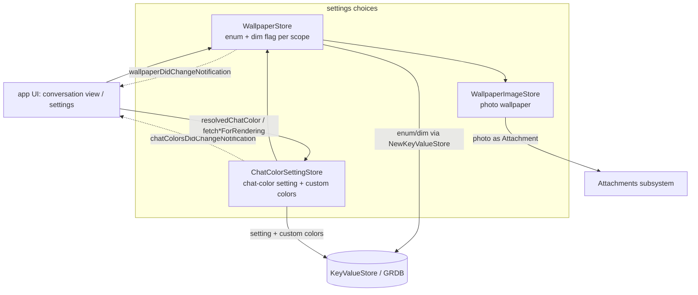

# UISupport (Wallpaper & Chat Colors)

Covers `SignalServiceKit/UISupport/`:

- `WallpaperStore.swift`
- `WallpaperImageStore.swift`
- `WallpaperImageStoreImpl.swift`
- `MockWallpaperImageStore.swift`
- `ChatColorSettingStore.swift`
- `Models/Wallpaper.swift`
- `Models/Wallpaper+Constants.swift`
- `Models/ChatColors.swift`
- `Models/PaletteChatColor+Constants.swift`
- `Models/ColorOrGradient.swift`

This folder owns the **persistence and resolution logic for conversation appearance**: the
per-thread (and global) *wallpaper* and *chat color* settings used to render the conversation
background and the outgoing message bubbles. It stores the user's *choices* (an enum value, a
palette key, a custom color, a dim-in-dark-mode flag, an optional photo) and provides the
"resolution" logic that turns those choices — which may live at either the thread scope or the
global scope — into a concrete color/gradient the UI can draw. The actual views that render these
values live in the app layer, not here.

Everything is scoped by `TSThread.uniqueId` with a sentinel for the global/default scope
(`"global"` for wallpaper, `WallpaperStore.swift:13`; `"defaultKey"` for chat colors,
`ChatColorSettingStore.swift:47`). Changes are broadcast via two `NotificationCenter`
notifications so UI can refresh.

Wiring (confidence: HIGH): all three stores are constructed in `AppSetup`
(`SignalServiceKit/Environment/AppSetup.swift:790`, `:796`, `:799`) and exposed on
`DependenciesBridge` (`SignalServiceKit/Environment/DependenciesBridge.swift:95`, `:199`, `:200`).
`ChatColorSettingStore` depends on `WallpaperStore`; `WallpaperStore` depends on
`WallpaperImageStore`; `WallpaperImageStoreImpl` depends on the Attachments stack
(`AttachmentManager`/`AttachmentStore`/`AttachmentContentValidator`). They are also re-constructed
locally by `ThreadMerger` when merging thread records
(`SignalServiceKit/Contacts/ThreadMerger.swift:383`, `:386`).

---

## Wallpaper

### `Wallpaper` enum — `Models/Wallpaper.swift:8`
Confidence: HIGH (read in full). A `String`-backed `CaseIterable` enumerating the built-in solid
and gradient wallpapers, plus two special cases: `.photo` (user-supplied image) and `.releaseNotes`
(the Release Notes "chat"). `defaultWallpapers` (`:40`) is every case except `.photo`/`.releaseNotes`
(the pickable built-ins).

Color mapping (confidence: HIGH): `Wallpaper.asColorOrGradientSetting`
(`Models/Wallpaper+Constants.swift:11`) maps each case to a themed `ColorOrGradientSetting`
(hard-coded light/dark RGB values transcribed from the design spec). `.photo` and `.releaseNotes`
return `nil`. `Wallpaper.defaultChatColor` (referenced from `ChatColorSettingStore`) supplies the
chat color a wallpaper prefers for message bubbles. `shouldDimInDarkModeDefaultValue = true`
(`Models/Wallpaper+Constants.swift:9`) is the fallback for the dim-in-dark-mode toggle.

### `WallpaperStore` — `WallpaperStore.swift:9`
Confidence: HIGH (read in full). Persists the *non-image* parts of the wallpaper setting:
- Two `NewKeyValueStore`s: `"Wallpaper+Enum"` (the chosen `Wallpaper.rawValue`) and
  `"Wallpaper+Dimming"` (the per-scope dim-in-dark-mode `Bool`) (`:17`–`:18`).
- Holds a `WallpaperImageStore` to co-manage photo wallpapers (`:16`).

Key API:

| Method | Line | Behavior |
|--------|------|----------|
| `setBuiltIn(_:for:)` | 43 | Set a built-in wallpaper (asserts not `.photo`); clears any photo image for the scope. |
| `setPhoto(_:for:)` | 49 | Set `.photo` and store the `UIImage` via the image store. |
| `_set(_:photo:for:)` | 53 | Private: routes to per-thread vs. global image store, passing `onInsert` that writes the enum value in the *same* transaction. |
| `setWallpaperType(_:for:tx:)` | 68 | Write just the enum (doesn't touch the image); posts change notification. |
| `fetchWallpaper(for:tx:)` | 73 | Read the raw enum for a scope. |
| `fetchWallpaperForRendering(for:tx:)` | 85 | Thread value, else global value (via `fetchResolvedValue`). |
| `fetchResolvedValue(for:fetchBlock:)` | 95 (static) | Generic "thread value if set, else global" helper reused for dim flag too. |
| `fetchUniqueThreadIdsWithWallpaper(tx:)` | 100 | All scopes that have a wallpaper enum set (nil = global). |
| `setDimInDarkMode(_:for:tx:)` / `fetchDimInDarkMode(for:tx:)` | 104 / 114 | Per-scope dim toggle (nil removes). |
| `fetchDimInDarkModeForRendering(for:tx:)` | 118 | Resolved dim flag, defaulting to `shouldDimInDarkModeDefaultValue`. |
| `reset(for:tx:)` / `resetAll(tx:)` | 126 / 133 | Clear a scope / everything. |

Change notification (confidence: HIGH): `WallpaperStore.wallpaperDidChangeNotification` (`:10`) is
posted on the main thread via `tx.addSyncCompletion` after any mutation, with the affected
`threadUniqueId` (or `nil` for global) as the notification `object` (`postWallpaperDidChangeNotification`,
`:139`).

### `WallpaperImageStore` protocol — `WallpaperImageStore.swift:9`
Confidence: HIGH (read in full). The photo-wallpaper surface, kept separate because photos are
stored as **attachments**, not key-value blobs. Notable contract: `setWallpaperImage` /
`setGlobalThreadWallpaperImage` open a "sneaky" write transaction and must *not* be called from
inside an existing transaction; they take an `onInsert` block run in that same write (used by
`WallpaperStore` to persist the enum atomically). Pass `nil` to remove an existing wallpaper.

### `WallpaperImageStoreImpl` — `WallpaperImageStoreImpl.swift:9`
Confidence: HIGH (read in full). Backs photos with the Attachments subsystem (see
[Attachments](../Attachments/README.md)):
- Images are JPEG-encoded at quality `0.8` (`dataSource(wallpaperImage:)`, `:109`), validated via
  `AttachmentContentValidator`, and stored as an attachment stream owned by
  `.threadWallpaperImage(threadRowId:)` or `.globalThreadWallpaperImage`
  (`setWallpaperImage(_:owner:onInsert:)`, `:125`).
- Setting a new image first removes any existing reference for that owner, then creates the new
  stream, then runs `onInsert` — all in one `db.awaitableWrite`.
- `loadWallpaperImage` / `loadGlobalThreadWallpaper` (`:64`/`:72`) fetch the referenced attachment,
  `asStream()`, and return `decryptedImage()` (nil on any failure).
- `copyWallpaperImage(from:to:)` (`:76`) clones a thread's wallpaper reference to another thread
  (used by thread merges), replacing the destination's existing wallpaper first.
- `resetAllWallpaperImages` (`:103`) removes all thread-owned attachment references.

Both `setWallpaperImage` and `loadWallpaperImage` require an *inserted* thread
(`thread.sqliteRowId`); uninserted threads throw / `owsFailDebug` (`:33`, `:65`).

### `MockWallpaperImageStore` — `MockWallpaperImageStore.swift:11`
Confidence: HIGH. `TESTABLE_BUILD`-only no-op conforming to `WallpaperImageStore`.

---

## Chat colors

### `ChatColorSetting` — `Models/ChatColors.swift:19`
Confidence: HIGH (read in full). The chosen setting for a scope: `.auto`, `.builtIn(PaletteChatColor)`,
or `.custom(CustomChatColor.Key, CustomChatColor)`. `constantColor` (`:37`) yields the explicit
`ColorOrGradientSetting` for built-in/custom, or `nil` for `.auto` (meaning "derive it"). As the
doc comment notes (`:7`), a `ChatColorSetting` alone often isn't enough to render — resolving
`.auto` requires the wallpaper and global fallbacks.

### `PaletteChatColor` — `Models/ChatColors.swift:81`
Confidence: HIGH. `String`-backed `CaseIterable` of the built-in palette (solid colors and
gradients), default `.ultramarine`. `PaletteChatColor.colorSetting`
(`Models/PaletteChatColor+Constants.swift:23`) maps each case to a concrete
`ColorOrGradientSetting` (hard-coded RGB / gradient values + angle conversion from the spec).

### `CustomChatColor` — `Models/ChatColors.swift:49`
Confidence: HIGH. A user-authored color: a `ColorOrGradientSetting` plus `creationTimestamp`,
identified by a random-UUID `Key` (`:50`). `Codable`; `CodingKeys` note deprecated legacy keys
still present in older DB values.

### `ColorOrGradientSetting` / `OWSColor` — `Models/ColorOrGradient.swift:11` / `:127`
Confidence: HIGH (read in full). `ColorOrGradientSetting` is the **persisted/comparable** color
model: `.solidColor`, `.themedColor` (light/dark), `.gradient`, `.themedGradient`, with a custom
`Codable` implementation keyed by a numeric `TypeKey` for stable serialization. The file comment
(`:9`) notes `ColorOrGradientSetting` is for persistence/comparison while a separate
`ColorOrGradientValue` (elsewhere) is for rendering. `OWSColor` is a lossless, `Equatable`,
`Codable` RGB triple (clamped to 0–1) with an `asUIColor` accessor.

### `ChatColorSettingStore` — `ChatColorSettingStore.swift:13`
Confidence: HIGH (read in full). Stores chat-color settings per scope and the catalog of custom
colors:
- `settingStore` (`NewKeyValueStore` `"chatColorSettingStore"`): scope key → raw value, where the
  raw value is either a `PaletteChatColor.rawValue` or a `CustomChatColor.Key.rawValue` (`:14`).
- `customColorsStore` (`KeyValueStore` `"customColorsStore.3"`): `CustomChatColor.Key` →
  `CustomChatColor` (Codable) (`:17`).
- Holds a `WallpaperStore` because "auto" resolution depends on the wallpaper's preferred color.

Key API:

| Method | Line | Behavior |
|--------|------|----------|
| `fetchAllScopeKeys(tx:)` | 29 | All scope keys that have a setting. |
| `fetch/setRawSetting(...)` | 33 / 37 | Low-level raw value access per scope. |
| `fetchCustomValues(tx:)` | 51 | All custom colors, sorted by creation time. |
| `upsertCustomValue / deleteCustomValue` | 70 / 79 | Mutate the custom-color catalog (posts change notification). |
| `usageCount(of:tx:)` | 85 | How many scopes reference a given custom color. |
| `chatColorSetting(for:tx:)` | 174 | The chosen `ChatColorSetting` for a scope (falls back to `.auto` if the raw value no longer resolves). |
| `hasChatColorSetting(for:tx:)` | 164 | Whether a scope has an explicit setting. |
| `setChatColorSetting(_:for:tx:)` | 195 | Persist a setting (`.auto` → nil), posts change notification. |
| `resolvedChatColor(for:previewWallpaper:tx:)` | 105 | The color to actually render for outgoing bubbles. |
| `autoChatColor(for:tx:)` | 123 | The color the "auto" chip should show in the editor. |
| `resetAllSettings(tx:)` | 41 | Clear all per-scope settings. |

Change notification (confidence: HIGH): `ChatColorSettingStore.chatColorsDidChangeNotification`
(`:193`) is posted on the main thread via `tx.addSyncCompletion`, object = affected
`threadUniqueId` (or `nil`) (`:213`).

#### Resolution priority (confidence: HIGH)
`resolvedChatColor` (`:105`) returns the scope's explicit `constantColor` if the setting is
built-in/custom; otherwise it delegates to `autoChatColor`. The private
`autoChatColor(for:previewWallpaper:tx:)` (`:133`) implements the documented priority:

1. If `previewWallpaper` is given (editing/previewing): the thread's explicit color, else the
   preview wallpaper's `defaultChatColor` (`:138`).
2. The thread wallpaper's `defaultChatColor`, if a thread wallpaper is set (`:147`). Note it only
   consults `wallpaperStore.fetchWallpaper(for: threadId, ...)` when there is a real `threadId`,
   because passing `nil` would return the *global* wallpaper.
3. The global explicit chat color, if any (`:152`).
4. The global wallpaper's `defaultChatColor`, if any (`:158`).
5. `Constants.defaultColor` (`.ultramarine`) (`:161`).

Edge cases (confidence: HIGH): a raw setting pointing at a deleted custom color resolves back to
`.auto` rather than erroring (`chatColorSetting`, `:190`); custom-color decode failures log via
`owsFailDebug` and are treated as absent (`fetchCustomValue`, `:61`).

---

## Interactions with the rest of the app

Confidence: HIGH for wiring/consumer identification (via grep + `AppSetup`), MEDIUM for the precise
UI render path (the rendering views live in the `Signal` app target, outside this folder).

- **Dependency graph.** `AppSetup` builds `WallpaperImageStoreImpl` → `WallpaperStore` →
  `ChatColorSettingStore` and publishes them on `DependenciesBridge`
  (`DependenciesBridge.swift:95`, `:199`, `:200`), so the app and other SSK code reach them through
  the bridge.
- **Attachments.** Photo wallpapers are first-class attachments owned by `threadWallpaperImage` /
  `globalThreadWallpaperImage` owners; creation/validation/removal go through
  `AttachmentManager`/`AttachmentStore`/`AttachmentContentValidator` (see
  [Attachments](../Attachments/README.md)).
- **Thread merging.** When two threads are merged, `ThreadMerger`
  (`SignalServiceKit/Contacts/ThreadMerger.swift:383`) uses these stores (and
  `copyWallpaperImage`) to carry appearance settings onto the surviving thread.
- **UI refresh.** Conversation and appearance-settings views observe
  `wallpaperDidChangeNotification` and `chatColorsDidChangeNotification` and call the
  `*ForRendering` / `resolvedChatColor` accessors to redraw backgrounds and outgoing bubbles.
