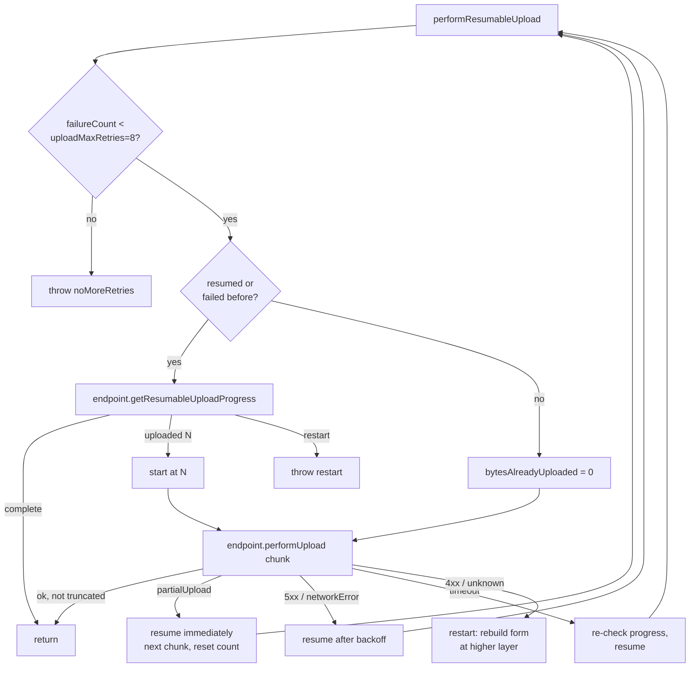

# Upload

Covers `SignalServiceKit/Upload/` — the subsystem that pushes **encrypted blobs to Signal CDNs**.
Despite the name, it is not attachment-specific: the same engine uploads attachment transit-tier
and media-tier blobs, non-attachment backup protos, and transient link'n'sync files. It owns the
CDN upload *state machine* (resumable, chunked, retrying) and the CDN-flavor-specific endpoint
implementations.

> This doc describes the `Upload/` folder itself. The sibling
> [Attachments/Upload.md](../Attachments/Upload.md) documents the same code from the *attachment*
> point of view (how an `Attachment` becomes a transit/media-tier upload). The two overlap on
> `AttachmentUploadManager`; this doc focuses on the generic upload engine, metadata model, and
> CDN endpoint protocols.

The subsystem has three layers:

- **Engine** — `AttachmentUpload` drives the resumable upload loop against an `UploadEndpoint`
  (`AttachmentUpload.swift:14`, `UploadEndpoint.swift:9`).
- **Endpoints** — `UploadEndpointCDN2` (Google resumable XML API) and `UploadEndpointCDN3`
  (TUS protocol) implement the wire protocol per CDN. `UploadV2.swift` holds the legacy
  CDN0 (AWS S3 POST-form) uploader used only for group avatars.
- **Orchestration** — `AttachmentUploadManager` ties the engine to the attachment store,
  encryption, upload forms, and persistence of resumable state across app launches.

---

## Shared vocabulary — `Upload.swift`

Confidence: HIGH (read in full). `enum Upload` is a namespace for the subsystem's value types.

| Type | Line | Purpose |
|------|------|---------|
| `Upload.uploadQueue` | 9 | Global `ConcurrentTaskQueue`; limit **12** normally, **2** in the NSE. |
| `Upload.Constants` | 11 | Progress-notification name/keys, reuse windows, `maxUploadAttempts = 5`. |
| `Upload.FormSource` | 23 | `remote` (fetch a form) vs `local(Form)` (caller supplies one). |
| `Upload.Form` | 28 | The CDN upload form: `headers`, `signedUploadLocation`, `cdnKey` (JSON `key`), `cdnNumber` (JSON `cdn`). `Codable`. |
| `Upload.FailureMode` | 44 | How to recover: `noMoreRetries`, `resume(RetryMode)`, `restart(RetryMode)`. |
| `Upload.FailureMode.RetryMode` | 45 | `afterServerRequestedDelay(TimeInterval)` (honor `retry-after`) or `afterBackoff` (internal exponential backoff). |
| `Upload.ResumeProgress` | 65 | Server's view of progress: `restart`, `complete`, or `uploaded(UInt64)` bytes. |
| `Upload.Error` | 79 | Upload error cases; all map to one localized string. `partialUpload(bytesUploaded:)` signals a chunk succeeded. |
| `Upload.Result<Metadata>` / `AttachmentResult` | 176 / 188 | Final `cdnKey`/`cdnNumber` + begin/finish timestamps. |
| `Upload.Attempt<Metadata>` | 200 | A single upload attempt: file URL, encrypted length, resolved `endpoint`, `uploadLocation`, `isResumedUpload`, logger. |

### Reuse windows (confidence: HIGH)
- `uploadReuseWindow = 3 days` (`Upload.swift:17`) — an existing transit-tier upload can be reused
  for re-sends within this window.
- `uploadFormReuseWindow = 6 days` (`Upload.swift:18`) — a fetched upload *form* can be reused;
  deliberately shorter than the server's ~7-day form expiry to avoid edge cases
  (`AttachmentUploadManager.swift:690` comment).

---

## Metadata model — `UploadMetadata.swift`

Confidence: HIGH (read in full). A small protocol hierarchy describing *what* is being uploaded.

```
UploadMetadata                (encryptedDataLength)
  └─ ValidatedUploadMetadata  (+ digest, plaintextDataLength)
       └─ AttachmentUploadMetadata (+ key, isReusedTransitTierUpload)
```

Concrete types live in `Upload.swift`:

| Metadata | Line | Used for |
|----------|------|----------|
| `LocalUploadMetadata` | 130 | A normal attachment: file URL (`iv + ciphertext + hmac`), `key` (encryption key + hmac), `digest`, encrypted + plaintext lengths. `validateAndBuild` at `Upload.swift:218`. |
| `EncryptedBackupUploadMetadata` | 102 | A full backup proto upload; carries SVRB `nonceMetadata` for forward secrecy and byte-size accounting. |
| `LinkNSyncUploadMetadata` | 149 | The transient link'n'sync backup transferred during device linking. |
| `ReusedUploadMetadata` | 156 | A transit-tier upload reused by key/CDN without re-sending bytes (`isReusedTransitTierUpload == true`). |

The encrypted file layout is uniformly **`iv + encrypted data + hmac`** (AES-CBC + HMAC-SHA256);
`digest` is `SHA256` over that whole blob. See the attachment encryption overview in
[Attachments/README.md](../Attachments/README.md#encryption-model-overview).

---

## Endpoint protocol — `UploadEndpoint.swift`

Confidence: HIGH (read in full). The engine talks to CDNs only through `UploadEndpoint`
(`UploadEndpoint.swift:9`), which abstracts three operations:

| Method | Line | Responsibility |
|--------|------|----------------|
| `fetchResumableUploadLocation()` | 16 | Turn a form into a backend-specific upload URL (session). |
| `getResumableUploadProgress(attempt:)` | 22 | Ask the server how many bytes it already has → `Upload.ResumeProgress`. |
| `performUpload(startPoint:attempt:progressBlock:)` | 31 | Upload bytes from `startPoint`; may be fresh or a resume. `throws(Upload.Error)` (typed). |

`UploadEndpoint.readUploadFileChunk` (`Upload.swift:244`) memory-maps the encrypted file and
returns a chunk capped at `maxFileChunkSizeBytes()` (**31 MiB**, `UploadShims.swift:74`, kept under
the server's ~32 MiB limit). Its `truncated` flag tells the caller more chunks remain, which is how
chunked uploads are expressed.

---

## CDN endpoints

### `UploadEndpointCDN2` — Google resumable XML API
Confidence: HIGH (read in full). File `UploadEndpointCDN2.swift`.

- **Session creation** (`:34`): `POST` to `signedUploadLocation` with `Content-Length: 0`; expects
  `201` and reads the resumable session from the `location` header. Retries up to
  `maxUploadLocationRetries = 2` on network failure (`:11`).
- **Progress check** (`:88`): `PUT` with `Content-Range: bytes */<len>`. `200/201 → complete`;
  `308 → parse Range header` to learn uploaded bytes (`bytesAlreadyUploaded = rangeEnd + 1`); any
  other code → `restart`.
- **Upload** (`:147`): `PUT` a chunk with a `Content-Range: bytes start-end/total` header when
  resuming or chunking. `200/201 → done`; `308` on a truncated (chunked) upload → throw
  `partialUpload` so the engine immediately resumes with the next chunk.

### `UploadEndpointCDN3` — TUS resumable protocol
Confidence: HIGH (read in full). File `UploadEndpointCDN3.swift`. Implements
[tus.io](https://tus.io/protocols/resumable-upload) (`:9`).

- **Session** (`:33`): the signed location *is* the session URL (no extra round-trip).
- **Progress** (`:40`): `HEAD` with `Tus-Resumable: 1.0.0`; reads `upload-offset`. `404/410/403` →
  treat as fresh (`uploaded(0)`, `:57`); non-200 → `restart`.
- **Upload** (`:85`): first chunk (`startPoint == 0`) is a `POST` that creates the resource with
  `Upload-Length` and a **`x-signal-checksum-sha256` header = base64(digest)** (`:13`, `:120`) so
  the server can validate integrity; subsequent chunks are `PATCH` with `Upload-Offset`. Status
  `200...204` with `truncated` → `partialUpload`. A **415** means checksum validation failed →
  `restart` (`:177`); `4xx → restart`, `5xx → resume`, honoring any `retry-after` header.

### `UploadEndpointCDN0` — legacy AWS S3 POST form
Confidence: HIGH (read in full). `UploadV2.swift` (`Upload.CDN0`). A one-shot multipart `POST`
upload (no resume, `:53`), parsed from `GroupsProtoAvatarUploadAttributes` (`:29`). Field ordering
is built manually because S3 is order-sensitive (`:97`). Used only for endpoints still on CDN0
(group avatars); not wired into the resumable engine.

---

## Upload engine — `AttachmentUpload.swift`

Confidence: HIGH (read in full). `enum AttachmentUpload` is the generic, source-agnostic driver.
Its comment notes that past this point "the upload doesn't have any knowledge of the source
(attachment, backup, image, etc)" (`:20`).

- **`buildAttempt(...)`** (generic `:325`, with typed overloads at `:259`/`:281`/`:303`): selects
  the endpoint by `form.cdnNumber` (`2 → CDN2`, `3 → CDN3`, else assertion `unsupportedEndpoint`,
  `:353`), resolves the upload location (reusing `existingSessionUrl` if given, `:357`), and
  packages everything into an `Upload.Attempt`.
- **`start` → `attemptUpload` → `performResumableUpload`** (`:21`, `:47`, `:83`): the core loop.

### Resumable loop state machine (confidence: HIGH)



Key behaviors:
- **Chunked uploads** surface as `Upload.Error.partialUpload`; the loop resumes *immediately*
  (no backoff) with `failureCount` reset to 0, because the server positively confirmed bytes
  (`AttachmentUpload.swift:180`, `:250`).
- **Backoff** is `OWSOperation.retryIntervalForExponentialBackoff(maxAverageBackoff: 14.1 min)`
  (`:233`), or the server's `retry-after` when provided.
- **Per-level retry caps**: engine loop `uploadMaxRetries = 8` (`:10`),
  progress-check retries `maxUploadProgressRetries = 2` (`:11`), CDN2 session retries `2`.
  `restart` is *not* handled here — it bubbles up to `AttachmentUploadManager`, which must rebuild
  the whole form (`:241`).
- **Progress reporting** composes chunk offsets into whole-file progress and emits an initial
  update reflecting already-uploaded bytes (`:131`).

---

## Orchestration — `AttachmentUploadManager.swift`

Confidence: HIGH (interface + core driver read; some tier-specific branches skimmed).
`AttachmentUploadManager` (protocol `:9`, impl `AttachmentUploadManagerImpl:60`) is the stateful
entry point used by the rest of the app. Public API:

| Method | Line | Uploads |
|--------|------|---------|
| `uploadTransitTierAttachment(attachmentId:)` | 30 / 271 | Attachment to the ephemeral transit CDN. |
| `uploadMediaTierAttachment(...)` | 36 / 322 | Attachment to the long-lived media (backup) CDN. |
| `uploadMediaTierThumbnailAttachment(...)` | 47 / 498 | Media-tier thumbnail. |
| `uploadBackup(localUploadMetadata:form:)` | 11 / 144 | Non-attachment encrypted backup proto. |
| `uploadTransientAttachment(dataSource:)` | 18 / 181 | Transient (non-persisted) attachment. |
| `uploadLinkNSyncAttachment(...)` | 23 / 224 | Link'n'sync transfer during device linking. |
| `currentProgress(forAttachmentId:)` | 57 | `@MainActor` progress poll. |

Concurrency: a `KeyedConcurrentTaskQueue<UploadId>` with `concurrentLimitPerKey: 1`
(`:93`) serializes uploads per (attachment, thumbnail?) so the same attachment can't upload twice
at once.

### Persistence of resumable state — `AttachmentUploadRecord.swift`
Confidence: HIGH (read in full). `AttachmentUploadRecord` (table `AttachmentUploadRecord`,
`:11`) persists mid-upload state so uploads survive relaunch: `sourceType`
(`transit`/`media`/`thumbnail`), `uploadForm` + `uploadFormTimestamp`, cached `localMetadata`,
`uploadSessionUrl`, and `attempt` count. The manager reads/creates this record
(`AttachmentUploadManager.swift:634`, `fetchOrCreateAttachmentRecord:851`), caches the form within
`uploadFormReuseWindow`, and stores the resolved session URL before starting
(`:738`).

### Metadata reuse decision (confidence: HIGH)
`getOrFetchUploadMetadata` (`:876`) returns one of `new / existing / reuse / alreadyUploaded`
(`MetadataResult:869`). An existing transit-tier upload with the *same* encryption key that is not
expired (within `messageQueueTime`) short-circuits to `.alreadyUploaded` — returning the existing
`cdnKey`/`cdnNumber` with **no bytes re-sent** (`:902`). Media-tier uploads can also *copy* an
existing transit-tier blob to the media tier via `copyToMediaTier` (`:372`) instead of re-uploading.

### Failure handling at the orchestration layer (confidence: HIGH)
On error (`:769`): if `attempt >= maxUploadAttempts (5)` it gives up and `cleanup`s the record
(`:772`); an `Upload.Error.uploadFailure` (a bubbled-up `restart`) clears form/metadata/session and
recurses to rebuild from scratch (`:783`); `Upload.Error.missingFile` marks the attachment offloaded
and deletes the record; network errors and cancellation do **not** bump the attempt count.

---

## Shims — `UploadShims.swift`

Confidence: HIGH (read in full). Three injectable boundaries (protocol `Shim` + concrete
`Wrapper`), used for testing and for isolating side effects:

| Shim | Line | Wraps |
|------|------|-------|
| `AttachmentEncrypter` | 24 | `Cryptography.encrypt/decryptAttachment`. |
| `FileSystem` | 30 | `OWSFileSystem` temp files, existence, delete, `maxFileChunkSizeBytes()` (31 MiB), memory-mapped reads (`.mappedIfSafe, .uncached`). |
| `SleepTimer` | 42 | `Task.sleep` for backoff delays. |

---

## Interactions with the rest of SignalServiceKit / app

- **Networking**: endpoints use `signalService.sharedUrlSessionForCdn(cdnNumber:)` (per-CDN URL
  session; see [Network](../Network/README.md)); transit-tier forms come from the chat
  authenticated service (`chatConnectionManager.withAuthService(.attachments)`,
  `AttachmentUploadManager.swift:706`), media-tier forms from `BackupRequestManager`
  (`:711`).
- **Attachments**: operates on `Attachment`/`AttachmentStream` and persists via `AttachmentStore` /
  `AttachmentUploadStore`; see [Attachments/Store-and-Records.md](../Attachments/Store-and-Records.md)
  and [Attachments/Upload.md](../Attachments/Upload.md).
- **Backups**: `uploadBackup` and `copyToMediaTier` connect to the backup/media-tier flow; see
  [Backups/server-and-cdn.md](../Backups/server-and-cdn.md).
- **Cryptography**: all uploaded blobs are `iv + ciphertext + hmac`; CDN3 sends the SHA-256 digest
  as a checksum header for server-side integrity validation.
- **UI/progress**: progress is reported through `OWSURLSession.ProgressBlock` and the
  `attachmentUploadProgressNotification` (`Upload.swift:12`).

## Notable cryptography / networking considerations

- **No plaintext leaves the device**: the engine uploads an already-encrypted file; the key never
  goes to the CDN. The digest/checksum is over ciphertext.
- **Resumability**: both live CDNs support resume (Google resumable XML API on CDN2, TUS on CDN3);
  the session URL and progress are persisted so a resumed upload avoids re-sending confirmed bytes.
- **Chunking**: files are uploaded in ≤31 MiB chunks via memory-mapped reads to bound memory use;
  `partialUpload` drives immediate chunk-to-chunk continuation.
- **Backoff & server cooperation**: exponential backoff (capped ~14 min average) with `retry-after`
  override; 5xx → resume, 4xx → restart, 415 (CDN3 checksum mismatch) → restart.
- **NSE constraint**: upload concurrency drops to 2 in the Notification Service Extension
  (`Upload.swift:9`) to respect its tight memory budget.
