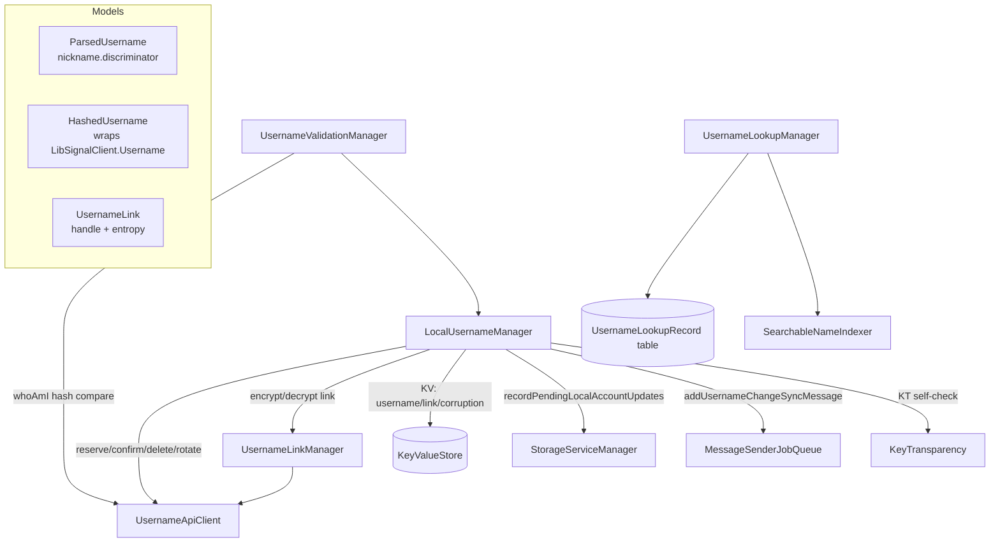

# Usernames

Covers `SignalServiceKit/Usernames/`:

- `Usernames.swift`, `Usernames+ParsedUsername.swift`, `Usernames+HashedUsername.swift`,
  `Usernames+UsernameLink.swift`, `Usernames+BetterIdentifierChecker.swift` — models.
- `LocalUsernameManager.swift` — the local user's own username + link lifecycle.
- `UsernameValidationManager.swift` — periodically reconcile local state against the service.
- `UsernameLinkManager.swift` — encrypt/decrypt username links.
- `UsernameApiClient.swift` / `UsernameApiClientImpl.swift` — the network layer.
- `UsernameLookupManager.swift`, `UsernameLookupRecord.swift`, `UsernameLookupRecordStore.swift` —
  cache of *other* accounts' usernames.
- `UsernameEducationManager.swift` — UI education/tooltip flags.
- `UsernameChangeSyncMessage.swift` — linked-device sync nudge.
- `UsernameLogger.swift` — a prefixed logger.

A Signal **username** is a user-chosen `nickname.discriminator` string (e.g. `alice.42`). The server
never stores the plaintext username; it stores a **hash** (so a username can be looked up to an ACI
without revealing the plaintext) plus an **encrypted username blob** addressed by a random **link
handle**. The nickname/discriminator split, the hashing, ZK proofs, and link encryption all live in
`LibSignalClient.Username`; this folder is the Swift glue that wires those primitives to Signal's
network stack, local storage, Storage Service backup, and device-sync.

Two largely independent concerns live here:

1. **The local user's own username/link** — created, confirmed, rotated, deleted, and periodically
   validated. Owned by `LocalUsernameManager` + `UsernameValidationManager` + `UsernameLinkManager`.
2. **Other people's usernames** — a transient, best-effort cache from username→ACI lookups. Owned by
   `UsernameLookupManager` + `UsernameLookupRecordStore`.

All types read in full. Confidence is HIGH throughout except where noted. The core protocols are
wired in `AppSetup.swift` (`:1310`–`:1337`, `:342`); validation is kicked off at app launch from
`Signal/AppLaunch/AppEnvironment.swift:248`.

---

## Models

### `Usernames` namespace — `Usernames.swift:9`
Just `public enum Usernames {}`; every model/manager type below hangs off it.

### `Usernames.ParsedUsername` — `Usernames+ParsedUsername.swift:9`
A username split on `.` (`separator`, `:10`) into `nickname` + `discriminator`. `init?(rawUsername:)`
(`:15`) requires exactly two non-empty components (otherwise `owsFailDebug` + nil). `reassembled`
(`:44`) rejoins them; `updatingNickame(newNickname:)` (`:48`) swaps the nickname while keeping the
discriminator. Note the discriminator is a `String`, not an integer — leading-zero discriminators
are preserved.

### `Usernames.HashedUsername` — `Usernames+HashedUsername.swift:10`
Confidence: HIGH. The crypto wrapper around `LibSignalClient.Username` (type-aliased
`LibSignalUsername`, `:11`). It exposes:
- `usernameString` (`:28`) — the raw plaintext username.
- `rawHash` (`:33`) — the username hash as bytes (used for ACI lookup, `UsernameApiClientImpl.lookupAci`).
- `hashString` (`:38`) — base64url of the hash (used for reserve/confirm requests).
- `proofString` (`:43`) — base64url **ZK proof** generated via `libSignalUsername.generateProof()`,
  proving knowledge of the nickname that produced the hash without revealing it. Sent on confirm.

`GeneratedCandidates` (`:52`) holds a set of candidate hashes; `candidateHashes` (`:59`) and
`candidate(matchingHash:)` (`:63`) let the API client map a server-accepted hash back to its
candidate. `generateCandidates(forNickname:minNicknameLength:maxNicknameLength:desiredDiscriminator:)`
(`:97`) delegates to LibSignal: with a `desiredDiscriminator` it builds one specific username,
otherwise it asks LibSignal for a batch of discriminator candidates. LibSignal validation errors are
mapped to `CandidateGenerationError` (`:70`: empty / starts-with-digit / invalid-character /
too-short / too-long); unmapped errors propagate (`:126`). Equality (`:134`) compares the plaintext
`value`.

### `Usernames.UsernameLink` — `Usernames+UsernameLink.swift:14`
Confidence: HIGH. The shareable "signal.me" link model. **The link does not contain the username.**
It carries a `handle: UUID` (`:33`, server address of the encrypted username) and `entropy: Data`
(`:37`, the key material to decrypt it). `init?(handle:entropy:)` (`:39`) enforces a 32-byte entropy
length (`expectedEntropyLength`, `:25`).

URL form: `{https,sgnl}://signal.me/#eu/{base64url(entropy ++ handle)}` (`:13`, components `:17`–`:22`).
`init?(usernameLinkUrl:)` (`:48`) strictly validates scheme (`https`/`sgnl`), host (`signal.me`),
path, the `eu/` fragment prefix, and rejects any query/user/password/port; it then base64url-decodes
the fragment and splits a fixed `32 (entropy) + 16 (UUID)` byte payload (`:89`). The computed `url`
(`:109`) re-encodes `entropy + handle.data`; it `owsFail`s if URL assembly fails (should be
impossible). Because entropy never leaves the client, the server can store/serve the encrypted
username without ever learning the plaintext.

### `Usernames.BetterIdentifierChecker` — `Usernames+BetterIdentifierChecker.swift:11`
Confidence: HIGH. A tiny heuristic: given a `SignalRecipient`, does the UI have a *better* display
identifier than the username (an E164, a profile name, or a system-contact name)? It records booleans
for each candidate identifier; `usernameIsBestIdentifier()` (`:57`) returns true only when none of
them are present. `assembleByQuerying(...)` (`:27`) populates it from `ProfileManager` +
`ContactManager`. This is purely a presentation helper — no network, no storage.

---

## The local user's username and link

### `LocalUsernameManager` protocol — `LocalUsernameManager.swift:7`
Confidence: HIGH (read in full). Owns the local user's own username and link, both as local state and
as remote mutations. Implementation `LocalUsernameManagerImpl` (`:172`).

#### Local state model — `Usernames.LocalUsernameState` `:104`
A four-case enum representing every state the local username/link can be in:
- `.unset` (`:106`) — deliberately no username.
- `.available(username, usernameLink)` (`:108`) — both present and healthy.
- `.linkCorrupted(username)` (`:111`) — username is fine, but the link values may not decrypt the
  server's encrypted blob.
- `.usernameAndLinkCorrupted` (`:114`) — the local username may not match the server's stored hash.

Accessors `username` (`:127`) and `usernameLink` (`:139`) project out the usable values;
`isExplicitlyUnset` (`:117`) distinguishes "unset" from "corrupted".

#### Persistence — two KeyValueStores
Confidence: HIGH.
- `UsernameStore` (`:203`, collection `"LocalUsername"`) persists the username string plus the link's
  **handle** and **entropy** separately (`:246`), and the QR-code color (`:235`, a `QRCodeColor`
  Codable). `usernameLink(tx:)` (`:222`) reconstructs a `UsernameLink` only if handle + entropy both
  parse.
- `CorruptionStore` (`:173`, collection `"LocalUsernameCorruption"`) holds two bool flags: username
  corrupted, link corrupted.

`usernameState(tx:)` (`:310`) is derived: username-corrupted ⇒ `.usernameAndLinkCorrupted`; else if a
username exists, link-corrupted-or-unparseable ⇒ `.linkCorrupted`, otherwise `.available`; else
`.unset`.

Every state mutation posts `Usernames.localUsernameStateChangedNotification` (`:98`) on the main
thread via `tx.addSyncCompletion` (`:340`, `:354`) so UI can refresh.

#### The "corrupt first, then clear on definite response" pattern
Confidence: HIGH. This is the central correctness idea for all remote mutations. Because a username
mutation request that fails mid-flight could have taken effect server-side without us knowing, each of
`confirmUsername`, `deleteUsername`, `rotateUsernameLink`, and `updateVisibleCaseOfExistingUsername`
**marks the username/link corrupted in a write transaction before issuing the network request**
(`markUsernameCorrupted`/`markUsernameLinkCorrupted`, `:388`/`:397`). Only a definite, understood
response (success / rejected / rate-limited) clears the corruption flag; network/unknown errors leave
it corrupted so a later validation pass can repair it.

As a pre-filter, every remote mutation first checks `reachabilityManager.isReachable` and bails with
`.networkError` *without* marking corruption (`NoReachabilityError` rationale at `:264`) — avoiding
pointless corruption when the request is known-doomed.

Requests go through `makeRequestWithNetworkRetries` (`:776`) → `Retry.performWithBackoff` with
`maxNetworkRequestRetries + 1` attempts (default 2+1=3), retrying only `isNetworkFailureOrTimeout`.

#### Remote mutations
Confidence: HIGH. All return `Usernames.RemoteMutationResult<T>` = `Result<T, RemoteMutationError>`
(`.networkError`/`.otherError`, `:151`).
- `reserveUsername(usernameCandidates:)` (`:414`) → `UsernameApiClient.reserveUsernameCandidates`.
  Pure reservation; does **not** mark corruption (no local state changes yet). Result is
  `ApiClientReservationResult` (`.successful`/`.rejected`/`.rateLimited`).
- `confirmUsername(reservedUsername:)` (`:437`): generates a fresh link (entropy + encrypted username)
  via `UsernameLinkManager.generateEncryptedUsername`, marks corrupted (`:466`), confirms with the
  service (sending hash + ZK proof + encrypted-username-for-link), then on `.success(linkHandle)`
  builds the `UsernameLink`, stores username+link, fires `usernameHashDidChangeLocally`, and triggers
  a Storage Service backup (`:503`). On `.rejected`/`.rateLimited` it clears corruption and returns
  that outcome.
- `deleteUsername()` (`:530`): marks corrupted (`:541`), calls `deleteCurrentUsername`, then clears
  local username, fires `usernameHashDidChangeLocally`, and backs up (`:558`).
- `rotateUsernameLink()` (`:598`): generates **new** entropy for the *same* username, marks link
  corrupted (`:630`), uploads with `keepLinkHandle: false` (new handle), and stores the new link.
  Changes the link but not the username (so the hash doesn't change — no sync message / KT update).
- `updateVisibleCaseOfExistingUsername(newUsername:)` (`:676`): used to change only the *casing* of
  the visible username. Requires the new string to case-insensitively equal the current one (`:690`).
  Re-encrypts using the **existing** entropy and uploads with `keepLinkHandle: true` (`:733`, service
  must return the same handle, `:735`) so the existing shared link keeps working but now resolves to
  the re-cased username. On any error it still saves the new nickname locally but marks the link
  corrupted (`:753`).

#### `usernameHashDidChangeLocally(tx:)` — `:574`
Confidence: HIGH. Side-effects fired whenever *this* device changes the username hash (confirm /
delete, not rotate):
- Enqueues a `UsernameChangeSyncMessage` via `syncMessageSender.addUsernameChangeSyncMessage` (`:583`)
  so linked devices are nudged — the comment notes this exists because relying on Storage Service
  alone could collapse several quick updates into one and miss intermediate changes.
- Calls `KeyTransparencyManager.handleSelfCheckIdentifierChanged(accountDataField: .usernameHash, …)`
  (`:587`) so LibSignal's **key-transparency self-check** monitors the new username hash.

### `UsernameValidationManager` — `UsernameValidationManager.swift:22`
Confidence: HIGH (read in full). Periodically reconciles local username/link state with the service.
Scheduled at app launch (`AppEnvironment.swift:248`). `validateUsername()` (`:51`) serializes runs
through a `ConcurrentTaskQueue(concurrentLimit: 1)` (`:41`) so only one validation runs at a time.

`_validateUsername()` (`:62`) first calls `ensureUsernameStateUpToDate()` (`:108`), which
`waitForFetchingAndProcessing()` on the `MessageProcessor` (so a "fetch latest" sync message can
trigger a Storage Service restore) and then `waitForPendingRestores()` on the StorageServiceManager —
guaranteeing we compare against the freshest local state before touching the network. Both are
injected via protocol shims (`_UsernameValidationManager_MessageProcessorShim` `:203`,
`_UsernameValidationManager_StorageServiceManagerShim` `:220`) with real wrappers (`:207`, `:224`).

It then branches on `LocalUsernameState`:
- `.unset` → verify the service also has no username.
- `.available` → verify both username and link.
- `.linkCorrupted` → verify only the username (link known-bad).
- `.usernameAndLinkCorrupted` → short-circuit `false`.

`validateLocalUsernameAgainstService` (`:119`) issues a **whoAmI** request (`WhoAmIManager`) and
compares `whoAmIResponse.usernameHash` against `HashedUsername(forUsername:).hashString`. On mismatch
it writes `setLocalUsernameCorrupted` (`:155`). `validateLocalUsernameLinkAgainstService` (`:163`)
decrypts the local link via `UsernameLinkManager.decryptEncryptedLink` and checks it equals the local
username; on failure (including `usernameLinkInvalidEntropyDataLength` / `usernameLinkInvalid`) it
writes `setLocalUsernameWithCorruptedLink` (`:189`). So validation is the *repair* mechanism for the
corruption flags that mutations set.

### `UsernameLinkManager` — `UsernameLinkManager.swift:28`
Confidence: HIGH (read in full). Transforms between links and plaintext usernames. The header comment
(`:7`–`:26`) is the authoritative explanation of the handle/entropy indirection and why the server
never sees the plaintext. Two operations, both delegating crypto to `LibSignalClient.Username`:
- `generateEncryptedUsername(username:existingEntropy:)` (`:59`) → `lscUsername.createLink(previousEntropy:)`,
  returning `(entropy, encryptedUsername)`. Passing `existingEntropy` reuses the key material (that's
  how case-change keeps the same link).
- `decryptEncryptedLink(link:)` (`:72`) → `apiClient.getUsernameLink(handle:entropy:)` and returns
  the decrypted `.value`.

---

## Other accounts' usernames (lookup cache)

### `UsernameLookupManager` — `UsernameLookupManager.swift:13`
Confidence: HIGH (read in full). A **transient, best-effort** cache mapping ACI → last-known username
for *other* accounts. The doc comment (`:7`) stresses that stored usernames are only as fresh as the
last lookup and must not be treated as authoritative. `UsernameLookupManagerImpl` (`:37`):
- `fetchUsername(forAci:)` (`:51`) / `fetchUsernames(forAddresses:)` (`:58`, maps non-ACI addresses to
  `nil`).
- `saveUsername(_:forAci:)` (`:70`): first deletes any existing record for the ACI; if setting a
  non-nil username it also deletes any **conflicting** record that already holds that username
  (case-insensitive), because a username can map to only one ACI at a time (`:82`). It then inserts
  the record and indexes it in full-text search via `SearchableNameIndexer.insert` (`:99`) — this is
  how username search works in the app.

### `UsernameLookupRecord` — `UsernameLookupRecord.swift:14`
Confidence: HIGH. A GRDB `Codable`/`FetchableRecord`/`PersistableRecord` row in table
`"UsernameLookupRecord"` (`:15`) with columns `aci` (stored as the ACI's raw UUID) and `username`.

### `UsernameLookupRecordStore` — `UsernameLookupRecordStore.swift:9`
Confidence: HIGH. Thin GRDB CRUD layer. `aci` is the primary key (one record per ACI, `:16`);
`fetchOne(forUsernameCaseInsensitive:)` (`:28`) uses `COLLATE NOCASE` for the unique-username
constraint. Also `enumerateAll` (`:39`), `insertOne` (`:50`), `deleteOne(forAci:)` (`:56`). All calls
are wrapped in `failIfThrows`.

---

## Supporting pieces

### `UsernameEducationManager` — `UsernameEducationManager.swift:8`
Confidence: HIGH. Two bool flags in a `KeyValueStore(collection: "UsernameEducation")` (`:26`):
`shouldShowUsernameEducation` and `shouldShowUsernameLinkTooltip`, both defaulting to `true` (`:32`,
`:48`). Pure UI gating; no network.

### `UsernameChangeSyncMessage` — `UsernameChangeSyncMessage.swift:7`
Confidence: HIGH. An `OutgoingSyncMessage` (inherits `init(localThread:tx:)` from
`OutgoingSyncMessage.swift:22`) marked `isUrgent` (`:10`). `syncMessageBuilder(tx:)` (`:12`) builds a
`SSKProtoSyncMessage` carrying an (empty) `SSKProtoSyncMessageUsernameChange` — the message is a
content-free *nudge* telling linked devices to re-fetch username state (actual data flows via Storage
Service). Enqueued by `LocalUsernameManagerImpl.UsernameChangeSyncMessageSenderImpl` (`:791`) onto the
`MessageSenderJobQueue`.

### `UsernameLogger` — `UsernameLogger.swift:7`
Confidence: HIGH. A shared `PrefixedLogger` with prefix `[Username]`.

---

## Cryptography & networking notes

Confidence: HIGH for the Swift-side facts below; the cryptographic primitives themselves live in
`LibSignalClient` and are out of scope here.

- **Hashing + ZK proof.** The plaintext username is never uploaded. Reservation/confirmation send the
  base64url **hash** (`HashedUsername.hashString`) and, on confirm, a **ZK proof**
  (`HashedUsername.proofString`) that the client knows the nickname behind the hash. ACI lookup
  (`UsernameApiClientImpl.lookupAci`, `:149`) sends the raw hash bytes over the **unauthenticated**
  chat service (`withUnauthService(.usernames)`), so a username can be resolved to an ACI without
  authenticating.
- **Link encryption.** The username link's `entropy` is 32 bytes of client-only key material
  (`Usernames+UsernameLink.swift:25`); only an **encrypted** username blob and a random **handle** are
  stored server-side. Decryption (`getUsernameLink`, `:181`) also uses the unauthenticated service.
  Rotating a link uploads new entropy + a new handle (`keepLinkHandle: false`); a case change reuses
  entropy and keeps the handle (`keepLinkHandle: true`).
- **Networking surface** (`UsernameApiClientImpl.swift`): reserve (`:28`) and confirm (`:87`) go over
  `networkManager.asyncRequest` with `OWSRequestFactory` requests; confirm is sent `.identified`.
  Delete (`:141`) and both link ops (`:159`, `:181`) go over `chatConnectionManager` auth/unauth
  services. Status codes are mapped to domain results: reserve 422/409 → `.rejected`, 429 →
  `.rateLimited` (`:72`); confirm 409/410 → `.rejected`, 429 → `.rateLimited` (`:120`).
- **Storage Service + sync + key transparency.** Successful hash-changing mutations trigger a Storage
  Service backup (`storageServiceManager.recordPendingLocalAccountUpdates`), enqueue a
  `UsernameChangeSyncMessage`, and notify key-transparency self-check — see
  `usernameHashDidChangeLocally` above. Validation (`UsernameValidationManager`) is the
  reconciliation/repair loop that runs at launch and flips the corruption flags back to healthy (or
  confirms corruption) by comparing against whoAmI + the live link.
