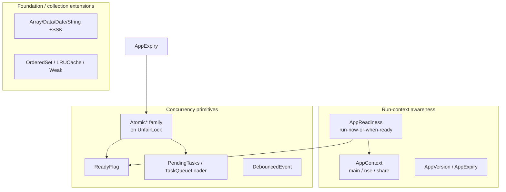

# Signal iOS — Util Module

This documentation set reconstructs Signal iOS's **`Util`** module from the
first-party source in `SignalServiceKit/Util/` (~118 Swift files). Unlike a
cohesive subsystem such as **Backups**, `Util` is a deliberate **grab-bag of
cross-cutting utilities**: app-lifecycle plumbing, thread-safe primitives,
Foundation/collection extensions, device/system probes, data-encoding helpers,
and a long tail of small, single-purpose helpers that the rest of
`SignalServiceKit` builds upon.

Because the module has no single orchestrating flow, this document is organized
**by category at the module level**, not file-by-file. Each category below has a
table of representative files with a one-line purpose; the most important
cross-cutting types (`AppReadiness`, `AppContext`, `Atomics`) each get a deeper
paragraph.

> **Coverage note.** This document is **category-level, not exhaustive.** The
> module contains ~118 files; the tables cite a representative, verified subset
> read directly from source. Files not named here (e.g. the many additional
> `+SSK`/`+OWS` extensions, UI-color helpers, and formatting utilities) follow
> the same conventions as their neighbors in the same category but were not
> individually inspected.

> **Confidence labels.** Each claim is tagged with a confidence level:
> - **[High]** — directly read from source; behavior is explicit in code.
> - **[Medium]** — inferred from code with reasonable certainty, but depends on
>   collaborators defined outside this directory (e.g. `UnfairLock`,
>   `KeyValueStore`, `LibSignalClient`, UIKit).
> - **[Low]** — inferred from naming/comments; not fully verified in-tree.
>
> Where the code does not reveal *why* something is done, this is stated as
> "intent undetermined — no evidence in source".
>
> All file+line citations refer to the state of the tree at the time of writing.
> Line numbers are approximate anchors; use the cited symbol name to locate code
> if lines have drifted.

---

## Synthesis: what `Util` is for

`Util` provides the shared substrate that higher-level `SignalServiceKit`
subsystems (Backups, messaging, attachments, registration) assume exists. Three
themes recur across the module:

1. **Run-context awareness.** Signal ships as a main app plus two extensions
   (NSE, Share). A large chunk of `Util` exists so that code can ask "which
   process am I?" and "is the app ready / foregrounded?" without caring about
   the answer's origin — `AppContext` and `AppReadiness` are the two load-bearing
   abstractions here. **[High]**
2. **Thread-safety without ceremony.** Signal predates full Swift Concurrency
   adoption, so `Util` carries a hand-rolled family of `Atomic*` wrappers and
   small coordination primitives (`ReadyFlag`, `PendingTasks`, `DebouncedEvent`)
   built on a shared `UnfairLock`. **[High]**
3. **Foundation ergonomics.** Dozens of `+SSK` / `+OWS` extensions add the small
   conveniences the standard library lacks (hex coding, dedup, millisecond
   timestamps, constant-time compare). **[High]**

---

## App lifecycle & readiness

The abstractions that let code reason about the running process and defer work
until the app is ready.

| File | Purpose |
| --- | --- |
| `AppContext.swift` | `AppContext` protocol + `AppContextType` (`main`/`nse`/`share`); process identity, foreground/background state, dirs, background tasks (`AppContext.swift:21`, `:34`). **[High]** |
| `AppReadiness.swift` | `AppReadiness`/`AppReadinessSetter` + `AppReadinessImpl`; run-now-or-when-ready block scheduling (`AppReadiness.swift:8`, `:191`). **[High]** |
| `ReadyFlag.swift` | Thread-safe one-shot "ready" flag backing `AppReadiness`, with will/did/polite block queues (`ReadyFlag.swift:25`). **[High]** |
| `AppVersion.swift` | `AppVersion` protocol + `AppVersionNumber`/`AppVersionNumber4`; current/first/last-launch version tracking (`AppVersion.swift:8`, `:70`). **[High]** |
| `AppExpiry.swift` | Tracks and persists app expiration (`default`/`immediately`/`atDate` modes); `AppExpiredError` at HTTP 499 (`AppExpiry.swift:11`, `:17`). **[High]** |
| `OWSBackgroundTask.swift` | RAII wrapper over `UIBackgroundTask` lifecycle. **[Medium]** |
| `BGProcessingTaskRescheduleOnCatch.swift` | Reschedule a `BGProcessingTask` if its body throws. **[Low]** — inferred from name; not inspected. |
| `DeviceSleepManager.swift` | Reference-counted "keep device awake" (idle-timer) management. **[Low]** |

### `AppContext` — the process-identity abstraction

`AppContext` is the protocol every piece of `SignalServiceKit` uses to learn
*which* process it is running in and *what state* that process is in, without a
direct UIKit dependency at the call site. It exposes `type`
(`.main`/`.nse`/`.share`, with `isMainApp`/`isNSE`/`isShareExtension`
conveniences at `AppContext.swift:101`), a **thread-safe**
`reportedApplicationState` that is deliberately *conservative* — it skews toward
"inactive"/"background" so callers err on the side of caution when gating
foreground-only work (`AppContext.swift:50`) — and process-appropriate directory
paths, `UserDefaults`, and background-task hooks. The extensions diverge in
behavior here: `beginBackgroundTask` is expected to be a no-op outside the main
app (`AppContext.swift:76`). **[High]**

### `AppReadiness` — deferring work until launch is done

`AppReadiness` solves "run this now if the app is ready, otherwise run it the
moment it becomes ready." It distinguishes **will-become-ready** blocks (internal
setup that must not touch other components) from **did-become-ready** blocks
(the safe default, which may use other components), and offers a **polite async**
flavor that spaces blocks out to avoid a launch-time "stampede" of database
writes that could starve the main thread and cause `0x8badf00d` watchdog crashes
(`AppReadiness.swift:52`). All blocks are `@MainActor` and dispatched main-thread-safe
(`AppReadiness.swift:243`). `AppReadinessImpl` is backed by two `ReadyFlag`s (app
vs. UI readiness) and short-circuits entirely under `isRunningTests`
(`AppReadiness.swift:168`, `:191`). An `AppReadinessObjcBridge` exposes a global
`isAppReady` for legacy/ObjC callers, explicitly documented as a bridge of last
resort (`AppReadiness.swift:332`). **[High]**

---

## Concurrency & atomics

Hand-rolled thread-safety primitives built on a shared `UnfairLock`, predating
Signal's Swift Concurrency adoption.

| File | Purpose |
| --- | --- |
| `Atomics.swift` | `AtomicBool`/`AtomicUInt`/`AtomicValue`/`AtomicOptional`/`AtomicArray`/`AtomicDictionary`/`AtomicSet` + `@Atomic` property wrapper (`Atomics.swift:21`, `:427`). **[High]** |
| `PendingTasks.swift` | Await outstanding "pending" work without background-task side effects; pre-structured-concurrency (`PendingTasks.swift:20`). **[High]** |
| `TaskQueueLoader.swift` | Generic DB-backed task-queue runner: `TaskRecord`/`TaskRecordStore`/`TaskRecordRunner` with retry timestamps (`TaskQueueLoader.swift:12`, `:28`). **[High]** |
| `DebouncedEvent.swift` | `DebouncedEvent`/`DebouncedEvents` with `lastOnly` and `firstLast` debouncing modes (`DebouncedEvent.swift:8`, `:56`). **[High]** |
| `Batching.swift` | `Batching.loop` — chunk long loops into autoreleasepool batches to bound memory (default 1000) (`Batching.swift:8`, `:16`). **[High]** |
| `ReverseDispatchQueue.swift` | LIFO-ordered dispatch queue. **[Low]** |
| `OffMainThreadTimer.swift` / `WeakTimer.swift` / `NSTimer+OWS.swift` | Off-main-thread and non-retaining timer helpers. **[Low]** |
| `OWSOperation.swift` | Base `Operation` subclass with retry/error hooks. **[Low]** |
| `DispatchQueue+OWS.swift` | Dispatch-queue conveniences (`DispatchMainThreadSafe`, etc.). **[Medium]** |

### `Atomics` — the lock-based primitive family

`Atomics.swift` defines a family of `Sendable`, lock-guarded wrappers around
mutable state, all sharing a single global `UnfairLock.sharedGlobal` by default
(`Atomics.swift:16`) while allowing a caller-supplied lock. The generic core is
`AtomicValue<T>`, which guards a `nonisolated(unsafe) var` behind
`lock.withLock { … }` and offers `get`/`set`/`swap`/`map`/`update`
(`Atomics.swift:102`). Equatable values gain a **compare-and-set** `transition(from:to:)`
that throws `AtomicError.invalidTransition` on mismatch — the basis for
`AtomicBool.tryToSetFlag()`/`tryToClearFlag()` (`Atomics.swift:153`, `:44`).
Specialized collections (`AtomicArray`, `AtomicDictionary`, `AtomicSet`) wrap the
same locking discipline with queue/dedup helpers (`popHead`, `pushTail`,
`removeAllValues`), and `@Atomic` is a property-wrapper convenience that gives
each property its own fresh `UnfairLock` (`Atomics.swift:427`). These are simple
mutual-exclusion wrappers, not lock-free atomics — the "atomic" refers to the
guarantee that each operation is indivisible, not to CPU atomic instructions. **[High]**

---

## Foundation & collection extensions

The `+SSK` / `+OWS` extensions and small collection types that add the standard
conveniences Foundation lacks. (This is the largest category by file count; the
table is representative.)

| File | Purpose |
| --- | --- |
| `Array+SSK.swift` | `anySatisfy`, `removingDuplicates`, `removeFirst(where:)`, `compacted`, `mapAsync` (`Array+SSK.swift:8`). **[High]** |
| `Data+SSK.swift` | Hex init/encode (`Data(hex:)`, `hexadecimalString`), `ows_constantTimeIsEqual` (`Data+SSK.swift:16`, `:40`, `:46`). **[High]** |
| `Date+SSK.swift` | HTTP/ISO-8601 date parsing, `ows_millisecondsSince1970` helpers (`Date+SSK.swift:23`, `:33`). **[High]** |
| `OrderedSet.swift` | Insertion-ordered set keeping both an array and a `Set` (`OrderedSet.swift:9`). **[High]** |
| `LRUCache.swift` | Entry-count-bounded LRU over `NSCache`, NSE-aware sizing + background eviction (`LRUCache.swift:9`, `:31`). **[High]** |
| `Weak.swift` | `Weak<T>` box and `WeakArray` for reference-semantic weak storage (`Weak.swift:14`, `:31`). **[High]** |
| `String+SSK.swift` / `String+OWS.swift` / `StringSanitizer.swift` | String conveniences and sanitization (companion `StringSanitizerTests.swift`). **[Medium]** |
| `Dictionary+SSK.swift` / `Sequence+OWS.swift` / `Collection+OWS.swift` / `SetAlgebra+SSK.swift` | Keyed/sequence/collection/set-algebra conveniences. **[Low]** |
| `OrderedDictionary.swift` / `MergingDict.swift` / `SetDeque.swift` / `Refinery.swift` | Specialized ordered/merging/deque collection types. **[Low]** |
| `Optional+SSK.swift` / `Result.swift` / `CaseIterable.swift` | Small standard-type helpers. **[Low]** |
| `Int+SSK.swift` / `UInt64+SSK.swift` / `Decimal+Rounded.swift` / `Decimal+IsInteger.swift` / `Math+OWS.swift` / `OWSMath.swift` | Numeric conveniences and rounding. **[Low]** |

---

## Device & system

Probes and managers that reach into hardware/OS state.

| File | Purpose |
| --- | --- |
| `LocalDevice.swift` | `LocalDevice.MemoryStatus` via Mach `task_vm_info` (footprint, bytes remaining) (`LocalDevice.swift:9`, `:17`). **[High]** |
| `DeviceBatteryLevelManager.swift` | Reason-counted battery monitoring; enables `UIDevice.isBatteryMonitoringEnabled` only while in use (`DeviceBatteryLevelManager.swift:21`, `:27`). **[High]** |
| `DarwinNotificationCenter.swift` | Ergonomic Swift wrapper over `notify(3)` cross-process notifications (`DarwinNotificationCenter.swift:15`). **[High]** |
| `DarwinNotificationName.swift` | Named Darwin notification constants (companion to the above). **[Medium]** |
| `Platform.swift` / `UIDevice+FeatureSupport.swift` | Platform/feature-capability probes. **[Low]** |
| `ProximityMonitoringManager.swift` / `DeviceSleepManager.swift` | Proximity-sensor and idle-timer management. **[Low]** |
| `ScreenLock.swift` / `DeviceOwnerAuthenticationType.swift` | Device-passcode/biometric screen-lock. **[Low]** |
| `Bundle+OWS.swift` / `Preferences.swift` / `SSKPreferences.swift` | Bundle info and preference accessors. **[Low]** |

---

## Data & encoding

Byte-level helpers: hashing, padding, checksums, identifiers.

| File | Purpose |
| --- | --- |
| `CRC32.swift` | `CRC32` struct wrapping zlib's incremental CRC-32 (`CRC32.swift:21`). **[High]** |
| `Data+MessagePadding.swift` | `paddedMessageBody` (80-byte-block `0x80` padding scheme) + `withoutPadding` (`Data+MessagePadding.swift:9`, `:25`). **[High]** |
| `UUIDv7.swift` | `UUID.v7(timestamp:)` — RFC 9562 time-ordered UUIDs for lexicographically sequential DB keys (`UUIDv7.swift:20`). **[High]** |
| `Data+SSK.swift` | Hex coding + constant-time compare (also listed under extensions) (`Data+SSK.swift:16`). **[High]** |
| `StreamTransform/` | Streaming transform helpers (directory). **[Low]** — not inspected. |
| `ImageMetadata/` | Image metadata extraction (directory). **[Low]** — not inspected. |
| `CGDataProvider+SSK.swift` / `ImageQuality.swift` | Image data-provider and quality helpers. **[Low]** |

---

## Misc helpers

Single-purpose utilities that don't fit the categories above.

| File | Purpose |
| --- | --- |
| `OWSFileSystem.swift` | Temp-dir creation with file-protection classes, old-temp cleanup (`OWSFileSystem.swift:8`, `:29`). **[High]** |
| `OWSProgress.swift` | `OWSProgressSink`/`OWSProgressSource` — combinable, async-friendly progress reporting (`OWSProgress.swift:8`). **[High]** |
| `MimeTypeUtil.swift` | `MimeType` enum of known MIME types + file-type mapping (`MimeTypeUtil.swift:10`). **[High]** |
| `LinkValidator.swift` | Reject messages/links containing bidi-override/problematic codepoints (`LinkValidator.swift:8`, `:16`). **[High]** |
| `FiatMoney.swift` | `FiatMoney` (currency code + `Decimal` value) `Codable` value type (`FiatMoney.swift:11`). **[High]** |
| `OWSError.swift` / `Error+SSK.swift` / `Error+IsRetryable.swift` / `Error+ErrorLocalizedDescription.swift` | Error types, retryability, and localized-description helpers. **[Medium]** |
| `OWSFormat.swift` / `DateUtil.swift` / `CommonStrings.swift` / `OWSLocalizedString.swift` | Formatting, date display, and localized-string helpers. **[Medium]** |
| `Bench.swift` | Lightweight timing/benchmark instrumentation. **[Low]** |
| `ObjectRetainer.swift` / `SecurityScopedBookmark.swift` / `ParamParser.swift` | Object-lifetime, security-scoped bookmarks, and param parsing. **[Low]** |
| `OWSSequentialProgress.swift` / `OWSPaymentsLock.swift` / `OWS2FAManager.swift` / `APNSRotationStore.swift` | Domain-specific helpers (progress, payments lock, 2FA, APNS). **[Low]** |

---

## Cross-cutting conventions observed in the code

- **`UnfairLock.sharedGlobal` is the default lock** for the entire `Atomic*`
  family unless a caller passes its own (`Atomics.swift:16`). **[High]**
- **`CurrentAppContext()` gates behavior everywhere** — e.g. `AppReadiness`
  short-circuits under `isRunningTests` and `LRUCache` sizes itself differently
  in the NSE (`AppReadiness.swift:168`, `LRUCache.swift:31`). **[High]**
- **`+SSK` and `+OWS` suffixes** mark Signal's own extensions on Foundation/UIKit
  types vs. first-party `OWS*`-prefixed types (`OWSFileSystem`, `OWSProgress`,
  `OWSError`). **[High]**
- **Many helpers predate Swift Concurrency** and say so explicitly
  (`PendingTasks.swift:18`), so expect lock-based rather than actor-based
  coordination. **[High]**
- **Milliseconds-since-1970 is Signal's canonical timestamp unit**, surfaced via
  `ows_millisecondsSince1970` / `ows_millisecondTimestamp` on `Date`/`NSDate`
  (`Date+SSK.swift:33`). **[High]**

This document is intentionally category-level. For any individual helper not
named above, read the file directly — the module's small, self-contained files
are generally self-documenting and follow their category's conventions.
