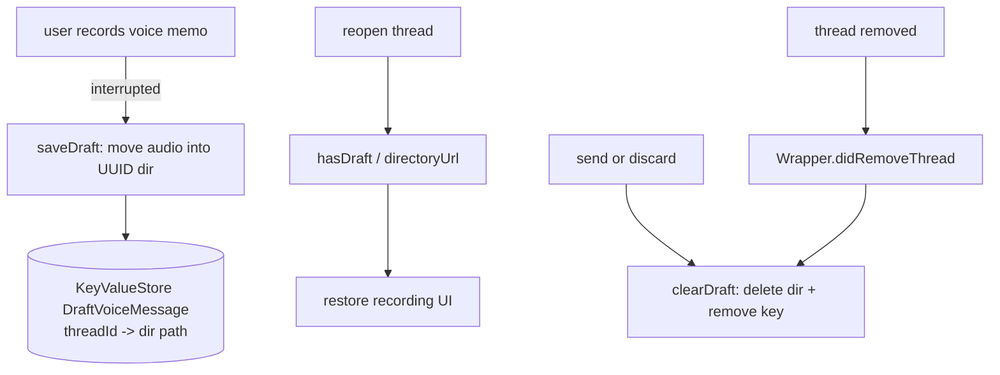

# Voice Messages

Covers `SignalServiceKit/VoiceMessage/`:

- `VoiceMessageInterruptedDraftStore.swift`
- `VoiceMessageConstants.swift`

This folder is small: it persists an **in-progress (interrupted) voice-memo draft** per thread, so
that a half-recorded voice message survives app backgrounding/termination. The actual
recording/encoding/UI lives elsewhere; once a voice message is finalized it becomes a normal
attachment (see [Attachments](../Attachments/README.md)) with the `voiceMessage` rendering flag.

---

## `VoiceMessageConstants` — `VoiceMessageConstants.swift:7`

Confidence: HIGH. `fileExtension = "m4a"` — the on-disk container for voice memos.

> Related: `AttachmentStream.makeDecryptedCopy` special-cases the legacy `aac` extension to `.m4a`
> because `AVAudioPlayer` can't handle `.aac` properly (see
> [V2-Model.md](../Attachments/V2-Model.md#attachmentstream--attachmentstreamswift12)).

---

## `VoiceMessageInterruptedDraftStore` — `VoiceMessageInterruptedDraftStore.swift:7`

Confidence: HIGH (read in full). A static-only store (private `init`).

- **Storage layout.** Drafts live under `draftVoiceMessageDirectory` (`:11`):
  `<appSharedDataDirectory>/draft-voice-messages/`. Each draft gets a random UUID subdirectory
  containing `Constants.audioFilename` (`voice-memo.m4a`, `:19`) and `Constants.waveformFilename`
  (`waveform.dat`, `:20`).
- **Index.** A `KeyValueStore(collection: "DraftVoiceMessage")` (`:44`) maps a thread's `uniqueId`
  to its draft's relative directory path.

### API
| Method | Line | Behavior |
|--------|------|----------|
| `directoryUrl(threadUniqueId:transaction:)` | 31 | Resolve a thread's draft directory URL (nil if none). |
| `hasDraft(for thread:transaction:)` / `(for threadUniqueId:...)` | 46 / 50 | Whether a draft exists for the thread. |
| `allDraftFilePaths(transaction:)` | 54 | All draft audio + waveform relative paths across all threads (used for orphan file cleanup). |
| `clearDraft(for thread:...)` / `(for threadUniqueId:...)` | 65 / 69 | Delete the draft directory (best-effort, `owsFailDebug` on failure) and remove the index entry. |
| `saveDraft(audioFileUrl:threadUniqueId:transaction:)` | 80 | Allocate a UUID directory, record it in the index, ensure the directory exists, and move the audio file into it. Returns the directory URL. |

### `VoiceMessageInterruptedDraftStoreWrapper` — `:93`
Confidence: HIGH. A `ThreadRemoverObserver`; `didRemoveThread(_:tx:)` clears the thread's draft so
voice-memo drafts don't outlive their thread.

Edge cases (confidence: HIGH): file-system failures during save/clear are logged via
`owsFailDebug` but do not throw; `allDraftFilePaths` lets the broader orphan-file sweep account for
draft files; removing a thread cascades to clearing its draft.
