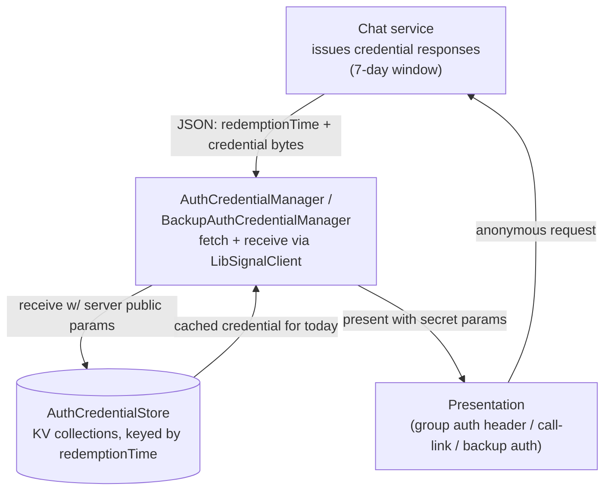
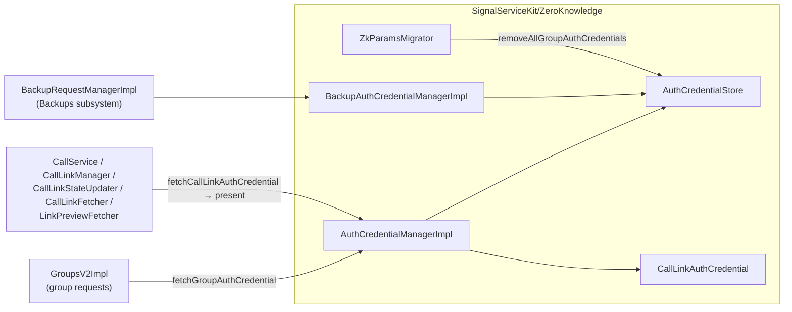

# Signal iOS — ZeroKnowledge Subsystem

This document covers the first-party source in `SignalServiceKit/ZeroKnowledge/`,
which fetches, caches, and presents the **zkgroup / libsignal zero-knowledge
auth credentials** that authorize anonymous (sealed-sender-style) requests to the
Signal service for three features: **GroupsV2**, **call links**, and **Backups**.
It also owns a small **migration** that resets zkgroup-derived local state when
the credential/params format changes.

The actual zero-knowledge cryptography (credential issuance verification, proof
generation, server-param handling) lives in the **LibSignalClient** library; the
code here is the glue that requests credentials from the chat service, persists
them per redemption-day, and hands out presentations to callers.

> **Confidence labels.** Each claim is tagged:
> - **[High]** — directly read from source in `SignalServiceKit/ZeroKnowledge/`;
>   behavior is explicit in code.
> - **[Medium]** — inferred with reasonable certainty but depends on collaborators
>   defined outside this folder (LibSignalClient crypto, the network stack,
>   `GroupsV2Impl`, the Backups subsystem, the call-link managers).
> - **[Low]** — inferred from naming/comments; not fully verified in-tree.
>
> File+line citations refer to the tree at time of writing; line numbers are
> approximate anchors — use the cited symbol name if lines have drifted.

## Files

| File | Role |
| --- | --- |
| `AuthCredentialManager.swift` | Protocol + impl for fetching **group** and **call-link** auth credentials; caches a week at a time. |
| `AuthCredentialStore.swift` | Per-redemption-day persistence of group, call-link, and backup (messages/media) credentials in key-value collections. |
| `BackupAuthCredentialManager.swift` | Protocol + impl for fetching **Backup** auth (`BackupServiceAuth`) and SVR-B auth, with entitlement-dependency sequencing. |
| `CallLinkAuthCredential.swift` | Thin wrapper over a libsignal `CallLinkAuthCredential` that produces a `CallLinkAuthCredentialPresentation`. |
| `ZkParamsMigrator.swift` | One-shot migration that resets zkgroup-derived local state when a migration counter is bumped. |

## The central concept: anonymous, time-bound credentials

The server issues credentials that let the client prove "I'm a valid, registered
user" (and, for groups, that it's a given ACI/PNI) **without** the request itself
carrying the user's normal identified auth. Each credential is scoped to a
**redemption time** — midnight (epoch seconds) at the start of a UTC day — and the
client always fetches a **7-day window** at once, then caches it keyed by
redemption day. At presentation time the client derives a zero-knowledge
*presentation* from the stored credential plus the relevant secret params (group
secret params, call-link secret params, backup key material). **[High]**

Three recurring properties:

- **Redemption-day keying.** "Today" is computed as
  `floor(now / 1 day) * 1 day` in epoch seconds
  (`AuthCredentialManager.swift:191` `startOfTodayTimestamp()`;
  `BackupAuthCredentialManager.swift` `epochSecondsSinceStartOfToday`). Credentials
  outside the requested `startTimestamp...endTimestamp` range are dropped with an
  `owsFailDebug`. **[High]**
- **Fetch-ahead + cache.** A single fetch requests 7 days
  (`Constants.numberOfDaysToFetch = 7`, `AuthCredentialManager.swift:47`; backups
  use `7 * .dayInSeconds`). The manager reads today's cached credential first and
  only hits the network on a miss. **[High]**
- **The crypto is delegated.** `receive…` / `present…` / `BackupServiceAuth`
  construction all come from LibSignalClient; this folder only moves bytes and
  server public params around. **[Medium]** (collaborator is external to the folder)

## `AuthCredentialManager` — group & call-link credentials

`AuthCredentialManager.swift:9` is the protocol with two members:
`fetchGroupAuthCredential(localIdentifiers:)` → `AuthCredentialWithPni` and
`fetchCallLinkAuthCredential(localIdentifiers:)` → `CallLinkAuthCredential`.
`AuthCredentialManagerImpl` (`:28`) is the production implementation; a
`MockAuthCrededentialManager` exists under `#if TESTABLE_BUILD` (`:17`). **[High]**

- **Shared fetch core.** Both public methods call the generic
  `fetchAuthCredential(for:localIdentifiers:fetchCachedAuthCredential:authCredentialsKeyPath:)`
  (`:78`). It (1) tries the cache (swallowing errors with `owsFailDebug` and
  falling through), (2) on a miss calls `fetchNewAuthCredentials` for the full
  7-day window, (3) writes **all** received group *and* call-link credentials in a
  single `awaitableWrite` (clearing the respective collections first), then (4)
  returns the credential whose `redemptionTime` matches "today", or throws
  `OWSAssertionError("The server didn't give us the credential we requested")`.
  **[High]**
- **Network + receive.** `fetchNewAuthCredentials` (`:136`) builds
  `OWSRequestFactory.authCredentialRequest(from:to:)`, sends it via
  `SSKEnvironment.shared.networkManagerRef.asyncRequest`, and decodes
  `AuthCredentialResponse` (keys: `pni`, `credentials` → group, `callLinkAuthCredentials`).
  It logs (but does not fail) when the response `pni` doesn't match the local PNI
  (`:153`). **[High]**
- **Group credentials** are received with
  `ClientZkAuthOperations(serverPublicParams:).receiveAuthCredentialWithPniAsServiceId(aci:pni:redemptionTime:authCredentialResponse:)`
  using `GroupsV2Protos.serverPublicParams()` (`:158`). The result type is
  `AuthCredentialWithPni` — i.e. the credential binds **both** the ACI and the PNI
  for the day. **[High]**
- **Call-link credentials** are received with
  `CallLinkAuthCredentialResponse(contents:).receive(userId:redemptionTime:params:)`
  (`:178`) using the injected `callLinkPublicParams` (a `GenericServerPublicParams`),
  then the day's credential is wrapped into the local `CallLinkAuthCredential` value
  type (`:69`). **[High]**

### `CallLinkAuthCredential` — presentation wrapper

`CallLinkAuthCredential.swift:8` is a value type holding the `localAci`,
`redemptionTime`, server public params, and the libsignal
`CallLinkAuthCredential`. Its only behavior is `present(callLinkParams:)`
(`:27`), which calls the libsignal credential's `present(userId:redemptionTime:serverParams:callLinkParams:)`
to produce a `CallLinkAuthCredentialPresentation` — the token a client attaches
when creating/reading/updating a call link anonymously. **[High]**

## `AuthCredentialStore` — persistence

`AuthCredentialStore.swift:8` wraps four `NewKeyValueStore` collections (`:14`):

| Collection name | Holds |
| --- | --- |
| `"CallLinkAuthCredentialV2"` | call-link credentials |
| `"GroupsV2Impl.authCredentialStoreStore"` | group credentials (`AuthCredentialWithPni`) |
| `"BackupAuthCredential"` | backup **messages** credentials |
| `"MediaAuthCredential"` | backup **media** credentials |

Keys are derived from the redemption time: call-link and backup use the raw
`"\(redemptionTime)"`; group uses the prefixed `"ACWP_\(redemptionTime)"`
(`:21`–`:29`). Each getter deserializes bytes back into the appropriate
LibSignalClient credential type (`AuthCredentialWithPni(contents:)`,
`LibSignalClient.CallLinkAuthCredential(contents:)`,
`BackupAuthCredential(contents:)`); setters call `.serialize()`. The backup getter
catches deserialization errors and logs `"Invalid backup credential format"`
rather than throwing (`:116`). Each credential family has `set…`, `removeAll…`,
and the backup family additionally has a type-parameterized API plus a public
`removeAllBackupAuthCredentials(tx:)` that clears every `BackupAuthCredentialType`
(`:149`). **[High]**

The collection names are stable on-disk identifiers; note the group collection
name retains a `GroupsV2Impl`-era name for historical/compatibility reasons.
**[Medium]**

## `BackupAuthCredentialManager` — Backups auth

`BackupAuthCredentialManager.swift:19` is the protocol; `BackupAuthCredentialManagerImpl`
(`:61`) the impl. It produces `BackupServiceAuth` (and SVR-B `LibSignalClient.Auth`)
used by the Backups subsystem to talk to the backup service/CDN. Two credential
types exist: `BackupAuthCredentialType.media` / `.messages`
(`:9`). **[High]**

- **Serialized fetches.** All three public methods run inside a
  `ConcurrentTaskQueue(concurrentLimit: 1)` (`:70`) so credential fetches don't
  race. **[High]**
- **Entitlement dependencies run first.** Before fetching, the impl awaits
  `BackupAuthCredentialDependency` steps (`:234`): `registerBackupId` (via
  `backupIdService.registerBackupIDIfNecessary`, wrapped in
  `Retry.performWithBackoff` honoring `Retry-After` because the endpoint is tightly
  rate-limited), `redeemBackupSubscriptionViaIAP`
  (`backupSubscriptionManager.redeemSubscriptionIfNecessary`), and
  `renewBackupEntitlementForTestFlight`
  (`backupTestFlightEntitlementManager.renewEntitlementIfNecessary`). These have
  side-effects that gate whether the server will issue **paid-tier** credentials.
  **[High]**
- **Registration vs. normal.** `fetchBackupServiceAuthForRegistration` (`:92`) runs
  only the `registerBackupId` dependency and **does not cache** — the doc comment
  warns it makes no entitlement moves and may not return paid-tier auth. The normal
  `fetchBackupServiceAuth` (`:128`) runs all three dependencies, consults the cache,
  fetches on miss, and persists. **[High]**
- **Cache policy.** `readCachedAuthCredential` (`:302`) only returns a cached
  credential if there are **>4 days** of credentials remaining (it probes
  `redemptionTime + 4 days`), otherwise triggers a refresh. A missing "today"
  credential while a future one exists is an `owsFailDebug`. `readCachedServiceAuth`
  (`:337`) additionally skips the cache when
  `forceRefreshUnlessCachedPaidCredential` is set and the cached level is `.free`,
  and memoizes derived `BackupServiceAuth` in an `LRUCache<Data, BackupServiceAuth>`
  (max 4) keyed by the serialized credential. **[High]**
- **Receive.** `fetchNewAuthCredentials` (`:394`) fetches a 7-day window via
  `OWSRequestFactory.backupAuthenticationCredentialRequest`, maps a `404` to
  `BackupAuthCredentialFetchError.noExistingBackupId` (`:16`), decodes
  `BackupCredentialResponse` (credentials keyed by `BackupAuthCredentialType`), and
  for each in-range entry builds a `BackupAuthCredentialRequestContext.create(backupKey:aci:)`
  and calls `.receive(_:timestamp:params:)` with
  `GenericServerPublicParams(contents: TSConstants.backupServerPublicParams)`.
  `BackupServiceAuth` is then constructed from `key.deriveEcKey(aci:)`, the received
  credential, and the credential type. **[High]**
- **SVR-B auth.** `fetchSVRBAuthCredential` (`:188`) first obtains a
  `BackupServiceAuth`, then calls `OWSRequestFactory.fetchSVRBAuthCredential(auth:)`
  and decodes a plain username/password into `LibSignalClient.Auth`. **[High]**

## `ZkParamsMigrator` — resetting zkgroup-derived state

`ZkParamsMigrator.swift:8` runs a one-shot, counter-gated migration at app
startup. It stores a counter in the `KeyValueStore(collection: "GroupsV2Impl.serviceStore")`
(name kept "for historical reasons", `:29`) and compares it against
`Constants.zkGroupMigrationCounter` (currently `5`, `:42`). The counter is **not**
the zkgroup library version — it's a local bump-when-you-need-to-migrate counter.
**[High]**

`migrateIfNeeded()` (`:45`) no-ops unless the stored counter is behind. For
counters `0–4` it (`performMigration`, `:61`): logs "Resetting zkgroup-related
state", clears all group auth credentials
(`authCredentialStore.removeAllGroupAuthCredentials`), clears profile-key
credentials (`versionedProfiles.clearProfileKeyCredentials`), re-uploads the local
profile, and removes the cached `lastServerPublicParamsKey`. The `case 5` branch is
a placeholder (fallthrough) for the next migration. The re-upload is deferred via
`appReadiness.runNowOrWhenAppDidBecomeReadyAsync` and skipped if unregistered
(`:83`). **[High]**

## Wiring & consumers

- **Construction** happens in `SignalServiceKit/Environment/AppSetup.swift`:
  `AuthCredentialStore()` (`:362`), `callLinkPublicParams` from
  `tsConstants.callLinkPublicParams` (`:364`), `AuthCredentialManagerImpl` (`:365`),
  and `BackupAuthCredentialManagerImpl` inside `BackupRequestManagerImpl` (`:554`).
  The store is shared with `GroupsV2Impl` (`:375`). `ZkParamsMigrator(...).migrateIfNeeded()`
  is invoked during launch (`:2264`). **[High]**
- **GroupsV2** consumes `fetchGroupAuthCredential` inside its service-request retry
  loop and passes the credential to the request builder
  (`GroupsV2Impl.swift:1123`). **[High]**
- **Call links** consume `fetchCallLinkAuthCredential` and then `.present(callLinkParams:)`
  across `CallService.swift:683`/`696`, `CallLinkManager.swift`,
  `CallLinkStateUpdater.swift:86`, `CallsListViewController.swift:1253`,
  `SignalUI/Calls/CallLinkFetcher.swift:31`, and
  `SignalUI/LinkPreview/LinkPreviewFetcher.swift:365`. **[High]**
- **Backups** consume `BackupServiceAuth` / SVR-B auth via `BackupRequestManager`
  and the backup attachment/CDN flows (see
  [Backups/server-and-cdn.md](../Backups/server-and-cdn.md)). **[Medium]**

## Cryptography considerations

- **Zero-knowledge auth, not identified auth.** The server never learns which
  identified account made a group/call-link/backup request from the credential
  presentation alone — the presentation proves membership/validity without
  revealing the ACI to the request handler. Verification/issuance math is in
  LibSignalClient; this folder trusts those APIs. **[Medium]**
- **ACI+PNI binding for groups.** Group credentials are
  `AuthCredentialWithPni`, received via `receiveAuthCredentialWithPniAsServiceId`,
  so a credential binds the ACI *and* PNI for its redemption day — relevant to the
  GroupsV2 identity split (full/requesting members are ACIs; PNIs can only be
  invited). See [Groups](../Groups/README.md). **[High]**
- **Server public params are trust anchors.** Receiving a credential requires the
  correct server public params: `GroupsV2Protos.serverPublicParams()` for groups,
  the injected `callLinkPublicParams` for call links, and
  `TSConstants.backupServerPublicParams` for backups. A params change is exactly
  what `ZkParamsMigrator` exists to recover from (clearing stale credentials and
  profile-key credentials, and dropping the cached `lastServerPublicParams`).
  **[High]**
- **Time-boxing limits replay/stale use.** Day-scoped `redemptionTime` keys and the
  strict `timestampRange.contains(...)` checks mean credentials can't be used
  outside their issued window, and the client refuses credentials it didn't request.
  **[High]**
- **Entitlement side-effects precede backup credentials.** Because paid-tier backup
  auth depends on server-side entitlement (IAP redemption / TestFlight renewal /
  backup-id registration), those steps are forced *before* fetching, and the cache
  can be bypassed to confirm paid eligibility
  (`forceRefreshUnlessCachedPaidCredential`). **[High]**
- **Secret params never leave the client.** Presentations are derived locally from
  secret params (group secret params, `CallLinkSecretParams`, derived EC key) held
  outside this folder; only the resulting zero-knowledge presentation/auth is sent.
  **[Medium]**

> **Not covered here:** the libsignal credential/proof internals, the group state
> model, profile-key credentials (owned by `VersionedProfiles`), and the Backups
> request/CDN flow all live outside `SignalServiceKit/ZeroKnowledge/` — see the
> [Groups](../Groups/README.md), [Backups](../Backups/README.md), and
> [Cryptography](../Cryptography/README.md) docs.
