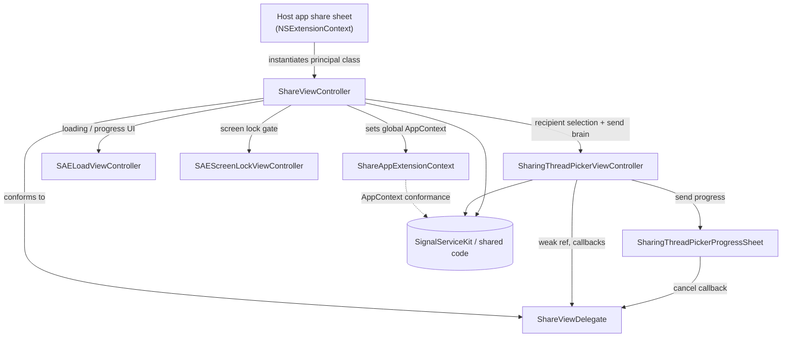
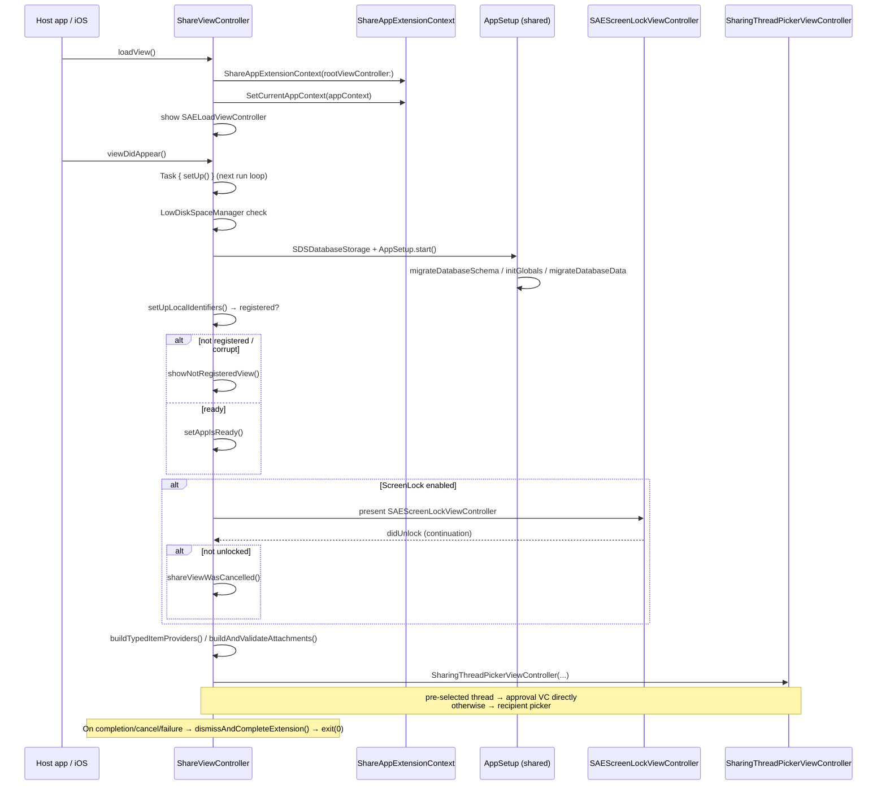
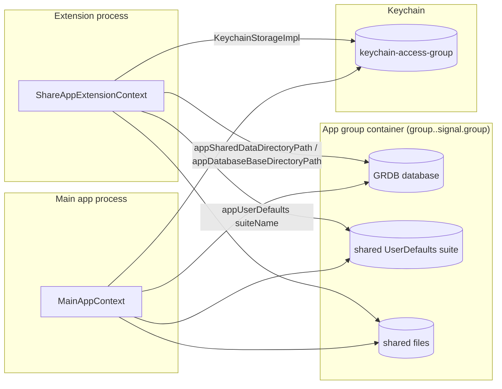
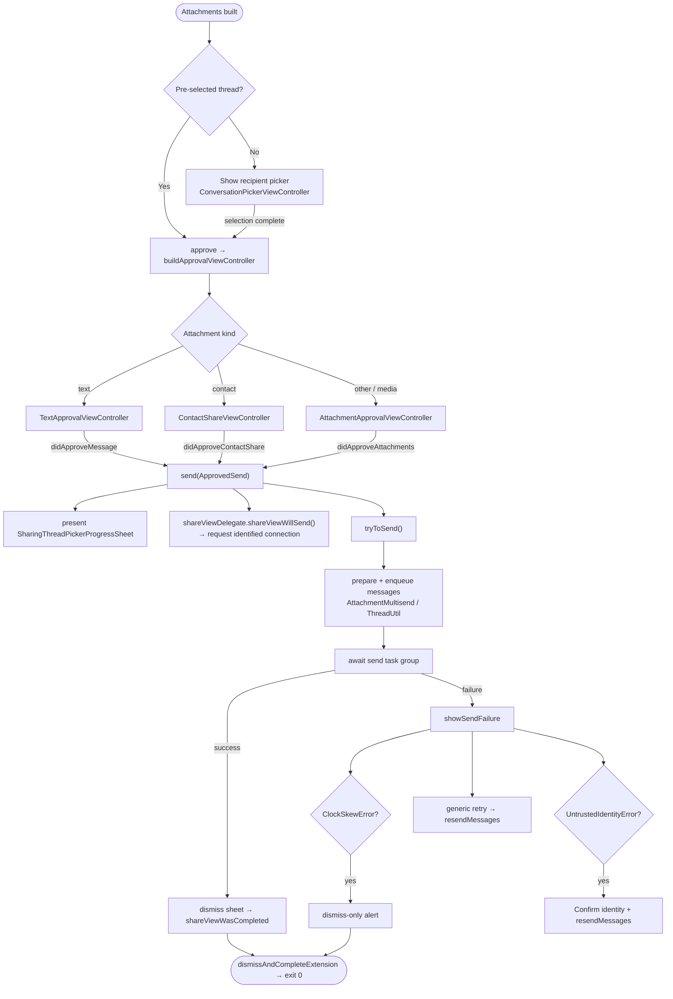
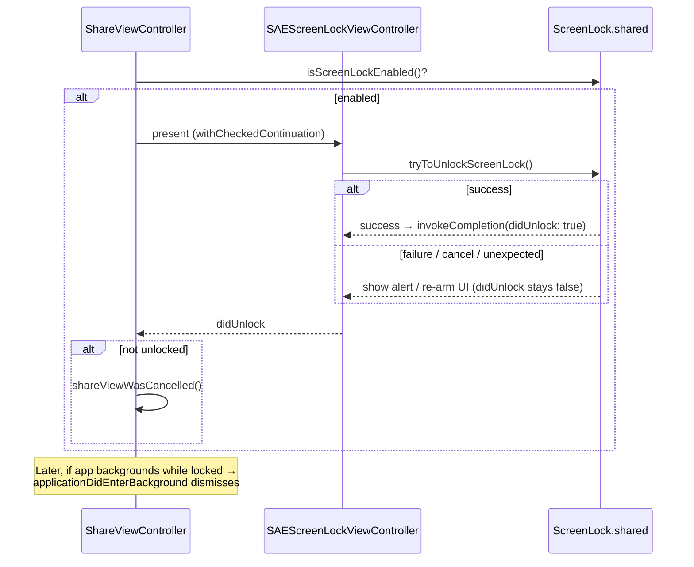

# SignalShareExtension

The **share extension** (SAE — "Share App Extension") is the iOS App Extension that
appears in the system share sheet so that content from other apps (text, URLs,
images, videos, contacts, PDFs, Apple Wallet passes, …) can be sent through Signal
without launching the main app.

It is a separate process from the main Signal app, bundled with the point
identifier `com.apple.share-services`
([`Info.plist`](../../SignalShareExtension/Info.plist), key `NSExtensionPointIdentifier`),
and its principal class is `ShareViewController`
([`Info.plist`](../../SignalShareExtension/Info.plist), key `NSExtensionPrincipalClass` →
`$(PRODUCT_MODULE_NAME).ShareViewController`).

> Confidence labels used throughout these docs:
> **[High]** stated directly by the code; **[Medium]** strongly implied by the code
> or dependent on shared code not in this target; **[Low]** inferred, would need
> code outside this target to confirm.

## Documents in this folder

Mirrors the target's file structure (one doc per first-party source file):

| Doc | Source file |
| --- | --- |
| [ShareViewController.md](ShareViewController.md) | `SignalShareExtension/ShareViewController.swift` |
| [SharingThreadPickerViewController.md](SharingThreadPickerViewController.md) | `SignalShareExtension/SharingThreadPickerViewController.swift` |
| [SharingThreadPickerProgressSheet.md](SharingThreadPickerProgressSheet.md) | `SignalShareExtension/SharingThreadPickerProgressSheet.swift` |
| [ShareViewDelegate.md](ShareViewDelegate.md) | `SignalShareExtension/ShareViewDelegate.swift` |
| [ShareAppExtensionContext.md](ShareAppExtensionContext.md) | `SignalShareExtension/ShareAppExtensionContext.swift` |
| [SAEScreenLockViewController.md](SAEScreenLockViewController.md) | `SignalShareExtension/SAEScreenLockViewController.swift` |
| [SAELoadViewController.md](SAELoadViewController.md) | `SignalShareExtension/SAELoadViewController.swift` |

Supporting (non-source) files in the target: `Info.plist`,
`SignalShareExtension.entitlements`, `SignalShareExtension-AppStore.entitlements`,
`PrivacyInfo.xcprivacy`.

## Component relationships

**[High]** `ShareViewController` is the hub: it installs the `AppContext`, owns the
navigation stack, conforms to `ShareViewDelegate`, and swaps between the load,
screen-lock, picker, and approval view controllers.

## Extension lifecycle

**[High]** `loadView()` runs first and installs the app context before anything
else ([`ShareViewController.swift:34`](../../SignalShareExtension/ShareViewController.swift)).
`viewDidAppear()` schedules `setUp()` on the next run loop so the loading spinner is
visible while `setUp()` may block
([`ShareViewController.swift:56`](../../SignalShareExtension/ShareViewController.swift)).

**[High]** When the extension finishes — success, cancel, or failure — it calls
`dismissAndCompleteExtension()`, which forwards to the host's `extensionContext`
(`completeRequest` / `cancelRequest(withError:)`) and then calls `exit(0)`
([`ShareViewController.swift:355`](../../SignalShareExtension/ShareViewController.swift)).
The explicit `exit(0)` is deliberate: share extension processes may be reused
between invocations, and the codebase relies on statics/singletons that cannot be
safely reset, so the process is torn down
([`ShareViewController.swift:370`](../../SignalShareExtension/ShareViewController.swift)).

## Shared code and app-group state

**[High]** The extension and the main app are separate processes that share state
through the **App Group container** and a **shared keychain group**, declared in
[`SignalShareExtension.entitlements`](../../SignalShareExtension/SignalShareExtension.entitlements)
<<<<<<< ours
<<<<<<< ours
<<<<<<< ours
(`com.apple.security.application-groups` → `group.$(SIGNAL_BUNDLEID_PREFIX).signal.group`
and `group.$(SIGNAL_BUNDLEID_PREFIX).signal.group.staging`; `keychain-access-groups`).
=======
(`com.apple.security.application-groups` → `group.$(SIGNAL_BUNDLEID_PREFIX).signal`
and `.staging`; `keychain-access-groups`).
>>>>>>> theirs
=======
(`com.apple.security.application-groups` → `group.$(SIGNAL_BUNDLEID_PREFIX).signal.group`
and `group.$(SIGNAL_BUNDLEID_PREFIX).signal.group.staging`; `keychain-access-groups`).
>>>>>>> theirs
=======
(`com.apple.security.application-groups` → `group.$(SIGNAL_BUNDLEID_PREFIX).signal.group`
and `group.$(SIGNAL_BUNDLEID_PREFIX).signal.group.staging`; `keychain-access-groups`).
>>>>>>> theirs

**[High]** `ShareAppExtensionContext` resolves all shared paths from the app-group
container: `appSharedDataDirectoryPath()` uses
`FileManager.containerURL(forSecurityApplicationGroupIdentifier: TSConstants.applicationGroup)`
([`ShareAppExtensionContext.swift:168`](../../SignalShareExtension/ShareAppExtensionContext.swift)),
`appDatabaseBaseDirectoryPath()` is the same directory
([`ShareAppExtensionContext.swift:179`](../../SignalShareExtension/ShareAppExtensionContext.swift)),
and `appUserDefaults()` opens the shared suite
`UserDefaults(suiteName: TSConstants.applicationGroup)`
([`ShareAppExtensionContext.swift:183`](../../SignalShareExtension/ShareAppExtensionContext.swift)).
Because both processes point at the same GRDB file and defaults suite, the
extension reads the same registration/account state and threads the main app wrote.
**[Medium]** This is also why `setUp()` runs the normal shared `AppSetup`,
schema/data migrations, and cache reloads before using the database
([`ShareViewController.swift:74`](../../SignalShareExtension/ShareViewController.swift)) —
the extension can be the first process to open the DB after an app update.

**[High]** The extension declares `NSFileProtectionComplete`
([`SignalShareExtension.entitlements`](../../SignalShareExtension/SignalShareExtension.entitlements),
`com.apple.developer.default-data-protection`), so shared files are inaccessible
while the device is locked — a cross-process concern that interacts with screen
lock handling below.

### Cross-process concerns

- **[High]** `shouldProcessIncomingMessages` is `false`
  ([`ShareAppExtensionContext.swift:194`](../../SignalShareExtension/ShareAppExtensionContext.swift)):
  the extension must not run the message-processing pipeline that belongs to the
  main app, even though it shares the database.
- **[High]** `beginBackgroundTask` returns `.invalid` and `endBackgroundTask`
  asserts the identifier is `.invalid`
  ([`ShareAppExtensionContext.swift:139`](../../SignalShareExtension/ShareAppExtensionContext.swift)):
  background-task APIs are not available to extensions.
- **[High]** `runNowOrWhenMainAppIsActive` is a hard `owsFailBeta`
  ([`ShareAppExtensionContext.swift:152`](../../SignalShareExtension/ShareAppExtensionContext.swift)):
  main-app-only work cannot be scheduled from the extension.
- **[High]** The `AppContext` reports `type == .share`, `isMainAppAndActive == false`
  ([`ShareAppExtensionContext.swift:115`](../../SignalShareExtension/ShareAppExtensionContext.swift)),
  so shared code can branch on being inside the extension.

## Sharing-to-send flow

**[High]** The brain of sending is `SharingThreadPickerViewController` (a
`ConversationPickerViewController` subclass). All three approval controllers funnel
into `send(_:)`
([`SharingThreadPickerViewController.swift:196`](../../SignalShareExtension/SharingThreadPickerViewController.swift)),
which presents the progress sheet, calls `shareViewWillSend()` (requesting an
identified chat connection — see
[`ShareViewController.swift`](../../SignalShareExtension/ShareViewController.swift)),
and runs `tryToSend(...)`
([`SharingThreadPickerViewController.swift:221`](../../SignalShareExtension/SharingThreadPickerViewController.swift)).

**[High]** Failures are surfaced by `showSendFailure(_:)`
([`SharingThreadPickerViewController.swift:435`](../../SignalShareExtension/SharingThreadPickerViewController.swift)),
which special-cases `ClockSkewError` (dismiss-only) and `UntrustedIdentityError`
(confirm the safety number, then resend), with a generic retry otherwise. Retrying
is handled by `resendMessages(_:)`
([`SharingThreadPickerViewController.swift:537`](../../SignalShareExtension/SharingThreadPickerViewController.swift)).

See [SharingThreadPickerViewController.md](SharingThreadPickerViewController.md) for
the per-branch detail of text / contact / media sends.

## Screen-lock handling

**[High]** During `setUp()`, if `ScreenLock.shared.isScreenLockEnabled()` the
extension presents `SAEScreenLockViewController` and awaits unlock via a
`withCheckedContinuation`; if the user does not unlock, the share is cancelled
([`ShareViewController.swift:74`](../../SignalShareExtension/ShareViewController.swift)).

**[High]** After setup, `ShareViewController` observes
`OWSApplicationDidEnterBackground`; if screen lock is enabled when the extension
backgrounds, it dismisses with `ShareViewControllerError.screenLockEnabled`
([`ShareViewController.swift:258`](../../SignalShareExtension/ShareViewController.swift)).
**[Medium]** That `OWSApplicationDidEnterBackground` notification is re-posted by
`ShareAppExtensionContext` from the extension-host notification
`NSExtensionHostDidEnterBackground`
([`ShareAppExtensionContext.swift`](../../SignalShareExtension/ShareAppExtensionContext.swift)) —
the context bridges the extension-host lifecycle into the app's own notifications.

See [SAEScreenLockViewController.md](SAEScreenLockViewController.md) for the unlock
state machine (success / failure / unexpected / cancel).
