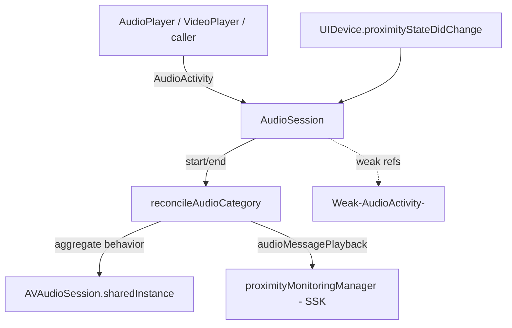
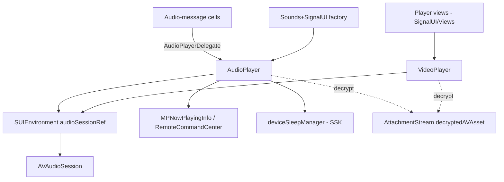

# Audio/Video Playback (AV)

Source: `SignalUI/AV/`. This area owns Signal iOS's **shared media playback**
primitives: a process-wide `AVAudioSession` arbiter (`AudioSession`), the
seekable audio-message/sound player (`AudioPlayer`), the video player wrapper
(`VideoPlayer`), and a small bridge that turns a notification `Sound` into an
`AudioPlayer` (`Sounds+SignalUI`). It does **not** render UI — the player views
(`VideoPlayerView`, `LoopingVideoView`, etc.) live in `SignalUI/Views/` and drive
these objects.

> Confidence labels: **[High]** read in full; **[Medium]** signature/partial read
> or depends on code outside `SignalUI/AV/`; **[Low]** inferred. Citations are
> `File.swift:line`. An uncited claim is a defect.

## Responsibility

**[High]** The directory is four files:

- `AudioSession.swift` — the `AudioSession` arbiter (`SignalUI/AV/AudioSession.swift:65`)
  plus the `AudioActivity` value type (`SignalUI/AV/AudioSession.swift:9`) and the
  `AudioBehavior`/`CategoryOptions` extensions.
- `AudioPlayer.swift` — the `AudioPlayer` (`SignalUI/AV/AudioPlayer.swift:34`),
  the `AudioPlayerDelegate` protocol (`SignalUI/AV/AudioPlayer.swift:25`), and the
  `AudioBehavior`/`AudioPlaybackState` enums (`SignalUI/AV/AudioPlayer.swift:10`,
  `:19`).
- `VideoPlayer.swift` — the `VideoPlayer` (`SignalUI/AV/VideoPlayer.swift:13`) and
  the `VideoPlayerDelegate` protocol (`SignalUI/AV/VideoPlayer.swift:9`).
- `Sounds+SignalUI.swift` — a `Sounds` extension factory for sound playback
  (`SignalUI/AV/Sounds+SignalUI.swift:8`).

## `AudioSession`: the process-wide audio arbiter

**[High]** `AudioSession` is an `NSObject` that wraps the singleton
`AVAudioSession.sharedInstance()` (`SignalUI/AV/AudioSession.swift:65`, `:67`). It is
instantiated once and held by the SignalUI environment:
`SUIEnvironment.shared.audioSessionRef` is a stored `AudioSession()`
(`SignalUI/AppLaunch/SUIEnvironment.swift:26`), initialized via
`performInitialSetup(appReadiness:)` during environment setup
(`SignalUI/AppLaunch/SUIEnvironment.swift:61`;
`SignalUI/AV/AudioSession.swift:75`). Every player in this directory reaches it
through that global reference rather than owning its own session.

### `AudioActivity` + `AudioBehavior`

**[High]** Callers never set an `AVAudioSession.Category` directly. Instead they
construct an `AudioActivity` describing *why* audio is running — a human-readable
`audioDescription` plus a `behavior` (`SignalUI/AV/AudioSession.swift:11`, `:13`) — and
register/unregister it with the session. The behaviors are
`unknown`, `playback`, `playbackMixWithOthers`, `audioMessagePlayback`,
`recordAudio`, and `call` (`SignalUI/AV/AudioPlayer.swift:10-17`). Two derived
policies hang off the behavior:

- `requiresRecordingPermissions` — true for `recordAudio`/`call`
  (`SignalUI/AV/AudioSession.swift:15-22`).
- `supportsBackgroundPlayback` — true only for `audioMessagePlayback`/`call`
  (`SignalUI/AV/AudioSession.swift:24-32`); only `audioMessagePlayback` supplies a
  `backgroundPlaybackName` for the now-playing display
  (`SignalUI/AV/AudioSession.swift:34-50`).

**[High]** Notably, `AudioActivity.deinit` calls back into
`SUIEnvironment.shared.audioSessionRef.ensureAudioState()`
(`SignalUI/AV/AudioSession.swift:56-58`), so a dropped activity still nudges the
session toward reconciliation even if the owner forgot to end it.

### Category reconciliation

**[High]** The session tracks a list of **weakly-held** activities,
`currentActivities: [Weak<AudioActivity>]`
(`SignalUI/AV/AudioSession.swift:95`), and derives `aggregateBehaviors` from the
live ones (`SignalUI/AV/AudioSession.swift:96-98`). `startAudioActivity(_:)`
(`SignalUI/AV/AudioSession.swift:111`) appends and `endAudioActivity(_:)`
(`SignalUI/AV/AudioSession.swift:142`) filters out, each followed by
`reconcileAudioCategory()`. `startAudioActivity(_:)` returns `false` (refuses) if a
record activity is requested during a call, or if recording permission is not
granted (`SignalUI/AV/AudioSession.swift:113-126`).

**[High]** `reconcileAudioCategory()` is the policy core
(`SignalUI/AV/AudioSession.swift:169-215`). It first culls dead weak references,
then picks a category by priority:

1. `call` → do nothing; WebRTC/`CallAudioService` owns call audio (comment at
   `SignalUI/AV/AudioSession.swift:181-185`).
2. `recordAudio` → `.playAndRecord` with `.defaultToSpeaker`/`.allowBluetoothHFP`
   and haptics-during-recording enabled (`SignalUI/AV/AudioSession.swift:186-196`).
3. `audioMessagePlayback` → **proximity-aware**: if the device is held to the ear
   (`device.proximityState`) use `.playAndRecord` with the earpiece
   (`overrideOutputAudioPort(.none)`), otherwise `.playback`
   (`SignalUI/AV/AudioSession.swift:197-203`).
4. `playback` → `.playback`; `playbackMixWithOthers` → `.playback` + `.mixWithOthers`
   (`SignalUI/AV/AudioSession.swift:204-207`).
5. Nothing active → fall back to `.ambient` and deactivate the session
   (`SignalUI/AV/AudioSession.swift:208-213`).

**[High]** For `audioMessagePlayback` the session registers/unregisters with
SSK's `proximityMonitoringManagerRef` so the proximity sensor is enabled while an
audio message plays (`SignalUI/AV/AudioSession.swift:175-178`), and it subscribes
to `UIDevice.proximityStateDidChangeNotification` to re-reconcile when the device
moves to/from the ear (`SignalUI/AV/AudioSession.swift:83-88`, `:165`).
`setCategory(...)` is a no-op guard that only touches the real `AVAudioSession`
when category/mode/options actually differ (`SignalUI/AV/AudioSession.swift:217-238`).

### Concurrency & deactivation

**[High]** All mutating paths are serialized by a single `UnfairLock`
(`SignalUI/AV/AudioSession.swift:109`), taken in `startAudioActivity`,
`endAudioActivity`, and `ensureAudioState` (`SignalUI/AV/AudioSession.swift:111`,
`:142`, `:154`). Deactivation is defensive:
`ensureAudioSessionActivationState(remainingRetries:)` only deactivates when there
are no activities (`SignalUI/AV/AudioSession.swift:256`), uses
`.notifyOthersOnDeactivation` so other apps (e.g. Music) can resume
(`SignalUI/AV/AudioSession.swift:271`), and on the `AVAudioSessionErrorCodeIsBusy`
error retries after a 0.5s delay on a global queue, **re-acquiring the lock**
inside the async block (`SignalUI/AV/AudioSession.swift:273-291`).
`cullStaleAudioActivities()` recovers from owners that were GC'd without ending
their activity (`SignalUI/AV/AudioSession.swift:240-253`).

> **Compatibility shim:** `AVAudioSession.CategoryOptions.allowBluetoothHFP`
> aliases the older `.allowBluetooth` on SDKs predating the renamed symbol
> (`SignalUI/AV/AudioSession.swift:293-296`). **[High]**

## `AudioPlayer`: seekable playback with lock-screen controls

**[High]** `AudioPlayer` wraps an `AVPlayer` for a single `Source` — either a
`.decryptedFile(URL)` or an `.attachment(AttachmentStream)`
(`SignalUI/AV/AudioPlayer.swift:53-65`). It is constructed with an
`AudioBehavior`, from which it builds its own `AudioActivity`
(`SignalUI/AV/AudioPlayer.swift:89-92`). Convenience inits cover decrypted files,
`PreviewableAttachment`, and `AttachmentStream`
(`SignalUI/AV/AudioPlayer.swift:77-87`).

**[High]** State flows through the weak `AudioPlayerDelegate`
(`SignalUI/AV/AudioPlayer.swift:25-32`): the player pushes
`audioPlaybackState` transitions and calls `setAudioProgress(_:duration:playbackRate:)`
and `audioPlayerDidFinish()`. Key behavior:

- **Main-thread contract.** `play`/`pause`/`togglePlayState`/`audioPlayerUpdated`
  all `AssertIsOnMainThread()` (`SignalUI/AV/AudioPlayer.swift:142`, `:172`,
  `:289`, `:394`).
- **Progress polling.** `play()` installs a 0.05s repeating `Timer` on the main
  run loop in `.common` mode to report progress, holding `self` weakly
  (`SignalUI/AV/AudioPlayer.swift:156-166`); it is invalidated on pause/stop.
- **Session integration.** `play()` calls
  `audioSessionRef.startAudioActivity(audioActivity)`
  (`SignalUI/AV/AudioPlayer.swift:144`); `stop()`/`pause()` end it via
  `endAudioActivities()` (`SignalUI/AV/AudioPlayer.swift:285-287`).
- **Sleep blocking.** A `DeviceSleepBlockObject` is added while playing and
  removed on pause/stop/`deinit`, via `DependenciesBridge.shared.deviceSleepManager`
  under `MainActor.assumeIsolated` (`SignalUI/AV/AudioPlayer.swift:75`,
  `:168`, `:193`, `:104-105`).
- **Encrypted assets.** For attachments it uses `attachment.decryptedAVAsset()`
  (`SignalUI/AV/AudioPlayer.swift:233`); for files it builds an `AVURLAsset`, and
  if the asset is not readable it creates a symlink with a corrected extension (via
  `MimeTypeUtil.alternativeAudioFileExtension`, `SignalUI/AV/AudioPlayer.swift:212`)
  and retries. Invalid-file `OSStatus` errors raise an action sheet
  (`SignalUI/AV/AudioPlayer.swift:244`).
- **Variable speed & looping.** `playbackRate` drives `AVPlayer.rate`
  (`SignalUI/AV/AudioPlayer.swift:43-48`) and `play()` uses
  `playImmediately(atRate:)` (`SignalUI/AV/AudioPlayer.swift:153`); `isLooping`
  restarts on completion (`SignalUI/AV/AudioPlayer.swift:415`).
- **Background / lock-screen.** When the activity
  `supportsBackgroundPlaybackControls` (`SignalUI/AV/AudioPlayer.swift:328`), it
  populates `MPNowPlayingInfoCenter` (`:343`) and wires `MPRemoteCommandCenter`
  play/pause/scrub targets (`SignalUI/AV/AudioPlayer.swift:350-378`), tearing them
  down only when nothing else `wantsBackgroundPlayback`
  (`SignalUI/AV/AudioPlayer.swift:380-391`). It also observes
  `OWSApplicationDidEnterBackground` (`:97-98`) and `stop()`s if the activity does
  not support background playback (`SignalUI/AV/AudioPlayer.swift:319-323`).

## `VideoPlayer`: the video wrapper

**[High]** `VideoPlayer` exposes a public `avPlayer: AVPlayer`
(`SignalUI/AV/VideoPlayer.swift:15`) so a view layer can attach an
`AVPlayerLayer`, while this class owns playback policy. It builds an
`AudioActivity` whose behavior is `.playbackMixWithOthers` or `.playback`
depending on `shouldMixAudioWithOthers` (`SignalUI/AV/VideoPlayer.swift:88-93`),
and only **starts** that activity lazily on the first `play()`
(`audioActivityHasStarted` guard, `SignalUI/AV/VideoPlayer.swift:120-123`); it
ends it in `deinit` (`SignalUI/AV/VideoPlayer.swift:105-112`).

**[High]** Construction supports decrypted file URLs, `ReferencedAttachmentStream`
(which maps `renderingFlag == .shouldLoop` to the loop flag,
`SignalUI/AV/VideoPlayer.swift:48`), `AttachmentStream`, and a raw `AVPlayer`
(`SignalUI/AV/VideoPlayer.swift:28-96`); attachment inits go through
`attachment.decryptedAVAsset()` (`SignalUI/AV/VideoPlayer.swift:73`). Playback
helpers include `pause`/`play`/`stop`, muting via `volume`
(`SignalUI/AV/VideoPlayer.swift:20-23`), tolerance-bounded `seek(to:)` /
`rewind` / `fastForward` at a 1000 timescale
(`SignalUI/AV/VideoPlayer.swift:144-162`, `:197`), and
`changePlaybackRate`/`restorePlaybackRate` for scrubbing fast (negative rate mutes
and rewinds) (`SignalUI/AV/VideoPlayer.swift:167-180`). On
`.AVPlayerItemDidPlayToEndTime` it notifies the delegate and loops if `shouldLoop`
(`SignalUI/AV/VideoPlayer.swift:202-207`). `isPlaying` reports the pre-scrub state
while a temporary playback rate is active (`SignalUI/AV/VideoPlayer.swift:184-195`).

> **Note:** `VideoPlayer` is a plain `class` with no main-thread assertions; its
> callers (player views in `SignalUI/Views/`) are responsible for driving it on
> the main thread. **[Medium]** (inferred from absence of assertions and the
> `UIKit`/`AVPlayerLayer` usage model.)

## `Sounds+SignalUI`: notification-sound playback

**[High]** `Sounds.audioPlayer(forSound:audioBehavior:)` resolves a `Sound`'s
`soundUrl` and returns an `AudioPlayer(decryptedFileUrl:audioBehavior:)`, marking
it `isLooping` for ring-type sounds (`.callConnecting`, `.callOutboundRinging`)
(`SignalUI/AV/Sounds+SignalUI.swift:10-27`). `Sounds` itself is defined in SSK;
this extension is the SignalUI-side glue to `AudioPlayer`. **[Medium]**

## Interactions with the rest of SignalUI and the app

**[High]** The AV layer is **headless**. It depends on:

- `SUIEnvironment.shared.audioSessionRef` as the shared session hub
  (`SignalUI/AppLaunch/SUIEnvironment.swift:26`, `:61`).
- SSK types: `AttachmentStream`/`ReferencedAttachmentStream`/`PreviewableAttachment`
  and their `decryptedAVAsset()`, `MimeTypeUtil`, `Sound`,
  `DependenciesBridge.deviceSleepManager`, and
  `SSKEnvironment.proximityMonitoringManagerRef` (cited above). **[Medium]**
- UIKit/MediaPlayer frameworks for `MPNowPlayingInfoCenter` /
  `MPRemoteCommandCenter` and background-audio surfacing.

**[Medium]** The rendering counterparts live elsewhere: `VideoPlayerView` and
`LoopingVideoView` in `SignalUI/Views/` present an `AVPlayer`/`VideoPlayer`, and
the media gallery / conversation-view audio-message cells drive `AudioPlayer`
through `AudioPlayerDelegate` (enumerated from the `Views` doc; not re-read here).

## Notable media/concurrency considerations

- **[High]** One shared `AVAudioSession`, many activities. Category selection is
  centralized and priority-ordered in `reconcileAudioCategory()`; callers express
  intent via `AudioBehavior` rather than touching the session
  (`SignalUI/AV/AudioSession.swift:169-215`).
- **[High]** `AudioSession` mutation is lock-serialized (`UnfairLock`), and the
  busy-retry re-acquires the lock after dispatching
  (`SignalUI/AV/AudioSession.swift:273-291`).
- **[High]** Activities are weak and self-reconciling (`deinit` nudge +
  `cullStaleAudioActivities`), so a leaked owner degrades gracefully rather than
  pinning a category (`SignalUI/AV/AudioSession.swift:56-58`, `:240-253`).
- **[High]** Proximity-driven routing (earpiece vs. speaker) is specific to
  `audioMessagePlayback` and is kept in sync via the proximity notification
  (`SignalUI/AV/AudioSession.swift:83-88`, `:197-203`).
- **[High]** `AudioPlayer` is strictly main-thread and polls progress on a main
  run-loop timer; `VideoPlayer` has no such guard and relies on its callers
  (`SignalUI/AV/AudioPlayer.swift:142-166` vs. `SignalUI/AV/VideoPlayer.swift`).
- **[High]** Background playback and lock-screen controls are gated on
  `AudioBehavior` and reference-counted across players via `wantsBackgroundPlayback`
  before teardown (`SignalUI/AV/AudioPlayer.swift:380-391`;
  `SignalUI/AV/AudioSession.swift:101`).
