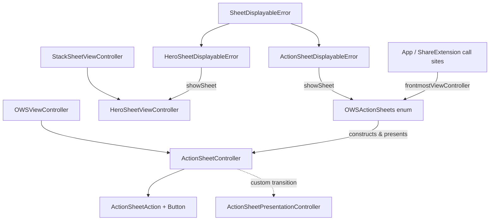

# Action Sheets

Source: `SignalUI/ActionSheets/`. Signal's custom, themed action-sheet subsystem —
a hand-rolled replacement for `UIAlertController`'s action-sheet style that the
app and share extension use for confirmations, error prompts, and "hero" (image +
title + body + buttons) sheets.

> Confidence: **[High]** read in full; **[Medium]** signature/partial; **[Low]**
> inferred. Citations are `File.swift:line`. An uncited claim is a defect.

## Responsibility

**[High]** This directory provides four cooperating pieces:

1. `ActionSheetController` — the themed bottom sheet view controller and its
   `ActionSheetAction` button model (`SignalUI/ActionSheets/ActionSheetController.swift:26`,
   `:404`).
2. `OWSActionSheets` — a namespace of static convenience presenters for the common
   cases (`SignalUI/ActionSheets/OWSActionSheets.swift:8`).
3. `HeroSheetViewController` — a richer sheet with a hero image/animation, title,
   structured body, and up to two buttons
   (`SignalUI/ActionSheets/HeroSheetViewController.swift:11`).
4. `SheetDisplayableError` — an error base class that knows how to present itself
   as a sheet (`SignalUI/ActionSheets/SheetDisplayableError.swift:9`).

**[High]** The subsystem is widely used: a tree search for
`OWSActionSheets.`/`ActionSheetController(`/`HeroSheetViewController(`/
`SheetDisplayableError` matches 636 times across 194 files (including the Xcode
project and these docs), spanning registration, backups, payments, donations,
conversation view, settings, and the recipient pickers — so it is one of the most
heavily depended-on UI primitives in the framework.

## `ActionSheetController` — the themed sheet

**[High]** `ActionSheetController` is an `open class` subclass of `OWSViewController`
(`SignalUI/ActionSheets/ActionSheetController.swift:26`), so it inherits the theming
and lifecycle hooks described in [../ViewControllers.md](../ViewControllers.md) and
[../Appearance.md](../Appearance.md). Signal uses its own action-sheet
implementation rather than `UIAlertController` so it can theme and style the sheet
consistently; the custom `UIAlertController`-matching behaviors (single cancel
button, cancel pinned last) are commented in-source
(`SignalUI/ActionSheets/ActionSheetController.swift:161-162`). **[Medium]** (reason:
the type exists and the UIAlertController-matching comments are explicit; the
broader "why not UIAlertController" rationale is **intent undetermined — no
evidence in source**.)

### View hierarchy & layout

**[High]** The sheet is built in `viewDidLoad()` as a bottom-pinned
`UIVisualEffectView` background (`backgroundView`) containing a `UIScrollView` →
`contentView` → vertical `UIStackView`
(`SignalUI/ActionSheets/ActionSheetController.swift:194-241`). Because the number of
actions can exceed the screen, the content is scrollable; `viewDidLayoutSubviews()`
scrolls to the bottom once after the first non-zero layout so the user can tell
there is more to scroll to (`SignalUI/ActionSheets/ActionSheetController.swift:289-307`).

**[High]** Width adapts to the available space: it pins to the superview width
(with a per-OS inset) on phones, but constrains to `maxPreferredWidth = 414`
(`SignalUI/ActionSheets/ActionSheetController.swift:189`) once the view is wider
than `414 + maxWidthWiggleRoom` (40) — the wiggle room exists so rounded corners
don't look strange when there's only slightly more side space than below
(`SignalUI/ActionSheets/ActionSheetController.swift:189-192`,
`:269-287`).

**[High]** The subsystem is iOS-26-aware: on iOS 26 the background uses a
`UIGlassEffect` tinted with `UIColor.Signal.background` and a corner configuration
driven by `updateWidthConstraints()`; on earlier OSes it uses a `.prominent`
`UIBlurEffect` with a fixed 24pt top corner radius
(`SignalUI/ActionSheets/ActionSheetController.swift:245-266`,
`:269-287`).

### Content: title, message, image, custom header

**[High]** `setTitle(_:message:)` (both `String` and `NSAttributedString` overloads)
builds a leading-aligned default header stack with a semibold `.dynamicTypeHeadline`
title and `.dynamicTypeBody` message
(`SignalUI/ActionSheets/ActionSheetController.swift:105-111`,
`:335-398`). Attributed messages are rendered in a `LinkingTextView` whose delegate
is the controller itself, so tapped links are handled (see
[Links & modality](#links--modality)). `setImage(_:)` inserts a centered image at
the very top of the stack (`SignalUI/ActionSheets/ActionSheetController.swift:114-122`),
and a caller may insert an arbitrary `customHeader` view — with the caveat, noted
in-source, that the caller is responsible for matching the sheet's theme
(`SignalUI/ActionSheets/ActionSheetController.swift:88-97`). The computed
`headerInsertIndex` keeps the header below any image
(`SignalUI/ActionSheets/ActionSheetController.swift:102-104`).

### Actions & buttons

**[High]** `ActionSheetAction` is an `NSObject` carrying a title, a `Style`
(`default`/`cancel`/`destructive`), and an optional `@MainActor` `Handler`
(`SignalUI/ActionSheets/ActionSheetController.swift:404-432`). Each action lazily
builds a capsule `UIButton` (`ActionSheetAction.Button`) using a filled
`UIButton.Configuration` with `.Signal.secondaryFill` background; destructive
actions render in `.Signal.red`, others in `.Signal.label`
(`SignalUI/ActionSheets/ActionSheetController.swift:439-471`).

**[High]** `addAction(_:)` enforces at most one `cancel` action via
`owsFailDebug`, and — matching `UIAlertController` — inserts non-cancel actions
before an already-added cancel action so cancel stays last
(`SignalUI/ActionSheets/ActionSheetController.swift:157-178`). A button tap dismisses
the sheet first, then runs the action's handler
(`SignalUI/ActionSheets/ActionSheetController.swift:173-176`). Common reusable
actions (`acknowledge`, `ok`, `okay`, `cancel`) are provided as static factories
(`SignalUI/ActionSheets/ActionSheetController.swift:475-502`).

**[High]** `isCancelable` is derived from the presence of a cancel action
(`SignalUI/ActionSheets/ActionSheetController.swift:72-76`); when cancelable,
tapping the backdrop outside the content is treated as tapping cancel
(`SignalUI/ActionSheets/ActionSheetController.swift:320-333`).

### Dismissal callbacks

**[High]** Two mutually-exclusive dismissal notifications are offered: a
`onDismiss: (() -> Void)?` closure and a `dismissalDelegate: SheetDismissalDelegate?`
(`SignalUI/ActionSheets/ActionSheetController.swift:10-12`,
`:36-69`). Setting one clears the other, and both are fired/cleared from
`viewDidDisappear(_:)` (`SignalUI/ActionSheets/ActionSheetController.swift:314-318`).
Internally `onDismiss` is adapted to the delegate via a private `OnDismissHandler`
(`SignalUI/ActionSheets/ActionSheetController.swift:14-23`).

### Presentation & animation

**[High]** The controller sets `modalPresentationStyle = .custom` and acts as its
own `transitioningDelegate` (`SignalUI/ActionSheets/ActionSheetController.swift:132-135`,
`:557-561`). The private `ActionSheetPresentationController` draws a
`.Signal.backdrop` backdrop and animates the sheet up from
`origin.y = presentedVC.height` on present and back down on dismiss, fading the
backdrop in/out alongside; it also re-lays-out on size transitions
(`SignalUI/ActionSheets/ActionSheetController.swift:507-555`).

### Links & modality

**[High]** Because presentation is `.custom`/modal, the controller cannot present
another VC on top of itself. Its `UITextViewDelegate` conformance dismisses the
sheet first, then opens tapped URLs in an `SFSafariViewController` presented from
`CurrentAppContext().frontmostViewController()`
(`SignalUI/ActionSheets/ActionSheetController.swift:563-578`).

## `OWSActionSheets` — convenience presenters

**[High]** `OWSActionSheets` is a `public enum` namespace of static presenters
(`SignalUI/ActionSheets/OWSActionSheets.swift:8`). The base
`showActionSheet(_:fromViewController:)` falls back to
`CurrentAppContext().frontmostViewController()` when no presenter is given, failing
with `owsFailDebug` if even that is nil
(`SignalUI/ActionSheets/OWSActionSheets.swift:9-18`). An `async` variant,
`showAndAwaitActionSheet(...)`, is `@MainActor` and bridges presentation to
`async`/`await` by wiring the sheet's `onDismiss` to a `withCheckedContinuation`
(`SignalUI/ActionSheets/OWSActionSheets.swift:24-33`).

**[High]** Higher-level helpers assemble common sheets:

- `showActionSheet(title:message:buttonTitle:…)` — a one-OK-button info sheet (both
  `String` and `NSAttributedString` message overloads)
  (`SignalUI/ActionSheets/OWSActionSheets.swift:34-62`).
- `showConfirmationAlert(…)` — cancel + a configurable proceed action (default/
  destructive style) (`SignalUI/ActionSheets/OWSActionSheets.swift:64-103`).
- `showConfirmationWithNotNowAlert(…)` — "Not Now" + proceed
  (`SignalUI/ActionSheets/OWSActionSheets.swift:105-126`).
- `showErrorAlert(message:…)` — info sheet titled with `CommonStrings.errorAlertTitle`
  (`SignalUI/ActionSheets/OWSActionSheets.swift:128-139`).
- `showPendingChangesActionSheet(discardAction:)` — localized discard/cancel prompt
  for unsaved changes (`SignalUI/ActionSheets/OWSActionSheets.swift:179-200`).

It also exposes reusable `okayAction`/`cancelAction`/`notNowAction`/`dismissAction`
factories (`SignalUI/ActionSheets/OWSActionSheets.swift:141-177`) and a private
`ActionSheetController.addOkayAction(…)` helper
(`SignalUI/ActionSheets/OWSActionSheets.swift:204-209`). All titles/labels come from
`CommonStrings`/`OWSLocalizedString`, so sheets are localized by construction.
**[Medium]** (`CommonStrings` is defined outside this directory.)

## `HeroSheetViewController` — rich sheets

**[High]** `HeroSheetViewController` subclasses `StackSheetViewController`
(`SignalUI/ActionSheets/HeroSheetViewController.swift:11`), which is itself an
interactive/draggable sheet (see [../ViewControllers.md](../ViewControllers.md)).
Unlike `ActionSheetController`, it is a composed, declarative sheet described by:

- `Hero` — a top visual: `.image`, Lottie `.animation`, or `.circleIcon`
  (`SignalUI/ActionSheets/HeroSheetViewController.swift:12-23`); the Lottie view
  loops via `Lottie` (`SignalUI/ActionSheets/HeroSheetViewController.swift:327-333`).
- `Body` — an ordered list of `Element`s: `.text`, `.bullets` (with per-bullet
  `Style` of image/numbered-circle/dot/dash), `.toggle`, `.selectableList`, and
  `.customSpacing` (`SignalUI/ActionSheets/HeroSheetViewController.swift:25-110`).
- `Button`/`Element` — up to a primary and secondary button, each `.primary`,
  `.secondary`, or `.secondaryDestructive`, with a `.dismiss` or `.custom` action
  (`SignalUI/ActionSheets/HeroSheetViewController.swift:114-163`).

**[High]** It builds its stack in `viewDidLoad()`, iterating `body.elements` and
applying custom spacing between them
(`SignalUI/ActionSheets/HeroSheetViewController.swift:221-285`). A notable
interaction detail: when a `.selectableList` is present, the primary button is
disabled until the user changes from the initial selection
(`reloadPrimaryButtonEnabled(…)`,
`SignalUI/ActionSheets/HeroSheetViewController.swift:298-310`). Attributed text
bodies are rendered in a `LinkingTextView` so embedded links stay tappable
(`SignalUI/ActionSheets/HeroSheetViewController.swift:354-371`).

## `SheetDisplayableError` — self-presenting errors

**[High]** `SheetDisplayableError` is an abstract `Error` base class with a
`@MainActor showSheet(from:dismissalDelegate:)` that subclasses override
(`SignalUI/ActionSheets/SheetDisplayableError.swift:9-21`). Two concrete subclasses
are provided:

- `ActionSheetDisplayableError` — shows a plain `OWSActionSheets` sheet from its
  localized title/message, and intentionally shows nothing when the message is nil
  (`SignalUI/ActionSheets/SheetDisplayableError.swift:45-73`).
- `HeroSheetDisplayableError` — builds and presents a `HeroSheetViewController` from
  a supplied builder closure
  (`SignalUI/ActionSheets/SheetDisplayableError.swift:75-104`).

**[High]** Static singletons cover the recurring cases: `.networkError`,
`.genericError`, and `.userCancelled` (the last deliberately shows no sheet, since a
user-cancel is self-explanatory)
(`SignalUI/ActionSheets/SheetDisplayableError.swift:21-42`). This lets call sites
throw/propagate a typed error and present it uniformly via `showSheet(...)` rather
than constructing a sheet by hand.

## Interactions with the rest of SignalUI and the app

- **[High]** Builds on `OWSViewController` theming/lifecycle
  (`ActionSheetController`) and `StackSheetViewController` interactive sheets
  (`HeroSheetViewController`); both are documented in
  [../ViewControllers.md](../ViewControllers.md). Colors come from the
  `UIColor.Signal` palette ([../Appearance.md](../Appearance.md)) and fonts from the
  Dynamic Type helpers ([../FontsAndFormatStyles.md](../FontsAndFormatStyles.md)).
- **[High]** Depends on SSK: all four files `import SignalServiceKit`
  (`SignalUI/ActionSheets/OWSActionSheets.swift:6`,
  `SignalUI/ActionSheets/SheetDisplayableError.swift:6`), and
  `ActionSheetController` additionally uses `BonMot` and `SafariServices`
  (`SignalUI/ActionSheets/ActionSheetController.swift:6-8`).
- **[High]** `CurrentAppContext().frontmostViewController()` is the default
  presentation anchor used throughout
  (`SignalUI/ActionSheets/OWSActionSheets.swift:13`,
  `SignalUI/ActionSheets/ActionSheetController.swift:574`,
  `SignalUI/ActionSheets/SheetDisplayableError.swift:89`), so most call sites can
  present a sheet without threading a view controller through.
- **[High]** The subsystem is referenced by the view-controllers doc already
  (`docs/SignalUI/ViewControllers.md`), which treats action sheets as a presentation
  primitive; this doc expands that area.

## Notable UI considerations

- **[High]** Custom (non-`UIAlertController`) implementation for consistent theming,
  including a dedicated iOS-26 glass/corner path
  (`SignalUI/ActionSheets/ActionSheetController.swift:245-266`).
- **[High]** Scrollable content with an initial scroll-to-bottom affordance so tall
  sheets reveal that more actions exist
  (`SignalUI/ActionSheets/ActionSheetController.swift:289-307`).
- **[High]** Width capping with corner "wiggle room" on wide layouts
  (`SignalUI/ActionSheets/ActionSheetController.swift:189-192`,
  `:269-287`), and a bottom layout margin that grows to the larger of 20pt and the
  safe-area inset (`SignalUI/ActionSheets/ActionSheetController.swift:309-312`).
- **[High]** Single-cancel enforcement and cancel-last ordering mirror UIKit
  conventions (`SignalUI/ActionSheets/ActionSheetController.swift:157-178`).
- **[High]** Backdrop-tap-to-cancel only when a cancel action exists
  (`SignalUI/ActionSheets/ActionSheetController.swift:320-333`).
- **[High]** Links in bodies dismiss-then-present a Safari VC because the modal
  presentation style cannot stack another controller
  (`SignalUI/ActionSheets/ActionSheetController.swift:563-578`).
- **[High]** `#Preview` providers (DEBUG only) exercise the normal and
  extreme-long-title layouts
  (`SignalUI/ActionSheets/ActionSheetController.swift:596-647`).

