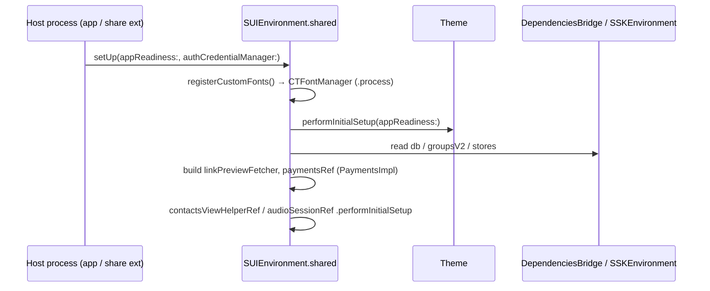

# SignalUI AppLaunch

Source: `SignalUI/AppLaunch/`. This directory holds SignalUI's **process-level
bootstrap surface**: the `SUIEnvironment` global that owns SignalUI's long-lived
singletons and performs the module's one-time startup work, plus a small
`AppContext` helper. It is the SignalUI counterpart to the host-process launch
sequences — not to be confused with the main app's launch orchestration in
`Signal/AppLaunch/` (see `docs/Signal/launch-sequence.md`), which *calls into*
this subsystem.

> Confidence labels: **[High]** read in full; **[Medium]** signature/partial read
> or depends on code outside `SignalUI/AppLaunch/`; **[Low]** inferred. Citations
> are `File.swift:line`. An uncited claim is a defect.

> **Scope note:** this directory is small — only two source files
> (`SUIEnvironment.swift`, `AppContext+SignalUI.swift`), both read in full.

## Responsibility

**[High]** `SUIEnvironment` is SignalUI's process-wide service locator and startup
hook. It is a `public class` singleton exposed via `SUIEnvironment.shared`
(`SignalUI/AppLaunch/SUIEnvironment.swift:8-23`). The `shared` setter is guarded so
that the environment can only be swapped while `CurrentAppContext().isRunningTests`
is true; outside tests it `owsFailDebug`s and refuses the swap
(`SignalUI/AppLaunch/SUIEnvironment.swift:17-22`). This mirrors the test-swap
pattern used by `SSKEnvironment`/`AppEnvironment` elsewhere in the codebase.
**[Medium]**

## Owned singletons (the "Ref" properties)

**[High]** `SUIEnvironment` holds the SignalUI-level dependencies that the rest of
the app reaches through `SUIEnvironment.shared.*`:

- `audioSessionRef: AudioSession` — the shared audio-session coordinator
  (`SignalUI/AppLaunch/SUIEnvironment.swift:26`).
- `contactsViewHelperRef: ContactsViewHelper` — the system-contacts access/flow
  helper (`SignalUI/AppLaunch/SUIEnvironment.swift:28`).
- `paymentsRef: Payments!` — the MobileCoin payments implementation, with two
  typed re-casts exposed as `paymentsSwiftRef` (annotated "should be deprecated")
  and `paymentsImplRef` (`SignalUI/AppLaunch/SUIEnvironment.swift:30-33`). These
  are implicitly-unwrapped / force-cast, so they are only valid after `setUp(...)`
  has run.
- `linkPreviewFetcher: (any LinkPreviewFetcher)!` — the link-preview fetcher,
  `private(set)` and implicitly unwrapped, so likewise only valid post-`setUp`
  (`SignalUI/AppLaunch/SUIEnvironment.swift:35`).

**[High]** The initializer is `private` and empty
(`SignalUI/AppLaunch/SUIEnvironment.swift:37-40`); all real wiring happens in
`setUp(...)`, so the properties are not usable until the host process bootstraps
the environment.

## Startup: `setUp(appReadiness:authCredentialManager:)`

**[High]** `setUp(...)` is `@MainActor` and performs SignalUI's one-time startup
(`SignalUI/AppLaunch/SUIEnvironment.swift:43-61`). In order it:

1. Registers the bundled custom fonts via `registerCustomFonts()`
   (`SignalUI/AppLaunch/SUIEnvironment.swift:47`).
2. Runs `Theme.performInitialSetup(appReadiness:)` to initialize the theming
   subsystem (`SignalUI/AppLaunch/SUIEnvironment.swift:49`; see
   `docs/SignalUI/Appearance.md`). **[Medium]**
3. Builds the `LinkPreviewFetcherImpl`, injecting the passed
   `authCredentialManager` plus services pulled from `DependenciesBridge.shared`
   and `SSKEnvironment.shared` (db, groupsV2, link-preview setting store,
   tsAccountManager) (`SignalUI/AppLaunch/SUIEnvironment.swift:51-57`). **[Medium]**
4. Constructs `paymentsRef = PaymentsImpl(appReadiness:)`
   (`SignalUI/AppLaunch/SUIEnvironment.swift:58`).
5. Forwards `performInitialSetup(appReadiness:)` to the contacts-view helper and
   the audio session so they can register their own app-readiness blocks
   (`SignalUI/AppLaunch/SUIEnvironment.swift:60-61`). **[Medium]**

### Font registration

**[High]** `registerCustomFonts()` resolves the SignalUI bundle via
`Bundle(for: type(of: self))`, enumerates every `.ttf` and `.otf` resource, and
registers each with Core Text using
`CTFontManagerRegisterFontsForURL(url, .process, &error)`
(`SignalUI/AppLaunch/SUIEnvironment.swift:64-83`). Registration is **process
scoped** (`.process`), and failures are logged with `owsFailDebug` rather than
being fatal (`:70`, `:74-77`). Because it is `.process`-scoped, each host
process (main app and share extension) must run `setUp(...)` to get the fonts.
See `docs/SignalUI/FontsAndFormatStyles.md` for the font-side detail.

## Who calls `setUp`

**[High]** Exactly two host processes bootstrap this environment, and each does so
after `SSKEnvironment`/`AppEnvironment`-level globals are in place:

- The main app: `Signal/AppLaunch/AppLifecycleManager.swift:505-508` calls
  `SUIEnvironment.shared.setUp(appReadiness:authCredentialManager:)` (documented as
  step 6 of the launch sequence in `docs/Signal/launch-sequence.md`).
- The share extension: `SignalShareExtension/ShareViewController.swift:117-120`
  (documented in `docs/SignalShareExtension/ShareViewController.md`).

## `AppContextUtils` (`AppContext+SignalUI.swift`)

**[High]** `AppContextUtils` is a non-instantiable utility (`private init()`)
providing one helper: `openSystemSettingsAction(completion:)`
(`SignalUI/AppLaunch/AppContext+SignalUI.swift:9-22`). It returns an
`ActionSheetAction` titled with `CommonStrings.openSystemSettingsButton` that opens
iOS Settings via `CurrentAppContext().openSystemSettings()`, and returns `nil` when
not running in the main app (`!CurrentAppContext().isMainApp`)
(`SignalUI/AppLaunch/AppContext+SignalUI.swift:14-21`). It is the standard "take me
to Settings" affordance used by permission-denied flows. **[Medium]**

**[High]** Representative callers construct permission/authorization action sheets:
- `SignalUI/ViewControllers/UIViewController+Permissions.swift:41,137`.
- `SignalUI/RecipientPickers/ContactsViewHelper.swift:213`.
(Found via a usage search; the three above are within SignalUI itself.) **[Medium]**

## Interactions & data flow summary

**[High]** This subsystem sits at the boundary between the host process and the
rest of SignalUI:

- **Inbound:** the only entry point is `setUp(...)`, invoked once per process by
  the app and share-extension bootstraps (above).
- **Outbound at startup:** it drives `Theme`, font registration, the
  contacts-view helper, and the audio session, and reads shared services from
  `DependenciesBridge.shared` / `SSKEnvironment.shared` to build the link-preview
  fetcher and payments stack. **[Medium]**
- **Ongoing:** after startup the rest of the codebase treats
  `SUIEnvironment.shared` as a global service locator. The audio session, contacts
  helper, payments, and link-preview fetcher are reached as
  `SUIEnvironment.shared.<ref>` from Calls, ConversationView, the Payments UI,
  RecipientPickers, AV playback, Stories, and settings screens (confirmed by a
  broad usage search across `Signal/` and `SignalUI/`). **[Medium]**

> **State note:** the forced/implicitly-unwrapped refs (`paymentsRef`,
> `linkPreviewFetcher`) encode an ordering invariant: nothing may touch them before
> `setUp(...)` completes. The code enforces this only via crash-on-nil, not via the
> type system (`SignalUI/AppLaunch/SUIEnvironment.swift:30-35`). **[High]** The
> product rationale for keeping these as a mutable singleton rather than injected
> dependencies is **intent undetermined — no evidence in source**.
