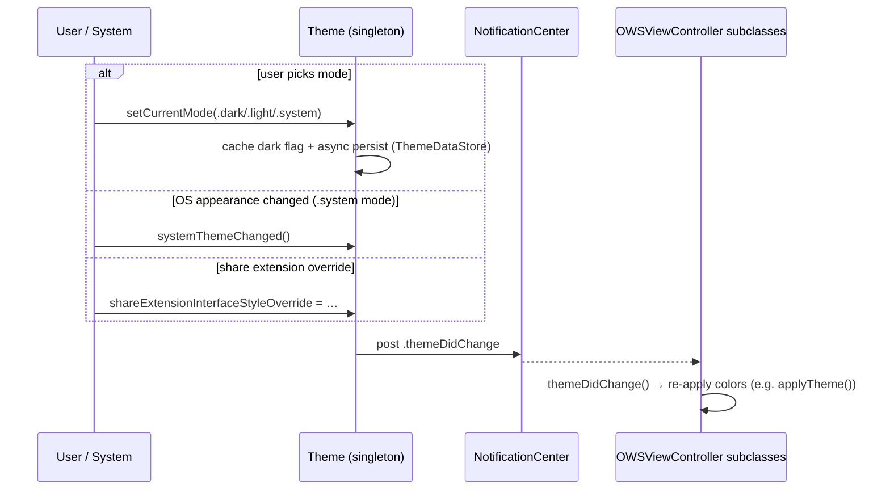

# Appearance & Theming

Source: `SignalUI/Appearance/` (plus the theme-change hooks in
`SignalUI/ViewControllers/`). This area defines Signal iOS's **color palette**,
its **light/dark theme model**, conversation styling, and the mechanism by which a
theme change *propagates* to every on-screen view controller.

> Confidence labels: **[High]** read in full; **[Medium]** signature/partial read
> or depends on code outside `SignalUI/`; **[Low]** inferred. Citations are
> `File.swift:line`. An uncited claim is a defect.

## The `Theme` singleton

**[High]** `Theme` is a `final class` singleton (`SignalUI/Appearance/Theme.swift:12`)
backed by a `ThemeDataStore` that persists the user's chosen appearance
(`SignalUI/Appearance/Theme.swift:14`). The three appearance modes are
`ThemeDataStore.Appearance` — `.system`, `.light`, `.dark` — read throughout the
file (e.g. `SignalUI/Appearance/Theme.swift:134-141`).

Key API:

- `Theme.isDarkThemeEnabled` — the global "are we dark right now?" accessor
  (`SignalUI/Appearance/Theme.swift:81`).
- `Theme.setCurrentMode(_:)` — set the mode, update the cached dark flag, persist
  it with an async DB write, and fire a change notification if it actually changed
  (`SignalUI/Appearance/Theme.swift:90`).
- `Theme.performInitialSetup(appReadiness:)` — run once the app is ready; it
  deliberately dispatches asynchronously to avoid a re-entrant `+shared`
  initialization bug (documented inline, IOS-782)
  (`SignalUI/Appearance/Theme.swift:21`).

**[High]** The semantic color accessors (`backgroundColor`
`SignalUI/Appearance/Theme.swift:275`, `primaryTextColor`
`SignalUI/Appearance/Theme.swift:295`, and many more) all branch on
`isDarkThemeEnabled`, resolving against light/dark `UITraitCollection`s.

### How "is dark enabled" is decided

**[High]** `isDarkThemeEnabled` (the private computed property) resolves in a
specific priority order (`SignalUI/Appearance/Theme.swift:117-168`):

1. In `TESTABLE_BUILD`, a test override wins if set.
2. Before app-readiness, fall back to the live system style
   (`UITraitCollection.current.userInterfaceStyle == .dark`).
3. **In extensions** (`!CurrentAppContext().isMainApp`), always respect the
   system theme — except that `shareExtensionInterfaceStyleOverride` can force
   light/dark inside the share extension
   (`SignalUI/Appearance/Theme.swift:134-146`).
4. In the main app, use the cached value derived from the persisted mode
   (`.system` → system style, `.dark` → true, `.light` → false).

**[High]** `shareExtensionInterfaceStyleOverride` has a precondition that it may
only be set inside the share extension, and setting it to a new value triggers a
theme change (`SignalUI/Appearance/Theme.swift:108-118`). This is the hook the
share extension uses to pin its own appearance.

## Theme-change propagation

The theme is distributed by a **single `NSNotification`**, not by direct calls.

**[High]** The notification name is `.themeDidChange`
(`SignalUI/Appearance/Theme.swift:9`). It is posted by the private
`themeDidChange()` method (`SignalUI/Appearance/Theme.swift:243`), which is
invoked from `setCurrentMode(_:)` (on an actual change), from
`systemThemeChanged()` when the OS style changes while in `.system` mode
(`SignalUI/Appearance/Theme.swift:224`), and from the
`shareExtensionInterfaceStyleOverride` setter.

**[High]** Every `OWSViewController` subscribes to that notification in
`viewDidLoad()` and routes it to the overridable `themeDidChange()` method
(`SignalUI/ViewControllers/OWSViewController.swift:134-139`); the base hook is
declared at `SignalUI/ViewControllers/OWSViewController.swift:53`. Subclasses
override `themeDidChange()` to re-apply colors. For example
`OWSTableViewController2.themeDidChange()` calls `applyTheme()` and re-applies its
contents (`SignalUI/ViewControllers/OWSTableViewController2.swift:182-186`), where
`applyTheme()` sets background/section-index colors from `Theme`
(`SignalUI/ViewControllers/OWSTableViewController2.swift:210`).

**[High]** Note the two-layer model: SignalUI tracks its *own* dark/light state
(so it can force dark in media flows, or pin the share-extension style)
independent of `UITraitCollection`. The semantic `Theme.*Color` accessors then
resolve concrete `UIColor`s by selecting a light or dark trait collection based on
`isDarkThemeEnabled` (e.g. `secondaryBackgroundColor`
`SignalUI/Appearance/Theme.swift` resolves `UIColor.Signal.secondaryBackground`
against the chosen trait collection, visible in the color section around
`SignalUI/Appearance/Theme.swift:275-320`).

## The `UIColor.Signal` palette

**[High]** The design-system palette is a namespaced enum: `UIColor.Signal`
(`SignalUI/Appearance/UIColor+Signal.swift:64`), with members such as
`ultramarine` (`:71`), `accent` (= `ultramarine`, `:125`), `label` (`:131`), and
`background` (`:197`). Colors are declared trait-aware via the custom
`UIColor(light:lightHighContrast:dark:darkHighContrast:)` initializer
(`SignalUI/Appearance/UIColor+Signal.swift:40`) and the `byRGBHex(...)` helper
(`SignalUI/Appearance/UIColor+Signal.swift:26`), both defined in the same file.
Because these are dynamic `UIColor`s, they adapt to the system trait collection as
well as to high-contrast accessibility settings
(`SignalUI/Appearance/UIColor+Signal.swift:48-54`).

## `ThemedColor`

**[High]** `ThemedColor` (defined in SSK) is extended here to resolve against the
current SignalUI theme: `ThemedColor.forCurrentTheme` returns the light or dark
variant using `Theme.isDarkThemeEnabled`
(`SignalUI/Appearance/ThemedColor+Theme.swift:11-13`), and `ThemedColor.fixed(_:)`
builds a theme-independent color (`SignalUI/Appearance/ThemedColor+Theme.swift:15`).
This is the bridge between the "SignalUI's own dark flag" model and per-element
color choices.

## Conversation styling & related types

The `Appearance/` directory also contains the conversation-rendering style types
(read by signature only here, **[Medium]**):

- `ConversationStyle` — `SignalUI/Appearance/ConversationStyle.swift` (17.9 KB)
  encapsulates bubble metrics/colors for the conversation view.
- `BubbleConfiguration` — `SignalUI/Appearance/BubbleConfiguration.swift`.
- `GroupNameColors` — `SignalUI/Appearance/GroupNameColors.swift` (deterministic
  per-group name colors).
- `SignalSymbols` — `SignalUI/Appearance/SignalSymbols.swift` (the bundled
  symbol font API; the font files live in `SignalUI/Fonts/`).
- `ColorOrGradient+SignalUI` / `ColorOrGradientSwatchView` — SSK's
  color-or-gradient value rendered into SignalUI views.
- `Theme+Icons.swift` — themed icon lookups.

> **Design intent for the independent dark-flag model:** the code comments explain
> the *mechanics* (re-entrancy avoidance, extension behavior) but the broader
> product rationale for maintaining a theme state separate from `UITraitCollection`
> is **intent undetermined — no evidence in source** beyond the media-flow comment
> in `Theme.setupLegacyAppearance()` noting that media send/gallery views "always
> use dark theme" (`SignalUI/Appearance/Theme.swift:39`, comment in body). **[Medium]**
