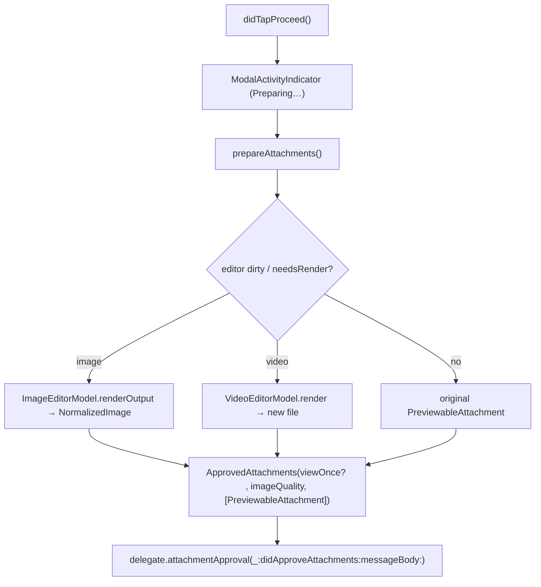
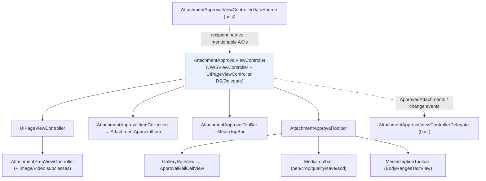

# Attachment Approval UI (`SignalUI/AttachmentApproval/`)

Source: `SignalUI/AttachmentApproval/`. This subsystem is the **review / caption /
edit screen** shown after media is picked or received but before it is sent:
"here are the N attachments you're about to send — page through them, draw/crop,
add a caption with mentions, reorder/remove, pick quality, optionally mark
view-once — then proceed." It produces an `ApprovedAttachments` payload and hands
it back to its delegate; it does **not** itself send anything.

> Confidence: **[High]** read in full; **[Medium]** signature/partial; **[Low]**
> inferred. Citations are `File.swift:line`. An uncited claim is a defect.

This is a focused, file+line companion to the higher-level
[AttachmentFlows.md](../AttachmentFlows.md), which situates this UI in the broader
pick → approve → send pipeline (the attachment model and multisend). Where that
doc gives the one-paragraph summary, this one documents the internal types and
data flow of the approval screen itself.

## Responsibility & boundary

**[High]** The subsystem owns the full-screen approval experience and nothing
below it. The screen is driven by `AttachmentApprovalViewController`, a `final`
`OWSViewController` that is also a `UIPageViewController` data source/delegate
(`SignalUI/AttachmentApproval/AttachmentApprovalViewController.swift:90`). It pages
between attachments so the user can review, caption, edit, reorder, add/remove, and
toggle view-once before sending
(`SignalUI/AttachmentApproval/AttachmentApprovalViewController.swift:290` sets
up the pager, top bar, and bottom toolbar in `viewDidLoad()`).

**[High]** Results flow out via `AttachmentApprovalViewControllerDelegate`
(`SignalUI/AttachmentApproval/AttachmentApprovalViewController.swift:34-57`). Its
callbacks are `attachmentApproval(_:didApproveAttachments:messageBody:)`,
`attachmentApprovalDidCancel()`,
`attachmentApproval(_:didChangeMessageBody:)`,
`attachmentApproval(_:didChangeViewOnceState:)`,
`attachmentApproval(_:didRemoveAttachment:)`, and
`attachmentApprovalDidTapAddMore(_:)`. The actual message send is the host's job,
not this subsystem's.

**[High]** Mention/recipient context is supplied by a separate
`AttachmentApprovalViewControllerDataSource`
(`SignalUI/AttachmentApproval/AttachmentApprovalViewController.swift:59-68`):
`attachmentApprovalTextInputContextIdentifier`,
`attachmentApprovalRecipientNames`,
`attachmentApprovalMentionableAcis(tx:)`, and
`attachmentApprovalMentionCacheInvalidationKey()`. The split lets the caption field
hydrate mentions and the top bar show recipient names without this VC knowing about
the destination conversation(s).

## Approved payload: `ApprovedAttachments`

**[High]** The output type is the `ApprovedAttachments` struct, bundling
`isViewOnce`, `imageQuality: ImageQuality`, and `attachments:
[PreviewableAttachment]`
(`SignalUI/AttachmentApproval/AttachmentApprovalViewController.swift:14-32`). Its
private initializer enforces an invariant — view-once allows at most one attachment
(`owsPrecondition(!isViewOnce || attachments.count <= 1)` at
`SignalUI/AttachmentApproval/AttachmentApprovalViewController.swift:20`) — and the
two public initializers (`viewOnceAttachment:` / `nonViewOnceAttachments:`) make the
two cases explicit. `PreviewableAttachment` itself lives in `SignalUI/Attachments/`
(documented in [AttachmentFlows.md](../AttachmentFlows.md)).

## Behavior flags: `AttachmentApprovalViewControllerOptions`

**[High]** `AttachmentApprovalViewControllerOptions` is an `OptionSet` of feature
toggles (`SignalUI/AttachmentApproval/AttachmentApprovalViewController.swift:72-89`):
`canAddMore`, `hasCancel`, `canToggleViewOnce`, `disallowViewOnce` (overrides and
forces view-once off), `canChangeQualityLevel`, and `isNotFinalScreen` (makes the
proceed button a "next" chevron instead of "send").

**[High]** The VC refines the received options into an effective `options` getter
at runtime
(`SignalUI/AttachmentApproval/AttachmentApprovalViewController.swift:99-123`):
`canToggleViewOnce` is auto-inserted when there is exactly one image/video item and
view-once isn't disallowed; `canChangeQualityLevel` is auto-inserted when the app
context allows the highest quality level and at least one item is an image. So the
visible controls are a function of both the caller's options and the current item
set.

## Entry point & lifecycle

**[High]** Callers typically use the class factory
`wrappedInNavController(attachments:initialMessageBody:hasQuotedReplyDraft:attachmentLimits:approvalDelegate:approvalDataSource:stickerSheetDelegate:)`
(`SignalUI/AttachmentApproval/AttachmentApprovalViewController.swift:210`),
which maps `[PreviewableAttachment]` into `AttachmentApprovalItem`s, derives options
(`.hasCancel`; `.disallowViewOnce` when there's a quoted-reply draft), builds the VC
via `loadWithSneakyTransaction(...)`, wires the data source **before** the message
body (so mentions can hydrate), and returns an `OWSNavigationController` with the bar
hidden.

**[High]** `loadWithSneakyTransaction(...)` reads the default `ImageQuality` from the
database before constructing the VC
(`SignalUI/AttachmentApproval/AttachmentApprovalViewController.swift:154`); the
designated initializer is private
(`SignalUI/AttachmentApproval/AttachmentApprovalViewController.swift:168`) and
also registers for `.OWSApplicationDidBecomeActive` to refresh contents, and opts
into dark mode when `Theme.forceDarkThemeForMedia` is set.

### Who constructs it

**[High]** The approval screen is driven from several hosts, each conforming to the
delegate (and usually the data source):

- `SendMediaNavigationController` (the camera/photo-picker flow) is itself the
  delegate + data source and sets options such as `.canAddMore`
  (`Signal/src/ViewControllers/Photos/SendMediaNavigationController.swift:76-77`,
  `:213`); it also reaches into
  `(topViewController as? AttachmentApprovalViewController)?.currentPageViewController?.canSaveMedia`
  (`Signal/src/ViewControllers/Photos/SendMediaNavigationController.swift:202`).
- The share extension's `SharingThreadPickerViewController`
  (`SignalShareExtension/SharingThreadPickerViewController.swift`).
- `GifPickerViewController`
  (`Signal/src/ViewControllers/GifPicker/GifPickerViewController.swift`).
- The main app's conversation input flow
  (`Signal/ConversationView/ConversationViewController+Delegates.swift`,
  `Signal/ConversationView/ConversationViewController+ConversationInputToolbarDelegate.swift`).

**[Medium]** (callers located by search of usages of
`AttachmentApprovalViewController*`; each host's exact option set was not read in
full.)

## Per-item model & paging

**[High]** Each attachment is wrapped in an `@MainActor` `AttachmentApprovalItem`
(`SignalUI/AttachmentApproval/AttachmentItemCollection.swift:10`). The item eagerly
constructs an editor model from the attachment: an `ImageEditorModel` if the
attachment is `.image`, otherwise a `VideoEditorModel` — never both
(`SignalUI/AttachmentApproval/AttachmentItemCollection.swift:40-72`). Its computed
`type` (`.image` / `.video` / `.generic`) is derived from which editor exists
(`SignalUI/AttachmentApproval/AttachmentItemCollection.swift:24-33`) and drives both
which prep view controller is built and which editing buttons appear. Items are
identity-compared by reference (`isIdenticalTo` is `===`,
`SignalUI/AttachmentApproval/AttachmentItemCollection.swift:78-80`).

**[High]** `AttachmentApprovalItemCollection` is the ordered, mutable list of items
plus an `isAddMoreVisible` closure
(`SignalUI/AttachmentApproval/AttachmentItemCollection.swift:86-133`). It provides
`itemAfter`/`itemBefore`/`remove`/`count`, which back both the pager and the thumbnail
rail.

**[High]** Pages are `AttachmentPrepViewController`s, built lazily and cached by item
(`SignalUI/AttachmentApproval/AttachmentApprovalViewController.swift:630`
`buildPage(item:)` with a `cachedPages` array). The concrete subclass is chosen by
item type via the `viewController(for:stickerSheetDelegate:)` factory —
`ImageAttachmentPrepViewController`, `VideoAttachmentPrepViewController`, or the base
`AttachmentPrepViewController` for generic media
(`SignalUI/AttachmentApproval/AttachmentPrepViewController.swift:38-56`). The two
media subclasses live outside this directory (in the image/video editor areas).

**[High]** `AttachmentPrepViewController` is an `OWSViewController` +
`UIScrollViewDelegate` that hosts a zoomable scroll view for image/video and a plain
constrained content view for generic attachments
(`SignalUI/AttachmentApproval/AttachmentPrepViewController.swift:25`,
`:87-137`). It owns pinch-zoom math (`configureScrollViewContentSizeAndZoom`,
`centerContent`, `zoomOut`), a keyboard-driven scale/translate transform
(`updateScrollViewTransform(keyboardHeight:)`,
`SignalUI/AttachmentApproval/AttachmentPrepViewController.swift:244`), and the
`presentMediaTool(...)` plumbing used by the pen/crop editors, which hides the
chrome and presents `.currentContext` so the tool stays within the share-extension
frame (`SignalUI/AttachmentApproval/AttachmentPrepViewController.swift:258-283`).
`activatePenTool()`/`activateCropTool()` are no-ops here and overridden by the image
subclass (`SignalUI/AttachmentApproval/AttachmentPrepViewController.swift:286-287`).

## Chrome: top bar, toolbar, caption, rail

The surrounding controls are composed by the VC rather than by the pager, so that the
toolbars keep the default safe-area insets while the pages get extra insets equal to
the control heights
(`SignalUI/AttachmentApproval/AttachmentApprovalViewController.swift:296` comment;
`updatePageViewContollerSafeAreaInsets()` at
`SignalUI/AttachmentApproval/AttachmentApprovalViewController.swift:409`).

**[High]** `MediaTopBar` is an open base `UIView` with a custom
`controlsLayoutGuide` used to pin controls to the top safe area (with iOS-26 corner
adaptation to avoid the iPad windowed stoplight buttons)
(`SignalUI/AttachmentApproval/MediaTopBar.swift:8`). It exists as a reusable base
(e.g. for the camera view, per its comment).

**[High]** `AttachmentApprovalTopBar` subclasses `MediaTopBar`
(`SignalUI/AttachmentApproval/AttachmentApprovalTopBar.swift:9`). It shows a leading
cancel-or-back button (`.hasCancel` selects which,
`SignalUI/AttachmentApproval/AttachmentApprovalTopBar.swift:47-55`) and an
`ExpandableContactListView` of recipient names — a private, scrollable, tappable
pill with edge-fading gradient and iOS-26 glass styling
(`SignalUI/AttachmentApproval/AttachmentApprovalTopBar.swift:76`).
`update(withRecipientNames:)` hides it when empty
(`SignalUI/AttachmentApproval/AttachmentApprovalTopBar.swift:35-45`).

**[High]** `AttachmentApprovalToolbar` is the bottom chrome: a vertical stack of
three rows — the `GalleryRailView` thumbnail strip (shown only for >1 item), a
`MediaToolbar` of edit/quality/save/add buttons, and the `MediaCaptionToolbar`
caption field (`SignalUI/AttachmentApproval/AttachmentApprovalToolbar.swift:71-100`).
It is configured declaratively through an `Equatable` `Configuration` struct
(`SignalUI/AttachmentApproval/AttachmentApprovalToolbar.swift:12-27`) and its
`update(using:configuration:supplementaryToolbarView:animator:)` de-bounces identical
updates (`SignalUI/AttachmentApproval/AttachmentApprovalToolbar.swift:380`).
It also manages keyboard-height layout
(`setKeyboardHeight(...)`,
`SignalUI/AttachmentApproval/AttachmentApprovalToolbar.swift:46-71`) and the
one-time "View Once" tooltip
(`SignalUI/AttachmentApproval/AttachmentApprovalToolbar.swift:453`, gated on
`SSKEnvironment.shared.preferencesRef.wasViewOnceTooltipShown`). The private
`MediaToolbar` tracks which buttons are visible with an `AvailableButtons` OptionSet
and swaps in glass styling on iOS 26
(`SignalUI/AttachmentApproval/AttachmentApprovalToolbar.swift:554-588`).

**[High]** `MediaCaptionToolbar` is the caption input row
(`SignalUI/AttachmentApproval/MediaCaptionToolbar.swift:24`). It wraps a
`BodyRangesTextView` (so captions support mentions/formatting), a placeholder view,
a "View Once" label/button, and Done/Proceed buttons. Caption length is implicitly
bounded by `kMaxMessageBodyCharacterCount = 2000`
(`SignalUI/AttachmentApproval/MediaCaptionToolbar.swift:12`). It auto-grows between
`minTextViewHeight`/`maxTextViewHeight`
(`SignalUI/AttachmentApproval/MediaCaptionToolbar.swift:231`), and critically,
`messageBodyForSending` returns `nil` whenever view-once is on
(`SignalUI/AttachmentApproval/MediaCaptionToolbar.swift:49-66`) — the UI-level
enforcement of "no caption for view-once." It forwards editing events to the toolbar
(via `MediaCaptionToolbarDelegate`,
`SignalUI/AttachmentApproval/MediaCaptionToolbar.swift:14-20`) and forwards
mention-picker calls straight through to the VC's `BodyRangesTextViewDelegate`
conformance.

**[High]** `ApprovalRailCellView` is the per-thumbnail cell in the rail
(`SignalUI/AttachmentApproval/ApprovalRailCellView.swift:18`), a `GalleryRailCellView`
subclass that overlays a trash/delete button when the cell is focused and removal is
allowed (`SignalUI/AttachmentApproval/ApprovalRailCellView.swift:91-100`), reporting
back through `ApprovalRailCellViewDelegate`
(`SignalUI/AttachmentApproval/ApprovalRailCellView.swift:8-15`). The VC adapts its
item/collection types to `GalleryRailItem`/`GalleryRailItemProvider` in extensions
(`SignalUI/AttachmentApproval/AttachmentApprovalViewController.swift:1167-1185`), reusing
the shared `GalleryRailView` from `SignalUI/Views/`.

## Key data flows & state

### Proceed (approve) — editors render on demand

**[High]** `didTapProceed()` presents a blocking
`ModalActivityIndicatorViewController` and, in an async block, calls
`prepareAttachments()`
(`SignalUI/AttachmentApproval/AttachmentApprovalViewController.swift:889`).
`prepareAttachment(attachmentApprovalItem:)`
(`SignalUI/AttachmentApproval/AttachmentApprovalViewController.swift:699`) returns the
original attachment unless an editor is *dirty*: a dirty `ImageEditorModel` is rendered
to a `NormalizedImage` and re-wrapped as a `PreviewableAttachment`, and a
`VideoEditorModel` that `needsRender` is rendered to a new file with a corrected
extension
(`SignalUI/AttachmentApproval/AttachmentApprovalViewController.swift:717-760`). On
success the VC builds `ApprovedAttachments` (view-once vs not, with
`owsPrecondition`s re-asserting the single-attachment / nil-caption invariants) and
calls `didApproveAttachments(_:messageBody:)`; on failure it surfaces a themed
`ActionSheetController` with the `SignalAttachmentError` description
(`SignalUI/AttachmentApproval/AttachmentApprovalViewController.swift:900-947`).

### Caption, view-once, quality — incremental delegate signals

**[High]** Beyond the final approve, the VC emits intermediate changes so hosts can
keep a draft in sync: caption edits forward through
`mediaCaptionToolbarDidChangeText` → `didChangeMessageBody`
(`SignalUI/AttachmentApproval/AttachmentApprovalViewController.swift:992-994`),
toggling view-once sets `isViewOnceEnabled` whose `didSet` fires
`didChangeViewOnceState`
(`SignalUI/AttachmentApproval/AttachmentApprovalViewController.swift:125-129`,
`:880-886`), and `outputImageQuality` is a `didSet` property that rebuilds the bottom
toolbar (`SignalUI/AttachmentApproval/AttachmentApprovalViewController.swift:131-135`;
menu built in `mediaQualitySelectionMenu()` at
`SignalUI/AttachmentApproval/AttachmentApprovalViewController.swift:1091`).

### Reorder / remove / page

**[High]** Tapping a rail thumbnail pages to it with the correct direction
(`galleryRailView(_:didTapItem:)`,
`SignalUI/AttachmentApproval/AttachmentApprovalViewController.swift:802`). Removal
(`remove(attachmentApprovalItem:)`,
`SignalUI/AttachmentApproval/AttachmentApprovalViewController.swift:529`) advances
to the next/previous item, mutates the collection, notifies `didRemoveAttachment`, and
hides the rail once fewer than two items remain — with an `owsFailBeta` guarding the
"remove last item" case that the rail is supposed to make impossible.

### Save to Photos

**[High]** `didTapSave()` builds a `SaveableAsset` (the editor's rendered image if
present, else the file URL), requests add-only Photos permission, writes via
`PHPhotoLibrary`, and shows a success toast or an error alert
(`SignalUI/AttachmentApproval/AttachmentApprovalViewController.swift:835`;
`SaveableAsset` is a private enum defined at
`SignalUI/AttachmentApproval/AttachmentApprovalViewController.swift:1190`).

## Notable UI considerations

- **[High]** **Media dark mode.** The screen honors `Theme.forceDarkThemeForMedia`
  for its interface style, status-bar style, and action sheets
  (`SignalUI/AttachmentApproval/AttachmentApprovalViewController.swift:182-184`,
  `:282-284`, `:929-931`), and uses `.Signal.mediaBackground` as the backdrop.
- **[High]** **Share-extension safety.** Media tools are presented
  `.currentContext` precisely so they stay within the extension's frame
  (`SignalUI/AttachmentApproval/AttachmentPrepViewController.swift:270`).
- **[High]** **Keyboard choreography.** The VC observes keyboard notifications only
  while the caption is being edited
  (`SignalUI/AttachmentApproval/AttachmentApprovalViewController.swift:998-1083`),
  dims the content behind the caption field with `contentDimmerView`
  (`SignalUI/AttachmentApproval/AttachmentApprovalViewController.swift:951-975`), lifts
  the toolbar above the keyboard, and scales/translates the preview — while keeping the
  toolbar's reported `currentHeight` as if the keyboard were down so page insets stay
  stable (`SignalUI/AttachmentApproval/AttachmentApprovalToolbar.swift:285-290`).
- **[High]** **iOS-26 glass styling.** Multiple controls branch on `#available(iOS 26,
  *)` to adopt `UIGlassEffect`/capsule corners vs. the pre-26 blur/pill treatments
  (e.g. `AttachmentApprovalTopBar.swift:106`,
  `MediaCaptionToolbar.swift:328`, `AttachmentApprovalToolbar.swift:588`).
- **[High]** **Single-item paging.** Horizontal paging is disabled when there's only
  one attachment
  (`SignalUI/AttachmentApproval/AttachmentApprovalViewController.swift:314`), and the
  rail is hidden below two items via the toolbar's `isMediaStripVisible` configuration
  (`SignalUI/AttachmentApproval/AttachmentApprovalViewController.swift:497`, applied at
  `SignalUI/AttachmentApproval/AttachmentApprovalToolbar.swift:302`).
- **[High]** **Accessibility.** Toolbar buttons set explicit `accessibilityLabel`s
  via localized strings
  (`SignalUI/AttachmentApproval/AttachmentApprovalToolbar.swift:506-595`).

## Internal collaboration diagram

