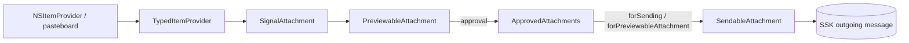
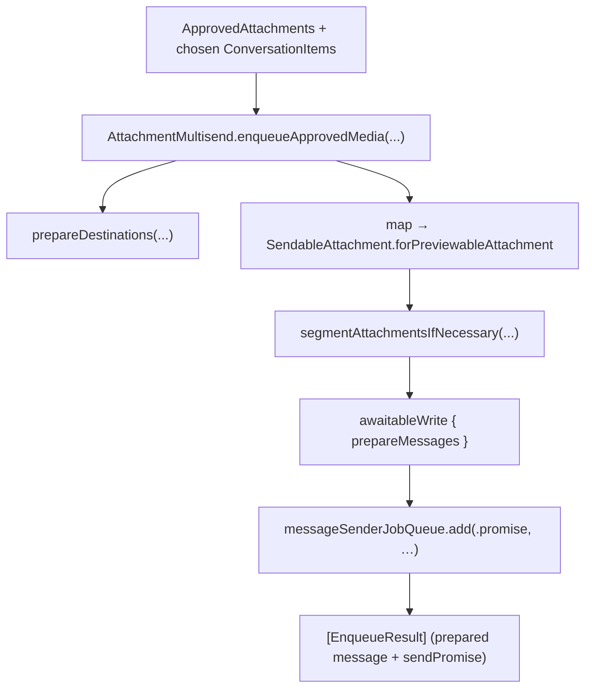

# Attachment Flows: Approval, Multisend, Attachment Model

Sources: `SignalUI/Attachments/` (the client-side attachment model),
`SignalUI/AttachmentApproval/` (the review/caption/edit UI), and
`SignalUI/AttachmentMultisend/` (fan-out send to multiple conversations/stories).
Together these implement "pick/receive media → review & approve → send to one or
many destinations."

> Confidence: **[High]** read in full; **[Medium]** signature/partial; **[Low]**
> inferred. Citations are `File.swift:line`. An uncited claim is a defect.

## The attachment model (`SignalUI/Attachments/`)

The directory holds a small stack of value/reference types representing an
attachment at different stages of the pipeline:

- **[High]** `TypedItemProvider` wraps an `NSItemProvider` with a resolved
  Signal-understood type (`SignalUI/Attachments/TypedItemProvider.swift:60`). This
  is the entry point for content coming from the share sheet / pasteboard.
- **[High]** `SignalAttachment` is the core client-side attachment class, subject
  to validation and (for some types) format conversion
  (`SignalUI/Attachments/SignalAttachment.swift:67`; see the explanatory comment
  at `SignalUI/Attachments/SignalAttachment.swift:60-65`). Its error type
  `SignalAttachmentError` enumerates the failure modes (too large, invalid data,
  conversion failures, …) with localized descriptions
  (`SignalUI/Attachments/SignalAttachment.swift:11`, `:25`).
- **[High]** `PreviewableAttachment` is the reviewable/approvable representation
  shown in the approval UI (`SignalUI/Attachments/PreviewableAttachment.swift:25`).
- **[High]** `SendableAttachment` is the send-ready representation
  (`SignalUI/Attachments/SendableAttachment.swift:16`); it is produced via
  `forSending(...)` / `forPreviewableAttachment(...)` and consumed by the send
  pipeline (used by `ThreadUtil+SignalUI` and `AttachmentMultisend`, see below).
- **[High]** `NormalizedImage` handles image normalization/orientation
  (`SignalUI/Attachments/NormalizedImage.swift`). **[Medium]** (role from name/size.)

## Attachment approval UI (`SignalUI/AttachmentApproval/`)

**[High]** `AttachmentApprovalViewController` is a `final` `OWSViewController`
subclass that is also a `UIPageViewController` data source
(`SignalUI/AttachmentApproval/AttachmentApprovalViewController.swift:90`) — it pages
between attachments so the user can review, caption, reorder, add/remove, and toggle
view-once before sending.

**[High]** It communicates results through
`AttachmentApprovalViewControllerDelegate`
(`SignalUI/AttachmentApproval/AttachmentApprovalViewController.swift:35`), whose
callbacks include `didApproveAttachments(_:messageBody:)`,
`attachmentApprovalDidCancel()`, `didChangeMessageBody`, `didChangeViewOnceState`,
`didRemoveAttachment`, and `didTapAddMore`
(`SignalUI/AttachmentApproval/AttachmentApprovalViewController.swift:37-55`). The
approved payload is the `ApprovedAttachments` struct, which bundles `isViewOnce`,
`imageQuality`, and the `[PreviewableAttachment]`, with a precondition that
view-once allows at most one attachment
(`SignalUI/AttachmentApproval/AttachmentApprovalViewController.swift:14-24`).

**[Medium]** Supporting views in this directory — `AttachmentApprovalToolbar`,
`AttachmentApprovalTopBar`, `MediaCaptionToolbar`, `MediaTopBar`,
`ApprovalRailCellView`, `AttachmentItemCollection`, and `AttachmentPrepViewController`
— compose the toolbar/caption/rail/preview chrome around the pager (read by role).

## Multisend (`SignalUI/AttachmentMultisend/`)

**[High]** `AttachmentMultisend` is the class that fans an approved payload out to
multiple destinations (`SignalUI/AttachmentMultisend/AttachmentMultisend.swift:10`).
Its API `enqueueApprovedMedia(conversations:approvedMessageBody:approvedAttachments:attachmentLimits:)`
returns `[EnqueueResult]`, each pairing a `PreparedOutgoingMessage` with a
`sendPromise` (`SignalUI/AttachmentMultisend/AttachmentMultisend.swift:21`,
`:12-15`). It:

1. Resolves destinations from the chosen `ConversationItem`s and detects whether
   any are stories vs. normal messages
   (`SignalUI/AttachmentMultisend/AttachmentMultisend.swift:26-39`).
2. Resolves image quality and converts each `PreviewableAttachment` into a
   `SendableAttachment` via `SendableAttachment.forPreviewableAttachment`
   (`SignalUI/AttachmentMultisend/AttachmentMultisend.swift:41-47`).
3. Segments attachments when needed (e.g. story video length/quality limits)
   (`SignalUI/AttachmentMultisend/AttachmentMultisend.swift:49-55`).
4. Prepares all messages inside a single `awaitableWrite` and enqueues each on the
   message-sender job queue
   (`SignalUI/AttachmentMultisend/AttachmentMultisend.swift:57-70`).

**[High]** Oversize-text handling for multisend is split out into
`AttachmentMultisend+OversizeText`
(`SignalUI/AttachmentMultisend/AttachmentMultisend+OversizeText.swift`).

**[Medium]** The story-vs-message segmentation decision reads
`ConversationItem.limitsVideoAttachmentLengthForStories`
(`SignalUI/RecipientPickers/ConversationItem.swift:37-39`); see
[RecipientPickers.md](RecipientPickers.md) for the `ConversationItem` protocol.

