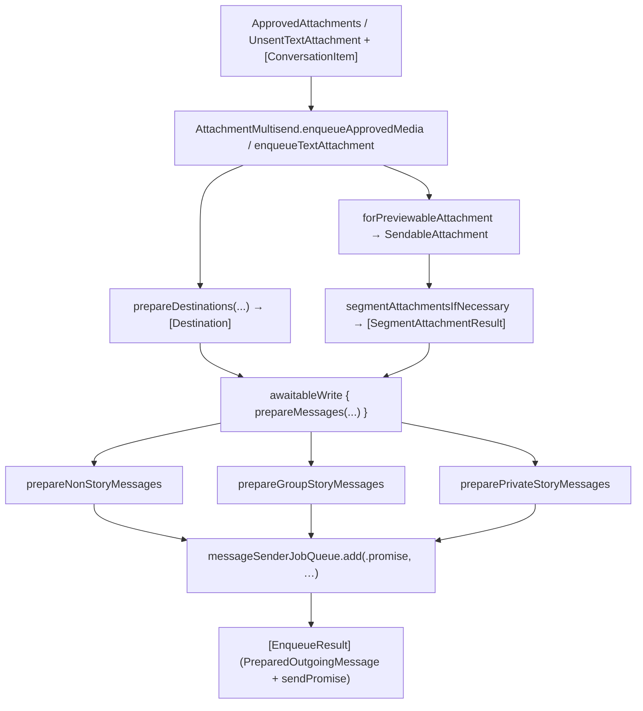

# AttachmentMultisend

Source: `SignalUI/AttachmentMultisend/`. This subsystem takes an already
*approved* payload (media, oversize/text attachment, or a text story) plus a set of
chosen destinations and "fans it out," building and enqueuing one durable outgoing
message per destination. It is the glue between the approval UI and
SignalServiceKit's (SSK) outgoing-message pipeline, with the extra complexity of
handling normal chats, group stories, and private stories in a single send.

> Confidence: **[High]** read in full; **[Medium]** signature/partial; **[Low]**
> inferred. Citations are `File.swift:line`. An uncited claim is a defect.

## Responsibility

**[High]** `AttachmentMultisend` is a stateless `public class` with a private
initializer and only class (static) methods — it is a namespace for the multisend
algorithm, not an instantiable object
(`SignalUI/AttachmentMultisend/AttachmentMultisend.swift:10`, `:17`). It does not own
UI; callers pass in the approved content and the chosen
`[ConversationItem]`, and it returns prepared/enqueued messages. For how the
approved payload is produced, see [../AttachmentFlows.md](../AttachmentFlows.md); for
the `ConversationItem` destination protocol, see
[../RecipientPickers.md](../RecipientPickers.md).

## Public API

**[High]** Both entry points return `[EnqueueResult]`, where each `EnqueueResult`
pairs a `PreparedOutgoingMessage` with a `Promise<Void>` send promise
(`SignalUI/AttachmentMultisend/AttachmentMultisend.swift:12-15`):

- **[High]** `enqueueApprovedMedia(conversations:approvedMessageBody:approvedAttachments:attachmentLimits:)`
  — the media path, used for photos/videos/files to chats and/or stories
  (`SignalUI/AttachmentMultisend/AttachmentMultisend.swift:21`).
- **[High]** `enqueueTextAttachment(_:to:)` — the text-story path; it validates and
  prepares the `UnsentTextAttachment`, then prepares messages for the story
  destinations only (`SignalUI/AttachmentMultisend/AttachmentMultisend.swift:77`). It
  short-circuits to `[]` when there are no conversations
  (`SignalUI/AttachmentMultisend/AttachmentMultisend.swift:81-83`).

## Key types

- **[High]** `EnqueueResult` — the per-destination return value (prepared message +
  send promise) (`SignalUI/AttachmentMultisend/AttachmentMultisend.swift:12`).
- **[High]** `Destination` — a resolved send target: a `ConversationItem`, its
  `TSThread`, and an optional per-destination `ValidatedMessageBody`. The message body
  is modeled per-destination because mentions must be hydrated against each thread's
  participants (`SignalUI/AttachmentMultisend/AttachmentMultisend+OversizeText.swift:11-17`).
- **[High]** `Dependencies` — the injected SSK collaborators the subsystem needs:
  `attachmentManager`, `attachmentValidator` (`AttachmentContentValidator`),
  `contactsMentionHydrator`, `databaseStorage`, `linkPreviewManager`,
  `messageSenderJobQueue`, and `tsAccountManager`
  (`SignalUI/AttachmentMultisend/AttachmentMultisend.swift:104-112`). A single shared
  instance wires these to `DependenciesBridge.shared` / `SSKEnvironment.shared`
  (`SignalUI/AttachmentMultisend/AttachmentMultisend.swift:114-122`).
- **[High]** `SegmentAttachmentResult` — the result of (optionally) segmenting one
  attachment into story-length pieces. It holds the `original` and/or `segmented`
  data sources plus a `renderingFlag`, enforcing that at least one is present and
  exposing `segmentedOrOriginal` to pick segments when available
  (`SignalUI/AttachmentMultisend/AttachmentMultisend.swift:126`, `:140-154`).
- **[High]** `StoryMessageBuilder` — a value type that captures everything needed to
  build a `StoryMessage` (local ACI, an `AttachmentType` of `.media`/`.text`, target
  group IDs, and whether private story threads are included), and whose `build(...)`
  inserts the `StoryMessage` and its attachment
  (`SignalUI/AttachmentMultisend/AttachmentMultisend.swift:519`, `:533`).

## Data flow — media (`enqueueApprovedMedia`)

**[High]** The media path proceeds as follows:

1. **Resolve destinations.** `prepareDestinations(forSendingMessageBody:toConversations:)`
   gets-or-creates a `TSThread` per `ConversationItem` and prepares the message body
   (`SignalUI/AttachmentMultisend/AttachmentMultisend.swift:25-28`,
   `SignalUI/AttachmentMultisend/AttachmentMultisend+OversizeText.swift:19`). **[High]**
   If the body has no mentions it is hydrated once and shared across all destinations;
   otherwise it is re-hydrated and oversize-text-prepared per thread via
   `attachmentValidator.prepareOversizeTextIfNeeded`
   (`SignalUI/AttachmentMultisend/AttachmentMultisend+OversizeText.swift:23-25`,
   `:53-99`).
2. **Classify destinations.** It scans destinations to set `hasNonStoryDestination`
   / `hasStoryDestination` from each `ConversationItem.outgoingMessageType`
   (`SignalUI/AttachmentMultisend/AttachmentMultisend.swift:30-39`).
3. **Make sendable attachments.** Image quality is resolved against
   `attachmentLimits`, then each approved attachment becomes a `SendableAttachment`
   via `SendableAttachment.forPreviewableAttachment`
   (`SignalUI/AttachmentMultisend/AttachmentMultisend.swift:41-47`).
4. **Segment if needed.** `segmentAttachmentsIfNecessary(...)` only segments when
   there is a story destination with a video length limit; it computes the minimum
   required segment duration from the conversations and validates original and/or
   segment data sources accordingly (originals are produced for non-story
   destinations; segments for stories)
   (`SignalUI/AttachmentMultisend/AttachmentMultisend.swift:49-55`, `:156`,
   `:160-224`).
5. **Prepare + enqueue.** Inside a single `databaseStorage.awaitableWrite`,
   `prepareMessages(...)` builds a `PreparedOutgoingMessage` per destination and each
   is enqueued with `messageSenderJobQueue.add(.promise, message:transaction:)`,
   yielding the `[EnqueueResult]`
   (`SignalUI/AttachmentMultisend/AttachmentMultisend.swift:57-70`).

**[Medium]** Note that destination resolution/body hydration performs its own
`awaitableWrite` (`SignalUI/AttachmentMultisend/AttachmentMultisend+OversizeText.swift:33`),
separate from the final build/enqueue write at
`SignalUI/AttachmentMultisend/AttachmentMultisend.swift:57`.

## Message construction — three destination kinds

**[High]** `prepareMessages(forSendingMessageBodyForStories:approvedAttachments:isViewOnce:toDestinations:tx:)`
partitions destinations into non-story threads, private story threads, and group
story threads (with debug asserts tying each kind to `outgoingMessageType` and the
`limitsVideoAttachmentLengthForStories` flag), then builds each kind separately and
concatenates the results
(`SignalUI/AttachmentMultisend/AttachmentMultisend.swift:227`, `:248-298`).

- **[High]** Non-story: `prepareNonStoryMessages(...)` whitelists the thread if it has
  a pending/empty message request, builds an `UnpreparedOutgoingMessage` with the
  unsegmented (original) attachments, prepares it, and donates a send-message intent
  (`SignalUI/AttachmentMultisend/AttachmentMultisend.swift:341`, `:347-389`).
- **[High]** Group story: `prepareGroupStoryMessages(...)` creates one `StoryMessage`
  per attachment *per group* and an `OutgoingStoryMessage` for each — stories allow
  only one attachment, hence one `StoryMessage` per attachment
  (`SignalUI/AttachmentMultisend/AttachmentMultisend.swift:391-397`, `:398-427`).
- **[High]** Private story: `preparePrivateStoryMessages(...)` creates a single
  shared `StoryMessage` per attachment across all private story threads, then
  deduped `OutgoingStoryMessage`s pointing at it via
  `OutgoingStoryMessage.createDedupedOutgoingMessages(...)`
  (`SignalUI/AttachmentMultisend/AttachmentMultisend.swift:450-456`, `:462-483`).

**[High]** Story recipient state differs by kind: group stories derive recipient
states from the group's members (replies allowed)
(`SignalUI/AttachmentMultisend/AttachmentMultisend.swift:429-448`), while private
stories accumulate per-recipient `StoryRecipientState`s across all selected private
story threads, OR-ing `allowsReplies` and unioning the thread UUID contexts
(`SignalUI/AttachmentMultisend/AttachmentMultisend.swift:485-517`).

## Data flow — text story (`enqueueTextAttachment`)

**[High]** The text path validates/prepares the `UnsentTextAttachment`, then in an
`awaitableWrite` calls the sibling
`prepareMessages(forSendingTextAttachment:toConversations:tx:)`, which rejects
non-story (`.message`) targets, builds a single text `StoryMessageBuilder`
(including validating a link-preview draft when present), and routes to the group /
private story preparers above
(`SignalUI/AttachmentMultisend/AttachmentMultisend.swift:85-100`, `:303-337`,
`:641-716`).

## Interactions with the rest of SignalUI / the app

- **[High]** Inputs come from the approval UI (`ApprovedAttachments`,
  `OutgoingAttachmentLimits`) and the recipient pickers (`[ConversationItem]`) — see
  [../AttachmentFlows.md](../AttachmentFlows.md) and
  [../RecipientPickers.md](../RecipientPickers.md).
- **[High]** Output flows into SSK: `PreparedOutgoingMessage`,
  `UnpreparedOutgoingMessage`, `OutgoingStoryMessage`, `StoryMessage`, and the
  `messageSenderJobQueue` are all SSK types; multisend's job is to assemble and
  enqueue them (`SignalUI/AttachmentMultisend/AttachmentMultisend.swift:62-68`,
  `:362-389`, `:398-427`).
- **[Medium]** Mention hydration uses `ContactsMentionHydrator`
  (`SignalUI/AttachmentMultisend/AttachmentMultisend.swift:106`, `:629-632`), and
  link previews for text stories use `linkPreviewManager`
  (`SignalUI/AttachmentMultisend/AttachmentMultisend.swift:663-677`).

## Important state / correctness notes

- **[High]** Segmentation is lazy and need-driven: originals are only built for
  non-story destinations or when no segments exist, and segments only for stories, to
  avoid expensive data-source creation
  (`SignalUI/AttachmentMultisend/AttachmentMultisend.swift:132-139`, `:180-209`).
- **[High]** Stories receive the *untruncated* message body as a caption, which is
  why `prepareMessages` takes `forSendingMessageBodyForStories` separately from the
  per-destination (potentially oversize-truncated) chat bodies
  (`SignalUI/AttachmentMultisend/AttachmentMultisend.swift:60-62`, `:617-636`).
- **[High]** All inserts/enqueues for a given send happen inside one write
  transaction so the fan-out is atomic
  (`SignalUI/AttachmentMultisend/AttachmentMultisend.swift:57`, `:85`).
