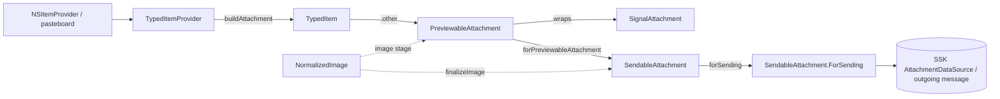

# Attachments: the client-side attachment model

Source: `SignalUI/Attachments/`. This directory holds the client-side value/reference
types that model an outgoing attachment as it moves from "raw content the OS handed
us" to "bytes we're allowed to upload." It is responsible for *typing*, *validation*,
*format conversion*, and *(re)compression* of attachment data — not for the review UI
or the send fan-out.

This README documents the model types themselves. For how they slot into the broader
"pick/receive → review & approve → send" pipeline (approval UI and multisend), see
[AttachmentFlows.md](../AttachmentFlows.md). For the durable send pipeline those bytes
eventually feed, see [Sending.md](../Sending.md). This is distinct from
SignalServiceKit's own `Attachments` subsystem, which owns persisted/received
attachments and the DB-backed `AttachmentDataSource`/`AttachmentContentValidator`
types this code hands off to.

> Confidence: **[High]** read in full; **[Medium]** signature/partial; **[Low]**
> inferred. Citations are `File.swift:line`. An uncited claim is a defect.

## The staged type pipeline

The directory encodes a one-directional pipeline where each stage is a distinct type
representing more-validated data than the last:

The invariant the doc comments describe is a widening of validity guarantees:
`PreviewableAttachment` is "valid enough that we *could* make it fully valid if the
user sends it" (`SignalUI/Attachments/PreviewableAttachment.swift:9-23`), while
`SendableAttachment` is "fully processed and ready to send as-is"
(`SignalUI/Attachments/SendableAttachment.swift:9-14`).

## `TypedItemProvider` + `TypedItem` — the entry point

**[High]** `TypedItemProvider` wraps an `NSItemProvider` together with a resolved,
Signal-understood `ItemType` (`SignalUI/Attachments/TypedItemProvider.swift:60`,
`:64`). It is the entry point for content arriving from the share sheet, pasteboard,
and similar OS hand-offs.

**[High]** `TypedItem` is the discriminated result of loading a provider: `.text`
(a size-capped `MessageText`), `.contact` (raw vCard `Data`), or `.other`
(a `PreviewableAttachment`) (`SignalUI/Attachments/TypedItemProvider.swift:27-33`).
`MessageText` enforces `kMaxOversizeTextMessageSendSizeBytes` at construction, failably
returning `nil` when too large (`SignalUI/Attachments/TypedItemProvider.swift:30-38`).

**[High]** `ItemType` enumerates the supported UTIs (movie, image, web/file URL,
contact, plain-text/text, pdf, pkPass, json, data) and maps each to its
`typeIdentifier` (`SignalUI/Attachments/TypedItemProvider.swift:64-121`). `pkPass`
is a hard-coded `"com.apple.pkpass"` because there is no `UTType` constant
(`SignalUI/Attachments/TypedItemProvider.swift:99-100`).

Type resolution is deliberately ordered:

- **[High]** `make(for:)` first checks `forcedDataTypeIdentifiers`
  (`com.topografix.gpx`, `com.apple.ips`) that must transfer as raw `data` to work
  around OS quirks (`SignalUI/Attachments/TypedItemProvider.swift:137-141`,
  `:165-170`).
- **[High]** It then walks `itemTypeOrder`, a hand-ordered list where more-specific
  types precede their UT-conformance fallbacks (e.g. `movie`/`image` before `data`)
  (`SignalUI/Attachments/TypedItemProvider.swift:145-147`, `:172-176`). An unmatched
  provider throws `ItemProviderError.unsupportedMedia`
  (`SignalUI/Attachments/TypedItemProvider.swift:178-179`).

**[High]** `buildAttachment(attachmentLimits:progress:)` is the `@concurrent` loader
that turns the provider into a `TypedItem` (`SignalUI/Attachments/TypedItemProvider.swift:185`).
It branches per `ItemType` and handles the real-world messiness of iOS item
providers. The image case is the clearest example of its defensive layering: it tries
to load from a file first (to avoid loading into RAM), then falls back to loading a
`UIImage` directly, then to `NSKeyedUnarchiver`-ing a bplist that actually contains a
`UIImage` (`SignalUI/Attachments/TypedItemProvider.swift:200-218`). `loadObjectWithKeyedUnarchiverFallback`
generalizes that object-then-archived-data fallback for `UIImage`/`NSURL`/`NSString`
(`SignalUI/Attachments/TypedItemProvider.swift:303-331`), and `isBplist(url:)` sniffs
the `"bplist"` magic bytes to detect the archived case
(`SignalUI/Attachments/TypedItemProvider.swift:337-344`).

**[High]** `buildVisualMediaAttachment(forItemProvider:attachmentLimits:)` is the
convenience entry that produces a `PreviewableAttachment` and throws
`invalidFileFormat` if the result isn't visual media
(`SignalUI/Attachments/TypedItemProvider.swift:152-163`). Text that's too large to
send inline is quietly demoted to an oversize-text generic attachment rather than
failing (`SignalUI/Attachments/TypedItemProvider.swift:346-368`).

**[High]** Videos are compressed up front via `PreviewableAttachment.compressVideoAsMp4`,
with a private `ProgressPoller` bridging `AVAssetExportSession.progress` into an
`NSProgress` by polling on a `WeakTimer`
(`SignalUI/Attachments/TypedItemProvider.swift:410-431`, `:446-478`). A `// TODO` notes
the desire to defer that export to the end of the share flow
(`SignalUI/Attachments/TypedItemProvider.swift:411`).

**[Medium]** `isVisualMedia`/`isStoriesCompatible` on both `TypedItem` and
`TypedItemProvider` drive downstream UI eligibility (e.g. story compatibility)
(`SignalUI/Attachments/TypedItemProvider.swift:40-54`, `:124-135`).

## `SignalAttachment` — the core reference type

**[High]** `SignalAttachment` is the core client-side attachment class and the oldest
file here (2017). It carries a `DataSourcePath` + `dataUTI` and gathers the
validation/conversion logic along with cached derived images
(`SignalUI/Attachments/SignalAttachment.swift:67`; the explanatory class comment is at
`:57-66`). The constructor is `init`-private-by-convention — "use the factory methods
instead" — which in practice means it is created through `PreviewableAttachment`'s
factories (`SignalUI/Attachments/SignalAttachment.swift:81-91`).

**[High]** `SignalAttachmentError` enumerates the failure modes (missing/invalid data,
too large, image/video conversion/resize failures, invalid format) and provides
localized descriptions via `LocalizedError`/`UserErrorDescriptionProvider`
(`SignalUI/Attachments/SignalAttachment.swift:12-22`, `:26-56`). This is the shared
error currency for the whole directory.

Notable responsibilities:

- **[High]** Memory pressure handling: it observes
  `didReceiveMemoryWarningNotification` and drops its cached image/thumbnail/video
  preview (`SignalUI/Attachments/SignalAttachment.swift:93-99`).
- **[High]** Thumbnailing: `staticThumbnail()` center-crop-sizes to ~60pt on the
  smaller axis, caching the result (`SignalUI/Attachments/SignalAttachment.swift:115-144`).
- **[High]** `renderingFlag` maps attachment traits to
  `AttachmentReference.RenderingFlag` (voice message, borderless, looping/animated,
  default) (`SignalUI/Attachments/SignalAttachment.swift:150-160`).
- **[High]** `mimeType` special-cases voice messages as `audio/aac` to work around a
  legacy-client `.m4a`/`.mp4` playback bug
  (`SignalUI/Attachments/SignalAttachment.swift:206-217`).
- **[High]** The UTI set accessors define what counts as a valid input/output image,
  video, audio, or media type — e.g. `inputImageUTISet` adds transcodable formats
  (HEIC/HEIF/WebP, and version-gated AVIF/DNG/JPEG-XL) on top of `outputImageUTISet`
  (`SignalUI/Attachments/SignalAttachment.swift:234-299`). These sets are the
  gatekeepers used by `PreviewableAttachment`'s factories.

## `PreviewableAttachment` — the reviewable representation

**[High]** `PreviewableAttachment` wraps a `SignalAttachment` (`rawValue`) plus an
`AttachmentType` discriminator (`.image(NormalizedImage)`, `.animatedImage`, `.other`)
(`SignalUI/Attachments/PreviewableAttachment.swift:25-33`). Its stored
`AttachmentType.image` carries the `NormalizedImage` so the final re-compression can
happen later without re-deriving it. Accessors (`dataSource`, `mimeType`,
`isImage`, …) simply forward to `rawValue`
(`SignalUI/Attachments/PreviewableAttachment.swift:35-46`).

It is essentially a factory namespace. Each factory validates against the appropriate
UTI set and size limit (`OutgoingAttachmentLimits`) and throws `SignalAttachmentError`:

- **[High]** `imageAttachment(...)` validates `inputImageUTISet`, special-cases
  animated images (never re-encoded as JPEG; capped at `kMaxFileSizeAnimatedImage`),
  fixes the HEIC-extension-but-JPEG-data case, and otherwise defers to
  `NormalizedImage.forDataSource` (`SignalUI/Attachments/PreviewableAttachment.swift:48-104`).
- **[High]** `videoAttachment(...)` validates the video extension/asset and enforces
  `maxPlaintextVideoBytes` (`SignalUI/Attachments/PreviewableAttachment.swift:116-130`).
- **[High]** `compressVideoAsMp4(...)` (`@MainActor`) transcodes to a 640x480 MP4 via
  `AVAssetExportSession`, optimized for network streaming, then re-validates as a video
  attachment (`SignalUI/Attachments/PreviewableAttachment.swift:132-213`).
- **[High]** `audioAttachment`/`voiceMessageAttachment`/`genericAttachment` validate the
  audio UTI set / enforce the generic plaintext limit; `genericAttachment` asserts the
  data is neither a video nor an input image
  (`SignalUI/Attachments/PreviewableAttachment.swift:217-253`).
- **[High]** `buildAttachment(ofTypes:...)` is the general dispatcher that routes a
  `dataUTI` to the right factory, gated by an `AttachmentTypes` option set
  (`SignalUI/Attachments/PreviewableAttachment.swift:255-315`). The private
  `newAttachment(...)` is the shared validate-UTI-and-size helper
  (`SignalUI/Attachments/PreviewableAttachment.swift:319-345`).

## `SendableAttachment` — the send-ready representation

**[High]** `SendableAttachment` is an immutable struct holding the finalized
`dataSource`, `dataUTI`, filtered filename, `mimeType`, and `renderingFlag`
(`SignalUI/Attachments/SendableAttachment.swift:16-34`). It is produced from a
`PreviewableAttachment` and consumed by the send pipeline.

- **[High]** `forPreviewableAttachment(_:imageQualityLevel:)` (`@concurrent`) is the
  conversion step: PNG animated images get metadata stripped, other animated images
  pass through, `.image` attachments are run through
  `NormalizedImage.finalizeImage(imageQuality:)`, and everything else passes through
  unchanged (`SignalUI/Attachments/SendableAttachment.swift:46-77`). This is the point
  where the user's chosen `ImageQualityLevel` is actually applied.
- **[High]** `segmentedIfNecessary(segmentDuration:attachmentLimits:)` splits a video
  longer than the given duration into multiple sub-attachments via
  passthrough `AVAssetExportSession` trims — used by story sends which cap video length
  (`SignalUI/Attachments/SendableAttachment.swift:94-184`). A `// [15M] TODO` notes the
  segments don't carry over all `SignalAttachment` fields
  (`SignalUI/Attachments/SendableAttachment.swift:136`).
- **[High]** `forSending(attachmentContentValidator:)` is the hand-off into
  SignalServiceKit: it calls `validateSendableAttachmentContents` (an extension on
  SSK's `AttachmentContentValidator`) to produce an `AttachmentDataSource`, wrapped in
  the small `ForSending` struct alongside the `renderingFlag`
  (`SignalUI/Attachments/SendableAttachment.swift:186-224`). `defaultFilename` supplies
  a timestamped `signal-…` fallback name when the user didn't provide one
  (`SignalUI/Attachments/SendableAttachment.swift:80-91`).

**[Medium]** `forSending` is the boundary consumed by the send plumbing in
[Sending.md](../Sending.md) (`ThreadUtil+SignalUI`) and by multisend
(`AttachmentMultisend` calls `forPreviewableAttachment`), per
[AttachmentFlows.md](../AttachmentFlows.md).

## `NormalizedImage` — image normalization & (re)compression

**[High]** `NormalizedImage` represents a `PreviewableAttachment` that is specifically
an image, and owns the orientation/format normalization and the final
quality-aware compression (`SignalUI/Attachments/NormalizedImage.swift:15`). It stores
the intermediate `dataSource`/`dataUTI` plus three decision flags — `mustCompress`,
`mayHaveMetadata`, `mayHaveTransparency` — that steer finalization
(`SignalUI/Attachments/NormalizedImage.swift:16-33`).

Construction:

- **[High]** `forImage(_:...)` writes a `UIImage` out as PNG and defers to
  `forDataSource` (`SignalUI/Attachments/NormalizedImage.swift:100-130`).
- **[High]** `forDataSource(_:dataUTI:...)` decides whether the original can be used
  as-is (right format and within the starting quality tier's max edge size) or must be
  converted to a lossless PNG intermediate; it also narrows `mayHaveTransparency` to
  only sticker-like images, because screenshots etc. have alpha channels without real
  transparency (`SignalUI/Attachments/NormalizedImage.swift:132-200`). The guiding
  principle in the comments: prepare at max quality now, apply the user's chosen
  quality only at finalize time
  (`SignalUI/Attachments/NormalizedImage.swift:148-200`).

Finalization:

- **[High]** `finalizeImage(imageQuality:)` is the terminal step called from
  `SendableAttachment.forPreviewableAttachment`. If `mustCompress` is false it checks
  whether the original is *still* valid at the user's chosen quality and, if so,
  returns it (optionally metadata-stripped); otherwise it compresses
  (`SignalUI/Attachments/NormalizedImage.swift:226-278`).
- **[High]** `compressImageToQuality`/`compressImageToTier` progressively step down
  through `ImageQualityTier`s until output fits `maxFileSize`, choosing PNG for
  transparency or JPEG (with size-dependent quality) otherwise
  (`SignalUI/Attachments/NormalizedImage.swift:280-343`).
- **[High]** Metadata stripping is format-specific: PNGs are rewritten keeping only an
  allowlist of chunks via `PngChunker`
  (`SignalUI/Attachments/NormalizedImage.swift:360-404`), while non-PNG images go
  through `CGImageDestinationCopyImageSource` with tags nulled out — except JPEGs,
  which deliberately fall back to recompression to dodge an iOS crash bug (FB13285956)
  (`SignalUI/Attachments/NormalizedImage.swift:406-466`). TIFF/IPTC orientation tags
  are preserved (`SignalUI/Attachments/NormalizedImage.swift:349-358`).

**[Medium]** `loadImage(imageSource:maxPixelSize:)` is public and reused outside this
file for downsampling; the comment explains CGContext resizing is used because
`UIGraphicsBeginImageContext` crashes in the locked share extension
(`SignalUI/Attachments/NormalizedImage.swift:46-61`).

## Interactions with the rest of SignalUI and the app

**[Medium]** (consumer list gathered by grep across `SignalUI/` and `Signal/`.)

- The **share extension** (`SignalShareExtension/ShareViewController.swift`) and
  **pasteboard** handling (`Signal/Attachments/PasteboardAttachment.swift`) are the
  primary producers that feed `TypedItemProvider`.
- The **approval UI** (`SignalUI/AttachmentApproval/`, especially
  `AttachmentApprovalViewController.swift` and `AttachmentItemCollection.swift`)
  consumes `PreviewableAttachment` for review/caption/reorder; see
  [AttachmentFlows.md](../AttachmentFlows.md).
- **Capture/picker surfaces** in the app — `CameraCaptureSession`,
  `SendMediaNavigationController`, `PhotoLibrary`, `GifPickerViewController`,
  `LocationPicker`, voice-message drafts — construct `PreviewableAttachment`s via the
  factories.
- The **send boundary** is `forSending`/`forPreviewableAttachment`, consumed by
  `SignalUI/Sending/ThreadUtil+SignalUI.swift` and
  `SignalUI/AttachmentMultisend/AttachmentMultisend.swift` (see
  [Sending.md](../Sending.md) and [AttachmentFlows.md](../AttachmentFlows.md)).

## Notable UI/engineering considerations

- **[High]** Heavy work is designed to run off the main thread: the item-provider
  loaders and `forPreviewableAttachment` are marked `@concurrent`
  (`SignalUI/Attachments/TypedItemProvider.swift:184-185`,
  `SignalUI/Attachments/SendableAttachment.swift:45-46`), while
  `compressVideoAsMp4` is `@MainActor`
  (`SignalUI/Attachments/PreviewableAttachment.swift:131-132`). A standing `// TODO`
  on `SignalAttachment` still wants conversion moved off-main
  (`SignalUI/Attachments/SignalAttachment.swift:66`).
- **[High]** Prepare-at-max-quality, apply-quality-at-send is a deliberate split so the
  user can toggle standard/high quality in the approval UI without re-importing
  (`SignalUI/Attachments/NormalizedImage.swift:148-152`).
- **[High]** Progress reporting for video export is surfaced to the UI via
  `ProgressPoller` + `NSProgress` (`SignalUI/Attachments/TypedItemProvider.swift:446-478`).
- **[High]** Memory safety: cached images are dropped on memory warnings
  (`SignalUI/Attachments/SignalAttachment.swift:93-99`), and resizing avoids
  `UIGraphicsBeginImageContext` for share-extension stability
  (`SignalUI/Attachments/NormalizedImage.swift:48-50`).
- **[High]** Graceful degradation rather than hard failure where possible: oversize
  text becomes an oversize-text attachment
  (`SignalUI/Attachments/TypedItemProvider.swift:346-368`), and JPEG metadata-strip
  failures fall back to recompression
  (`SignalUI/Attachments/NormalizedImage.swift:425-432`).
