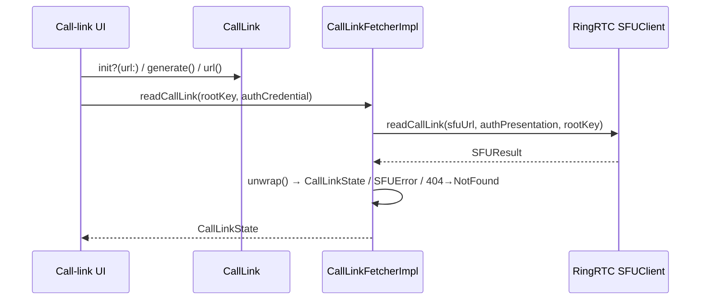

# Call links

Source: `SignalUI/Calls/`. This small area models **call links** — the shareable
`https://signal.link/call/#key=…` URLs that address an ad-hoc group call — and
provides the SFU round-trip used to read a link's server-side state. It is the
SignalUI-level glue between RingRTC/SSK call-link primitives and the UI that
creates, parses, and inspects call links.

> Confidence: **[High]** read in full; **[Medium]** signature/partial; **[Low]**
> inferred. Citations are `File.swift:line`. An uncited claim is a defect.

## `CallLink` — model, URL parsing, and generation

**[High]** `CallLink` is an `Equatable` value type wrapping a single
`CallLinkRootKey` (`SignalUI/Calls/CallLink.swift:9`, `SignalUI/Calls/CallLink.swift:22`).
It is the UI-facing representation of a call link and owns the canonical URL
format via a private `Constants` enum: scheme `https`, host `signal.link`, path
`/call/` (plus a legacy `/call` path), and the `key` query name
(`SignalUI/Calls/CallLink.swift:13-20`).

**[High]** `init?(url:)` parses a link URL of the form
`https://signal.link/call/#key=value` (`SignalUI/Calls/CallLink.swift:25`). The
parse is deliberately strict:

1. The scheme must be `https` **or** the custom `sgnl` scheme, there must be no
   user/password/port, the host must be `signal.link`, the path must be `/call/`
   or the legacy `/call`, and the (non-fragment) query must be empty
   (`SignalUI/Calls/CallLink.swift:27-37`).
2. The root key is carried in the URL *fragment*, not the query. The initializer
   copies `percentEncodedFragment` into `percentEncodedQuery` so it can reuse
   `URLComponents.queryItems` parsing (`SignalUI/Calls/CallLink.swift:39`).
3. It then requires exactly one `key` query item whose value decodes to a
   `CallLinkRootKey`; anything else returns `nil`
   (`SignalUI/Calls/CallLink.swift:40-48`).

**[High]** `generate()` mints a fresh link from `CallLinkRootKey.generate()`
(`SignalUI/Calls/CallLink.swift:55-58`), and `url()` is the inverse of the parser:
it rebuilds the components and moves the `key` query item back into the fragment
via `percentEncodedFragment`/clearing `query`
(`SignalUI/Calls/CallLink.swift:60-72`). **[High]** Equality is defined by
comparing the canonical `url()` strings rather than the raw key bytes
(`SignalUI/Calls/CallLink.swift:76-78`).

**[Medium]** The fragment-based key placement matters for privacy: the root key
lives in the URL fragment, which is not sent to servers on an ordinary request —
consistent with the key being client-side material (inferred from the
query↔fragment juggling; the exact threat model is not stated in-file).

## `CallLinkFetcher` — reading link state from the SFU

**[High]** `CallLinkFetcherImpl` reads a call link's server state through
RingRTC's SFU client (`SignalUI/Calls/CallLinkFetcher.swift:12`). On init it
constructs a `CallHTTPClient` and an `SFUClient` bound to that client's
`ringRtcHttpClient`; it intentionally retains the `CallHTTPClient` in
`sfuClientHttpClient` even though it is otherwise unused, because the `SFUClient`
depends on it staying alive (`SignalUI/Calls/CallLinkFetcher.swift:13-24`).

**[High]** `readCallLink(_:authCredential:)` is `async throws` and returns an
SSK `CallLinkState` (`SignalUI/Calls/CallLinkFetcher.swift:26-29`). It:

1. Picks the SFU URL — the test SFU when the `callingUseTestSFU` debug flag is
   set, otherwise the production `TSConstants.sfuURL`
   (`SignalUI/Calls/CallLinkFetcher.swift:30`).
2. Derives `CallLinkSecretParams` from the root key bytes and builds an
   auth-credential presentation scoped to those params
   (`SignalUI/Calls/CallLinkFetcher.swift:31-32`).
3. Calls `sfuClient.readCallLink(sfuUrl:authCredentialPresentation:linkRootKey:)`,
   `unwrap()`s the `SFUResult`, and wraps the payload in `CallLinkState`
   (`SignalUI/Calls/CallLinkFetcher.swift:34-39`).
4. Maps a raw `404` error to a typed `CallLinkNotFoundError`
   (`SignalUI/Calls/CallLinkFetcher.swift:10`, `SignalUI/Calls/CallLinkFetcher.swift:40-42`).

**[High]** Error handling is formalized with `SFUError` wrapping the SFU's
numeric error code (`SignalUI/Calls/CallLinkFetcher.swift:46-48`) and an
`SFUResult.unwrap()` typed-throws extension that returns the success value or
throws `SFUError` on failure (`SignalUI/Calls/CallLinkFetcher.swift:50-59`).

## Interactions and data flow

**[Medium]** This area is a thin SignalUI layer over lower-level dependencies:

- **RingRTC (`SignalRingRTC`)** supplies `CallLinkRootKey`, `SFUClient`,
  `SFUResult`, and `CallHTTPClient` (`SignalUI/Calls/CallLink.swift:7`,
  `SignalUI/Calls/CallLinkFetcher.swift:8`, `SignalUI/Calls/CallLinkFetcher.swift:14-16`).
- **SignalServiceKit** supplies `CallLinkAuthCredential`, `CallLinkSecretParams`,
  `CallLinkState`, `TSConstants`, and `DebugFlags`
  (`SignalUI/Calls/CallLinkFetcher.swift:9`, `SignalUI/Calls/CallLinkFetcher.swift:27-39`).
- **LibSignalClient** is imported for the credential/zk machinery
  (`SignalUI/Calls/CallLinkFetcher.swift:7`).

**[Low]** The intended UI consumers (join/share/create call-link screens) are not
in this folder; `CallLink` provides parse/serialize and `generate()`, while
`CallLinkFetcherImpl` provides the "fetch current state" call those screens would
use. The division of labor is inferred from the public API shape rather than
observed call sites.

## UI considerations

**[Medium]** There are no view controllers or views in this folder — it is model
and networking only. The UI-relevant behaviors are:

- **Canonical, round-trippable URLs.** `url()` and `init?(url:)` are inverses, and
  `testRoundtrip` asserts a parsed link re-serializes to the identical string
  (`SignalUI/Calls/CallLinkTest.swift:24-28`). UI code can rely on `url()` for
  display/share without reformatting.
- **Strict parsing.** Wrong scheme, host, or path all yield `nil`
  (`SignalUI/Calls/CallLinkTest.swift:12-17`), so UI that accepts pasted/scanned
  links can treat a `nil` result as "not a valid call link" without extra
  validation.
- **Typed not-found.** `CallLinkNotFoundError` lets UI distinguish a deleted/
  nonexistent link from other SFU failures (`SignalUI/Calls/CallLinkFetcher.swift:10`,
  `SignalUI/Calls/CallLinkFetcher.swift:40-42`).

## Tests

**[High]** `CallLinkTest` covers URL parsing rejection cases, URL round-tripping,
and that `generate()` produces distinct links (`SignalUI/Calls/CallLinkTest.swift:10-33`).
There is no test coverage for `CallLinkFetcherImpl` in this folder (it depends on
a live SFU).
