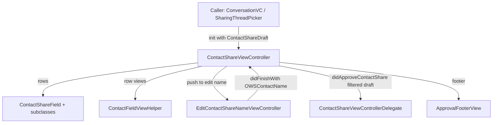

# Contact Sharing UI

Source: `SignalUI/ContactSharing/`. The reusable UI for *approving and editing a
shared contact card* before it is sent, plus the small view-model and
field/rendering helpers that back it. Both the app and the share extension present
these screens when a user shares a contact.

> Confidence: **[High]** read in full; **[Medium]** signature/partial; **[Low]**
> inferred. Citations are `File.swift:line`. An uncited claim is a defect.

## Responsibility

**[High]** This directory does not model or persist a contact share — that lives in
SignalServiceKit (`OWSContact`, and the mutable `ContactShareDraft`,
`SignalServiceKit/Messages/Interactions/ContactShare/ContactShareDraft.swift:9`).
Instead it provides:

- An approval screen that lets the user pick which fields of a contact to include
  and edit the name before sending (`ContactShareViewController`).
- A name-editing sub-screen (`EditContactShareNameViewController`).
- A read-oriented view model wrapping a persisted `OWSContact`
  (`ContactShareViewModel`).
- Per-field selection wrappers (`ContactShareField` and subclasses).
- Static view-builder helpers for rendering individual contact fields
  (`ContactFieldViewHelper`).

## `ContactShareViewController` — the approval screen

**[High]** `ContactShareViewController` is an `OWSTableViewController2` that
conforms to `ApprovalFooterDelegate` and `EditContactShareNameViewControllerDelegate`
(`SignalUI/ContactSharing/ContactShareViewController.swift:24-26`). It is UI-only
and defers all policy to its `ContactShareViewControllerDelegate`
(`SignalUI/ContactSharing/ContactShareViewController.swift:8`), which supplies the
approve/cancel callbacks, an optional title, a recipients description, and the
`ApprovalMode` (`SignalUI/ContactSharing/ContactShareViewController.swift:10-21`).
The approval mode falls back to `.send` when no delegate is set
(`SignalUI/ContactSharing/ContactShareViewController.swift:31`).

**[High]** It is initialized with a `ContactShareDraft`
(`SignalUI/ContactSharing/ContactShareViewController.swift:77`) and builds its
editable field list lazily from that draft: phone numbers, emails, and addresses
become `ContactShareField`s (`:51-58`), and an optional avatar becomes a
`ContactShareAvatarField` (`:38-49`).

**[High]** The table has one section with a row per field
(`SignalUI/ContactSharing/ContactShareViewController.swift:144-184`):

- A **name** row that is always included (its checkmark is selected and disabled)
  and whose action pushes the name editor
  (`:147-160`, `:233-249` for `contactNameCell(for:)`).
- An optional **avatar** row (`:163-172`).
- One row per phone/email/address field (`:175-184`).

Each non-name row toggles inclusion via `toggleSelection(for:)`, which flips
`ContactShareField.isIncluded`, updates just that cell's checkmark, and recomputes
the proceed-button state (`:195-209`).

**[High]** Send is gated: `didPressSendButton()` requires at least one selected
field (`updateProceedButtonState`/`isAtLeastOneFieldSelected`, `:139-143`,
`:188-190`), validates the draft via `ows_isValid` (showing a localized error
otherwise), then builds a *filtered* draft and hands it to the delegate's
`didApproveContactShare` (`:213-234`). `filteredContactShare()` constructs a fresh
contact via `contactShareDraft.newContact(withName:)` and applies only the included
fields (`:60-74`).

## `ContactShareField` — per-field inclusion

**[High]** `ContactShareField` is a small protocol (`isIncluded`, `localizedLabel`,
`applyToContact(contact:)`, `SignalUI/ContactSharing/ContactShareField.swift:8`)
with a generic base `ContactShareFieldBase<ContactFieldType: OWSContactField>`
(`:14`). Concrete subclasses wrap SSK field types and append themselves to the
target draft when included: `ContactSharePhoneNumber` (`:38`), `ContactShareEmail`
(`:50`), `ContactShareAddress` (`:62`), and `ContactShareAvatarField` (`:91`).
`OWSContactAvatar` is a stub `OWSContactField` so the avatar can participate in the
same field machinery (`:75`). Each `applyToContact` asserts it is only called when
`isIncluded` (`owsPrecondition(isIncluded)`, e.g. `:41`).

## `EditContactShareNameViewController` — name editor

**[High]** An `OWSTableViewController2` that conforms to a private
`ContactNameFieldViewDelegate` (`SignalUI/ContactSharing/EditContactShareNameViewController.swift:63`).
It presents six editable text fields — name prefix, given, middle, family, suffix,
and organization — each a private `ContactNameFieldView` (a `UIView` wrapping a
`UITextField`, `:11-61`) seeded from the draft's `OWSContactName`
(`:67-105`). The Done button is enabled only when at least one field is non-empty
(`canSaveChanges`, `:160-167`) and, on save, builds a new `OWSContactName` and calls
the delegate's `didFinishWith`, then pops (`:169-184`). The parent
`ContactShareViewController` applies the new name back onto its draft and reloads
(`SignalUI/ContactSharing/ContactShareViewController.swift:280-286`).

## `ContactShareViewModel` — read-side wrapper

**[High]** `ContactShareViewModel` is an `Equatable` class wrapping a persisted
`OWSContact` (`dbRecord`) plus a cached avatar image
(`SignalUI/ContactSharing/ContactShareViewModel.swift:9-11`). Its primary
initializer resolves the avatar from the parent message's referenced
contact-avatar attachment via `DependenciesBridge.shared.attachmentStore`, decoding
image data only for image content types (`:48-85`). Most accessors (`name`,
`addresses`, `emails`, `phoneNumbers`, `displayName`) delegate straight to
`dbRecord` (`:117-162`). Equality compares the underlying `OWSContact`
(`:105-107`).

**[High]** Two copy methods bridge rendering and sending:
`copyForResending()` produces a `ContactShareDraft` (feeding this subsystem's
approval screen on resend, `:164-173`) and `copyForRendering()` deep-copies the
`OWSContact` for display (`:175-184`). Avatar rendering intentionally never falls
back to a name-derived or system/profile avatar — the default avatar uses only the
contact's own name components so the UI does not imply an avatar that was not
actually shared (see the inline note, `:91-104`).

## `ContactFieldViewHelper` — field view builders

**[High]** `ContactFieldViewHelper` is a stateless helper exposing class methods
that build a `UIView` for each contact field type: avatar
(`SignalUI/ContactSharing/ContactFieldViewHelper.swift:10`), contact name (`:23`),
organization (`:27`), phone number — formatted via
`PhoneNumber.bestEffortLocalizedPhoneNumber` (`:34`), email (`:39`), and address —
formatted with `CNPostalAddressFormatter` (`:72`). The simple cases share a
label-stack builder (`simpleFieldView`, `:43`) that uses dynamic-type fonts and
`Theme` colors.

## Interactions with the rest of the app

**[High]** The approval screen is instantiated in two places, both constructing it
with a `ContactShareDraft`:

- The main app's conversation input flow
  (`Signal/ConversationView/ConversationViewController+Delegates.swift:130`).
- The share extension's thread picker
  (`SignalShareExtension/SharingThreadPickerViewController.swift:155`).

**[High]** `ContactShareViewModel` is the read-side type consumed broadly across the
app's conversation rendering and detail surfaces — e.g. `CVContactShareView`,
`CVComponentContactShare`, message/edit-history/pinned-message detail views — and by
`ContactShareViewHelper` in the main app, which drives "invite" and "add to
contacts" flows from a shared contact
(`Signal/src/ViewControllers/ContactShareViewHelper.swift:89-203`).
**[Medium]** (consumer set enumerated from a repo-wide search; the view-helper read
in full.)

## Notable UI considerations

- **[High]** Field selection is non-destructive: toggling only flips an in-memory
  `isIncluded` flag; the actual draft is assembled from included fields at send time
  via `filteredContactShare()`
  (`SignalUI/ContactSharing/ContactShareViewController.swift:60-74`).
- **[High]** The footer is an `ApprovalFooterView` whose proceed button reflects the
  "at least one field selected" rule
  (`SignalUI/ContactSharing/ContactShareViewController.swift:125-143`). On iOS 26+ a
  `UIScrollEdgeElementContainerInteraction` is attached and `tableView` content
  insets are kept in sync with the footer height in `viewDidLayoutSubviews`
  (`:107-131`).
- **[High]** Validity is enforced twice before approval: a user-facing error sheet
  when the draft is invalid, and an `owsPrecondition` on the filtered draft
  (`:213-232`).
- **[Medium]** Views use dynamic-type fonts and `Theme` colors throughout
  (`ContactFieldViewHelper.simpleFieldView`,
  `SignalUI/ContactSharing/ContactFieldViewHelper.swift:43-69`;
  `ContactNameFieldView`,
  `SignalUI/ContactSharing/EditContactShareNameViewController.swift:19-26`).
