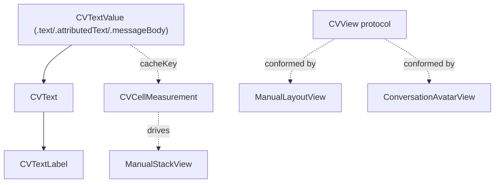

# Conversation-View Building Blocks

Source: `SignalUI/ConversationView/`. These are the low-level, shared rendering
primitives used to build conversation (message list) cells. The full conversation
*view controller* lives in the main app (`Signal/`); this directory holds the
reusable `CV*` ("Conversation View") pieces that both the app and shared code rely
on.

> Confidence: **[High]** read in full; **[Medium]** signature/partial; **[Low]**
> inferred. Citations are `File.swift:line`. An uncited claim is a defect.

## `CVTextValue` — the text abstraction

**[High]** `CVTextValue` is an enum unifying the three ways conversation text can
be supplied (`SignalUI/ConversationView/CVText.swift:8`):

- `.text(String)` — plain text.
- `.attributedText(NSAttributedString)` — pre-attributed text.
- `.messageBody(HydratedMessageBody)` — a hydrated SSK message body (mentions,
  styles, etc.).

It exposes `isEmpty`/`nilIfEmpty` (`SignalUI/ConversationView/CVText.swift:14-27`),
`naturalTextAligment` for RTL handling (`SignalUI/ConversationView/CVText.swift:30`),
an `accessibilityDescription` (`SignalUI/ConversationView/CVText.swift:40`), and a
`cacheKey` used for measurement/layout caching
(`SignalUI/ConversationView/CVText.swift:62`).

## `CVText` — measurement & label construction

**[High]** `CVText` is the helper class for building and measuring conversation
labels (`SignalUI/ConversationView/CVText.swift:294`). **[Medium]** Together with
the per-value `cacheKey`, this is what lets conversation cells be measured cheaply
and reused — the measurement is keyed and cached rather than recomputed per layout
pass (inferred from the `cacheKey` design + `CVCellMeasurement`; the full caching
policy was not read in detail).

## `CVTextLabel` — rich interactive label

**[High]** `CVTextLabel` is a class (not a `UILabel` subclass) that renders rich,
interactive conversation text (`SignalUI/ConversationView/CVTextLabel.swift:9`). It
is the mechanism behind tappable mentions / links / data detectors inside message
bubbles. **[Medium]** (role inferred from the file's size (~24 KB) and the `CV`
naming; exact interaction model not read line-by-line.)

## `CVCellMeasurement` — cached geometry

**[High]** `CVCellMeasurement` is an `Equatable` struct holding precomputed sizes
and values for a conversation cell (`SignalUI/ConversationView/CVCellMeasurement.swift:23`).
This is the "measure once, lay out many times" record that the manual-layout views
(`ManualStackView`/`ManualLayoutView`, see [Views.md](Views.md)) consume.

## `CVView` — the marker protocol

**[High]** `CVView` is a `UIView`-refining protocol
(`SignalUI/ConversationView/CVUtils.swift:38`). Views that participate in
conversation rendering (`ManualLayoutView` at
`SignalUI/Views/ManualLayoutView.swift:23`, `ConversationAvatarView` at
`SignalUI/Views/ConversationAvatarView.swift:42`, `AvatarImageView` at
`SignalUI/Views/AvatarImageView.swift:8`) conform to it. `CVUtils` also defines its
own `LayoutBlock`/`addLayoutBlock(_:)` manual-layout helpers
(`SignalUI/ConversationView/CVUtils.swift:84`, `:105`).

## Other pieces

- **[High]** `CVCapsuleLabel` — a `UILabel` subclass that renders inside a capsule
  shape (`SignalUI/ConversationView/CVCapsuleLabel.swift:15`).
- **[High]** `CVItemViewModel` — the protocol a conversation item view model
  conforms to (`SignalUI/ConversationView/CVItemViewModel.swift:8`).

