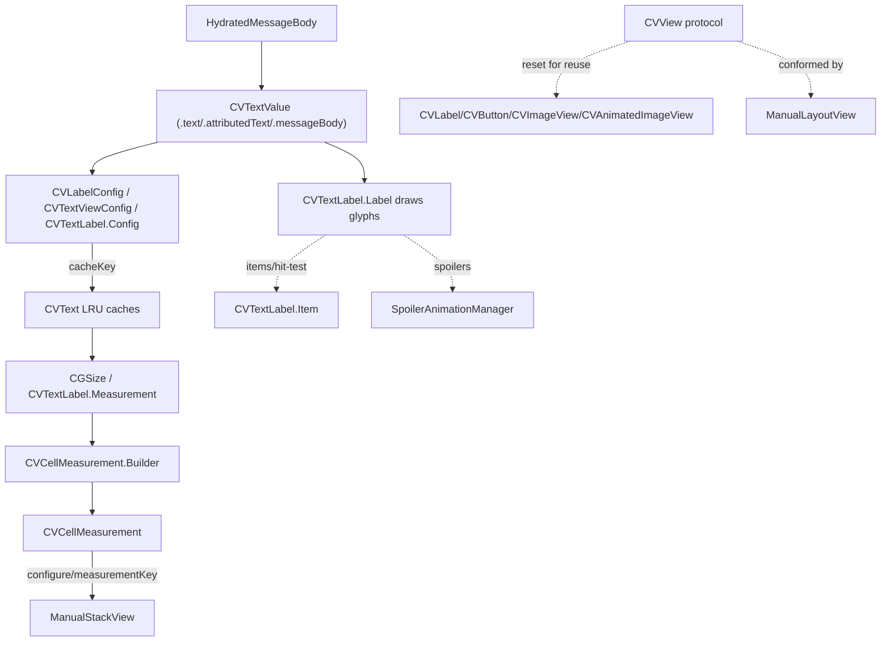

# ConversationView Subsystem

Source: `SignalUI/ConversationView/`. The low-level, reusable rendering primitives
("CV" = Conversation View) that both the main app's conversation screen (`Signal/`)
and other shared surfaces use to measure and draw message-list cells. This is a
*subsystem* doc; for the one-page overview of the same directory see the sibling
[../ConversationView.md](../ConversationView.md). The full conversation *view
controller* lives in the main app and is not in this directory.

> Confidence: **[High]** read in full; **[Medium]** signature/partial; **[Low]**
> inferred. Citations are `File.swift:line`. An uncited claim is a defect.

## Responsibility

**[High]** This directory contains exactly six files and holds no view controller,
collection view, or data source. Its job is narrow: supply the shared primitives
that let conversation cells be (1) measured cheaply off the main render path and
(2) laid out by precomputed geometry rather than Auto Layout. The pieces are:

- A text abstraction (`CVTextValue`) plus two label/text-view configs
  (`CVLabelConfig`, `CVTextViewConfig`) — `CVText.swift`.
- A cached measurement helper (`CVText`) with LRU caches — `CVText.swift`.
- A rich, interactive, hand-drawn text label (`CVTextLabel`) — `CVTextLabel.swift`.
- A measurement record (`CVCellMeasurement` / `CVMeasurementObject`) consumed by
  the manual-layout views — `CVCellMeasurement.swift`.
- The `CVView` marker protocol and the `CV*` reusable UIView subclasses
  (`CVLabel`/`CVButton`/`CVImageView`/`CVAnimatedImageView`), plus `CVUtils`'
  dispatch queues — `CVUtils.swift`.
- A capsule-highlight label (`CVCapsuleLabel`) — `CVCapsuleLabel.swift`.
- The item view-model protocol (`CVItemViewModel`) — `CVItemViewModel.swift`.

## `CVTextValue` — the text abstraction

**[High]** `CVTextValue` is an `Equatable, Hashable` enum unifying the three ways
conversation text can be supplied (`SignalUI/ConversationView/CVText.swift:8`):

- `.text(String)` — plain text.
- `.attributedText(NSAttributedString)` — pre-attributed text.
- `.messageBody(HydratedMessageBody)` — a hydrated SSK message body (mentions,
  styles, spoilers, etc.).

It exposes `isEmpty`/`nilIfEmpty` (`SignalUI/ConversationView/CVText.swift:15-27`),
`naturalTextAligment` for RTL handling (`SignalUI/ConversationView/CVText.swift:30`),
`accessibilityDescription` (`SignalUI/ConversationView/CVText.swift:41`), and a
`cacheKey` that prefixes each case with a disambiguating letter (`t`/`a`/`m`) so
distinct cases never collide (`SignalUI/ConversationView/CVText.swift:63-72`).

## `CVLabelConfig` and `CVTextViewConfig` — immutable render/measure descriptors

**[High]** `CVLabelConfig` is a value type bundling a `CVTextValue` with a
`HydratedMessageBody.DisplayConfiguration`, font, color, line count, line-break
mode, and optional alignment (`SignalUI/ConversationView/CVText.swift:77`). It
provides a convenience constructor for unstyled text (`unstyledText(...)`,
`SignalUI/ConversationView/CVText.swift:106`) and three apply paths that write its
contents onto a target view:

- `applyForMeasurement(label:)` deliberately skips `textColor`/`textAlignment` and
  applies text last to protect attributed-string attributes
  (`SignalUI/ConversationView/CVText.swift:125`).
- `applyForRendering(label:)` additionally sets color and alignment
  (`SignalUI/ConversationView/CVText.swift:147`).
- `applyForRendering(button:)` builds an `AttributedString` title for
  `UIButton.Configuration`, merging default font/color with `.keepCurrent` so
  existing attributes win, and still assigns `titleLabel?.textAlignment` because
  `titleAlignment` alone is insufficient for complex attributed text "as of iOS
  26.5" (`SignalUI/ConversationView/CVText.swift:173`).

**[High]** `measure(maxWidth:)` delegates to `CVText.measureLabel` and asserts the
result fits (`SignalUI/ConversationView/CVText.swift:216`). The `cacheKey`
intentionally omits `textColor` because color does not affect measurement
(`SignalUI/ConversationView/CVText.swift:227`).

**[High]** `CVTextViewConfig` is the analogous descriptor for the `UITextView`
path, carrying link attributes, a `CVTextLabel.LinkifyStyle`, `linkItems`,
`matchedSearchRanges`, and `extraCacheKeyFactors`
(`SignalUI/ConversationView/CVText.swift:235`). Its `cacheKey` similarly excludes
color/link/search factors that don't influence size
(`SignalUI/ConversationView/CVText.swift:279`).

## `CVText` — cached measurement

**[High]** `CVText` is the measurement helper (`SignalUI/ConversationView/CVText.swift:294`).
It owns two `LRUCache`s of size 500, one for `UILabel` sizes and one for
`CVTextLabel.Measurement`, both keyed by `"<configKey>,<maxWidth>"`
(`SignalUI/ConversationView/CVText.swift:307`, `:355`).

- `measureLabel(config:maxWidth:)` returns the cached ceil-rounded size or computes
  it via an `NSLayoutManager`/`NSTextContainer` pass
  (`SignalUI/ConversationView/CVText.swift:309`).
- `measureLabelUsingLayoutManager(...)` builds a zero-padding text container with
  the config's line count/break mode (`SignalUI/ConversationView/CVText.swift:342`).
- A `#if TESTABLE_BUILD` variant `measureLabelUsingView(...)` measures with an
  actual `UILabel` for test cross-checking (`SignalUI/ConversationView/CVText.swift:329`).
- `measureBodyTextLabel(config:maxWidth:)` is the `CVTextLabel` equivalent
  (`SignalUI/ConversationView/CVText.swift:357`).

**[High]** `measureBodyTextLabelInManualStackView(...)` is a notable layout detail:
it computes whether the message body's last line can share a row with the trailing
footer (timestamp/status). It first measures with space reserved for the footer
(`maxWidth - footerWidth - 6`), then decides whether the footer fits adjacent,
should overlap the last line, or needs its own spacer subview — returning the
appropriate `[ManualStackSubviewInfo]`
(`SignalUI/ConversationView/CVText.swift:378`).

**[High]** The private `NSTextContainer.size(for:font:)` extension
(`SignalUI/ConversationView/CVText.swift:432`) carries two important correctness
notes: the attributed string must be assigned to `NSTextStorage` *after* a layout
manager is attached (otherwise the `NSOriginalFont` attribute is wrong and
CJK/Arabic/Emoji measure incorrectly), and the lifetime of `textStorage` is
explicitly extended with `withExtendedLifetime` because the layout components hold
only weak references to it and optimized builds may free it early
(`SignalUI/ConversationView/CVText.swift:455-469`).

## `CVTextLabel` — rich interactive, hand-drawn label

**[High]** `CVTextLabel` is a wrapper class (not a `UILabel`/`UITextView` subclass)
whose rendering is done by a private inner `UIView` subclass `Label` that draws
glyphs itself in `draw(_:)` using an `NSLayoutManager`
(`SignalUI/ConversationView/CVTextLabel.swift:9`; inner class at `:303`;
`draw(_:)` at `:386`). `view` exposes the underlying `Label`
(`SignalUI/ConversationView/CVTextLabel.swift:165`).

It is the mechanism behind tappable/interactive spans inside message bubbles. The
span types are modeled as `Item` cases, each carrying an `NSRange`
(`SignalUI/ConversationView/CVTextLabel.swift:70`):

- `.dataItem` (detected links/data via `TextCheckingDataItem`)
- `.mention` (`MentionItem`, by `Aci`)
- `.referencedUser` (`ReferencedUserItem`, by `SignalServiceAddress`)
- `.unrevealedSpoiler` (`UnrevealedSpoilerItem`, carries `StyleId` +
  interaction identifiers)
- `.deleteAuthor` (`DeleteAuthorItem`, by `Aci`)

**[High]** `Config` bundles the `CVTextValue`, display config, font/color,
selection styling, alignment, line settings, `items`, and a `LinkifyStyle`
(`.linkAttribute` or `.underlined`), auto-deriving a `cacheKey` from measurement-
relevant factors when one isn't supplied
(`SignalUI/ConversationView/CVTextLabel.swift:115`; `LinkifyStyle` defined just
above at `:108`).

**[High]** `measureSize(config:maxWidth:)` lays out the formatted string and
returns a `Measurement` (a `CVMeasurementObject` subclass) holding both `size` and
the `lastLineRect` used by the footer-adjacency logic above
(`SignalUI/ConversationView/CVTextLabel.swift:206`). It repeats the same
layout-manager-before-text-storage and `withExtendedLifetime` precautions as
`CVText`.

**[High]** `formatAttributedString(config:)` builds the drawable string: it
materializes text per `CVTextValue` case (applying search ranges for the plain/
attributed cases; `.messageBody` applies them internally), sets default font and
foreground color only where unset, calls `linkifyData(...)` to apply link styling,
and finally installs a paragraph style with the config's line-break mode and
alignment (`SignalUI/ConversationView/CVTextLabel.swift:419`). `linkifyData` skips
already-styled spans (mentions/users/spoilers/delete-author) and only styles
`.dataItem` links, either via `.link` or an underline
(`SignalUI/ConversationView/CVTextLabel.swift:266`).

### Interaction, selection, spoilers, and drag

**[High]** Hit-testing maps a gesture location to a character index via
`textContainer.characterIndex(...)` and returns the `Item` whose range contains it
(`item(at:)`, `SignalUI/ConversationView/CVTextLabel.swift:494`; public entry
`itemForGesture(sender:)` at `:256`). `animate(selectedItem:)` applies the config's
`selectionStyling` for 0.25s then reverts (public entry at
`SignalUI/ConversationView/CVTextLabel.swift:260`, inner impl at `:525`).

**[High]** Spoiler animation is driven by `SpoilerAnimationManager`: the label
conforms to `SpoilerableViewAnimator`, exposing `spoilerFrames()`
(`SignalUI/ConversationView/CVTextLabel.swift:600`) and a `spoilerFramesCacheKey`
that hashes text + display config + container size
(`SignalUI/ConversationView/CVTextLabel.swift:617`). It only animates when the cell
is visible and the body has spoiler ranges (`updateSpoilerAnimationState`,
`SignalUI/ConversationView/CVTextLabel.swift:539`; visibility fed via
`setIsCellVisible(_:)` at `:179`).

**[High]** `Label` adds a `UIDragInteraction`; only `.dataItem` spans are draggable
(mentions/users/spoilers/delete-author explicitly return no drag items), producing
an `NSItemProvider` of the detected snippet with a text-line-rect drag preview
(`dragInteraction(_:itemsForBeginning:)`, `SignalUI/ConversationView/CVTextLabel.swift:659`).

## `CVCellMeasurement` — cached geometry record

**[High]** `CVCellMeasurement` is an `Equatable` struct capturing a cell's measured
state so views can be pinned to those sizes — necessary because some `UIView`s
(e.g. `UIImageView`) impose content-driven constraints that need overriding
(`SignalUI/ConversationView/CVCellMeasurement.swift:23`, with the rationale comment
just above). It stores a `cellSize` plus keyed dictionaries of `sizes`, `values`
(`CGFloat`), `measurements` (`ManualStackMeasurement`), and `objects`
(`CVMeasurementObject`), built via a `Builder` whose setters `owsAssertDebug`
against overwriting a key (`SignalUI/ConversationView/CVCellMeasurement.swift:35-72`).

**[High]** `CVMeasurementObject` is a minimal `Equatable` base whose `==` always
returns `true` — equality is intentionally identity-agnostic for measurement
caching (`SignalUI/ConversationView/CVCellMeasurement.swift:8`).
`CVTextLabel.Measurement` is a concrete subclass (see above).

**[High]** The file extends `ManualStackView`
(`SignalUI/ConversationView/CVCellMeasurement.swift:129`) with `configure(...)`
(`:131`), `configureForReuse(...)` (`:148`), and a static `measure(...)` (`:160`)
that all look up or store a `Measurement` by `measurementKey` in a
`CVCellMeasurement`. This is the glue binding this subsystem to the manual-layout
views in `SignalUI/Views/` (`ManualStackView`/`ManualLayoutView`, see
[../Views.md](../Views.md)).

## `CVView` protocol and the `CV*` view subclasses

**[High]** `CVView` is a `UIView`-refining protocol with a single `reset()`
requirement (`SignalUI/ConversationView/CVUtils.swift:38`). `CVUtils.swift` defines
four reusable conforming subclasses used in conversation cells:

- `CVLabel` (`UILabel`, `SignalUI/ConversationView/CVUtils.swift:44`): `reset()`
  nils attributed text *then* text — the comment calls this "the magic incantation"
  that prevents stale attributed-string attributes from bleeding into the next
  string (`SignalUI/ConversationView/CVUtils.swift:51`).
- `CVButton` (`UIButton`, `SignalUI/ConversationView/CVUtils.swift:61`): `reset()`
  restores an `emptyConfiguration()` with zero insets, fixed square corners, and
  clear background (`SignalUI/ConversationView/CVUtils.swift:63`).
- `CVImageView` (`UIImageView`, `SignalUI/ConversationView/CVUtils.swift:80`):
  supports frame/bounds-driven `LayoutBlock`s run on `layoutSubviews`, a
  `circleView()` factory, and a two-part spin animation whose comment explains the
  trick of animating to `.pi` then `2*.pi` because `UIViewPropertyAnimator` drops a
  straight `2*.pi` rotation as a no-op.
- `CVAnimatedImageView` (`SDAnimatedImageView`,
  `SignalUI/ConversationView/CVUtils.swift:195`): animated-image variant.

**[High]** `CVUtils` itself is a non-instantiable class
(`SignalUI/ConversationView/CVUtils.swift:10`) that owns two serial dispatch queues
— `.userInteractive` for the initial load and `.userInitiated` otherwise —
selected via `workQueue(isInitialLoad:)`
(`SignalUI/ConversationView/CVUtils.swift:31`). **[Medium]** This is the
off-main-thread work path for conversation loads; the consuming load pipeline lives
in the app (`Signal/`), not here.

**[High]** The `CVView` protocol is conformed to beyond this directory — e.g.
`ManualLayoutView` (`SignalUI/Views/ManualLayoutView.swift:23`) — tying the
manual-layout view system to this subsystem (see [../Views.md](../Views.md)).

## `CVCapsuleLabel` — highlighted capsule label

**[High]** `CVCapsuleLabel` is a `UILabel` subclass that draws a rounded capsule
behind a highlighted sub-range of attributed text (e.g. a member role next to a
sender name) (`SignalUI/ConversationView/CVCapsuleLabel.swift:15`). The capsule
color derives from the text color at reduced opacity, varying by a
`PresentationContext` (non-bubble, regular bubble, incoming/outgoing quote reply,
name-not-verified warning) and dark mode (`capsuleColor`,
`SignalUI/ConversationView/CVCapsuleLabel.swift:77`).

**[High]** Its distinctive behavior is wrap control: the highlighted range must not
wrap, so `formatCapsuleString(...)` moves the highlight to its own line and
truncates it with an ellipsis via `truncateStringUntilFits(...)` when it (or the
whole string) exceeds the available width; the doc comments give worked examples of
the resulting layout (`SignalUI/ConversationView/CVCapsuleLabel.swift:192`;
truncation at `:127`). Truncation deletes whole composed character sequences to
avoid splitting emoji (`SignalUI/ConversationView/CVCapsuleLabel.swift:127`).

**[High]** Rendering is custom: `drawText(in:)` lays the formatted string into a
transient `NSLayoutManager`/`NSTextStorage`, fills a `UIBezierPath` capsule behind
the highlight glyphs, then draws highlight and non-highlight glyphs with the
computed offsets; it asserts `numberOfLines` is 0 or 1
(`SignalUI/ConversationView/CVCapsuleLabel.swift:256`). `measureLabel(...)` /
`labelSize(maxWidth:)` size the label including capsule insets and offsets
(`SignalUI/ConversationView/CVCapsuleLabel.swift:333`), and `intrinsicContentSize`
returns `labelSize(maxWidth: .greatestFiniteMagnitude)`
(`SignalUI/ConversationView/CVCapsuleLabel.swift:306`).

**[High]** UI considerations: it is tappable via `onTap`
(`SignalUI/ConversationView/CVCapsuleLabel.swift:28`) and a tap recognizer
(`didTapMemberLabel`, `SignalUI/ConversationView/CVCapsuleLabel.swift:121`); it
computes an RTL-aware horizontal offset only when alignment is `.natural`
(`calculateHorizontalOffset`, `SignalUI/ConversationView/CVCapsuleLabel.swift:246`);
and it exposes accessibility affordances — an `axLabelPrefix`-prefixed
`accessibilityLabel` (`SignalUI/ConversationView/CVCapsuleLabel.swift:369`) and a
`.button` trait when tappable (`SignalUI/ConversationView/CVCapsuleLabel.swift:379`).

## `CVItemViewModel` — item view-model protocol

**[High]** `CVItemViewModel` is the `AnyObject` protocol a conversation item's view
model conforms to, exposing the `TSInteraction` plus renderable payload accessors:
`contactShare`, `linkPreview`, `stickerAttachment`/`stickerMetadata`, `isGiftBadge`,
and `hasRenderableContent`
(`SignalUI/ConversationView/CVItemViewModel.swift:8-16`). **[Medium]** The concrete
conforming view model is defined in the app's conversation load pipeline
(`Signal/`), not in this directory.

## Data flow / state

**[High]** The intended flow, read from the measure/configure APIs:

1. A `CVTextValue` (often `.messageBody` from a `HydratedMessageBody`) is wrapped in
   a `CVLabelConfig` / `CVTextViewConfig` / `CVTextLabel.Config`, each exposing a
   `cacheKey` that excludes color and other non-size factors.
2. During the (off-main) load, `CVText.measureLabel` / `measureBodyTextLabel`
   produce `CGSize` / `CVTextLabel.Measurement`, memoized in LRU caches keyed by
   `"<configKey>,<maxWidth>"`.
3. Measurements are stored into a `CVCellMeasurement` (via its `Builder`) under
   string keys, including per-stack `ManualStackMeasurement`s.
4. At render time, `ManualStackView.configure(config:cellMeasurement:measurementKey:subviews:)`
   pulls the stored measurement to lay out children by frame, and the reusable
   `CV*` views draw into those frames; `reset()` returns pooled views to a clean
   state for reuse.

## Notable UI considerations

- **[High]** Measurement excludes color/link/search factors from cache keys so
  theme or link-style changes don't thrash the caches
  (`SignalUI/ConversationView/CVText.swift:227`, `:279`;
  `SignalUI/ConversationView/CVTextLabel.swift:115`).
- **[High]** Correct multilingual sizing depends on attaching the layout manager
  before setting text and keeping `NSTextStorage` alive during measurement
  (`SignalUI/ConversationView/CVText.swift:455-469`;
  `SignalUI/ConversationView/CVTextLabel.swift:206`).
- **[High]** RTL handling appears in `CVTextValue.naturalTextAligment`
  (`SignalUI/ConversationView/CVText.swift:30`) and in `CVCapsuleLabel`'s RTL offset
  (`SignalUI/ConversationView/CVCapsuleLabel.swift:246`).
- **[High]** Accessibility: `CVTextValue.accessibilityDescription`
  (`SignalUI/ConversationView/CVText.swift:40`) and `CVCapsuleLabel`'s
  accessibility label/traits (`SignalUI/ConversationView/CVCapsuleLabel.swift:369`,
  `:379`).
- **[High]** View reuse hygiene is explicit via `CVView.reset()`, most subtly in
  `CVLabel.reset()` clearing attributed text then text
  (`SignalUI/ConversationView/CVUtils.swift:51`).
