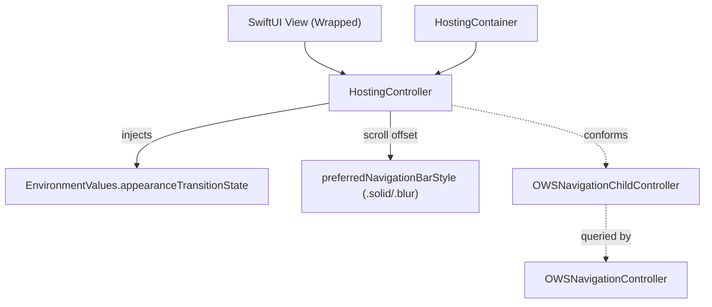

# UIKit & SwiftUI Extensions

Sources: `SignalUI/UIKitExtensions/` and `SignalUI/SwiftUIExtensions/`. These are
the cross-cutting helpers that give the rest of SignalUI (and its consumers) a
consistent layout/animation/image/text vocabulary, plus the UIKit↔SwiftUI bridge.

> Confidence: **[High]** read in full; **[Medium]** signature/partial; **[Low]**
> inferred. Citations are `File.swift:line`. An uncited claim is a defect.

## UIKit extensions (`SignalUI/UIKitExtensions/`)

### AutoLayout (PureLayout-based)

**[High]** `UIView+AutoLayout` builds on the **PureLayout** dependency
(`SignalUI/UIKitExtensions/UIView+AutoLayout.swift:6`, `public import PureLayout`)
and adds Signal's convenience constraint helpers — e.g.
`autoPinEdge(toSuperviewEdge:relation:)`
(`SignalUI/UIKitExtensions/UIView+AutoLayout.swift:14`),
`autoPinEdges(toSuperviewEdgesExcludingEdge:)`
(`SignalUI/UIKitExtensions/UIView+AutoLayout.swift:19`), and
`autoPinEdges(toEdgesOf:with:)`
(`SignalUI/UIKitExtensions/UIView+AutoLayout.swift:123`). Because it is a
`public import`, PureLayout's API is re-exported to consumers of SignalUI. **[Medium]**

### View helpers

**[High]** `UIView+SignalUI` provides general view helpers and defines a
`SpacerView` (a non-rendering `CATransformLayer`-backed spacer with a configurable
intrinsic size) (`SignalUI/UIKitExtensions/UIView+SignalUI.swift:11`), plus
`UIView.spacer(withWidth:)`-style factory helpers
(`SignalUI/UIKitExtensions/UIView+SignalUI.swift:41`).

### Other UIKit helpers

**[Medium]** The directory also contains (enumerated from the tree; read by role):
`UIKit+Animations`, `UIKit+Image`, `UIKit+Text`, `UIImage+Blur`,
`UIButton+SignalUI`, `UIStackView+SignalUI`, `UITableView+ReusableCell`,
`UITableView+RowHeights`, `UIViewController+SignalUI`,
`UIViewPropertyAnimator+SignalUI`, `UIGeometry+Signal`, `UIFont+OWS`,
`UIFont+TextStyle` (fonts covered in [FontsAndFormatStyles.md](FontsAndFormatStyles.md)),
and `OWSTableViewDiffableDataSource`.

**[High]** `UIButton+DeprecationWorkaround` is the one Objective-C helper in the
module. Its header is the single file the SignalUI umbrella header re-exports
(`SignalUI/SignalUI.h:8` → `UIButton+DeprecationWorkaround.h`), with the
implementation at `SignalUI/UIKitExtensions/UIButton+DeprecationWorkaround.m:6`. It
exists specifically to work around a UIKit `UIButton` deprecation from Objective-C.
**[Medium]** (the "why" beyond the file name is **intent undetermined — no evidence
in source** beyond the name itself.)

## SwiftUI extensions (`SignalUI/SwiftUIExtensions/`)

### Hosting bridge

**[High]** `HostingController<Wrapped: View>` subclasses `UIHostingController` and
conforms to `OWSNavigationChildController`
(`SignalUI/SwiftUIExtensions/HostingController.swift:86`). It wraps the SwiftUI
`rootView` to inject an `EnvironmentValues.appearanceTransitionState`
(`SignalUI/SwiftUIExtensions/HostingController.swift:10`, `:23-27`), letting SwiftUI
views know whether they are mid-navigation-transition (`.appearing`/`.finished`/
`.cancelled`) so they can defer animations. It also tracks scroll offset to flip
the navigation-bar style between `.solid` and `.blur`
(`SignalUI/SwiftUIExtensions/HostingController.swift:88-96`, `:138-157`), feeding the
`OWSNavigationChildController` overrides consumed by `OWSNavigationController` (see
[ViewControllers.md](ViewControllers.md)).

**[High]** `HostingContainer<Wrapped: View>` wraps a `HostingController` in a plain
`UIViewController` (`SignalUI/SwiftUIExtensions/HostingController.swift:35`); its doc
comment explains the intent: it lets UIKit callers set navigation bar-button items
manually, avoiding `UIHostingController`'s behavior of only showing bar buttons once
fully appeared (`SignalUI/SwiftUIExtensions/HostingController.swift:31-34`).

### Other SwiftUI helpers

**[Medium]** The directory also includes `Text+Links` and `SwiftUI+Animations`
(`SignalUI/SwiftUIExtensions/`), `ScrollableWhenCompact`
(`SignalUI/SwiftUIExtensions/ScrollableWhenCompact.swift:8`),
`ScrollableContentPinnedFooterView`, `ScrollBounceBehaviorIfAvailable`,
`AsyncViewTask`, and `AccessibleLayoutMetric` — small view/modifier helpers
(enumerated from the tree; read by role).
