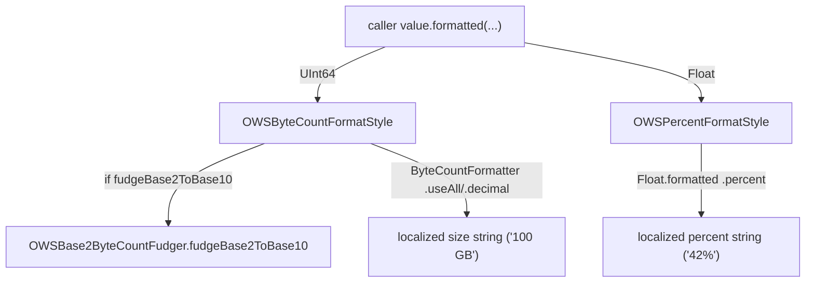

# FormatStyles

Source: `SignalUI/FormatStyles/`. A small set of Swift [`FormatStyle`][formatstyle]
implementations that give the app a single, consistent way to render byte counts
and percentages into user-facing strings — primarily for Backups and other
storage/progress UI.

> This README is the subsystem-level deep dive for `SignalUI/FormatStyles/`. For
> where format styles sit relative to fonts and the broader SignalUI module, see
> [../FontsAndFormatStyles.md](../FontsAndFormatStyles.md); this document does not
> duplicate that overview and instead documents the directory in detail.

> Confidence: **[High]** read in full; **[Medium]** signature/partial; **[Low]**
> inferred. Citations are `File.swift:line`. An uncited claim is a defect.

## Responsibility

**[High]** The directory holds the module's reusable value-formatting styles. Each
type conforms to the standard-library `FormatStyle` protocol and exposes a
`FormatStyle`-extension factory, so callers can use the ergonomic
`value.formatted(.owsByteCount(...))` / `value.formatted(.owsPercent(...))` syntax
rather than instantiating a formatter directly. The two concrete styles are:

- `OWSByteCountFormatStyle` — human-readable byte counts
  (`SignalUI/FormatStyles/OWSByteCountFormatStyle.swift:6`).
- `OWSPercentFormatStyle` — percentages
  (`SignalUI/FormatStyles/OWSPercentFormatStyle.swift:6`).

**[High]** Both are `public`, so they are part of SignalUI's API surface and are
consumed from the `Signal` app target (see [Interactions](#interactions)).

## Key types

### `OWSByteCountFormatStyle`

**[High]** A `struct` conforming to `FormatStyle` that formats a `UInt64` byte
count into a localized string (`SignalUI/FormatStyles/OWSByteCountFormatStyle.swift:6`).
It has two configuration flags, both set at construction
(`SignalUI/FormatStyles/OWSByteCountFormatStyle.swift:18-25`):

- `fudgeBase2ToBase10` (default `false`) — convert a base-2 byte count to its
  roughly-equivalent base-10 value before formatting.
- `zeroPadFractionDigits` (default `true`) — zero-pad fraction digits for a stable
  string length.

**[High]** `format(_:)` does the work
(`SignalUI/FormatStyles/OWSByteCountFormatStyle.swift:26-55`):

1. If `fudgeBase2ToBase10` is set and `OWSBase2ByteCountFudger.fudgeBase2ToBase10`
   returns a value, the input is replaced by the fudged value
   (`:28-35`).
2. A `ByteCountFormatter` is configured with `allowedUnits = .useAll`,
   `countStyle = .decimal`, `allowsNonnumericFormatting = false`, and
   `zeroPadsFractionDigits = zeroPadFractionDigits` (`:37-52`).
3. The count is clamped into `Int64` and formatted
   (`Int64(clamping: byteCount)`, `:54`) — guarding the `UInt64 → Int64` narrowing
   that `ByteCountFormatter.string(fromByteCount:)` requires.

**[High]** The `.owsByteCount(fudgeBase2ToBase10:zeroPadFractionDigits:)` factory is
exposed via `extension FormatStyle where Self == OWSByteCountFormatStyle`
(`SignalUI/FormatStyles/OWSByteCountFormatStyle.swift:58-68`).

### `OWSBase2ByteCountFudger`

**[High]** A private-to-module `enum` namespace holding the single static method
`fudgeBase2ToBase10(_:)` (`SignalUI/FormatStyles/OWSByteCountFormatStyle.swift:72-116`).
It only converts counts that are *exact* multiples of a power of 1024: it divides
the input by 1024 repeatedly, bailing with `nil` if any step leaves a remainder
(`:98-102`), then rebuilds the "multiple" using powers of 1000 (`:112-115`). So
`100 * 1024³` ("100 GiB") becomes `100 * 1000³` ("100 GB"), while a non-round value
like 1 GiB + 2 MiB returns `nil` and is formatted as-is.

**[High]** `0` is special-cased to return `0` (`:90`). The rebuild loop cannot
overflow because `1000 < 1024`, so the result is always ≤ the input
(comment at `:108-111`).

**[High]** The documented reason this exists is the Backups `storageAllowanceBytes`
value, which the server configures as a GiB value even though the UI wants to show
GB (doc comment at `SignalUI/FormatStyles/OWSByteCountFormatStyle.swift:85-88`).

### `OWSPercentFormatStyle`

**[High]** A `struct` conforming to `FormatStyle` that formats a `Float` as a
percentage string (`SignalUI/FormatStyles/OWSPercentFormatStyle.swift:6`). Its only
option is `fractionDigits` (default `0`, `:7-11`). `format(_:)` delegates to the
standard-library `.percent` style with
`.precision(.fractionLength(fractionDigits))`
(`SignalUI/FormatStyles/OWSPercentFormatStyle.swift:13-15`). The
`.owsPercent(fractionDigits:)` factory is exposed via the matching `FormatStyle`
extension (`SignalUI/FormatStyles/OWSPercentFormatStyle.swift:18-24`).

**[High]** Note the input is already a fraction in `0...1` terms (the standard
`.percent` style multiplies by 100); callers pass through a raw progress `Float`
(e.g. a `0.0...1.0` completion value).

## Interactions

**[High]** These styles are consumed almost entirely by Backups and
storage/progress UI in the `Signal` app target. Representative call sites:

- Backups settings and plan/storage display:
  `Signal/Backups/BackupSettingsViewController.swift:2061`, `:2069`, `:2343`
  (`.owsPercent()`), `:2506`, `:2514`; `Signal/Backups/BackupPlanOptionView.swift:164`;
  `Signal/Backups/LocalFileBackupsSettingsViewController.swift:303-304`, `:412`,
  `:422`, `:435`.
- Chat-list backup progress banners:
  `Signal/src/ViewControllers/HomeView/Chat List/ChatListViewController+BackupDownloadProgressView.swift:217`, `:656-657`, `:675`, `:682`;
  `…+BackupExportProgressView.swift:632`, `:643-644`;
  `…+LocalFileBackupExportProgressView.swift:466`, `:472`, `:483-484`;
  `…+LocalFileBackupRestoreProgressView.swift:265-266`, `:275`.
- Restore / link-and-sync progress:
  `Signal/src/ViewControllers/AppSettings/Linked Devices/BackupRestoreProgressModal.swift:250`, `:264`;
  `Signal/Provisioning/UserInterface/LinkAndSyncProvisioningProgressViewController.swift:210`, `:218`;
  `Signal/AppLaunch/LoadingViewController.swift:234`.
- Data-usage auto-download limits:
  `Signal/src/ViewControllers/AppSettings/Data Usage/DataSettingsTableViewController.swift:50`, `:58`
  (both pass `zeroPadFractionDigits: false`).
- Low-storage launch failure sheet:
  `Signal/AppLaunch/AppLifecycleManager.swift:1283`
  (`OWSByteCountFormatStyle(zeroPadFractionDigits: false)`).
- Device transfer and media megaphone:
  `Signal/DeviceTransfer/DeviceTransferStatusViewController.swift:374`;
  `Signal/Megaphones/UserInterface/BackupsBackUpYourMediaMegaphone.swift:18`.

**[High]** The `fudgeBase2ToBase10: true` option is used specifically where the
value originates as a server-provided GiB allowance — e.g.
`storageAllowanceBytes.formatted(.owsByteCount(fudgeBase2ToBase10: true, zeroPadFractionDigits: false))`
(`Signal/Backups/BackupSettingsViewController.swift:2061-2064`), matching the fudger's
documented use case.

**[High]** Both the direct-instantiation style (`OWSByteCountFormatStyle().format(x)`)
and the `.formatted(.owsByteCount())` sugar are used interchangeably across the
call sites above; the factory extensions exist to make the latter available.

**[High]** Formatted output is routinely interpolated into localized format strings
via `String.nonPluralLocalizedStringWithFormat(...)` (e.g.
`Signal/src/ViewControllers/AppSettings/Data Usage/DataSettingsTableViewController.swift:45-51`),
so the styles are a leaf dependency: they produce the already-localized numeric
substring that is then embedded in a surrounding localized sentence.

**[High]** Build membership: all three files are compiled into SignalUI, and the
test is a separate build file
(`Signal.xcodeproj/project.pbxproj:2991`, `:3282`, `:3308`, `:7386`, `:7680`).

## Notable formatting considerations

- **[High]** *Base-2 vs base-10.* `ByteCountFormatter` is explicitly set to
  `.decimal` (base-10, "1000 bytes = 1 KB"), and the fudger handles the server's
  base-2 (GiB) values up-front, so a "100 GiB" allowance reads as "100 GB" in the UI
  (`SignalUI/FormatStyles/OWSByteCountFormatStyle.swift:40-42`, `:85-88`). The fudger
  only touches exact powers-of-1024 multiples; anything else is left untouched
  (`:98-102`).
- **[High]** *Stable string length.* `zeroPadFractionDigits` keeps the fractional
  digit count consistent to avoid a "jumpy" label when a live value changes in place
  (comment at `SignalUI/FormatStyles/OWSByteCountFormatStyle.swift:45-52`). Call sites
  formatting a single fixed value tend to pass `false`
  (e.g. the data-usage footers,
  `…/DataSettingsTableViewController.swift:50`, `:58`).
- **[High]** *Non-numeric suppression.* `allowsNonnumericFormatting = false` forces a
  numeral `0` instead of the word "zero"
  (`SignalUI/FormatStyles/OWSByteCountFormatStyle.swift:43-44`).
- **[High]** *`UInt64 → Int64` clamping.* The public API accepts `UInt64` but
  `ByteCountFormatter` requires `Int64`; the style clamps rather than trapping
  (`SignalUI/FormatStyles/OWSByteCountFormatStyle.swift:54`).
- **[Medium]** *Localization.* Both styles delegate to Foundation
  (`ByteCountFormatter` / the standard `.percent` style), so unit words, decimal
  separators, and percent placement follow the current locale; the styles do not
  hard-code any of that.

## Tests

**[High]** `OWSByteCountFormatStyleTest` (swift-testing) pins the fudger's behavior
with a table of base-2 inputs and expected base-10 outputs, including the `nil` cases
for non-round values (`SignalUI/FormatStyles/OWSByteCountFormatStyleTest.swift:10-28`).
It exercises `OWSBase2ByteCountFudger.fudgeBase2ToBase10` directly via
`@testable import SignalUI` (`:8`). **[Medium]** There is no dedicated test for
`OWSPercentFormatStyle` or for the full `ByteCountFormatter` path in this directory.

[formatstyle]: https://developer.apple.com/documentation/foundation/formatstyle
