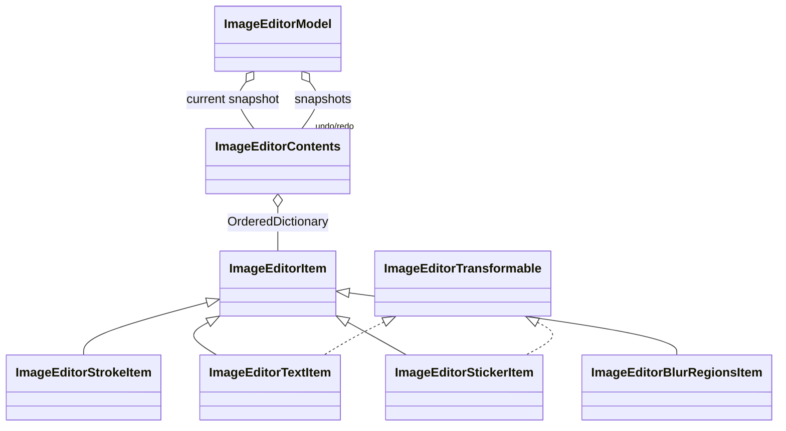
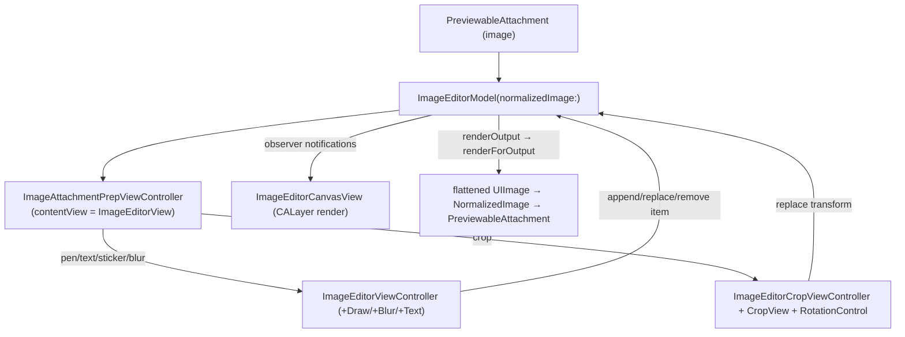

# Image Editor: Draw / Text / Stickers / Blur / Crop

Source: `SignalUI/ImageEditor/`. This subsystem is the in-app photo editor used
when preparing/approving outgoing image attachments. It lets the user annotate an
image with brush strokes, text, stickers, and blur regions, and transform it
(crop, rotate, flip, aspect-ratio) before sending. It owns an immutable,
snapshot-based model with undo/redo, a `CALayer`-based canvas renderer that is also
used to flatten the final output image, and a set of tool view controllers and
custom gesture recognizers.

The editor plugs into the attachment-approval flow (see
[AttachmentFlows.md](../AttachmentFlows.md)): an `ImageEditorModel` is created per
image attachment, and on approval the model renders a flattened output image that
becomes the new attachment.

> Confidence: **[High]** read in full; **[Medium]** signature/partial; **[Low]**
> inferred. Citations are `File.swift:line`. An uncited claim is a defect.

## Responsibility & the model (`ImageEditorModel`)

**[High]** `ImageEditorModel` is the `@MainActor` heart of the subsystem
(`SignalUI/ImageEditor/ImageEditorModel.swift:44`). It is constructed from a
`NormalizedImage`, reads the source image metadata/pixel size (throwing
`ImageEditorError.invalidInput` on bad input), and seeds a default transform
(`SignalUI/ImageEditor/ImageEditorModel.swift:63-80`). It holds:

- the current `ImageEditorContents` snapshot of items
  (`SignalUI/ImageEditor/ImageEditorModel.swift:48`),
- the current `ImageEditorTransform`
  (`SignalUI/ImageEditor/ImageEditorModel.swift:50`),
- `undoStack`/`redoStack` of `ImageEditorOperation` snapshots
  (`SignalUI/ImageEditor/ImageEditorModel.swift:52-53`),
- a sticker image LRU cache and a cached `blurredSourceImage`
  (`SignalUI/ImageEditor/ImageEditorModel.swift:55-59`),
- the current draw/text `color` (`SignalUI/ImageEditor/ImageEditorModel.swift:61`).

**[High]** The core design is *immutable snapshots*. `ImageEditorOperation` captures
a whole `ImageEditorContents` so undo/redo simply swaps snapshots back in
(`SignalUI/ImageEditor/ImageEditorModel.swift:14-24`; comment at `:8-12`). All
mutations go through `performAction(_:changedItemIds:suppressUndo:)`, which pushes an
undo snapshot (unless suppressed), clears the redo stack, applies the mutation to a
copy of `contents`, and fires change notifications
(`SignalUI/ImageEditor/ImageEditorModel.swift:255-283`). `append`/`replace`/`remove`
are thin wrappers over this (`:198-234`). `undo()`/`redo()` pop one stack, snapshot
the current state onto the other, and swap
(`SignalUI/ImageEditor/ImageEditorModel.swift:171-196`).

**[High]** `replace(transform:)` is special: it stores the new transform but, since
`contents` is unchanged, it still fires a *full* `before/after` change so observers
reload everything (crop/rotate must re-render all layers)
(`SignalUI/ImageEditor/ImageEditorModel.swift:236-244`). Note transform changes do
**not** participate in undo/redo here — only item changes are pushed onto the undo
stack. **[Medium]** (Transform history is managed separately inside the crop tool;
`replace(transform:)` itself does not snapshot.)

**[High]** `isDirty` is true if there are any items *or* the transform differs from
the default (`SignalUI/ImageEditor/ImageEditorModel.swift:91-96`). This is what the
approval flow checks before rendering output.

**[High]** `renderOutput()` delegates to
`ImageEditorCanvasView.renderForOutput(model:transform:)`
(`SignalUI/ImageEditor/ImageEditorModel.swift:82-84`).

**[High]** Change notifications flow through the `ImageEditorModelObserver` protocol,
which has two granularities: a large `before/after` reload and a narrow
`changedItemIds` update (`SignalUI/ImageEditor/ImageEditorModel.swift:28-39`).
Observers are held weakly (`:118-122`). The canvas view and the editor views are the
observers.

**[High]** The model also owns scratch temp files via
`temporaryFilePath(fileExtension:)` and deletes them on `deinit` on a background queue
(`SignalUI/ImageEditor/ImageEditorModel.swift:243-269`).

### Contents & items

**[High]** `ImageEditorContents` is the snapshot value type — an
`OrderedDictionary<String, ImageEditorItem>` keyed by `itemId`, with
append/replace/remove mutators (`SignalUI/ImageEditor/ImageEditorContents.swift:8-45`).
Ordering is preserved so z-ordering/iteration is stable.

**[High]** `ImageEditorItem` is the base class: an `itemId` (defaults to a UUID), an
`itemType`, and an `outputScale` used when rendering output
(`SignalUI/ImageEditor/ImageEditorItem.swift:41-66`). `ImageEditorItemType` enumerates
`test`, `stroke`, `text`, `sticker`, `blurRegions`
(`SignalUI/ImageEditor/ImageEditorItem.swift:16-22`). The item subclasses are
immutable; "editing" an item means constructing a replacement with the same `itemId`.

Concrete item types:

- **[High]** `ImageEditorStrokeItem` — a brush stroke: `StrokeType` (`.pen`,
  `.highlighter`, `.blur`), optional color, unit-space sample points, and a unit
  stroke width (`SignalUI/ImageEditor/ImageEditorStrokeItem.swift:8-30`). It defines
  per-type default widths and the slider→width mapping
  (`unitStrokeWidth(forStrokeType:widthAdjustmentFactor:)`,
  `SignalUI/ImageEditor/ImageEditorStrokeItem.swift:63-95`). The `.blur` stroke type is
  how freehand blur is drawn.
- **[High]** `ImageEditorTextItem` — a text overlay. It is both `ImageEditorTransformable`
  and `Equatable` (`SignalUI/ImageEditor/ImageEditorTextItem.swift:8`) and carries
  text, `ColorPickerBarColor`, `MediaTextView.TextStyle`/`DecorationStyle`, font size,
  a `fontReferenceImageWidth` (so text renders consistently across differently-sized
  contexts — see comment at `:63-73`), `unitCenter`, `unitWidth`, `rotationRadians`,
  and `scaling` (`SignalUI/ImageEditor/ImageEditorTextItem.swift:10-120`). Foreground/
  background/decoration colors are derived from the decoration style
  (`:21-54`). Scaling is clamped to `kMinScaling…kMaxScaling`
  (`:97-99`) and `outputScale` returns `scaling` (`:287-289`). The many `with(...)`
  methods return modified copies (`:181-285`).
- **[High]** `ImageEditorStickerItem` — an `EditorSticker` placement (also
  `ImageEditorTransformable`). It stores a creation `date` specifically so time-based
  "clock" stickers freeze their displayed time between placement and output render
  (`SignalUI/ImageEditor/ImageEditorStickerItem.swift:8-18`). `with(...)` copies follow
  the same immutable pattern (`:56-97`).
- **[High]** `ImageEditorBlurRegionsItem` — a set of unit-space bounding boxes used for
  rectangular/auto (face) blur, distinct from freehand blur strokes
  (`SignalUI/ImageEditor/ImageEditorBlurRegionsItem.swift:8-28`).

**[High]** `ImageEditorTransformable` is the protocol unifying movable/rotatable/
scalable items (text + sticker): `unitCenter`, `scaling`, `rotationRadians`, plus
`with(unitCenter:)` and `with(scaling:rotationRadians:)`
(`SignalUI/ImageEditor/ImageEditorTransformable.swift:7-13`).

## Coordinate systems & the transform (`ImageEditorTransform`)

**[High]** The subsystem's most important concept is its coordinate systems,
documented at length at the top of `ImageEditorTransform.swift`
(`SignalUI/ImageEditor/ImageEditorTransform.swift:7-54`). There are six systems:
unit/absolute × image/canvas/view. Content (strokes, text, blur) is stored in
**image unit** coordinates (fractions of image size, `ImageEditorSample = CGPoint`,
"ULO" = upper-left-origin, `SignalUI/ImageEditor/ImageEditorItem.swift:24-36`) so it
stays pegged to image content across crop/rotate/scale operations. The canvas and view
share bounds; they diverge only through the transform.

**[High]** `ImageEditorTransform` is an `Equatable`/`Hashable` struct of
`outputSizePixels`, `unitTranslation`, `rotationRadians`, `scaling` (≥ 1.0), and
`isFlipped` (`SignalUI/ImageEditor/ImageEditorTransform.swift:56-66`). It produces the
`CGAffineTransform`/`CATransform3D` applied to the content superlayer using
scale-rotate-translate ordering (`:81-112`). The key invariant — *the image always
fills the canvas* — is enforced by `normalized(srcImageSizePixels:)`, which clamps
scaling to ≥ 1 and clamps translation to the valid region by projecting the viewport
corners into canvas space (`SignalUI/ImageEditor/ImageEditorTransform.swift:116-212`).
`defaultTransform(srcImageSizePixels:)` is the identity-ish starting point
(`:68-78`).

## Canvas & rendering (`ImageEditorCanvasView`)

**[High]** `ImageEditorCanvasView` is the `CALayer`-based renderer and an
`ImageEditorModelObserver` (`SignalUI/ImageEditor/ImageEditorCanvasView.swift:168`). It
renders the source image plus one `CALayer` per item into `imageLayerView`, which has
the transform's affine transform applied to it, inside a `clipView` that clips to the
output aspect ratio (`:265-316`). `gestureReferenceView` is this `clipView`
(`:318-320`).

**[High]** Layer z-ordering is fixed by constants so blurs render above the image,
strokes above blurs, text above strokes, the selection frame above everything, and the
trash affordance on top (`SignalUI/ImageEditor/ImageEditorCanvasView.swift:189-200`).

**[High]** Static builders turn items into layers: `strokeLayerForItem(...)` (`:773`),
`textLayerForItem(...)`/`textLayer(...)` (`:965`, `:1031`), and the image layer. Text
layers use `EditorTextLayer` (a `CATextLayer` tagged with the `itemId`,
`SignalUI/ImageEditor/ImageEditorCanvasView.swift:46-93`) with an optional rounded-rect
background layer (`ImageEditorItemBackground`, `:8-42`) for the "white/colored
background" decoration styles. A selected text item gets a `TextFrameLayer` — a
dashed-ish frame with left/right handle circles (`:97-163`).

**[High]** `renderForOutput(model:transform:)` is the flattening path used for the
final sent image and for crop previews
(`SignalUI/ImageEditor/ImageEditorCanvasView.swift:1336`). It renders at the source
image's pixel size into an offscreen `UIView` (not a `CGContext`, because
`CALayer.renderInContext()` ignores layer `frame`/`transform`), applies the affine
transform to a content subview, builds a layer per item, and — because
`UIView.renderAsImage()` ignores `zPosition` — sorts the item layers by `zPosition`
before adding them (`:1363-1405`). It renders opaque only when the source has no alpha
(`:1407`).

**[High]** Hit-testing for interactive items is `transformableLayer(forLocation:)`,
which also expands the hit area to the selection frame of the selected text layer so
it is easy to grab (`SignalUI/ImageEditor/ImageEditorCanvasView.swift:1413`+).
`locationImageUnit(...)` (used by the gesture handlers) converts a view-space touch
into image-unit space.

## Views & controllers

**[High]** `ImageEditorView` is the interactive editing `UIView` — an
`AttachmentPrepContentView`, gesture delegate, and model observer that wraps the canvas
and handles selection, move, pinch, and the trash affordance
(`SignalUI/ImageEditor/ImageEditorView.swift:27`). It exposes a
`ImageEditorViewDelegate` for add/tap/move text events and toolbar-visibility updates
(`:8-21`). Interaction is gated by a `TextInteractionModes` option set
(`.tap`/`.select`/`.move`/`.resize`), which enables/disables the corresponding gesture
recognizers (`SignalUI/ImageEditor/ImageEditorView.swift:200-224`,
`:154-162`). It creates upright new text/sticker items by inverting the current
transform's rotation/scale (`createNewTextItem(...)` / `createNewStickerItem(...)`,
`:240-308`).

**[High]** The tap handler either adds a new text item, selects/deselects an item, or
(for selected text) reports a tap, and advances clock-sticker style on tap
(`SignalUI/ImageEditor/ImageEditorView.swift:310-392`). The pinch handler updates a
transformable item's center/scale/rotation
(`SignalUI/ImageEditor/ImageEditorView.swift:398-480`), and the pan handler moves it,
showing the trash and deleting the item (with an undo pop to avoid snapping back over
the trash) when dropped onto it
(`SignalUI/ImageEditor/ImageEditorView.swift:496-603`). Both suppress undo on
intermediate frames and only record undo on the first change of a gesture.

**[High]** `ImageEditorViewController` is the base tool view controller — an
`OWSViewController` conforming to the gesture/text/model/editor-view and
sticker-picker delegates (`SignalUI/ImageEditor/ImageEditorViewController.swift:11`). It
hosts an `ImageEditorView`, an `ImageEditorTopBar` (undo + clear-all), and the
`ImageEditorToolbar` (draw/text/sticker/blur) (`:14-37`). Its `Mode` enum
(`.draw`/`.blur`/`.text`/`.sticker`) drives which tool UI is shown via
`updateUIForCurrentMode()` (`:40-52`, `:470`). It wires undo/clear to top-bar buttons
(`:402-406`, `:578`) and limits undo to operations created in this controller via
`firstUndoOperationId` (`:16-18`). Per-tool behavior is split into extensions:
  - **[High]** `+Draw` — pen/highlighter/blur stroke drawing and the draw toolbar
    (`SignalUI/ImageEditor/ImageEditorViewController+Draw.swift`).
  - **[High]** `+Blur` — blur hint/panel, the face-blur switch (uses `Vision`), and the
    blur gesture (`SignalUI/ImageEditor/ImageEditorViewController+Blur.swift:1-7`+).
  - **[High]** `+Text` — sticker selection and text item selection/editing entry points
    (`SignalUI/ImageEditor/ImageEditorViewController+Text.swift:9-45`+).
  - **[High]** `+StrokeWidthSlider` — the vertical stroke-width slider used by draw/blur
    (`SignalUI/ImageEditor/ImageEditorViewController+StrokeWidthSlider.swift`).

**[High]** `ImageAttachmentPrepViewController` is the integration point with the
approval flow: it is an `AttachmentPrepViewController` whose `contentView` is the
`ImageEditorView`, obtaining its model from `attachmentApprovalItem.imageEditorModel`
(`SignalUI/ImageEditor/ImageAttachmentPrepViewController.swift:7-33`). It presents the
pen/text/sticker tool via `ImageEditorViewController` and the crop tool via
`ImageEditorCropViewController` (`:60-120`), and reports dirtiness through
`canSaveMedia`/`model.isDirty` (`:39-45`). For the crop tool it pre-renders a *preview*
image that flattens annotations using the **default** transform (so crop operates on
un-transformed content) (`:66-83`).

## Crop & rotate (`ImageEditorCropViewController` / `CropView`)

**[High]** `ImageEditorCropViewController` is the dedicated crop/rotate/flip/
aspect-ratio tool (`SignalUI/ImageEditor/ImageEditorCropViewController.swift:23`). It
works on its own copy of the `transform` plus a flattened `previewImage`, and animates
between an `initial` and `final` content layout guide so the image center stays put as
the tool presents/dismisses (`:25-62`). `clipView` both defines the crop rectangle's
aspect ratio and serves as the gesture reference view (`:33-45`). A full-screen
`CropView` (`:72`) draws the crop handles, grid, and dimming.

**[High]** `CropView` defines the `CropRegion` enum (four sides + four corners) used to
identify which handle is being dragged (`SignalUI/ImageEditor/ImageEditorCropView.swift:8-18`),
with `CropCornerView` handle views (`:20`+). The `RotationControl` is a scrollable,
degree-based rotation dial that tracks a `canvasRotation` separate from the fine angle
(`SignalUI/ImageEditor/RotationControl.swift:8-40`).

## Gesture recognizers

The editor ships custom recognizers tuned to fail fast and expose richer state than
UIKit's:

- **[High]** `ImageEditorPanGestureRecognizer` — a `UIPanGestureRecognizer` subclass
  that records a centroid `locationHistory` relative to a `referenceView`
  (`SignalUI/ImageEditor/ImageEditorPanGestureRecognizer.swift:13-66`).
- **[High]** `ImageEditorPinchGestureRecognizer` — exposes `ImageEditorPinchState`
  (centroid, distance, angle) at start/last for move+scale+rotate
  (`SignalUI/ImageEditor/ImageEditorPinchGestureRecognizer.swift:7-27`+).
- **[High]** `PermissiveGestureRecognizer` — the "most permissive GR possible": accepts
  any touches, cannot be prevented, and blocks other GRs; used by the drawing tools so
  strokes aren't stolen by competing gestures
  (`SignalUI/ImageEditor/PermissiveGestureRecognizer.swift:13-28`).

## Toolbars & misc views

- **[High]** `ImageEditorTopBar` (a `MediaTopBar`) hosts the undo button and the
  "clear all" button (`SignalUI/ImageEditor/ImageEditorToolbar.swift:9-52`).
- **[High]** `ImageEditorToolButton` enumerates the tool icons (rotate/flip/aspectRatio
  for crop; draw/text/sticker/blur for drawing) and builds their button configs
  (`SignalUI/ImageEditor/ImageEditorToolbar.swift:54-115`); `ImageEditorToolbar` lays
  out cancel/tools/done with iOS-26 glass styling and safe-area-aware margins
  (`:117-290`).
- **[High]** `ImageEditorSlider` is a `UISlider` subclass with a custom background track
  used for stroke width (`SignalUI/ImageEditor/ImageEditorSliderView.swift:7-40`).

## Notable UI/rendering considerations

- **[High]** *Immutability + snapshots* make undo/redo trivial but mean every edit
  allocates a new item and a new contents snapshot
  (`SignalUI/ImageEditor/ImageEditorModel.swift:255-283`).
- **[High]** *Consistent sizing across contexts*: text uses `fontReferenceImageWidth`
  and new transformable items invert the current transform so they appear upright and
  natural-sized regardless of crop/rotation state
  (`SignalUI/ImageEditor/ImageEditorTextItem.swift:63-73`,
  `SignalUI/ImageEditor/ImageEditorView.swift:258-308`).
- **[High]** *Output rendering quirks*: output is produced via `UIView.renderAsImage()`
  rather than a raw `CGContext`, with explicit `zPosition` sorting and `contentsScale`
  derived from `transform.scaling * item.outputScale`, because the UIKit/CoreAnimation
  render paths otherwise drop layer transform / z-order
  (`SignalUI/ImageEditor/ImageEditorCanvasView.swift:1336-1408`).
- **[Medium]** *Blur rendering*: the model caches a `blurredSourceImage` and blur comes
  in two flavors — freehand `.blur` strokes (`ImageEditorStrokeItem`) and rectangular/
  face-detected regions (`ImageEditorBlurRegionsItem`, face detection via `Vision` in
  `+Blur`) — layered beneath strokes/text per the z constants
  (`SignalUI/ImageEditor/ImageEditorModel.swift:59`,
  `SignalUI/ImageEditor/ImageEditorCanvasView.swift:189-200`). (Exact blur compositing
  not read line-by-line.)

## Entry point & integration

**[High]** The model is created per image attachment by
`AttachmentApprovalItem.imageEditorModel(for:)`, which calls
`try ImageEditorModel(normalizedImage:)` for `.image` attachments
(`SignalUI/AttachmentApproval/AttachmentItemCollection.swift:53-62`). On approval,
`AttachmentApprovalViewController.prepareImageAttachment(...)` asserts the model is
dirty, calls `renderOutput()`, wraps the result as a `NormalizedImage`, and produces a
`PreviewableAttachment.imageAttachmentForNormalizedImage(...)`
(`SignalUI/AttachmentApproval/AttachmentApprovalViewController.swift:715-734`). See
[AttachmentFlows.md](../AttachmentFlows.md) for the broader approval → multisend
pipeline. **[Medium]** Tests live in `Signal/test/views/ImageEditor/`
(`ImageEditorModelTest`, `ImageEditorTest`), outside this directory.
