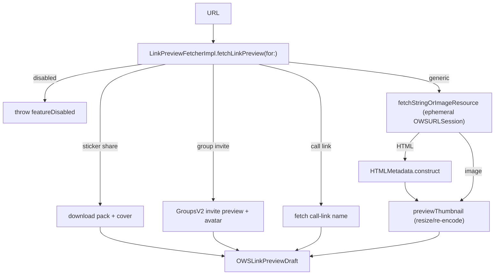

# Link Previews: Fetch, State, and Composer UI

Source: `SignalUI/LinkPreview/`. This subsystem turns a URL found in user text
into a rich preview (title, description, thumbnail, date) and renders it in the
message composer. It covers three concerns: **fetching** a preview over the
network (`LinkPreviewFetcher`), **tracking** the live fetch/parse state tied to
the input text (`LinkPreviewFetchState`), and **presenting** the result as either
a view-model (`LinkPreviewState` family) or the composer's dismissible
`LinkPreviewView`. HTML scraping is isolated in `HTMLMetadata`.

> Confidence: **[High]** read in full; **[Medium]** signature/partial; **[Low]**
> inferred. Citations are `File.swift:line`. An uncited claim is a defect.

## Responsibility and boundaries

**[High]** This folder produces an `OWSLinkPreviewDraft` from a `URL`, decides
whether/when to fetch while the user types, and draws the loading/loaded preview
chrome in the composer. The draft type itself, settings (`LinkPreviewSettingStore`),
URL validation (`LinkValidator`), and the on-wire `OWSLinkPreview` all live in
`SignalServiceKit`, which every file here imports
(`SignalUI/LinkPreview/LinkPreviewFetcher.swift:7`,
`SignalUI/LinkPreview/LinkPreviewState.swift:6`). The in-conversation (received
message) rendering path, by contrast, lives in the app target under
`Signal/ConversationView/` (`CVComponentLinkPreview`, `CVLinkPreviewView`) and
only consumes the `LinkPreviewState` protocol defined here (see Interactions).

## Fetching (`LinkPreviewFetcher.swift`)

**[High]** `LinkPreviewFetcher` is a one-method protocol —
`fetchLinkPreview(for:) async throws -> OWSLinkPreviewDraft`
(`SignalUI/LinkPreview/LinkPreviewFetcher.swift:9-11`). A `MockLinkPreviewFetcher`
is compiled under `TESTABLE_BUILD` for tests
(`SignalUI/LinkPreview/LinkPreviewFetcher.swift:13-27`).

**[High]** `LinkPreviewFetcherImpl` is the production implementation
(`SignalUI/LinkPreview/LinkPreviewFetcher.swift:29`). It is constructed with
`AuthCredentialManager`, `DB`, `GroupsV2`, `LinkPreviewSettingStore`, and
`TSAccountManager` (`SignalUI/LinkPreview/LinkPreviewFetcher.swift:30-48`). Its
`fetchLinkPreview(for:)` first short-circuits with
`LinkPreviewError.featureDisabled` if previews are turned off in settings
(`SignalUI/LinkPreview/LinkPreviewFetcher.swift:50-54`), then dispatches on URL
shape (`SignalUI/LinkPreview/LinkPreviewFetcher.swift:56-66`):

- **Sticker-pack shares** → `linkPreviewDraft(forStickerShare:)`, which downloads
  the pack (reusing local data when possible) and uses its title + cover image
  (`SignalUI/LinkPreview/LinkPreviewFetcher.swift:57-58`).
- **Group invite links** → `linkPreviewDraft(forGroupInviteLink:)`, which fetches
  the invite-link preview and avatar via `GroupsV2`
  (`SignalUI/LinkPreview/LinkPreviewFetcher.swift:59-60`).
- **Call links** → fetches the call-link name via `fetchName(forCallLink:)` using
  a call-link auth credential and `CallLinkFetcherImpl`
  (`SignalUI/LinkPreview/LinkPreviewFetcher.swift:61-63`).
- **Everything else** → `fetchLinkPreview(forGenericUrl:)`
  (`SignalUI/LinkPreview/LinkPreviewFetcher.swift:64-65`).

If no draft can be produced it throws `LinkPreviewError.noPreview`
(`SignalUI/LinkPreview/LinkPreviewFetcher.swift:67-69`).

**[High]** Generic-URL fetching (`fetchLinkPreview(forGenericUrl:)`,
`SignalUI/LinkPreview/LinkPreviewFetcher.swift:72`) retrieves a string-or-image
resource. For HTML it builds `HTMLMetadata`, prefers OpenGraph title/description
over the `<title>`/`<meta description>` tags, normalizes them via
`LinkPreviewHelper.normalizeString` (title ≤ 2 lines, description ≤ 3 lines), and
then — only if the image URL passes `isPermittedLinkPreviewUrl` — fetches and
down-samples a thumbnail (`SignalUI/LinkPreview/LinkPreviewFetcher.swift:79-99`).
For a direct image resource it uses the thumbnail and falls back to the URL's last
path component as a title (`SignalUI/LinkPreview/LinkPreviewFetcher.swift:101-111`).
A draft is only returned if a title or thumbnail exists
(`SignalUI/LinkPreview/LinkPreviewFetcher.swift:113-115`).

### Networking considerations

- **[High]** The `OWSURLSession` is **ephemeral with caching disabled**
  (`sessionConfig.urlCache = nil`, `requestCachePolicy = .reloadIgnoringLocalCacheData`),
  so preview fetches do not persist to disk cache
  (`SignalUI/LinkPreview/LinkPreviewFetcher.swift:129-132`).
- **[High]** The request spoofs a `WhatsApp/2` User-Agent; the in-source comment
  explains some sites (e.g. Twitter) won't return OpenGraph tags to a Signal UA
  (`SignalUI/LinkPreview/LinkPreviewFetcher.swift:134-138`).
- **[High]** Redirects are allowed but filtered: a `customRedirectHandler` drops
  any redirect whose target fails `LinkPreviewHelper.isPermittedLinkPreviewUrl`,
  preventing redirect-based SSRF to disallowed hosts
  (`SignalUI/LinkPreview/LinkPreviewFetcher.swift:144-151`).
- **[High]** Responses are size-capped at **2 MiB** (`maxFetchedContentSize`,
  `SignalUI/LinkPreview/LinkPreviewFetcher.swift:223`), enforced both as
  `maxResponseSize` on the request
  (`SignalUI/LinkPreview/LinkPreviewFetcher.swift:169`) and in `dataForImage`
  (`SignalUI/LinkPreview/LinkPreviewFetcher.swift:160-165`). Non-2xx responses and
  unparseable bodies raise `fetchFailure` / `invalidPreview`
  (`SignalUI/LinkPreview/LinkPreviewFetcher.swift:176-196`).
- **[High]** Thumbnails are generated by `previewThumbnail(srcImageData:)`: original
  JPEG/PNG images under 2400 px (`maxImageSize`) and non-animated are passed through
  untouched; otherwise the image is resized via `NormalizedImage.loadImage` and
  re-encoded to PNG (alpha) or JPEG at quality 0.8
  (`SignalUI/LinkPreview/LinkPreviewFetcher.swift:232-284`, `maxImageSize` at `:244`).
- **[Medium]** A private `HTMLMetadata.dateForLinkPreview` extension derives a
  publish/modified date from OG/article date strings via
  `Date.ows_parseFromISO8601String`, ignoring non-positive timestamps
  (`SignalUI/LinkPreview/LinkPreviewFetcher.swift:370-385`).

## Fetch state machine (`LinkPreviewFetchState.swift`)

**[High]** `LinkPreviewFetchState` ties a `LinkPreviewFetcher` to the text the user
is typing (`SignalUI/LinkPreview/LinkPreviewFetchState.swift:11`). Its nested
`State` enum has four cases — `none`, `loading`, `loaded(OWSLinkPreviewDraft)`,
`failed(Error)` (`SignalUI/LinkPreview/LinkPreviewFetchState.swift:37-50`). State
is stored as a `(State, URL?)` tuple whose `didSet` fires an `onStateChange`
callback, letting UI observe transitions
(`SignalUI/LinkPreview/LinkPreviewFetchState.swift:52-70`).

**[High]** `update(_:enableIfEmpty:prependSchemeIfNeeded:)` is the core driver
(`SignalUI/LinkPreview/LinkPreviewFetchState.swift:103`): it extracts a candidate
URL via `validUrl(in:...)`, returns early if the URL hasn't changed, cancels any
in-flight `fetchTask`, moves to `.loading`, and spawns a `@MainActor` task that
calls the fetcher and settles into `.loaded`/`.failed` — but only if `currentUrl`
still matches, discarding obsolete (raced) callbacks
(`SignalUI/LinkPreview/LinkPreviewFetchState.swift:103-156`).

**[High]** `disable()` sets `isEnabled = false` and clears state; this models the
user tapping the "X" and suppresses future fetches for that instance regardless of
the global setting (`SignalUI/LinkPreview/LinkPreviewFetchState.swift:72-77`).
`validUrl(...)` enforces: not-disabled, non-empty text, link previews enabled when
`onlyParseIfEnabled` is set, optional scheme prepending (`https://`), and finally
`LinkValidator.firstLinkPreviewURL(in:)`
(`SignalUI/LinkPreview/LinkPreviewFetchState.swift:158-187`). `linkPreviewDraftIfLoaded`
exposes the draft only in the `.loaded` case
(`SignalUI/LinkPreview/LinkPreviewFetchState.swift:85-93`).

## Presentation view-models (`LinkPreviewState.swift`)

**[High]** `LinkPreviewState` is the protocol every rendered preview conforms to —
exposing `urlString`, `displayDomain`, `title`, `imageState`, async image loading,
pixel size, description, date, and `isGroupInviteLink`/`isCallLink` flags
(`SignalUI/LinkPreview/LinkPreviewState.swift:37-54`). `LinkPreviewImageState`
enumerates `none`/`loading(blurHash:)`/`loaded`/`invalid`/`failed(blurHash:)`
(`SignalUI/LinkPreview/LinkPreviewState.swift:8-14`), and
`LinkPreviewImageCacheKey` keys cached thumbnails by attachment id / URL / blurhash
+ quality (`SignalUI/LinkPreview/LinkPreviewState.swift:18-35`). Protocol-extension
helpers `hasLoadedImageOrBlurHash` and `shouldShowInvalidImageIcon` centralize
image-display logic (`SignalUI/LinkPreview/LinkPreviewState.swift:58-80`).

Three concrete conformers cover the lifecycle:

- **[High]** `LinkPreviewLoading` — placeholder for an in-flight preview, carrying
  only a `LinkPreviewLinkType` so it can report `isGroupInviteLink`
  (`SignalUI/LinkPreview/LinkPreviewState.swift:92-139`;
  `LinkPreviewLinkType` at `:82-89`).
- **[High]** `LinkPreviewDraft` — wraps a freshly fetched `OWSLinkPreviewDraft`
  (composer side); decodes its in-memory `imageData`, caches the pixel size, and
  reports `.loaded`/`.none` image state
  (`SignalUI/LinkPreview/LinkPreviewState.swift:141-228`).
- **[High]** `LinkPreviewSent` — wraps a persisted `OWSLinkPreview` plus a
  `ReferencedAttachment` for already-sent/received messages; derives image state
  from attachment stream vs. backup-thumbnail vs. blurhash (including
  `failed`/`loading` from `isFailedImageAttachmentDownload`) and loads images off
  the main thread via blurhash or decrypted attachment streams
  (`SignalUI/LinkPreview/LinkPreviewState.swift:230-355`). It is the only conformer
  carrying a `ConversationStyle` (`:235`, `:246`).

## Composer UI (`LinkPreviewView.swift`)

**[High]** `LinkPreviewView: UIView` is the **composer-side** preview widget. Its
doc comment contrasts it with the conversation-side `CVLinkPreviewView`: this one
shows a "loading" state and an (X) cancel button to dismiss the preview
(`SignalUI/LinkPreview/LinkPreviewView.swift:9-11`). It is initialized directly
from a `LinkPreviewFetchState.State`
(`SignalUI/LinkPreview/LinkPreviewView.swift:13`), so the view and the fetch state
machine share a vocabulary.

**[High]** `configure(withState:)` switches on the state: `.loading` → spinner;
`.loaded` → either a call-link layout (when the URL parses as a `CallLink`, using
`LinkPreviewCallLink`) or the standard draft layout; any other case trips
`owsFailBeta` (`SignalUI/LinkPreview/LinkPreviewView.swift:112-126`). The draft
layout (`configureAsLinkPreviewDraft`) builds a vertical title/description/domain
stack with an optional trailing 77×77 image, loading the image asynchronously at
`.small` thumbnail quality and placing the capsule (X) button over the image or in
its own container (`SignalUI/LinkPreview/LinkPreviewView.swift:143-255`). The
call-link layout renders a video-camera circle, title, and
`CallStrings.callLinkDescription`
(`SignalUI/LinkPreview/LinkPreviewView.swift:257`). `cancelButton` is public so the
owning toolbar can wire dismissal (`SignalUI/LinkPreview/LinkPreviewView.swift:97`).

**[Medium]** iOS 26 uses `cornerConfiguration` concentric corners; earlier OSes
apply a `CAShapeLayer` rounded-corner mask in `bounds.didSet`
(`SignalUI/LinkPreview/LinkPreviewView.swift:24-27`, `:46-60`). Colors come from
the `.Signal` palette (see [Appearance.md](../Appearance.md)) and fonts from
dynamic-type styles (see [FontsAndFormatStyles.md](../FontsAndFormatStyles.md)).

## HTML scraping (`HTMLMetadata.swift`)

**[High]** `HTMLMetadata` is an `Equatable` value type holding the scraped fields:
`<title>`, favicon, `<meta name=description>`, and OpenGraph/article properties for
title/description/image/publish/modified
(`SignalUI/LinkPreview/HTMLMetadata.swift:8-27`). `construct(parsing:)` runs the
regex parsers and prefers `og:image` over `og:image:url`
(`SignalUI/LinkPreview/HTMLMetadata.swift:30-45`). Parsing is **regex-based**, not
a real HTML parser: a set of case-insensitive, dot-matches-newline
`NSRegularExpression`s extracts tags, `metaContentRegex` pulls the `content="…"`
value, and `decodeHTMLEntities(in:)` decodes entities via `NSAttributedString`'s
HTML reader (`SignalUI/LinkPreview/HTMLMetadata.swift:49-129`).

> **[Low]** The regex approach is deliberately lightweight and tolerant of
> malformed markup, but inherits the known limitations of HTML-via-regex (nested
> tags, unusual attribute quoting). Treat it as best-effort scraping.

## Interactions with SignalUI and the app

- **[High]** The shared `LinkPreviewFetcherImpl` is instantiated once in
  `SUIEnvironment` and exposed as `SUIEnvironment.shared.linkPreviewFetcher`
  (`SignalUI/AppLaunch/SUIEnvironment.swift:35`, `:51`).
- **[High]** The composer wires a `LinkPreviewFetchState` fed by that shared
  fetcher and refreshes `LinkPreviewView` on each `onStateChange`
  (`Signal/ConversationView/ConversationInputToolbar.swift:95-103`). The dedicated
  URL-entry screen `LinkPreviewAttachmentViewController` does the same
  (`Signal/src/ViewControllers/LinkPreviewAttachmentViewController.swift:20-25`).
- **[High]** The conversation render path builds a `LinkPreviewSent` for received
  messages (`Signal/ConversationView/Components/CVComponentState.swift:2047`) and
  draws it through the app-target `CVLinkPreviewView` /
  `CVComponentLinkPreview` — those live outside this folder and consume the
  `LinkPreviewState` protocol. **[Medium]** (consumer sites by grep;
  `CVLinkPreviewView.swift` not read in full.)
- **[Medium]** `PhotoCaptureViewController` and `TextAttachmentView` build
  `LinkPreviewDraft` view-models for story/text-attachment previews
  (`Signal/src/ViewControllers/Photos/PhotoCaptureViewController.swift:2347`).

## Tests

**[Medium]** `LinkPreviewFetcherTest.swift`, `LinkPreviewFetchStateTest.swift`, and
`HTMLMetadataTests.swift` cover the fetcher dispatch, the state-machine
transitions/cancellation (using `MockLinkPreviewFetcher`), and HTML/OpenGraph
parsing respectively (file roles; not read in full).
