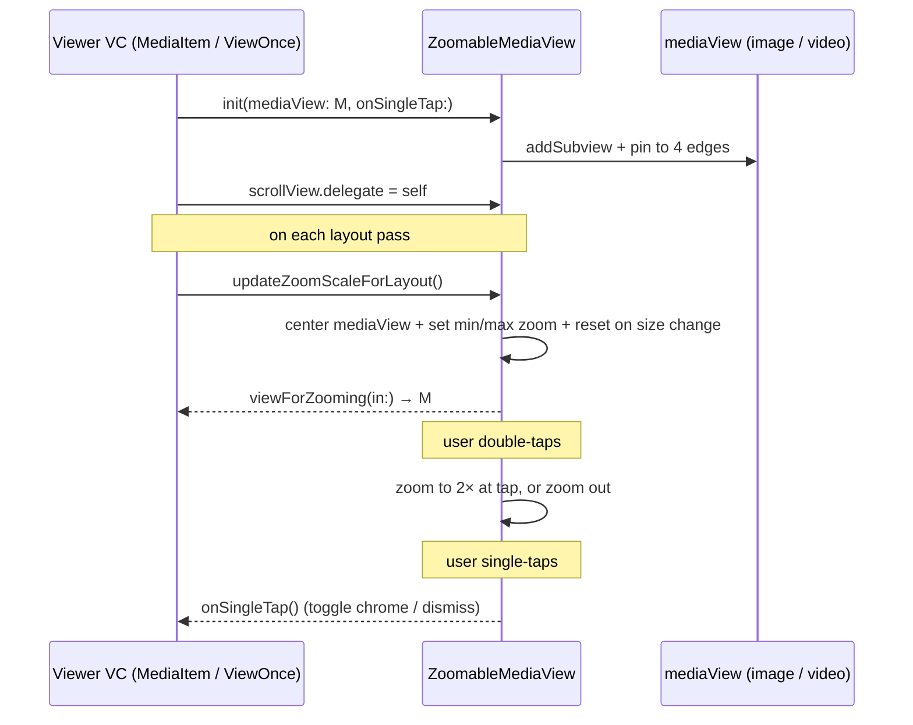

# Media

Source: `SignalUI/Media/`. A single-file area providing the reusable
pinch/double-tap zoom-and-pan container used by Signal's full-screen media
viewers. It does **not** load, decode, or own media — it wraps a caller-supplied
`UIView` and manages zoom/scroll geometry on its behalf.

> Confidence: **[High]** read in full; **[Medium]** signature/partial; **[Low]**
> inferred. Citations are `File.swift:line`. An uncited claim is a defect.

## `ZoomableMediaView`

**[High]** `ZoomableMediaView` is a `public class` subclass of `UIScrollView`
(`SignalUI/Media/ZoomableMediaView.swift:9`). It is constructed with the view to
display and an optional single-tap handler:
`init(mediaView: UIView, onSingleTap: @escaping () -> Void = {})`
(`SignalUI/Media/ZoomableMediaView.swift:20`). The `mediaView` is added as a
subview and pinned to all four scroll-view edges via PureLayout, capturing the
four edge constraints (`mediaViewLeading/Top/Trailing/BottomConstraint`) so they
can later be mutated to center the content
(`SignalUI/Media/ZoomableMediaView.swift:28-34`).

**[High]** In `init` the scroll view hides both scroll indicators, sets
`decelerationRate = .fast`, and opts into Auto Layout
(`translatesAutoresizingMaskIntoConstraints = false`)
(`SignalUI/Media/ZoomableMediaView.swift:27-31`). The `required init?(coder:)`
initializer is unsupported and calls `owsFail("Not implemented!")`
(`SignalUI/Media/ZoomableMediaView.swift:45-47`), so the view is code-constructed
only.

### Gesture handling

**[High]** Two tap recognizers are installed in `init`
(`SignalUI/Media/ZoomableMediaView.swift:36-43`): a double-tap
(`numberOfTapsRequired = 2`) and a single-tap that is required to wait for the
double-tap to fail (`singleTap.require(toFail: doubleTap)`), so a double-tap does
not also fire the single-tap handler.

- **[High]** `handleSingleTap` simply invokes the stored `singleTapGestureBlock`
  (`SignalUI/Media/ZoomableMediaView.swift:62-64`) — the hook callers use to
  toggle chrome/dismiss (see Consumers below).
- **[High]** `handleDoubleTap` toggles zoom
  (`SignalUI/Media/ZoomableMediaView.swift:51-59`): if already zoomed in (zoom
  scale `!=` the minimum) it zooms all the way back out via `zoomOut(animated:)`;
  otherwise it zooms to `2×` centered on the tap location. The zoom rect is built
  in the scroll view's coordinate space, clamped to non-negative origin, then
  converted into the media view's coordinate space with
  `mediaView.convert(zoomRect, from: self)` before calling `zoom(to:animated:)`
  (`SignalUI/Media/ZoomableMediaView.swift:66-77`).

### Layout / zoom-scale math

**[High]** `updateZoomScaleForLayout()` is the core geometry routine
(`SignalUI/Media/ZoomableMediaView.swift:81`). Callers must invoke it from their
layout pass (see Consumers). Its design goals are spelled out in-source: content
visually centered, zoomed to *just barely fit* by default regardless of content
size, with safe zooming up to 8× (`SignalUI/Media/ZoomableMediaView.swift:84-95`).

It determines the media's intrinsic size with a fallback chain
(`SignalUI/Media/ZoomableMediaView.swift:97-120`):

1. `mediaView.intrinsicContentSize` if both dimensions are positive (most
   accurate, but may be unavailable for async-loaded media).
2. Otherwise, if the `mediaView` is a `UIImageView` with a sized `image`, the
   image's `size`.
3. Otherwise, fall back to the scroll view's own size (unknown media size).

It then centers the media by distributing the leftover space into the edge
constraints — equal top/bottom `yOffset` and leading/trailing `xOffset`, with the
trailing/bottom insets negated (`SignalUI/Media/ZoomableMediaView.swift:122-130`).
`minimumZoomScale` is computed as the aspect-fit scale
(`min(scaleWidth, scaleHeight)`) and `maximumZoomScale` as `minScale * 8`; the
current `zoomScale` is then clamped into that range
(`SignalUI/Media/ZoomableMediaView.swift:132-145`).

**[High]** To handle iOS multitasking (where the root/scroll-view size is set
after `viewWillAppear`), the method tracks `lastKnownSafeAreaSize` and resets
`zoomScale` back to `minimumZoomScale` whenever the safe-area size changes beyond
a small tolerance (`fuzzyEquals(.zero, tolerance: 0.001)`)
(`SignalUI/Media/ZoomableMediaView.swift:147-154`). This prevents a stale zoom
level from persisting across a resize.

**[High]** `zoomOut(animated:)` is a public convenience that animates back to
`minimumZoomScale`, no-opping if already there
(`SignalUI/Media/ZoomableMediaView.swift:157-160`).

## Interactions with SignalUI and the app

**[High]** The file imports `PureLayout` (for the edge-pin helpers) and
`SignalServiceKit` (for `owsFail` and the `CGSize`/`CGPoint` `fuzzyEquals`/`asPoint`
helpers used in the safe-area check) — see the imports at
`SignalUI/Media/ZoomableMediaView.swift:5-6` and usage at lines 46 and 152.

**[Medium]** `ZoomableMediaView` does **not** adopt `UIScrollViewDelegate` itself.
Pinch-zoom only works because consumers set themselves as the scroll view's
`delegate` and implement `viewForZooming(in:)` to return the media view; the class
provides the double-tap/geometry layer on top of that standard UIKit contract.

### Consumers (in the `Signal` app target)

**[High]** `MediaItemViewController` — the full-screen media gallery/viewer page.
It builds the inner `mediaView` (image, animated GIF, or looping/standard video),
constructs `ZoomableMediaView(mediaView:onSingleTap:)` where the single-tap
forwards to `delegate?.mediaItemViewControllerDidTapMedia(self)` (toggling chrome),
and assigns `scrollView.delegate = self`
(`Signal/src/ViewControllers/MediaGallery/MediaItemViewController.swift:156-160`;
field at `:43`). It drives layout by calling `updateZoomScaleForLayout()`
(`Signal/src/ViewControllers/MediaGallery/MediaItemViewController.swift:381`),
clears the delegate on teardown (`:97`), and implements `viewForZooming(in:)`
(`:366`).

**[High]** `ViewOnceMessageViewController` — the view-once (disappearing) media
viewer. It constructs `ZoomableMediaView(mediaView:)` with the default no-op
single-tap handler (`Signal/src/ViewControllers/ViewOnceMessageViewController.swift:90`;
field at `:32`), calls `updateZoomScaleForLayout()` from its layout pass (`:335`),
and implements `viewForZooming(in:)` (`:330`).

> **[Medium]** The separate attachment-approval zoom surface
> (`SignalUI/AttachmentApproval/AttachmentPrepViewController`,
> which also implements `viewForZooming(in:)`) is an *independent* zoom
> implementation and does **not** use `ZoomableMediaView`. It is noted here only
> to disambiguate; it belongs to the AttachmentApproval area, not Media.

## Important data flow / state

**[High]** The class holds minimal state: the wrapped `mediaView`, the
`singleTapGestureBlock`, the four edge constraints, and `lastKnownSafeAreaSize`
(`SignalUI/Media/ZoomableMediaView.swift:10-18`). It owns no media data, performs
no decoding, and does not retain the delegate (standard `UIScrollView` weak
delegate). The typical lifecycle is:

## Notable media / UI considerations

- **[High]** Centering is done via constraint constants rather than `contentInset`
  (`SignalUI/Media/ZoomableMediaView.swift:122-130`), keeping the content centered
  at the aspect-fit minimum zoom.
- **[High]** The safe-area change reset avoids a stale zoom after rotation,
  Split View, or Slide Over resizing
  (`SignalUI/Media/ZoomableMediaView.swift:147-154`).
- **[High]** The intrinsic-size fallback chain tolerates async-loaded media that
  has no intrinsic size yet, degrading to the image size and finally to the scroll
  view size (`SignalUI/Media/ZoomableMediaView.swift:97-120`).
- **[Medium]** Rendering quality for the zoomed media (e.g. `scaleAspectFit`,
  trilinear min/magnification filters) is configured by the *consumer* on the
  `mediaView`, not by `ZoomableMediaView`
  (`Signal/src/ViewControllers/MediaGallery/MediaItemViewController.swift:145-152`).
