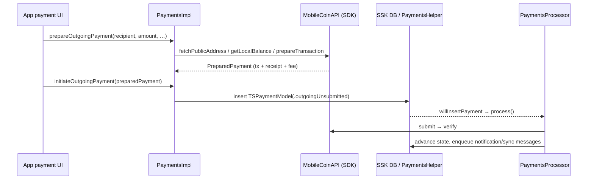
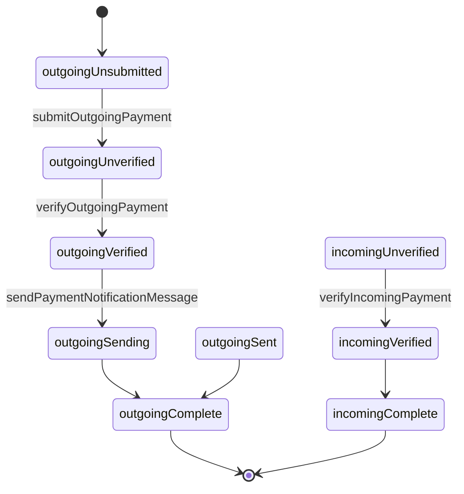

# Payments (MobileCoin wallet)

Source: `SignalUI/Payments/`. This area is SignalUI's **MobileCoin payments
engine** — the concrete implementation of the in-app wallet. It owns the local
MobileCoin account/keys derivation, talks to the MobileCoin SDK and Signal's
payments-auth service, drives outgoing/incoming payments through a processing
state machine, keeps the client's `TSPaymentModel` records reconciled with the
ledger, and formats payment amounts for display in chat. The user-facing payment
*screens* live in the main app; this module provides the service that those
screens call into via `SUIEnvironment.shared.paymentsRef`.

> Confidence: **[High]** read in full; **[Medium]** signature/partial; **[Low]**
> inferred. Citations are `File.swift:line`. An uncited claim is a defect.

## Where it plugs into SignalUI

**[High]** `SUIEnvironment` constructs the payments service at framework setup and
holds it as `paymentsRef: Payments!`
(`SignalUI/AppLaunch/SUIEnvironment.swift:30`, `:58` — `self.paymentsRef =
PaymentsImpl(appReadiness:)`). Two typed accessors downcast it for callers that
need the richer protocols: `paymentsSwiftRef: PaymentsSwift`
(`SignalUI/AppLaunch/SUIEnvironment.swift:32`) and `paymentsImplRef: PaymentsImpl`
(`SignalUI/AppLaunch/SUIEnvironment.swift:33`). Code throughout this directory
reaches the singleton through these accessors (e.g.
`SignalUI/Payments/PaymentsFormat+MobileCoin.swift:188`,
`SignalUI/Payments/PaymentsReconciliation.swift:76`,
`SignalUI/Payments/MobileCoinAPI.swift:383`).

**[Medium]** The protocol/implementation split lets SSK own the *persistence* side
of payments while SignalUI owns the *MobileCoin network* side. State such as the
`paymentsState`, the shared `KeyValueStore`, and `TSPaymentModel` insertion live in
`SSKEnvironment.shared.paymentsHelperRef`
(`SignalUI/Payments/PaymentsImpl.swift:48-49`, `:150-168`,
`:405`); the key material, SDK client, and processing loop live here.

## Public API surface (`Payments.swift`)

**[High]** `Payments` is the `@objc` protocol describing the minimal payments
service: wallet address, whether to show payments UI, the `paymentsEntropy`,
address validation, reconciliation scheduling, model lookup, auth-error handling,
a kill-switch check (`canUsePayments()`), and state clearing
(`SignalUI/Payments/Payments.swift:10-38`).

**[High]** `PaymentsSwift` refines it with the Swift-only, mostly `async`
operations: current balance read/update, fee estimation, prepare/initiate outgoing
payment, maximum payment amount, passphrase ⇄ entropy conversion, word validation,
and `blockOnOutgoingVerification` (`SignalUI/Payments/Payments.swift:42-73`).

**[High]** Supporting value types in the same file:
- `SendPaymentRecipient` — a recipient addressed either by `SignalServiceAddress`
  or (anonymously) by raw public address
  (`SignalUI/Payments/Payments.swift:100-104`); the concrete enum
  `SendPaymentRecipientImpl` (`.address` / `.publicAddress`) lives in
  `PaymentsImpl.swift` (`SignalUI/Payments/PaymentsImpl.swift:1140-1156`).
- `PreparedPayment` — a prepared-but-unsent MobileCoin `Transaction` + `Receipt` +
  fee (`SignalUI/Payments/Payments.swift:107-112`); concrete
  `PreparedPaymentImpl` at `SignalUI/Payments/PaymentsImpl.swift:1160-1171`.
- `PaymentBalance` — an amount stamped with the `Date` it was observed
  (`SignalUI/Payments/Payments.swift:115-123`).
- `MockPayments` — a no-op `PaymentsSwift` whose members `owsFail`, for
  tests/previews (`SignalUI/Payments/Payments.swift:127-247`).

**[High]** `PaymentsPassphrase.parse(passphrase:validateWords:)` lowercases and
splits the input, enforces the fixed word count
(`PaymentsConstants.passphraseWordCount`), and — when asked — validates each word
against the SDK word list via `paymentsSwiftRef.isValidPassphraseWord`
(`SignalUI/Payments/Payments.swift:77-99`). **[Medium]** `PaymentsPassphrase`,
`TSPaymentAmount`, `TSPaymentModel`, `PaymentsState`, `PaymentsError`, and
`PaymentsConstants` are SSK types used throughout.

## The service implementation (`PaymentsImpl.swift`)

**[High]** `PaymentsImpl: NSObject, PaymentsSwift` is the real service
(`SignalUI/Payments/PaymentsImpl.swift:11`). At `init` it builds the
`PaymentsReconciliation` and `PaymentsProcessor`, installs a `RefreshEvent` that
periodically checks whether the balance needs refreshing (checked every 5 min; the
balance itself is treated as stale after ~4 h), calls
`MobileCoinAPI.configureSDKLogging()`, and schedules a one-time update of the
"last known local payment address" proto when the app version changes
(`SignalUI/Payments/PaymentsImpl.swift:23-44`, `:51-80`, `:480`).

**[High]** **Cached MobileCoin API handle.** Building a `MobileCoinAPI` requires a
network round-trip for auth, so `PaymentsImpl` caches one in an `ApiHandle` and
rebuilds it every 12 h (auth expires at 24 h), guarded by an `UnfairLock`
(`SignalUI/Payments/PaymentsImpl.swift:82-134`). `didReceiveMCAuthError()` discards
the handle (`:96`). `getMobileCoinAPI()` refuses to run in the NSE and throws
`PaymentsError.notEnabled` unless `paymentsState` is `.enabled`
(`SignalUI/Payments/PaymentsImpl.swift:137-147`).

**[High]** **Balance.** The balance is cached in an `AtomicOptional<PaymentBalance>`
(`SignalUI/Payments/PaymentsImpl.swift:217`); reads come from the cache
(`currentPaymentBalance`, `:219`). `setCurrentPaymentBalance` posts
`currentPaymentBalanceDidChange` (`:215`) on the main thread and, when the amount
actually changed, kicks off reconciliation because new ledger activity may not yet
be in the DB (`SignalUI/Payments/PaymentsImpl.swift:223-252`).
`updateCurrentPaymentBalance` (`:254`) only runs when
ready/enabled/main-app-active/registered and, on
`.outdatedClient`/`.attestationVerificationFailed`, flags the client as outdated
via `paymentsHelperRef.setPaymentsVersionOutdated`.

**[High]** **Outgoing payment flow** (two phases, UI calls them in order):
1. `prepareOutgoingPayment(...)` validates the recipient; for an identified
   recipient it fetches the profile and extracts a MobileCoin `PublicAddress`
   (`fetchPublicAddress(for:)`, `SignalUI/Payments/PaymentsImpl.swift:322`),
   refuses self-payments, defragments if required, then asks the SDK to
   `prepareTransaction`, returning a `PreparedPaymentImpl`
   (public entry `SignalUI/Payments/PaymentsImpl.swift:519`; private worker `:565`).
2. `initiateOutgoingPayment(preparedPayment:)` does **not** itself submit; it only
   persists a `TSPaymentModel` in state `.outgoingUnsubmitted`
   (`upsertNewOutgoingPaymentModel`,
   `SignalUI/Payments/PaymentsImpl.swift:347`; `initiate…` at `:686`). The
   `PaymentsProcessor` observes the DB insert and takes over submission,
   verification, and notification.

**[High]** **Defragmentation.** `defragmentIfNecessary` (`:610`) asks the SDK
whether UTXO defragmentation is needed and (if `canDefragment`) prepares the step
transactions, persists them as `.outgoingDefragmentation` `TSPaymentModel`s, and
blocks on their verification via a timed task group (`defragment` at
`SignalUI/Payments/PaymentsImpl.swift:625`, `blockOnVerificationOfDefragmentation`
at `:711`). `blockOnOutgoingVerification` polls the model's `paymentState` every
50 ms until it reaches a verified/sent terminal state or fails
(`SignalUI/Payments/PaymentsImpl.swift:732`).

**[High]** **Keys / addresses.** `localMobileCoinAccount` derives the local account
from `paymentsEntropy` via `MobileCoinAPI.buildLocalAccount`
(`SignalUI/Payments/PaymentsImpl.swift:416`). From there it builds the local
`TSPaymentAddress`, the Base58 wallet string, and the serialized address proto
(`buildLocalPaymentAddress` at `:440`, `walletAddressBase58` at `:450`,
`localPaymentAddressProtoData` at `SignalUI/Payments/PaymentsImpl.swift:459`), and
can `unmaskReceiptAmount` for incoming receipts with the local account key
(`SignalUI/Payments/PaymentsImpl.swift:431`).

**[High]** **Message/sync emission.** Class methods build the chat-visible payment
notification (`OWSOutgoingPaymentMessage`, enqueued via `ThreadUtil.enqueueMessage`)
and the device-to-device `OutgoingPaymentSyncMessage`
(`sendPaymentNotificationMessage` at `SignalUI/Payments/PaymentsImpl.swift:837`,
the private builder at `:971`, and `sendOutgoingPaymentSyncMessage` at `:891`/`:1029`).

**[High]** **SSK event bridge.** `PaymentsEventsMainApp: PaymentsEvents` is how SSK
calls back into this module when a payment is inserted/updated: it forwards to
`paymentsReconciliation` and refreshes the balance
(`SignalUI/Payments/PaymentsImpl.swift:1076-1103`).

## The processing state machine (`PaymentsProcessor.swift`)

**[High]** `PaymentsProcessor` watches the database (it registers a
`DatabaseChangeDelegate`) and also re-runs on reachability changes, app-foreground,
and the payments-enabled toggle (`SignalUI/Payments/PaymentsProcessor.swift:9-42`).
`process()` is a guarded entry point (no tests, payments enabled, app
ready/active/registered) that calls `buildProcessingOperations()`
(`SignalUI/Payments/PaymentsProcessor.swift:89-139`).

**[High]** It fetches every `TSPaymentModel` in a "needs processing" state
(`paymentStatesToProcess`, `SignalUI/Payments/PaymentsProcessor.swift:153-168`),
dedupes against an in-flight `processingPaymentIds` set under an `UnfairLock`, and
enqueues one `PaymentProcessingOperation` per model onto either a high-priority
queue (unverified outgoing) or the default queue
(`SignalUI/Payments/PaymentsProcessor.swift:68-76`, `:120-139`).

**[High]** Each `PaymentProcessingOperation` ushers a payment exactly **one step
forward** and, on success, asks the delegate to `continueProcessing` (enqueue the
next step); on retryable failure it `scheduleRetryProcessing` with backoff; on
assertion-type errors it `endProcessing`
(`SignalUI/Payments/PaymentsProcessor.swift:367-466`, delegate conformance at
`:273-347`). The step dispatch is the heart of the machine
(`SignalUI/Payments/PaymentsProcessor.swift:568-603`):

**[Medium]** The individual step handlers (`submitOutgoingPayment` at
`SignalUI/Payments/PaymentsProcessor.swift:615`, `verifyOutgoingPayment` at `:672`,
`verifyIncomingPayment` at `:786`) each obtain the shared `MobileCoinAPI` via
`SUIEnvironment.shared.paymentsImplRef.getMobileCoinAPI()` and refresh the balance
after state transitions
(`SignalUI/Payments/PaymentsProcessor.swift:662`, `:675`, `:705`, `:789`, `:813`)
(read by signature/role, not line-by-line).

## Ledger reconciliation (`PaymentsReconciliation.swift`)

**[High]** `PaymentsReconciliation` periodically reconciles the local
`TSPaymentModel` records against the MobileCoin account activity. It installs a
5-minute `RefreshEvent` check and also reconciles on the payments-enabled toggle,
serializing work on a `SerialTaskQueue`, and skips entirely in the NSE
(`SignalUI/Payments/PaymentsReconciliation.swift:9-49`).

**[High]** It gates work with `shouldReconcile` (not tests, enabled,
ready/active/registered, and due by date) and only pulls account activity from the
SDK when due; change detection compares the monotonically increasing ledger block
count and spent/received TXO counts stored in a dedicated `KeyValueStore`
(`SignalUI/Payments/PaymentsReconciliation.swift:52-140`). It also exposes
`scheduleReconciliationNow`, `willInsertPayment`, `willUpdatePayment`, and
`replaceAsUnidentified`, which `PaymentsImpl`/`PaymentsEventsMainApp` forward into
(`SignalUI/Payments/PaymentsImpl.swift:1080`, `:1088`, `:1109-1110`, `:1113-1120`).
**[Medium]**

## MobileCoin SDK boundary (`MobileCoinAPI.swift` + `+Configuration.swift`)

**[High]** `MobileCoinAPI` wraps the third-party `MobileCoin` SDK's
`MobileCoinClient` (`SignalUI/Payments/MobileCoinAPI.swift:10`, `:62`). It converts
passphrase ⇄ entropy using the SDK mnemonic (`:14-45`), validates passphrase words
and public addresses (`:48-52`, `:141-143`), and is `build`-ed by first requesting
a payments-auth credential from Signal
(`OWSRequestFactory.paymentsAuthenticationCredentialRequest`), then handing that
`OWSAuthorization` to the SDK client
(`SignalUI/Payments/MobileCoinAPI.swift:124-137`). All SDK calls go through
`withTimeoutAndErrorConversion`, which applies a 60 s timeout and maps SDK errors
onto SSK's `PaymentsError` via `convertMCError`
(`SignalUI/Payments/MobileCoinAPI.swift:96-110`, `:537-539`). Notable: a
`.connectionError` that is an auth failure calls back into
`paymentsRef.didReceiveMCAuthError()` to drop the cached handle
(`SignalUI/Payments/MobileCoinAPI.swift:528`).

**[High]** Key operations: `getLocalBalance` (`:147`), `getEstimatedFee` (`:179`),
`prepareTransaction` (`:220`), `submitTransaction` (`:355`),
`getOutgoingTransactionStatus` (`:372`), and `getAccountActivity` (`:458`).
`prepareTransaction` estimates the fee, asserts it matches the SDK's final fee, and
packages a `PreparedTransaction(transaction, receipt, feeAmount)`
(`SignalUI/Payments/MobileCoinAPI.swift:220-289`).

**[High]** `MobileCoinAPI+Configuration.swift` is the **crypto trust anchor** for
the wallet. It enumerates the MobileCoin `Environment`s (alpha/dev/test/main for
both MobileCoin and Signal variants; `current` picks Signal main vs test from
`TSConstants.isUsingProductionService`,
`SignalUI/Payments/MobileCoinAPI+Configuration.swift:15-44`), the per-environment
consensus/fog service URLs (`:51-120`), and the **SGX enclave attestation**
configuration — `MrEnclave`/`MrSigner` measurements, product IDs, minimum security
versions, and the explicit list of allowed hardening advisories (e.g.
`INTEL-SA-00334/00615/00657`) used to build `MobileCoin.Attestation` for consensus,
fog view, fog key-image, fog merkle-proof, and fog report
(`SignalUI/Payments/MobileCoinAPI+Configuration.swift:122-277`).

**[High]** `MobileCoinHelperSDK: MobileCoinHelper` is a tiny adapter that extracts
receipt info and validates public addresses without a full client, so SSK-side code
(and the NSE-safe `MobileCoinHelperMinimal`) can parse receipts
(`SignalUI/Payments/MobileCoinHelperSDK.swift:8-22`).
`MobileCoinHelperSDKTest.swift` cross-checks the SDK helper against the minimal
helper with fixed test vectors
(`SignalUI/Payments/MobileCoinHelperSDKTest.swift:9-45`).

## Display formatting (`PaymentsFormat+MobileCoin.swift`)

**[High]** This extends SSK's `PaymentsFormat` with UIKit/`NSAttributedString`
rendering for payment amounts shown in chat. It builds the large in-chat
success/failure amount strings (with explicit `UIFont` weights and a noted
non-RTL-friendly caveat), the amount + currency-code attributed strings colored via
`UIColor.Signal.label`/`.secondaryLabel`, and the quoted-reply preview text
(`SignalUI/Payments/PaymentsFormat+MobileCoin.swift:9-232`). For preview text it
reads the amount from the receipt — unmasking it for incoming messages via
`paymentsImplRef.unmaskReceiptAmount`, or looking up the stored `TSPaymentModel` for
outgoing (`SignalUI/Payments/PaymentsFormat+MobileCoin.swift:159-230`).

## Logging bridge (`DebugLogger+Payments.swift`)

**[High]** `DebugLogger.configureSwiftLogging()` bootstraps the swift-log
`LoggingSystem` with a handler that forwards MobileCoin SDK logs (prefixed
`MCSDK:`) to CocoaLumberjack through SSK's `Logger`, at `.trace` in DEBUG and
`.info` otherwise (`SignalUI/Payments/DebugLogger+Payments.swift:11-85`).

## Notable UI / cryptography considerations

- **[High] Key material.** The wallet is derived entirely from `paymentsEntropy`
  (SSK-held); passphrase ⇄ entropy conversion and account derivation go through the
  SDK mnemonic/account APIs (`SignalUI/Payments/Payments.swift:77-99`,
  `SignalUI/Payments/MobileCoinAPI.swift:14-45`,
  `SignalUI/Payments/PaymentsImpl.swift:416-427`). Entropy length is enforced
  against `PaymentsConstants.paymentsEntropyLength`
  (`SignalUI/Payments/MobileCoinAPI.swift:15`, `:37`, `:72`).
- **[High] Enclave attestation.** The configuration file pins SGX
  enclave/signer measurements and advisory allow-lists; mismatches surface as
  `PaymentsError.attestationVerificationFailed`
  (`SignalUI/Payments/MobileCoinAPI.swift:537-539`), which `PaymentsImpl` treats as
  "client outdated" (`SignalUI/Payments/PaymentsImpl.swift:268-270`).
- **[High] NSE exclusion.** Payments are disabled in the Notification Service
  Extension at multiple layers — `getMobileCoinAPI`, `MobileCoinAPI.build`,
  reconciliation, and processing all bail out when `CurrentAppContext().isNSE`
  (`SignalUI/Payments/PaymentsImpl.swift:138`,
  `SignalUI/Payments/MobileCoinAPI.swift:125`,
  `SignalUI/Payments/PaymentsReconciliation.swift:40-42`).
- **[High] Kill switch.** Mutating operations re-check `canUsePayments()` and throw
  `PaymentsError.killSwitch` if payments have been remotely disabled
  (`SignalUI/Payments/PaymentsImpl.swift:358`, `:527`, `:574`, `:688`).
- **[High] Sensitive logging.** The SDK's sensitive-data logging is only enabled
  under internal logging and never during tests
  (`SignalUI/Payments/MobileCoinAPI.swift:85-91`).
- **[High] RTL caveat.** The in-chat amount formatters explicitly note they are not
  RTL-friendly (`SignalUI/Payments/PaymentsFormat+MobileCoin.swift:44`, `:70`).
- **[Low] Threading intent.** Several balance/API caches are guarded by
  `UnfairLock`/`AtomicOptional` and refresh intervals are marked `TODO: Tune`
  (`SignalUI/Payments/PaymentsImpl.swift:93`, `:217`, `:32`); the exact tuning
  rationale is not documented in source.
