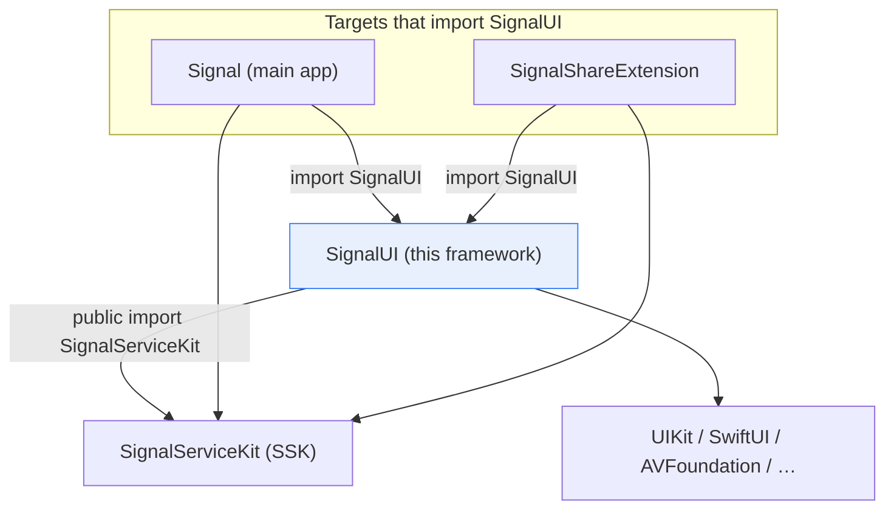
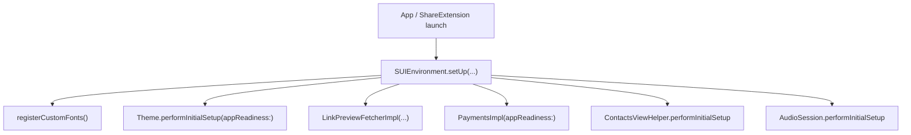

# SignalUI — the shared UI framework

`SignalUI/` is the **shared user-interface framework** for Signal iOS. It is a
separate build module that sits *above* `SignalServiceKit` (SSK) in the
dependency graph and *below* the two UI-bearing targets that import it: the main
**Signal** app and the **SignalShareExtension**. It provides the reusable UI
vocabulary — view-controller base classes, manual-layout views, theming/appearance,
conversation-rendering primitives, the attachment approval / multisend / sending
plumbing, recipient pickers, bundled fonts, format styles, and a large collection
of UIKit/SwiftUI extensions — so that the app and the share extension can present a
consistent interface without duplicating code.

> **Confidence labels** used throughout these docs:
> - **[High]** — stated directly by the code that was read in full; the claim is
>   explicit in-source.
> - **[Medium]** — strongly implied by the code, derived from signatures / partial
>   reads, or dependent on collaborators defined outside `SignalUI/`.
> - **[Low]** — an inference from naming/comments, not fully verified in-source.
>
> **Citations** are given as `File.swift:line`, pointing at the definition being
> described. Line numbers reflect the state of the tree at authoring time and may
> drift; use the cited symbol name to re-locate code if lines have moved. **An
> uncited factual claim is a defect.** Where the *reason* for a design cannot be
> established from the source, the docs say so explicitly ("intent undetermined —
> no evidence in source") rather than guessing.
>
> Diagrams are [Mermaid](https://mermaid.js.org/); GitHub renders them natively.

## Where SignalUI sits in the dependency graph

**[High]** SignalUI depends on SignalServiceKit. The dependency is pervasive and
is frequently re-exported: nearly every source file begins with either
`import SignalServiceKit` or `public import SignalServiceKit`. Representative
examples: `SignalUI/Appearance/Theme.swift:6` (`public import SignalServiceKit`),
`SignalUI/AppLaunch/SUIEnvironment.swift:6` (`public import SignalServiceKit`),
`SignalUI/ViewControllers/OWSViewController.swift:6` (`import SignalServiceKit`),
and `SignalUI/Sending/ThreadUtil+SignalUI.swift:7` (`public import SignalServiceKit`).
Because many of these are `public import`, SignalUI re-exports SSK types (threads,
messages, identifiers, transactions) directly through its own API surface. **[Medium]**

**[High]** SignalUI is consumed by the main app and the share extension. In the
repository, 613 first-party files contain `import SignalUI` (search of the tree).
The share extension in particular imports it from six files, e.g.
`SignalShareExtension/ShareViewController.swift:10` (`public import SignalUI`),
`SignalShareExtension/SharingThreadPickerViewController.swift:9` (`import SignalUI`),
and `SignalShareExtension/SAEScreenLockViewController.swift:7` (`import SignalUI`).

**[High]** The module's umbrella/Objective-C header is tiny — it exists only to
expose one Objective-C deprecation workaround to the mixed-language module:
`SignalUI/SignalUI.h:6` imports `UIKit/UIKit.h` and
`SignalUI/SignalUI.h:8` imports `<SignalUI/UIButton+DeprecationWorkaround.h>`.
The bulk of SignalUI is Swift; the header is **not** a catalog of the framework's
public API (that is defined by Swift `public`/`open` declarations).

## The SignalUI environment / bootstrap

**[High]** `SUIEnvironment` is the framework-level singleton that owns
SignalUI-scoped services and performs one-time setup
(`SignalUI/AppLaunch/SUIEnvironment.swift:8`). Its `shared` instance can only be
swapped in tests (`SignalUI/AppLaunch/SUIEnvironment.swift:12`), and
`setUp(appReadiness:authCredentialManager:)` is the entry point that: registers the
bundled custom fonts, runs `Theme.performInitialSetup`, constructs the
`LinkPreviewFetcher`, constructs `PaymentsImpl`, and performs initial setup of the
`ContactsViewHelper` and `AudioSession`
(`SignalUI/AppLaunch/SUIEnvironment.swift:43`). It holds the
`AudioSession`, `ContactsViewHelper`, `Payments`, and `LinkPreviewFetcher`
references (`SignalUI/AppLaunch/SUIEnvironment.swift:26`).

**[High]** `registerCustomFonts()` enumerates the `.ttf`/`.otf` resources bundled
in the SignalUI bundle and registers each with Core Text via
`CTFontManagerRegisterFontsForURL(... .process ...)`
(`SignalUI/AppLaunch/SUIEnvironment.swift:64-80`). The font files themselves live in
`SignalUI/Fonts/` (see [FontsAndFormatStyles.md](FontsAndFormatStyles.md)).

## Principal areas (document map)

This documentation describes **representative building blocks** per area rather
than every file. Each linked doc carries its own file+line citations.

| Doc | Source directory(ies) | What it covers |
| --- | --- | --- |
| [Appearance.md](Appearance.md) | `SignalUI/Appearance/`, `SignalUI/AppLaunch/` | Theming (`Theme`), the `UIColor.Signal` palette, `ThemedColor`, conversation styling, and how theme changes propagate to view controllers. |
| [ViewControllers.md](ViewControllers.md) | `SignalUI/ViewControllers/`, `SignalUI/ActionSheets/` | `OWSViewController`, `OWSTableViewController2`, `OWSNavigationController`, sheet/modal controllers, and action sheets. |
| [Views.md](Views.md) | `SignalUI/Views/` | Manual-layout views (`ManualLayoutView`/`ManualStackView`), avatars, toasts, bubble shapes, and other reusable views. |
| [ConversationView.md](ConversationView.md) | `SignalUI/ConversationView/` | `CVText`/`CVTextValue`, `CVTextLabel`, `CVCellMeasurement`, and conversation-cell rendering primitives. |
| [Sending.md](Sending.md) | `SignalUI/Sending/` | `ThreadUtil+SignalUI` message enqueue, `QuotedReplyModel`. |
| [AttachmentFlows.md](AttachmentFlows.md) | `SignalUI/AttachmentApproval/`, `SignalUI/AttachmentMultisend/`, `SignalUI/Attachments/` | Attachment approval UI, multisend enqueue, and the client-side `SignalAttachment` model. |
| [RecipientPickers.md](RecipientPickers.md) | `SignalUI/RecipientPickers/` | `RecipientPickerViewController` + delegate, `ConversationPicker`, `ConversationItem`, contact cells. |
| [FontsAndFormatStyles.md](FontsAndFormatStyles.md) | `SignalUI/Fonts/`, `SignalUI/FormatStyles/`, `SignalUI/UIKitExtensions/UIFont+*` | Bundled fonts & registration, `UIFont` Dynamic Type helpers, `OWSByteCountFormatStyle`, `OWSPercentFormatStyle`. |
| [Extensions.md](Extensions.md) | `SignalUI/UIKitExtensions/`, `SignalUI/SwiftUIExtensions/` | UIKit AutoLayout/animation/image/text helpers and SwiftUI hosting/environment helpers. |

> **Scope note.** `SignalUI/` contains additional areas not expanded in this set
> (e.g. `ImageEditor/`, `VideoEditor/`, `Stickers/`, `Stories/`, `Payments/`,
> `SafetyNumbers/`, `Search/`, `LinkPreview/`, `Calls/`, `ContactSharing/`,
> `Usernames/`, `Media/`, `AV/`, `AppBlocking/`, `Wallpapers/`). They follow the
> same framework conventions (depend on SSK, use the theming/appearance and
> manual-layout primitives documented here). The per-area docs above cover the
> areas called out in the task. **[Medium]** — directory existence confirmed from
> the tree; detailed per-file behavior for the un-expanded areas was not read in
> full.

## Cross-cutting conventions

- **`OWS` prefix.** Many base classes/utilities use the historical `OWS` prefix
  ("Open Whisper Systems"), e.g. `OWSViewController`, `OWSTableViewController2`,
  `OWSNavigationController`, `OWSActionSheets`, `OWSByteCountFormatStyle`.
- **Manual layout.** Performance-sensitive surfaces (conversation cells) avoid
  Auto Layout and use `ManualLayoutView`/`ManualStackView`
  (`SignalUI/Views/ManualStackView.swift:24`); see [Views.md](Views.md).
- **Theme awareness.** View controllers derive from `OWSViewController`, which
  observes `.themeDidChange` and exposes an overridable `themeDidChange()` hook
  (`SignalUI/ViewControllers/OWSViewController.swift:53`,
  `SignalUI/ViewControllers/OWSViewController.swift:134-139`); see
  [Appearance.md](Appearance.md).
