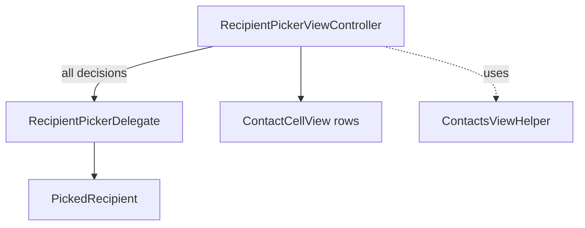

# Recipient Pickers

Source: `SignalUI/RecipientPickers/`. The reusable UI for choosing *who* to send
to — individual recipients, contacts, groups, and conversations/stories. Both the
app and the share extension build their "to:" surfaces on these.

> Confidence: **[High]** read in full; **[Medium]** signature/partial; **[Low]**
> inferred. Citations are `File.swift:line`. An uncited claim is a defect.

## `RecipientPickerViewController` + delegate

**[High]** `RecipientPickerViewController` is an `OWSViewController` that also
conforms to `OWSNavigationChildController`
(`SignalUI/RecipientPickers/RecipientPickerViewController.swift:12`). It is the
large (~59 KB) general-purpose recipient-selection screen (contacts list, search,
groups, "find by phone number"/"find by username", etc.).

**[High]** It is intentionally UI-only and delegates all policy/business decisions
to `RecipientPickerDelegate` (`SignalUI/RecipientPickers/RecipientPickerDelegate.swift:8`),
which refines `RecipientContextMenuHelperDelegate`. The delegate decides, per
`PickedRecipient`: the cell selection style, what happens on selection
(`didSelectRecipient`), accessory text/accessory views, subtitle, and whether a
recipient is interactive
(`SignalUI/RecipientPickers/RecipientPickerDelegate.swift:9-45`). Several delegate
methods have default (no-op/`nil`) implementations in a protocol extension so
conformers only implement what they need
(`SignalUI/RecipientPickers/RecipientPickerDelegate.swift:50-70`).

**[High]** `PickedRecipient` is the `Hashable` value identifying a chosen recipient
(`SignalUI/RecipientPickers/RecipientPickerDelegate.swift:82`).

## `ContactsViewHelper`

**[High]** `ContactsViewHelper` is the shared helper that backs contact-driven UI
(`SignalUI/RecipientPickers/ContactsViewHelper.swift:17`). It is owned by
`SUIEnvironment` (`SignalUI/AppLaunch/SUIEnvironment.swift:28`) and has its initial
setup performed during `SUIEnvironment.setUp` (see
[README.md](README.md#the-signalui-environment--bootstrap)).

## Contact cells

**[High]** `ContactCellView` is notable: it is built on the manual-layout system,
subclassing `ManualStackView` rather than using Auto Layout
(`SignalUI/RecipientPickers/ContactCellView.swift:8`) — consistent with the
performance-oriented list rendering described in [Views.md](Views.md). Related cell
types in the directory include `ContactCell`, `ContactTableViewCell`,
`GroupTableViewCell`, `NonContactTableViewCell`, and `ContactReminderTableViewCell`.
**[Medium]** (enumerated from the tree; `ContactCellView` read for its base class.)

## Conversation picking (`ConversationPicker` + `ConversationItem`)

**[High]** `ConversationPickerViewController` is an `OWSTableViewController2`
subclass (`SignalUI/RecipientPickers/ConversationPicker.swift:30`) used to pick one
or more *conversations* (threads/stories) to send to — this is the base class the
share extension's `SharingThreadPickerViewController` extends (see the
SignalShareExtension docs).

**[High]** The abstraction it operates on is the `ConversationItem` protocol
(`SignalUI/RecipientPickers/ConversationItem.swift:22`). A `ConversationItem`
exposes a `messageRecipient`, a `title(transaction:)`, an `outgoingMessageType`
(`.message` or `.storyMessage`, `SignalUI/RecipientPickers/ConversationItem.swift:16`),
image/blocked/story flags, disappearing-message config, thread
lookup/create helpers, and story-send constraints such as
`limitsVideoAttachmentLengthForStories`
(`SignalUI/RecipientPickers/ConversationItem.swift:22-39`). The `MessageRecipient`
enum distinguishes contact / group / private-story destinations
(`SignalUI/RecipientPickers/ConversationItem.swift:8`).

**[High]** Concrete conformers in the same file model the different picker rows:
`RecentConversationItem` (`:64`), `ContactConversationItem` (`:121`),
`GroupConversationItem` (`:189`), `StoryConversationItem` (`:264`), and
`PrivateStoryConversationItem` (`:586`). These are what
`AttachmentMultisend.enqueueApprovedMedia(...)` consumes as its `conversations:`
argument (see [AttachmentFlows.md](AttachmentFlows.md)).

## Other recipient-related screens

**[Medium]** The directory also contains `BaseMemberViewController` (group member
selection base), `NewMembersBar`, `InviteFlow`, `FindByPhoneNumberViewController`,
`CountryCodeViewController`/`PhoneNumberCountry`, `ContactPickerViewController`,
`DeleteSystemContactViewController`, `RecipientContextMenuHelper`,
`RecipientPickerContainerViewController`, and the `ThreadViewModel`/
`TSGroupThread+ViewModel`/`RecipientPickerViewModel` support types (enumerated from
the tree; read by role).
