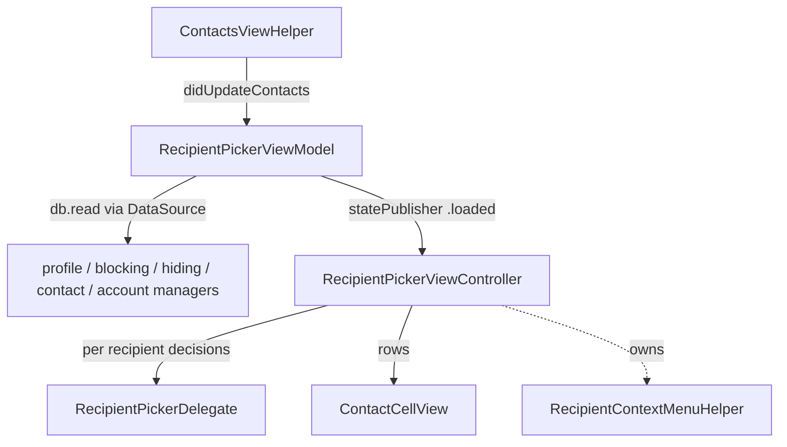

# RecipientPickers (subsystem)

Source: `SignalUI/RecipientPickers/`. This is the reusable UI subsystem for
choosing *who* a user is talking to or acting on — individual Signal recipients,
system contacts, groups, and conversations/stories — plus the surrounding chrome
(context menus, "find by phone number", invite flow, member bars) that composition
and selection screens share. Both the main app and the share extension build their
"to:" surfaces on top of these types.

This README expands the subsystem at a per-file level. The higher-level overview in
[../RecipientPickers.md](../RecipientPickers.md) summarizes the headline types; this
document goes deeper on data flow, state, delegation, and UI considerations.

> Confidence: **[High]** read in full; **[Medium]** signature/partial; **[Low]**
> inferred. Citations are `File.swift:line`. An uncited claim is a defect. Where a
> design *reason* cannot be established from the source, this doc says so explicitly
> rather than guessing.

## Responsibility

The subsystem owns three overlapping jobs:

1. **Recipient selection** — pick one or more Signal recipients (addresses or
   groups) from the user's connections, with search, an alphabet slider, pull to
   refresh, and "add by phone number"/"find by username".
2. **Conversation/story selection** — pick one or more *conversations* (threads or
   stories) to send media/text to; this is the base the share extension's thread
   picker extends.
3. **Supporting selection surfaces** — system-contact picking, group-member
   selection, the invite-to-Signal flow, country-code selection, recipient context
   menus (block/remove/hide), and the small view-model/cell types these screens
   render.

The subsystem is deliberately **UI-only**: policy and business decisions are pushed
out to host-supplied delegates, and data is read through `SignalServiceKit` (SSK)
managers resolved from `SSKEnvironment`/`DependenciesBridge`.

## The general-purpose recipient picker

**[High]** `RecipientPickerViewController` is an `OWSViewController` that also
conforms to `OWSNavigationChildController`
(`SignalUI/RecipientPickers/RecipientPickerViewController.swift:11`). It is the
large (~59 KB) general-purpose recipient-selection screen: a searchable contacts
list with an alphabet slider, pull-to-refresh, and optional "new group",
"find by phone number", and "invite" affordances.

**[High]** Its behavior is configured through plain stored properties set by the
host before the view loads, not subclassing:

- `selectionMode` (`.default` or `.blocklist`) — `.blocklist` lets unregistered
  numbers be chosen and suppresses the "invite to Signal" offer, because you may
  want to block someone who isn't registered
  (`SignalUI/RecipientPickers/RecipientPickerViewController.swift:14-24`, `:52`).
- `groupsToShow` — `.noGroups`, `.groupsThatUserIsMemberOfWhenSearching`, or
  `.allGroupsWhenSearching`
  (`SignalUI/RecipientPickers/RecipientPickerViewController.swift:27-31`, `:53`).
- `allowsAddByAddress`, `shouldHideLocalRecipient`, `shouldShowInvites`,
  `shouldShowAlphabetSlider`, `shouldShowNewGroup`, `findByPhoneNumberButtonTitle`,
  `searchBarPlaceholderTitle`
  (`SignalUI/RecipientPickers/RecipientPickerViewController.swift:46-60`).
  `shouldHideLocalRecipient` asserts if changed after the view has loaded
  (`SignalUI/RecipientPickers/RecipientPickerViewController.swift:47-51`).
- `pickedRecipients: [PickedRecipient]` — the currently chosen set; its `didSet`
  calls `updateTableContents()`
  (`SignalUI/RecipientPickers/RecipientPickerViewController.swift:63-67`).

**[High]** It is intentionally UI-only and delegates all per-recipient policy to
`RecipientPickerDelegate` (`SignalUI/RecipientPickers/RecipientPickerDelegate.swift:7`),
which refines `RecipientContextMenuHelperDelegate`. Setting `delegate` also forwards
it to the context-menu helper
(`SignalUI/RecipientPickers/RecipientPickerViewController.swift:33-37`). The delegate
decides, per `PickedRecipient`: cell selection style, what happens on selection
(`didSelectRecipient`), an accessory message string, a `ContactCellView.Accessory`,
an attributed subtitle, whether interaction is allowed, drag-begin notification, and
the "new group" / QR-code-scanner affordances
(`SignalUI/RecipientPickers/RecipientPickerDelegate.swift:8-48`). Several of these
have default (`nil`/no-op/`false`) implementations in a protocol extension so hosts
implement only what they need
(`SignalUI/RecipientPickers/RecipientPickerDelegate.swift:51-79`).

**[High]** `PickedRecipient` is the `Hashable` value identifying a chosen recipient.
Its `Identifier` enum is either `.address(SignalServiceAddress)` or
`.group(TSGroupThread)`, with `for(address:)` / `for(groupThread:)` factories and
`isGroup`/`address` accessors
(`SignalUI/RecipientPickers/RecipientPickerDelegate.swift:81-124`).

**[High]** `RecipientPickerContainerViewController` is the thin
`OWSViewController`/`OWSNavigationChildController` wrapper that embeds a
`RecipientPickerViewController` as a child and forwards navigation configuration to
it (`SignalUI/RecipientPickers/RecipientPickerContainerViewController.swift:8-21`).
`BaseMemberViewController` builds on it (see below).

### Picker state & data flow (`RecipientPickerViewModel`)

**[High]** `RecipientPickerViewModel` is a `@MainActor final` view model that is a
`ContactsViewHelperObserver` (`SignalUI/RecipientPickers/RecipientPickerViewModel.swift:10`).
`RecipientPickerViewController` creates it in `viewDidLoad`, calls `loadData()`, and
drives the table from its `statePublisher`
(`SignalUI/RecipientPickers/RecipientPickerViewController.swift:76-120`).

**[High]** State is a Combine `CurrentValueSubject<State, Never>` with `.initial` and
`.loaded(LoadedData)` cases
(`SignalUI/RecipientPickers/RecipientPickerViewModel.swift:48-72`). `LoadedData`
holds the sorted `signalConnections` (`[ComparableDisplayName]`), a
`Set<SignalServiceAddress>` for membership tests, and the derived `[Recipient]`
(`SignalUI/RecipientPickers/RecipientPickerViewModel.swift:38-46`). `Recipient` today
has a single case, `.signalConnection(ComparableDisplayName)`, exposing a
`pickedRecipient` and `comparableDisplayName`
(`SignalUI/RecipientPickers/RecipientPickerViewModel.swift:14-33`).

**[High]** `loadData(loadSignalConnections:)` reads inside `db.read` and computes the
connection set as *whitelisted registered* addresses minus *blocked* minus *hidden*,
then conditionally inserts/removes the local address per `shouldHideLocalRecipient`,
sorts them into `ComparableDisplayName`s, and filters to names with a known value
(`SignalUI/RecipientPickers/RecipientPickerViewModel.swift:97-139`). The reads are
abstracted behind `RecipientPickerViewModelDataSource`, whose production impl pulls
from `profileManager`, `blockingManager`, `recipientHidingManager`, `contactManager`,
and `tsAccountManager`
(`SignalUI/RecipientPickers/RecipientPickerViewModel.swift:160-213`). This indirection
is what the view-model tests substitute (see `RecipientPickerViewModelTests.swift`).

**[High]** When contacts change, `contactsViewHelperDidUpdateContacts()` re-loads only
if already `.loaded`, keeping an un-shown picker idle
(`SignalUI/RecipientPickers/RecipientPickerViewModel.swift:142-149`).

### Search, invites, and find-by-number

**[High]** Search runs through a `UISearchController` whose `searchResultsUpdater` is
the controller; results are stored in an `Atomic<RecipientSearchResultSet?>` whose
setter re-renders the table, with a minimum search length of 1
(`SignalUI/RecipientPickers/RecipientPickerViewController.swift:139-179`). On
`viewWillAppear` it calls `requestSystemContactsOnce()` so first-time composers get
prompted for contact access
(`SignalUI/RecipientPickers/RecipientPickerViewController.swift:122-131`).

**[High]** When `shouldShowInvites` is set and the user isn't searching and contact
sharing isn't denied, the picker shows an invite row that calls `presentInviteFlow()`
(`SignalUI/RecipientPickers/RecipientPickerViewController.swift:57`, `:411-423`,
`:636`). "Find by phone number" pushes a `FindByPhoneNumberViewController`
(`SignalUI/RecipientPickers/RecipientPickerViewController.swift:341`).

## Conversation picking (`ConversationPicker` + `ConversationItem`)

**[High]** `ConversationPickerViewController` is an `open` `OWSTableViewController2`
subclass (`SignalUI/RecipientPickers/ConversationPicker.swift:30`) used to pick one
or more *conversations* (threads or stories). Its `ConversationPickerDelegate`
reports selection changes, completion, cancellation, an `approvalMode`, and
search-bar/text-editing state
(`SignalUI/RecipientPickers/ConversationPicker.swift:11-25`). This is the base class
the share extension's `SharingThreadPickerViewController` extends (see the
SignalShareExtension docs).

**[High]** The abstraction it operates on is the `ConversationItem` protocol
(`SignalUI/RecipientPickers/ConversationItem.swift:22`). A `ConversationItem` exposes
a `messageRecipient`, a `title(transaction:)`, an `outgoingMessageType`
(`SignalUI/RecipientPickers/ConversationItem.swift:26`), typed as
`ConversationItemMessageType` whose cases are `.message` / `.storyMessage`
(`SignalUI/RecipientPickers/ConversationItem.swift:17-19`), image/blocked/story
flags, disappearing-message config, thread lookup/create helpers, and story-send
constraints such as `limitsVideoAttachmentLengthForStories`
(`SignalUI/RecipientPickers/ConversationItem.swift:23-39`). The `MessageRecipient`
enum distinguishes contact / group / private-story destinations
(`SignalUI/RecipientPickers/ConversationItem.swift:9`).

**[High]** Concrete conformers in the same file model the different picker rows:
`RecentConversationItem` (`:64`), `ContactConversationItem` (`:121`),
`GroupConversationItem` (`:189`), `StoryConversationItem` (`:264`), and
`PrivateStoryConversationItem` (`:586`). These are what
`AttachmentMultisend.enqueueApprovedMedia(...)` consumes as its `conversations:`
argument (see [../AttachmentFlows.md](../AttachmentFlows.md)).

## Recipient context menus

**[High]** `RecipientContextMenuHelper` builds the long-press/`UIContextMenu` for a
recipient (`SignalUI/RecipientPickers/RecipientContextMenuHelper.swift:22`). It is
constructed with explicit SSK dependencies (`SDSDatabaseStorage`, `BlockingManager`,
`RecipientHidingManager`, `TSAccountManager`, `ContactManager`), a presenting view
controller, and an optional delegate; it must be retained for context menus to work
(`SignalUI/RecipientPickers/RecipientContextMenuHelper.swift:40-57`). Its
`actionProvider(address:)` returns `nil` for Note to Self (the local address) and
otherwise composes the delegate's `additionalActions(for:)` with built-in remove and
block actions (`SignalUI/RecipientPickers/RecipientContextMenuHelper.swift:60-90`).
`RecipientContextMenuHelperDelegate` supplies the host-specific extra actions with
empty defaults (`SignalUI/RecipientPickers/RecipientContextMenuHelper.swift:8-19`).

**[High]** `DeleteSystemContactViewController` is the fallback shown when hiding a
recipient fails because they are a system contact; it offers to delete the system
contact (which then triggers the hide) and is **primary-device only** per its doc
comment (`SignalUI/RecipientPickers/DeleteSystemContactViewController.swift:7-14`). It
is an `OWSTableViewController2` with explicit (not global) SSK dependencies
(`SignalUI/RecipientPickers/DeleteSystemContactViewController.swift:15-25`).

## Contacts access helper

**[High]** `ContactsViewHelper` is the shared helper backing contact-driven UI
(`SignalUI/RecipientPickers/ContactsViewHelper.swift:17`). It is owned by
`SUIEnvironment` and set up via `performInitialSetup(appReadiness:)` during
`SUIEnvironment.setUp` (see [../README.md](../README.md#the-signalui-environment--bootstrap)).
It skips setup in the Notification Service Extension
(`SignalUI/RecipientPickers/ContactsViewHelper.swift:31`).

**[High]** It observes four notifications — `SignalAccountsDidChange`, profile
whitelist changes, block-list changes, and hide-list changes — and fans each out to
weakly-held `ContactsViewHelperObserver`s via `contactsViewHelperDidUpdateContacts()`
(`SignalUI/RecipientPickers/ContactsViewHelper.swift:38-100`). The hide-list comment
notes it is a backstop for hidden recipients that don't also change the whitelist
(`SignalUI/RecipientPickers/ContactsViewHelper.swift:65-74`).

**[High]** It also centralizes **permission gating**: `checkEditAuthorization(...)`
and `checkReadAuthorization(purpose:...)` route through the contact manager's
authorization state and, when blocked, present a themed `ActionSheetController` with
contextual copy (edit vs. share vs. invite) and an "open system settings" action
(`SignalUI/RecipientPickers/ContactsViewHelper.swift:105-240`). `ReadPurpose` is
`.share` or `.invite` (`SignalUI/RecipientPickers/ContactsViewHelper.swift:108-111`).

## Member selection and invites

**[Medium]** `BaseMemberViewController` is an `open` subclass of
`RecipientPickerContainerViewController` used as the base for group-member selection
(`SignalUI/RecipientPickers/BaseMemberViewController.swift:43`). It talks to its
subclass through `MemberViewDelegate`, which exposes the selected
`OrderedSet<PickedRecipient>`, unsaved-changes state, add/remove, member-count
display, pre-existing-member checks, blocked-selection policy, and dismissal
(`SignalUI/RecipientPickers/BaseMemberViewController.swift:16-41`). A separate
`MemberViewUsernameQRCodeScannerPresenter` protocol exists specifically to avoid
threading a QR-scanner delegate through every subclass; the comment explains the main
Signal target extends `BaseMemberViewController` to conform
(`SignalUI/RecipientPickers/BaseMemberViewController.swift:8-14`).

**[Medium]** `NewMembersBar` is a `UICollectionView`-backed bar that renders the
currently-selected `NewMember`s (recipient + address + short name) and reports height
changes to a `NewMembersBarDelegate`
(`SignalUI/RecipientPickers/NewMembersBar.swift:7-50`).

**[Medium]** `InviteFlow` (an `NSObject`, `SignalUI/RecipientPickers/InviteFlow.swift:11`)
presents the native Messages/Mail invite channels. Its `Channel` enum maps to a
`SubtitleCellValue` (phone number vs. email) and action titles, and
`presentInviteFlow(channel:)` drives the system compose UI
(`SignalUI/RecipientPickers/InviteFlow.swift:12-32`, `:101`). It relies on
`MessageUI`, imported `public`
(`SignalUI/RecipientPickers/InviteFlow.swift:7`).

**[Medium]** `ContactPickerViewController` is an `open`
`OWSViewController`/`OWSNavigationChildController` for picking *system* contacts
(`SignalUI/RecipientPickers/ContactPickerViewController.swift:23`). It is configured
by `allowsMultipleSelection` and a `SubtitleCellValue`, and reports results through
`ContactPickerDelegate` (`didSelect`/`didSelectMultiple`/`shouldSelect`/`didCancel`)
with `SystemContact` payloads
(`SignalUI/RecipientPickers/ContactPickerViewController.swift:9-55`).

## Find by phone number & country selection

**[High]** `FindByPhoneNumberViewController` is an `OWSTableViewController2`
(`SignalUI/RecipientPickers/FindByPhoneNumberViewController.swift:15`) that takes a
`buttonText` and a `requiresRegisteredNumber` flag, lets the user pick a country and
type a national number, and reports the resolved address through
`FindByPhoneNumberDelegate`
(`SignalUI/RecipientPickers/FindByPhoneNumberViewController.swift:8-37`). Country
selection is handled by `CountryCodeViewController`
(`SignalUI/RecipientPickers/CountryCodeViewController.swift`) via
`CountryCodeViewControllerDelegate`, with the model type `PhoneNumberCountry`
(`SignalUI/RecipientPickers/PhoneNumberCountry.swift`), used in the conformance at
`SignalUI/RecipientPickers/FindByPhoneNumberViewController.swift:267`. **[Medium]**
(`CountryCodeViewController`/`PhoneNumberCountry` read by role/signature.)

## Cells and view models

**[High]** `ContactCellView` is built on the manual-layout system, subclassing
`ManualStackView` rather than using Auto Layout
(`SignalUI/RecipientPickers/ContactCellView.swift:8`) — consistent with the
performance-oriented list rendering described in [../Views.md](../Views.md). Its
nested `Configuration` struct carries the data source (`.address`, `.groupThread`, or
a `.static` name/avatar), display mode, accessory message, custom name, a
`ContactCellView.Accessory`, attributed subtitle, contact-icon/interaction flags,
badging, and story state
(`SignalUI/RecipientPickers/ContactCellView.swift:10-71`). `Accessory` is the nested
struct used by the picker delegate's `contactCellAccessoryForRecipient`
(`SignalUI/RecipientPickers/ContactCellView.swift:71`,
`SignalUI/RecipientPickers/RecipientPickerDelegate.swift:28-32`).

**[Medium]** Related cell types, enumerated from the tree and read by role:
`ContactCell`, `ContactTableViewCell`, `GroupTableViewCell`, `NonContactTableViewCell`,
`ContactReminderTableViewCell`, and `ContactAccessLimitedReminderView` (the limited
contact-access reminder banner).

**[High]** `ThreadViewModel` is an `Equatable` snapshot of a thread for list display —
unread state, group-vs-contact, name/short name, pending message request, disappearing
message config, blocked/pinned/archived/muted flags, and pinned messages
(`SignalUI/RecipientPickers/ThreadViewModel.swift:9-40`). `TSGroupThread+ViewModel`
and `RegistrationValues` are small supporting files in the same directory
(enumerated from the tree). **[Medium]**

## Interactions with the rest of SignalUI and the app

- **View-controller base classes.** Pickers derive from `OWSViewController` /
  `OWSTableViewController2` and participate in `OWSNavigationChildController`
  navigation styling — see [../ViewControllers.md](../ViewControllers.md).
- **Theming.** They override `themeDidChange()` → `applyTheme()`
  (`SignalUI/RecipientPickers/RecipientPickerViewController.swift:135-137`) per the
  propagation described in [../Appearance.md](../Appearance.md).
- **Action sheets.** Permission and error prompts use `ActionSheetController`
  (`SignalUI/RecipientPickers/ContactsViewHelper.swift:203`) — see
  [../ViewControllers.md](../ViewControllers.md).
- **Attachment multisend.** `ConversationItem`s produced here are the input to the
  send fan-out in [../AttachmentFlows.md](../AttachmentFlows.md).
- **Share extension.** `ConversationPickerViewController` is subclassed by the share
  extension's thread picker (see the SignalShareExtension docs).
- **SSK managers.** Reads/writes go through `SSKEnvironment` /
  `DependenciesBridge`-resolved managers (profile, blocking, hiding, contacts,
  account), kept behind small protocols where tested
  (`SignalUI/RecipientPickers/RecipientPickerViewModel.swift:166-213`).

## Notable UI considerations

- **UI-only + delegation.** The pickers hold no business policy; selection style,
  interactivity, accessories, subtitles, and context-menu actions are all host
  decisions via delegates
  (`SignalUI/RecipientPickers/RecipientPickerDelegate.swift:7-48`,
  `SignalUI/RecipientPickers/RecipientContextMenuHelper.swift:8-19`).
- **Blocklist mode.** `.blocklist` intentionally relaxes registration requirements
  and suppresses invites so you can block unregistered numbers
  (`SignalUI/RecipientPickers/RecipientPickerViewController.swift:14-24`).
- **Note to Self exclusion.** The context menu returns `nil` for the local address
  today, with a comment anticipating future NtS menu items
  (`SignalUI/RecipientPickers/RecipientContextMenuHelper.swift:76-86`).
- **Contact permission UX.** First composition triggers a one-time contacts request
  (`SignalUI/RecipientPickers/RecipientPickerViewController.swift:122-131`), and
  denied access produces purpose-specific, settings-linked alerts
  (`SignalUI/RecipientPickers/ContactsViewHelper.swift:104-240`).
- **Performance.** Contact rows use manual layout (`ManualStackView`) rather than
  Auto Layout for list-scroll performance
  (`SignalUI/RecipientPickers/ContactCellView.swift:8`).
- **Reactivity.** Contact/profile/block/hide changes propagate through
  `ContactsViewHelper` observers into the view model, which republishes `.loaded`
  state to refresh the table only when the picker is live
  (`SignalUI/RecipientPickers/ContactsViewHelper.swift:38-100`,
  `SignalUI/RecipientPickers/RecipientPickerViewModel.swift:142-149`).

> **Tests.** The directory also contains `RecipientPickerViewModelTests.swift` and
> `RecipientPickerViewControllerTest.swift`. These exercise the view model's load
> logic (via a substitutable `RecipientPickerViewModelDataSource`) and the controller;
> they are test code, not part of the shipped subsystem surface. **[Medium]**
