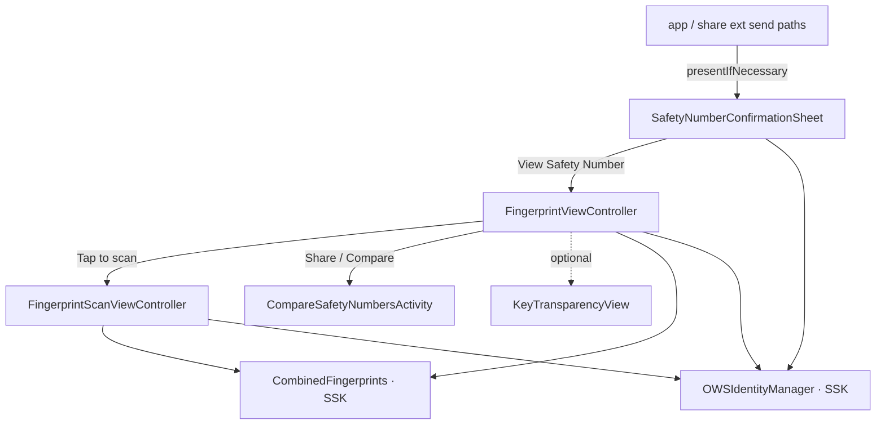

# Safety Numbers

Source: `SignalUI/SafetyNumbers/`. The reusable UI for **safety-number
verification** — the human-comparable fingerprint that lets two users confirm,
out of band, that their end-to-end-encrypted session has not been
man-in-the-middled. This subsystem owns the "View Safety Number" screen (QR code +
numeric fingerprint), the camera scanner that compares two devices' fingerprints,
the share/clipboard-compare `UIActivity`, the optional Key Transparency
auto-verification UI, and the blocking "safety number changed — confirm before
sending" sheet that gates outgoing messages.

> Confidence: **[High]** read in full; **[Medium]** signature/partial or depends on
> collaborators defined outside `SignalUI/`; **[Low]** inferred. Citations are
> `File.swift:line`. An uncited claim is a defect.

## Responsibility & where it sits

**[High]** Everything here is UI that reads/writes **identity state** owned by SSK.
The two state collaborators threaded through every file are
`DependenciesBridge.shared.identityManager` (`OWSIdentityManager`) and
`SSKEnvironment.shared.databaseStorageRef`; the fingerprint value type itself
(`CombinedFingerprints`) lives in SSK, not here
(`SignalServiceKit/Axolotl/CombinedFingerprints.swift:9`). So this subsystem is a
thin presentation layer: it renders identity keys as a comparable fingerprint and
turns user actions (verify / unverify / scan / "it's fine, send anyway") into
`identityManager` writes.

## `SafetyNumberConfirmationSheet`

**[High]** `SafetyNumberConfirmationSheet` is a custom-presented `UIViewController`
(`SignalUI/SafetyNumbers/SafetyNumberConfirmationSheet.swift:9`) — the bottom sheet
shown when you try to send to someone whose identity key changed and hasn't been
re-accepted. Its public entry point is the family of `presentIfNecessary(…)` class
methods: they filter the candidate `addresses` down to those that
`identityManager.untrustedIdentityForSending(to:untrustedThreshold:tx:)` reports as
untrusted, and only present a sheet if at least one remains
(`SignalUI/SafetyNumbers/SafetyNumberConfirmationSheet.swift:194-224`). The return
value is `true` iff a sheet was shown, so callers can treat "no sheet" as "safe to
proceed."

**[High]** `presentRepeatedlyAsNecessary(for:from:…)` wraps that in an `async` loop
(`SignalUI/SafetyNumbers/SafetyNumberConfirmationSheet.swift:153`, loop at `:161`):
each time the user accepts, it recomputes the address list (with a freshly bumped
`untrustedThreshold`) and re-presents, so a safety number that changes *while the
sheet is up* is still caught before sending. It resolves
`true` only when there are no remaining mismatches, `false` as soon as the user
cancels.

**[High]** Per-recipient rows are modeled by the private `Item` struct — address,
display name, `OWSVerificationState`, and the raw `identityKey`
(`SignalUI/SafetyNumbers/SafetyNumberConfirmationSheet.swift:15`) — built inside a
single DB read via `buildConfirmationItems(…)`
(`SignalUI/SafetyNumbers/SafetyNumberConfirmationSheet.swift:60`).

**[High]** State freshness is handled two ways:
- It observes `.identityStateDidChange` and rebuilds its items + reloads the table
  so the sheet reflects a verification the user just performed
  (`SignalUI/SafetyNumbers/SafetyNumberConfirmationSheet.swift:78`, handler at `:91`).
- On `viewWillAppear` it opportunistically fetches each recipient's profile
  (`profileFetcherRef.fetchProfile(…, isOpportunistic: true)`) to pull the latest
  identity key (`SignalUI/SafetyNumbers/SafetyNumberConfirmationSheet.swift:360-379`).

**[High]** The confirm button's write is deliberately conservative: for each item
it re-checks `identityManager.verificationState(for:tx:)` inside the write txn and
**skips** any address that became `.verified` since the sheet opened, otherwise it
sets `.implicit(isAcknowledged: true)` — i.e. "I've seen this change, send anyway"
without claiming the key is verified
(`SignalUI/SafetyNumbers/SafetyNumberConfirmationSheet.swift:311-337`, re-check at
`:319`, write at `:327`). Cancel just dismisses and reports `false`.

**[High]** The rest of the file is bespoke sheet chrome: a blurred
custom-presentation controller
(`SafetyNumberConfirmationAnimationController`,
`SignalUI/SafetyNumbers/SafetyNumberConfirmationSheet.swift:778`), interactive
drag-to-resize / drag-to-dismiss pan handling with a minimized "≈3.5 rows" height
(`SignalUI/SafetyNumbers/SafetyNumberConfirmationSheet.swift:406` minimizedHeight,
`:475` handlePan), and a
private `SafetyNumberCell` (a `ContactTableViewCell` subclass,
`SignalUI/SafetyNumbers/SafetyNumberConfirmationSheet.swift:651`) whose "View" button
pushes into `FingerprintViewController.present(for: item.address.aci, …)`
(`SignalUI/SafetyNumbers/SafetyNumberConfirmationSheet.swift:688`). The cell's
subtitle shows a check-prefixed "verified"/"previously verified" state label
(`SignalUI/SafetyNumbers/SafetyNumberConfirmationSheet.swift:706-712`).

## `FingerprintViewController`

**[High]** `FingerprintViewController` is the "View Safety Number" screen — an
`OWSViewController`/`OWSNavigationChildController`
(`SignalUI/SafetyNumbers/FingerprintViewController.swift:14`). Construction is via
the static `present(for theirAci:from:)`
(`SignalUI/SafetyNumbers/FingerprintViewController.swift:16`), which does **all**
its data loading up front inside one DB read and then snapshots the result into the
view controller. That snapshot includes: the contact's name, their
`VerificationState`, and — crucially — a `CombinedFingerprints` built from the
**local ACI identity key** and the **remote ACI identity key**
(`SignalUI/SafetyNumbers/FingerprintViewController.swift:66`). If the required
keys/identifiers are missing (e.g. you've never exchanged messages, so there is no
recipient identity), `present` instead shows a "can't verify — exchange messages
first" action sheet with a Learn More link
(`SignalUI/SafetyNumbers/FingerprintViewController.swift:78-94`).

**[High]** The snapshot is intentional: a comment notes they capture state at
presentation and *dismiss* the view on any identity change, to avoid edge cases
where state mutates while the view is up
(`SignalUI/SafetyNumbers/FingerprintViewController.swift:160`). The
`.identityStateDidChange` observer compares the current remote identity key against
the snapshotted `fingerprint.remote.identityKey`; if it differs it dismisses (so it
can be re-presented with the new number), otherwise it merely refreshes the
displayed `recipientVerificationState`
(`SignalUI/SafetyNumbers/FingerprintViewController.swift:200`).

**[High]** Dependencies are injected through a small `Deps` struct (`db`,
`identityManager`, `keyTransparencyManager`,
`SignalUI/SafetyNumbers/FingerprintViewController.swift:127`); the `#DEBUG`
SwiftUI previews pass `deps: nil` and random keys so the screen renders without a
live identity store (`SignalUI/SafetyNumbers/FingerprintViewController.swift:931-953`).

### Fingerprint card (QR + numeric)

**[High]** `FingerprintCard` is the private blue card
(`SignalUI/SafetyNumbers/FingerprintViewController.swift:301`) holding: a share
button, a white QR-code view rendered from `fingerprint.image()` with nearest-
neighbor scaling so the code stays crisp / unantialiased
(`SignalUI/SafetyNumbers/FingerprintViewController.swift:386`), the Menlo-font
numeric safety number from `fingerprint.displayableText()`
(`SignalUI/SafetyNumbers/FingerprintViewController.swift:409`), and a
verify/unverify capsule button whose title flips on `theirVerificationState`
(`SignalUI/SafetyNumbers/FingerprintViewController.swift:442`). Tapping the QR
code → scan; tapping the number or share button → the share sheet.

**[High]** `didTapVerifyUnverify()` is the write path: in a single `db.write` it
re-saves the remote identity key and flips verification between `.verified` and
`.implicit(isAcknowledged: false)` via
`identityManager.setVerificationState(…, isUserInitiatedChange: true, …)` with
`shouldUpdateStorageService: true` (so the change syncs across the user's devices),
then dismisses (`SignalUI/SafetyNumbers/FingerprintViewController.swift:707`, write at
`:727`).

### Key Transparency section

**[Medium]** When `keyTransparencyManager.isEnabled(tx:)` is true, the screen also
shows `KeyTransparencyView`, a 5-state machine
(`unableToVerify / readyToVerify / verifying / verifiedSuccess / verifiedFailure`,
`SignalUI/SafetyNumbers/FingerprintViewController.swift:481`) offering
*automatic* key verification. Tapping it runs
`keyTransparencyManager.performCheck(params:)` in a `Task` and transitions to
success/failure (`SignalUI/SafetyNumbers/FingerprintViewController.swift:794`).
A first-run education sheet and per-outcome `HeroSheetViewController`s
(`KeyTransparency{NotAvailable,Success,Failure,FirstTimeEducation}HeroSheet`) are
defined privately at the bottom of the file
(`SignalUI/SafetyNumbers/FingerprintViewController.swift:836-896`). The actual KT
protocol/check logic lives outside `SignalUI/` in SSK's `KeyTransparencyManager`.
**[Medium]** (relationship read from call sites; manager internals not read here.)

## `FingerprintScanViewController`

**[High]** `FingerprintScanViewController` is the camera screen reached from "tap to
scan" (`SignalUI/SafetyNumbers/FingerprintScanViewController.swift:10`). It embeds a
`QRCodeScanViewController(appearance: .framed)` and conforms to `QRCodeScanDelegate`
(`SignalUI/SafetyNumbers/FingerprintScanViewController.swift:16`,`:242`); it only
accepts QR payloads that carry binary `qrCodeData` (not a string), and stops
scanning after the first decode attempt whether or not it matched
(`SignalUI/SafetyNumbers/FingerprintScanViewController.swift:243-260`).

**[High]** `verifyCombinedFingerprintData(_:)` is the comparison core
(`SignalUI/SafetyNumbers/FingerprintScanViewController.swift:79`): it deserializes
the scanned bytes into `Textsecure_CombinedFingerprints` (a generated protobuf) and
calls `fingerprint.checkAgainst(combinedFingerprints:)`. Each
`CombinedFingerprints.MatchError` maps to a distinct localized alert —
`theyHaveOldVersion` / `weHaveOldVersion` (version skew) and
`theyHaveWrongKeyForUs` / `weHaveWrongKeyForThem` (key mismatch, i.e. a potential
MITM) (`SignalUI/SafetyNumbers/FingerprintScanViewController.swift:118-153`).

**[High]** On success, the shared static `showVerificationSucceeded(…)` offers a
"Verify" button that writes `.verified` for the recipient's ACI (again with
`shouldUpdateStorageService: true`), then pops/dismisses
(`SignalUI/SafetyNumbers/FingerprintScanViewController.swift:139-200`). The matching
`showVerificationFailed(…)` suppresses the scary "VERIFICATION FAILED" title when
the problem is mere user error and optionally offers a retry
(`SignalUI/SafetyNumbers/FingerprintScanViewController.swift:202-240`). These two
statics are reused by `FingerprintViewController` for the clipboard-compare flow
(`SignalUI/SafetyNumbers/FingerprintViewController.swift:812-826`).

## `CompareSafetyNumbersActivity`

**[High]** `CompareSafetyNumbersActivity` is a `UIActivity` added to the share sheet
so a user can paste a friend's safety number and compare without a camera
(`SignalUI/SafetyNumbers/CompareSafetyNumbersActivity.swift:30`). `prepare` strips
the shared number to digits only; `perform` reads the clipboard, requires exactly
**60** numeric digits, and reports success/`verificationError`/`userError` back
through `CompareSafetyNumbersActivityDelegate`
(`SignalUI/SafetyNumbers/CompareSafetyNumbersActivity.swift:58` prepare, `:67`
perform, 60-digit guard at `:72`). The 60-digit
length matches the three-lines-of-twenty numeric fingerprint produced by
`CombinedFingerprints.displayableText()`.

## Cryptography & verification notes

**[High]** The subsystem never computes crypto itself — it defers to the SSK value
type `CombinedFingerprints`, which holds a `local` and `remote` `Fingerprint` and
exposes three representations
(`SignalServiceKit/Axolotl/CombinedFingerprints.swift:9-24`):
- **Numeric text** — `stringRepresentation()` concatenates the two per-side strings
  in a canonical (sorted) order so both users see the *same* number regardless of
  who is "local," and `displayableText()` groups it into 3 lines × 5-digit groups
  (`SignalServiceKit/Axolotl/CombinedFingerprints.swift:50` and `:62`).
- **QR image** — serializes a `Textsecure_CombinedFingerprints` proto (version
  `aciScannableFormatVersion = 2`) and renders it via `CIQRCodeGenerator`
  (`SignalServiceKit/Axolotl/CombinedFingerprints.swift:80`, version const at `:125`).
- **Scan check** — `checkAgainst(…)` first rejects on version skew, then compares
  *their* local-vs-our-remote and *their* remote-vs-our-local contents, surfacing
  which side holds the wrong key (`SignalServiceKit/Axolotl/CombinedFingerprints.swift:28`).

**[Medium]** Fingerprints are derived per-ACI via `Fingerprint.derive(forAci:
identityKey:)` from `LibSignalClient` (call sites at
`SignalUI/SafetyNumbers/FingerprintViewController.swift:67-68`); the derivation /
iterated-hash itself is implemented in LibSignalClient, not in this repo.

**[High]** Verification-state semantics worth noting for anyone touching this code:
- `.verified` is only ever written from an explicit user action (scan success,
  clipboard-compare success, or the verify button) and always with
  `isUserInitiatedChange: true` and `shouldUpdateStorageService: true`.
- The "confirm before sending" sheet never writes `.verified`; it writes
  `.implicit(isAcknowledged: true)` ("acknowledged, not verified")
  (`SignalUI/SafetyNumbers/SafetyNumberConfirmationSheet.swift:328`).
- Both the sheet and the fingerprint screen guard against races by re-reading
  verification state inside the write txn / dismissing on `.identityStateDidChange`
  rather than trusting their snapshot, so a concurrent change on another device is
  not silently clobbered.
