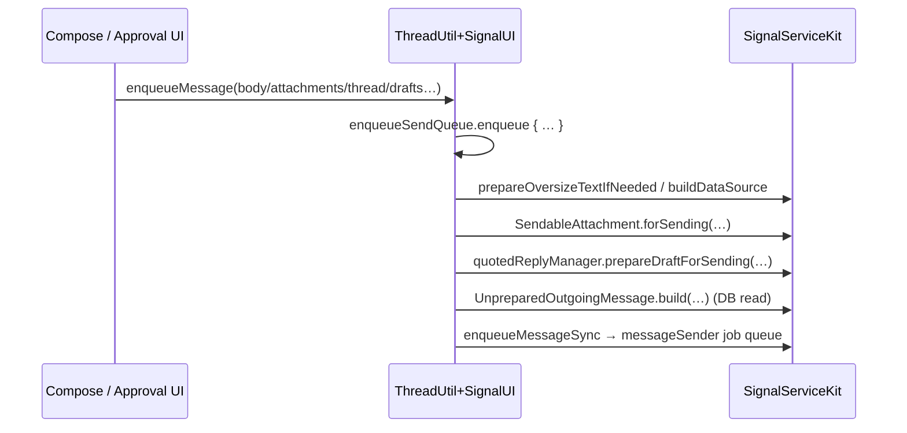

# Sending UI plumbing

Source: `SignalUI/Sending/`. This small-but-central area bridges UI-level "the user
pressed send" into SignalServiceKit's durable outgoing-message pipeline, and models
quoted replies for rendering/compose.

> Confidence: **[High]** read in full; **[Medium]** signature/partial; **[Low]**
> inferred. Citations are `File.swift:line`. An uncited claim is a defect.

## `ThreadUtil+SignalUI` — enqueue a message

**[High]** This file extends SSK's `ThreadUtil`
(`SignalUI/Sending/ThreadUtil+SignalUI.swift:9`) with the UI-facing durable send
entry point `enqueueMessage(body:attachments:thread:quotedReplyDraft:linkPreviewDraft:persistenceCompletionHandler:)`
(`SignalUI/Sending/ThreadUtil+SignalUI.swift:13`). It:

1. Generates a message timestamp and starts a send bench event
   (`SignalUI/Sending/ThreadUtil+SignalUI.swift:21-22`).
2. Enqueues work onto a serial `enqueueSendQueue`
   (`SignalUI/Sending/ThreadUtil+SignalUI.swift:24`) so sends are ordered.
3. Prepares the parts that require async validation/build: oversize-text handling
   via `attachmentContentValidator.prepareOversizeTextIfNeeded`, link-preview data
   source via `linkPreviewManager.buildDataSource`, per-attachment
   `SendableAttachment.forSending`, and the quoted-reply draft via
   `quotedReplyManager.prepareDraftForSending`
   (`SignalUI/Sending/ThreadUtil+SignalUI.swift:28-39`).
4. Builds an `UnpreparedOutgoingMessage` inside a DB read, then hands it to the
   internal `enqueueMessageSync(...)`
   (`SignalUI/Sending/ThreadUtil+SignalUI.swift:41-60`).

**[Medium]** All the heavy lifting (`attachmentContentValidator`,
`linkPreviewManager`, `quotedReplyManager`, `UnpreparedOutgoingMessage`,
`messageSenderJobQueue`) is defined in SSK — SignalUI's role here is to assemble
UI-provided drafts into SSK's build/enqueue types. A second `enqueueMessage(...)`
overload exists at `SignalUI/Sending/ThreadUtil+SignalUI.swift:116`.

## `QuotedReplyModel`

**[High]** `QuotedReplyModel` is the view model for an *existing* quoted reply
whose attachments have already been fetched
(`SignalUI/Sending/QuotedReplyModel.swift:12`). Its doc comment is explicit that it
is **not** for draft quoted replies — it is for already-created `TSMessage`/story
replies being rendered in a conversation
(`SignalUI/Sending/QuotedReplyModel.swift:8-10`). It carries the original message's
timestamp, author address/label, and a nested `OriginalContent` enum describing the
replied-to content (text, gift badge, story-reaction emoji, attachment, …)
(`SignalUI/Sending/QuotedReplyModel.swift:14-30`).

## `DraftQuotedReplyModel+Payments`

**[High]** `DraftQuotedReplyModel+Payments` extends SSK's `DraftQuotedReplyModel`
(`SignalUI/Sending/DraftQuotedReplyModel+Payments.swift:27`) with payment-specific
draft handling. **[Medium]** (role inferred from the file name and the extension
target; the payment-message specifics were read by signature only.)
