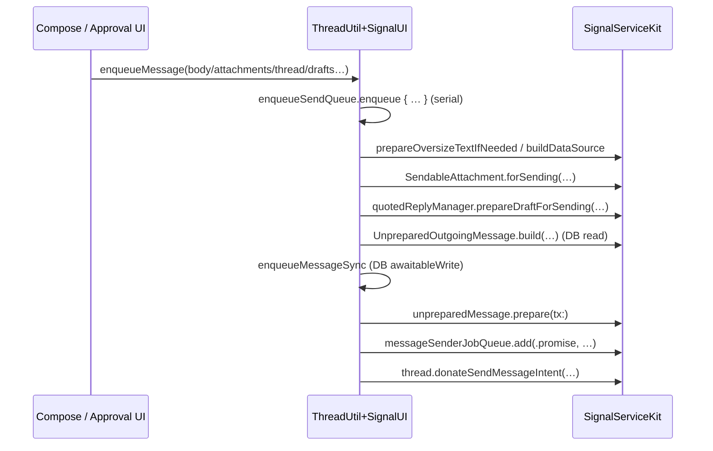

# SignalUI / Sending

Source: `SignalUI/Sending/`. This is the small, central layer that turns a UI-level
"the user pressed send" into SignalServiceKit's (SSK) durable outgoing-message
pipeline, and models quoted replies for the compose/render path. The directory has
exactly three files:

- `ThreadUtil+SignalUI.swift` — the durable send/edit enqueue entry points.
- `QuotedReplyModel.swift` — the view model for an *already-created* quoted reply.
- `DraftQuotedReplyModel+Payments.swift` — a payment-specific extension that lets
  draft quoted replies be built in the Signal app and then handed back to SSK.

> This README documents the `SignalUI/Sending/` subsystem in more depth than the
> top-level [`../Sending.md`](../Sending.md) overview; the two are complementary.

> Confidence: **[High]** read in full; **[Medium]** signature/partial / depends on
> collaborators defined outside `SignalUI/`; **[Low]** inferred. Citations are
> `File.swift:line`. An uncited claim is a defect.

## Responsibility

**[High]** `SignalUI/Sending/` is the seam between UI-provided *drafts* (a message
body, picked attachments, a quoted-reply draft, a link-preview draft) and SSK's
build-and-enqueue types (`UnpreparedOutgoingMessage`, `PreparedOutgoingMessage`,
the message-sender job queue). It assembles those drafts, performs the async
validation/build steps that must happen before persistence, serializes sends onto a
single queue, and persists + enqueues the message. The heavy machinery
(`attachmentContentValidator`, `linkPreviewManager`, `quotedReplyManager`,
`messageSenderJobQueue`, `UnpreparedOutgoingMessage`) lives in SSK — SignalUI's role
is orchestration and view-modeling, not the send protocol itself.

## `ThreadUtil+SignalUI` — durable enqueue

**[High]** This file extends SSK's `ThreadUtil`
(`SignalUI/Sending/ThreadUtil+SignalUI.swift:9`) and `public import`s SSK
(`SignalUI/Sending/ThreadUtil+SignalUI.swift:7`). It exposes two public send entry
points plus internal helpers.

### `enqueueMessage(body:attachments:thread:quotedReplyDraft:linkPreviewDraft:persistenceCompletionHandler:)`

**[High]** The primary send entry point
(`SignalUI/Sending/ThreadUtil+SignalUI.swift:13`). It:

1. Generates a message timestamp and starts a "Marked as Sent" bench event
   (`SignalUI/Sending/ThreadUtil+SignalUI.swift:21-23`).
2. Enqueues the rest of the work onto the serial `enqueueSendQueue`
   (`SignalUI/Sending/ThreadUtil+SignalUI.swift:24`) so sends are strictly ordered.
3. Inside the queued task, runs the async pre-build steps: oversize-text handling
   via `attachmentContentValidator.prepareOversizeTextIfNeeded`
   (`SignalUI/Sending/ThreadUtil+SignalUI.swift:26-30`), link-preview data source
   via `linkPreviewManager.buildDataSource`
   (`SignalUI/Sending/ThreadUtil+SignalUI.swift:31-33`), per-attachment
   `SendableAttachment.forSending(attachmentContentValidator:)`
   (`SignalUI/Sending/ThreadUtil+SignalUI.swift:34-37`), and the quoted-reply draft
   via `quotedReplyManager.prepareDraftForSending`
   (`SignalUI/Sending/ThreadUtil+SignalUI.swift:38-40`).
4. Builds an `UnpreparedOutgoingMessage` inside a DB **read**
   (`SignalUI/Sending/ThreadUtil+SignalUI.swift:42-53`) using the local
   `UnpreparedOutgoingMessage.build(...)` helper (see below), and on any thrown
   error logs via `owsFailDebug` and bails out of that send
   (`SignalUI/Sending/ThreadUtil+SignalUI.swift:54-57`).
5. Hands the unprepared message to the internal `enqueueMessageSync(...)`
   (`SignalUI/Sending/ThreadUtil+SignalUI.swift:59-64`).

**[Medium]** The `attachments` argument is a tuple `([SendableAttachment], isViewOnce: Bool)`
defaulting to empty/`false` (`SignalUI/Sending/ThreadUtil+SignalUI.swift:14`), and
`SendableAttachment` is the send-ready attachment type produced by
`SignalUI/Attachments/` (see [`../AttachmentFlows.md`](../AttachmentFlows.md)).
`SignalUI/Attachments/` (see [`../AttachmentFlows.md`](../AttachmentFlows.md)).

### `enqueueEditMessage(body:thread:quotedReplyEdit:linkPreviewDraft:editTarget:persistenceCompletionHandler:)`

**[High]** The edit path (`SignalUI/Sending/ThreadUtil+SignalUI.swift:68`). Unlike
the send path it asserts it starts on the main thread
(`SignalUI/Sending/ThreadUtil+SignalUI.swift:76`), then uses the same
timestamp/bench/`enqueueSendQueue` structure. It performs only oversize-text and
link-preview preparation (no media attachments) and builds the unprepared message
via `UnpreparedOutgoingMessage.buildForEdit(...)`
(`SignalUI/Sending/ThreadUtil+SignalUI.swift:92-98`) before deferring to the same
`enqueueMessageSync(...)` (`SignalUI/Sending/ThreadUtil+SignalUI.swift:105-110`).

### `enqueueMessage(_:thread:persistenceCompletionHandler:)` (prebuilt)

**[Medium]** An internal (`class func`, not `public`) overload that takes an
already-built `UnpreparedOutgoingMessage`
(`SignalUI/Sending/ThreadUtil+SignalUI.swift:116`) and enqueues it directly,
deriving the bench id from `messageTimestampForLogging`
(`SignalUI/Sending/ThreadUtil+SignalUI.swift:121`).

### `enqueueMessageSync(_:benchEventId:thread:persistenceCompletionHandler:)`

**[High]** The private core that must run on `enqueueSendQueue`
(`SignalUI/Sending/ThreadUtil+SignalUI.swift:133-138`). Inside a single
`awaitableWrite` (`SignalUI/Sending/ThreadUtil+SignalUI.swift:139`) it:

1. `prepare(tx:)`s the unprepared message, failing with `owsFailDebug` on error
   (`SignalUI/Sending/ThreadUtil+SignalUI.swift:140-143`).
2. Adds the prepared message to `messageSenderJobQueueRef` as a `.promise`
   (`SignalUI/Sending/ThreadUtil+SignalUI.swift:144-148`).
3. If a `persistenceCompletion` was supplied, schedules it to run `@MainActor` via
   `addSyncCompletion` once the write commits
   (`SignalUI/Sending/ThreadUtil+SignalUI.swift:149-155`).
4. Completes the bench event when the send promise resolves
   (`SignalUI/Sending/ThreadUtil+SignalUI.swift:156-158`).
5. Donates a `SendMessageIntent` to the system (for Siri/share suggestions) when the
   prepared message yields an intent-donation message and thread
   (`SignalUI/Sending/ThreadUtil+SignalUI.swift:160-164`).

**[High]** The bench event is created by `sendMessageBenchEventStart(messageTimestamp:)`,
which builds the id `"sendMessageMarkedAsSent-<timestamp>"` and starts a
production-logged `BenchEventStart`
(`SignalUI/Sending/ThreadUtil+SignalUI.swift:169-177`).

### `UnpreparedOutgoingMessage.build / buildForEdit`

**[High]** The same file extends SSK's `UnpreparedOutgoingMessage`
(`SignalUI/Sending/ThreadUtil+SignalUI.swift:182`) with two static builders used by
the enqueue paths above:

- `build(...)` (`SignalUI/Sending/ThreadUtil+SignalUI.swift:184`): asserts the
  view-once/borderless invariants (at most one attachment)
  (`SignalUI/Sending/ThreadUtil+SignalUI.swift:194-195`), fetches/builds the
  thread's disappearing-message configuration
  (`SignalUI/Sending/ThreadUtil+SignalUI.swift:197-198`), detects a voice message
  from a single `.voiceMessage` rendering flag with no oversize text
  (`SignalUI/Sending/ThreadUtil+SignalUI.swift:200-202`), configures a
  `TSOutgoingMessageBuilder` with body, expiration, voice/view-once flags
  (`SignalUI/Sending/ThreadUtil+SignalUI.swift:204-212`), and assembles an
  `UnpreparedOutgoingMessage.forMessage(...)` with media/link-preview/quoted-reply
  drafts (`SignalUI/Sending/ThreadUtil+SignalUI.swift:217-224`).
- `buildForEdit(...)` (`SignalUI/Sending/ThreadUtil+SignalUI.swift:227`): maps
  oversize text into a pending-attachment data source, assembles
  `MessageEdits.forOutgoingEdit(...)` (treating "now" as received-at), and returns
  `UnpreparedOutgoingMessage.forEditMessage(...)`
  (`SignalUI/Sending/ThreadUtil+SignalUI.swift:236-251`).

## `QuotedReplyModel` — rendering an existing quoted reply

**[High]** `QuotedReplyModel` is the view model for an *existing* quoted reply whose
attachments have already been fetched
(`SignalUI/Sending/QuotedReplyModel.swift:12`). Its doc comment is explicit that it
is **not** for draft quoted replies — it is for already-created `TSMessage`/story
replies being rendered in a conversation
(`SignalUI/Sending/QuotedReplyModel.swift:9-11`).

**[High]** Stored properties capture the original message's timestamp, author
address, member label, local-user flag, and (for story replies) the reaction emoji
on the reply body (`SignalUI/Sending/QuotedReplyModel.swift:15-27`), plus the
`originalContent` and the `sourceOfOriginal` content source
(`SignalUI/Sending/QuotedReplyModel.swift:151`, `:156`). Its initializer is
`private` (`SignalUI/Sending/QuotedReplyModel.swift:508`), so instances are only
created through the static `build(...)` factories.

**[High]** The nested `OriginalContent` enum
(`SignalUI/Sending/QuotedReplyModel.swift:30`) describes the replied-to content:
`.text` (`:33`), `.giftBadge` (`:38`), `.storyReactionEmoji` (`:41`),
`.attachmentStub` (`:47`), `.attachment` (`:53`), `.mediaStory` (`:61`),
`.textStory` with a `TextStoryThumbnailRenderer` closure (`:67-68`),
`.expiredStory` (`:71`), and `.poll` (`:73`). The enum carries convenience
accessors (`isGiftBadge`, `isStory`, `isPoll`, `attachmentMimeType`,
`attachmentContentType`) (`SignalUI/Sending/QuotedReplyModel.swift:77-149`), and the
outer type derives display helpers from it — `originalMessageBody`
(`:160`), `originalAttachmentSourceFilename` (`:189`),
`originalMessageAccessibilityLabel` (`:212`), and `hasQuotedThumbnail` (`:257`).

**[High]** Three `build(...)` factories construct the model:

- `build(replyingTo storyMessage:reactionEmoji:transaction:)`
  (`SignalUI/Sending/QuotedReplyModel.swift:281`) — handles story originals,
  producing `.mediaStory`/`.expiredStory` for `.media` and `.textStory` for `.text`
  (`SignalUI/Sending/QuotedReplyModel.swift:307-348`).
- `build(storyReplyMessage:storyTimestamp:storyAuthorAci:transaction:)`
  (`SignalUI/Sending/QuotedReplyModel.swift:350`) — resolves the referenced story,
  falling back to `.expiredStory` when it can't be found
  (`SignalUI/Sending/QuotedReplyModel.swift:357-383`).
- `build(replyMessage:quotedMessage:memberLabel:transaction:)`
  (`SignalUI/Sending/QuotedReplyModel.swift:385`) — the persisted
  incoming/outgoing path; special-cases gift badge, poll, and view-once targets,
  then resolves the quoted attachment reference into
  `.text`/`.attachmentStub`/`.attachment` with a thumbnail (stream thumbnail →
  backup thumbnail → blur hash) (`SignalUI/Sending/QuotedReplyModel.swift:415-506`).

**[High]** `QuotedReplyModel` and `OriginalContent` are both `Equatable`
(`SignalUI/Sending/QuotedReplyModel.swift:529`, `:540`). Notably, two `.textStory`
values are treated as **not** equal so the view defensively re-renders every time
(`SignalUI/Sending/QuotedReplyModel.swift:560-561`).

## `DraftQuotedReplyModel+Payments` — payment draft quotes

**[High]** This extension on SSK's `DraftQuotedReplyModel`
(`SignalUI/Sending/DraftQuotedReplyModel+Payments.swift:27`) exists because
`PaymentsFormat` lives in the Signal app (it depends on MobileCoin and
`PaymentsImpl`, neither an SSK dependency), yet the payment amount string is needed
both to display the quote and to put into the outgoing proto at send time — the
file's own comment documents this explicitly
(`SignalUI/Sending/DraftQuotedReplyModel+Payments.swift:8-26`).

**[High]** It adds two factories that compute the amount string in-app and then
defer the rest to the SSK `DraftQuotedReplyModel` initializers:

- `fromOriginalPaymentMessage(_:tx:)`
  (`SignalUI/Sending/DraftQuotedReplyModel+Payments.swift:29`) — returns `nil` when
  the message isn't an `OWSPaymentMessage`
  (`SignalUI/Sending/DraftQuotedReplyModel+Payments.swift:33-35`), otherwise builds
  the amount string and forwards to the SSK overload
  (`SignalUI/Sending/DraftQuotedReplyModel+Payments.swift:36-41`).
- `forEditingOriginalPaymentMessage(originalMessage:replyMessage:quotedReply:tx:)`
  (`SignalUI/Sending/DraftQuotedReplyModel+Payments.swift:44`) — the edit
  counterpart, same guard-and-forward shape
  (`SignalUI/Sending/DraftQuotedReplyModel+Payments.swift:50-61`).
- `amountString(_:interactionType:tx:)`
  (`SignalUI/Sending/DraftQuotedReplyModel+Payments.swift:63`) — delegates to
  `PaymentsFormat.paymentPreviewText(...)`, falling back to a localized "unknown
  payment" string (`SignalUI/Sending/DraftQuotedReplyModel+Payments.swift:68-74`).

**[Medium]** `DraftQuotedReplyModel`, `OWSPaymentMessage`, and the forwarded
initializers are defined outside `SignalUI/Sending/` (SSK and the Signal app
respectively); only the amount-string plumbing is read in full here.

## Interactions with the rest of SignalUI and the app

- **[Medium]** Inbound: compose and attachment-approval surfaces call
  `ThreadUtil.enqueueMessage(...)`; the `SendableAttachment`s it consumes are
  produced by the attachment stack in `SignalUI/Attachments/` and the approval UI in
  `SignalUI/AttachmentApproval/` (see [`../AttachmentFlows.md`](../AttachmentFlows.md)).
  The multisend path (`SignalUI/AttachmentMultisend/`) is a parallel fan-out
  enqueue that does **not** go through `ThreadUtil+SignalUI`.
- **[Medium]** `QuotedReplyModel` is consumed by conversation-rendering code to draw
  the quoted-reply snippet above a message bubble (see
  [`../ConversationView.md`](../ConversationView.md)); `DraftQuotedReplyModel`
  (SSK) is the compose-time counterpart that this directory only extends for
  payments.
- **[High]** Outbound: everything terminates in SSK via `UnpreparedOutgoingMessage`,
  `PreparedOutgoingMessage`, and `messageSenderJobQueueRef`
  (`SignalUI/Sending/ThreadUtil+SignalUI.swift:144`), consistent with SignalUI's
  position above SSK in the dependency graph (see [`../README.md`](../README.md)).

## Important data flows / state

- **[High]** Serialization: all sends and edits run through the single
  `enqueueSendQueue` (`SignalUI/Sending/ThreadUtil+SignalUI.swift:24`, `:81`,
  `:122`), giving a stable ordering of enqueues.
- **[High]** Read-then-write split: the message is *built* in a DB read
  (`SignalUI/Sending/ThreadUtil+SignalUI.swift:42`) but *prepared and enqueued* in a
  separate `awaitableWrite` (`SignalUI/Sending/ThreadUtil+SignalUI.swift:139`).
- **[High]** Instrumentation: a per-message "Marked as Sent" bench event spans from
  enqueue to send-promise completion
  (`SignalUI/Sending/ThreadUtil+SignalUI.swift:156-158`, `:169-177`).

## Notable considerations

- **[High]** `QuotedReplyModel` is for *rendering existing* replies; drafts are a
  separate SSK `DraftQuotedReplyModel` type (`SignalUI/Sending/QuotedReplyModel.swift:9-11`).
- **[High]** Error handling in the enqueue paths is log-and-drop (`owsFailDebug`,
  then `return`): a failed build/prepare silently abandons that one send rather than
  surfacing an error to the caller (`SignalUI/Sending/ThreadUtil+SignalUI.swift:54-57`,
  `:140-143`).
- **[High]** The payments extension is deliberately layered the "wrong" way around
  (Signal-app code reaching into an SSK type) and the source comment flags it as
  "absolutely horrible" with the rationale documented
  (`SignalUI/Sending/DraftQuotedReplyModel+Payments.swift:8-26`).
